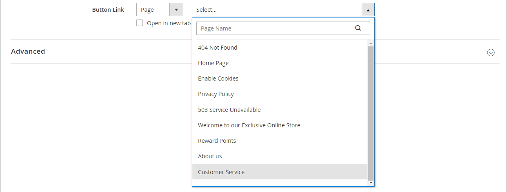

# 元素 — 按鈕

使用&#x200B;_按鈕_&#x200B;內容型別在[[!DNL Page Builder] 階段](workspace.md#stage)中新增個別按鈕或一組按鈕。 您可以水平或垂直排列按鈕，並將它們直接新增到舞台上的列、欄、標籤和橫幅中。

{width="600" zoomable="yes"}

{{$include /help/_includes/page-builder-save-timeout.md}}

## 工具箱

當您使用「按鈕」內容型別時，您可以新增和編輯個別按鈕以及容納一或多個按鈕的按鈕容器。 每個都有自己的工具箱，您可用來設計[!DNL Page Builder]舞台上的按鈕。

### 個別按鈕工具箱

{width="500" zoomable="yes"}

| 工具 | 圖示 | 說明 |
| --------- | -------- | -------------- |
| 設定 | {width="25"} | 開啟「編輯按鈕」頁面，您可以在此頁面變更按鈕的屬性。 |
| 複製 | {width="25"} | 製作按鈕的副本。 |
| 移除 | {width="25"} | 從舞台刪除按鈕。 |

{style="table-layout:auto"}

### 按鈕容器工具箱

{width="500" zoomable="yes"}

| 工具 | 圖示 | 說明 |
| --------- | ----------------- | ----------- |
| 移動 | {width="25"} | 將按鈕容器移至頁面上的另一個有效位置。 |
| 新增 | {width="25"} | 將按鈕新增至容器。 |
| （標籤） | 按鈕 | 將目前的容器識別為按鈕元素。 |
| 設定 | {width="25"} | 開啟「編輯按鈕」頁面，您可以在此頁面變更容器的屬性。 |
| 隱藏 | {width="25"} | 隱藏按鈕容器。 |
| 顯示 | {width="25"} | 顯示隱藏按鈕容器。 |
| 複製 | {width="25"} | 製作按鈕容器的副本。 |
| 移除 | {width="25"} | 從舞台刪除按鈕容器及其內容。 |

{style="table-layout:auto"}

{{$include /help/_includes/page-builder-hidden-element-note.md}}

## 新增個別按鈕

1. 在[!DNL Page Builder]面板中，展開&#x200B;**[!UICONTROL Elements]**&#x200B;並將&#x200B;**[!UICONTROL Buttons]**&#x200B;預留位置拖曳至舞台上的列、欄或索引標籤集。

   {width="500" zoomable="yes"}

1. 將滑鼠懸停在按鈕上以顯示工具箱，然後選擇&#x200B;_設定_ （）圖示。

1. 輸入要顯示在按鈕上的&#x200B;**[!UICONTROL Button Text]**。

   {width="600" zoomable="yes"}

1. 將&#x200B;**[!UICONTROL Button Type]**&#x200B;設定為下列其中一項：

   | 型別 | 說明 |
   | ------ | ----------- |
   | `Primary` | 從目前的樣式表套用主要按鈕樣式。 |
   | `Secondary` | 套用目前樣式表中的次要按鈕樣式（如果適用）。 |
   | `Link` | 建立超連結而非按鈕。 |

   {style="table-layout:auto"}

   {width="500" zoomable="yes"}

1. 使用下列其中一種型別設定&#x200B;**[!UICONTROL Button Link]**：

   - **[!UICONTROL URL]** — 輸入連結的目的地URL。

     URL可以是商店中產品或頁面的相對連結，或完全限定的URL。

     相對URL範例 — `../luma-analog-watch.html`

     完整URL範例 — `http://mystore.com/luma-analog-watch.html`

     如果連結進入不同的網站，您可以在新的瀏覽器分頁中開啟連結，讓目前的頁面保持對商店的開啟狀態。

     若要防止訪客離開您的商店，請選取「**[!UICONTROL Open in new tab]**」核取方塊。

   - **[!UICONTROL Product]** — 輸入產品名稱（部分或完整）或SKU，然後在清單中選擇產品名稱。

     >[!NOTE]
     >
     >產品會根據&#x200B;_顯示無庫存產品_&#x200B;設定顯示在清單中。 針對使用[Inventory management](../inventory-management/introduction.md)的多Source商家，產品清單僅受指派給預設網站的來源限制。

     {width="600" zoomable="yes"}

   - **[!UICONTROL Category]** — 輸入類別名稱（部分或完整），或按一下空白欄位以顯示類別樹狀結構。 然後，在樹狀結構中選取類別名稱。

     {width="600" zoomable="yes"}

   - **[!UICONTROL Page]** — 輸入CMS頁面的名稱（部分或完整），或按一下空白欄位以顯示完整清單。 然後，在搜尋結果清單中選擇頁面名稱。

     {width="600" zoomable="yes"}

1. 視需要完成[進階設定][advanced-settings]。

1. 完成後，按一下右上角的&#x200B;**[!UICONTROL Save]**&#x200B;套用設定並返回[!DNL Page Builder]工作區。

## 新增一組按鈕

以下小節說明一系列步驟，以從個別按鈕開始，並在按鈕容器中建立一組三個按鈕。 如果您還沒有個別按鈕，請按照之前的指示，將個別按鈕新增到舞台。

### 步驟1：建立第二個按鈕

1. 將滑鼠懸停在按鈕容器上以顯示工具箱，然後選擇&#x200B;_新增_ （ {width="20"} ）圖示。

   {width="500" zoomable="yes"}

1. 輸入要顯示在第二個按鈕上的文字。

1. 按一下新按鈕以顯示其工具箱，然後選擇&#x200B;_設定_ （ {width="20"} ）圖示。

   {width="500" zoomable="yes"}

1. 將&#x200B;**[!UICONTROL Button Type]**&#x200B;設為`Secondary`。

1. 視需要設定&#x200B;**[!UICONTROL Button Link]**。

   在以下範例中，連結是前往[聯絡我們](../getting-started/store-details.md#contact-us-form)頁面的相對URL。

   {width="600" zoomable="yes"}

1. 視需要完成[進階設定][advanced-settings]。

1. 完成後，按一下&#x200B;**[!UICONTROL Save]**&#x200B;套用設定並返回[!DNL Page Builder]工作區。

### 步驟2：建立第三個按鈕

1. 再次按一下舞台上的第二個按鈕，然後選擇&#x200B;_複製_ （{width="20"} ）圖示。

   {width="500" zoomable="yes"}

1. 輸入要顯示在第三個按鈕上的文字。

1. 按一下第三個按鈕以顯示工具箱，然後選擇&#x200B;_設定_ （ {width="20"} ）圖示。

   第三個按鈕的{width="500" zoomable="yes"}

1. 視需要更新&#x200B;**[!UICONTROL Button Link]**。

1. 在右上角，按一下&#x200B;**[!UICONTROL Save]**&#x200B;以套用設定並返回[!DNL Page Builder]工作區。

### 步驟3：更新按鈕容器

1. 將滑鼠懸停在按鈕容器上以顯示工具箱，然後選擇&#x200B;_設定_ （ {width="20"} ）圖示。

   {width="500" zoomable="yes"}

1. 在&#x200B;_[!UICONTROL Appearance]_&#x200B;底下，選擇&#x200B;**[!UICONTROL Stacked]**。

1. 將&#x200B;**[!UICONTROL All Buttons are same size]**&#x200B;設為`Yes`。

   {width="300"}

1. 使用按鈕容器[的][button-container]變更設定的說明，視需要更新其餘設定。

1. 完成後，按一下&#x200B;**[!UICONTROL Save]**&#x200B;套用設定並返回[!DNL Page Builder]工作區。

   完整的棧疊按鈕組出現在舞台上，包含一個主要按鈕和兩個次要按鈕。

   舞台上的{width="500" zoomable="yes"}

## 移動按鈕

1. 按一下您要移動的按鈕。

1. 選取並將按鈕文字前出現的移動（{width="20"} ）圖示拖曳到按鈕容器內按鈕的新位置。

   {width="500" zoomable="yes"}

## 變更按鈕的設定

1. 按一下舞台上的按鈕以顯示工具箱，然後選擇&#x200B;_設定_ （ {width="20"} ）圖示。

   {width="500" zoomable="yes"}

1. 視需要更新標準設定。

   - **[!UICONTROL Button Text]** — 輸入要顯示在按鈕上的文字（也可以直接從舞台更新）。

   - **[!UICONTROL Button Type]** — 決定按鈕格式。

     | 型別 | 說明 |
     | ------ | ----------- |
     | `Primary` | 從目前的樣式表套用主要按鈕樣式。 |
     | `Secondary` | 套用目前樣式表中的次要按鈕樣式（如果適用）。 |
     | `Link` | 建立超連結而非按鈕。 |

     {style="table-layout:auto"}

   - **[!UICONTROL Button Link]** — 決定按一下按鈕時所服務的目的地頁面。

     | 選項 | 說明 |
     | ------ | ----------- |
     | `URL` | 使用相對或完整URL來識別目的地頁面。 |
     | `Product` | 根據產品名稱或SKU識別目的地頁面。 您可以根據部分或完整名稱來搜尋產品名稱。 然後從搜尋結果清單中選擇產品。 |
     | `Category` | 將目的地頁面識別為類別樹狀結構中的特定類別或子類別。 |
     | `Page` | 將目的地頁面識別為特定CMS頁面。 |

     {style="table-layout:auto"}

1. 視需要完成[進階設定][advanced-settings]。

1. 若要儲存設定並返回[!DNL Page Builder]工作區，請按一下右上角的&#x200B;**[!UICONTROL Save]**。

## 變更按鈕容器的設定

1. 將滑鼠懸停在按鈕容器上以顯示工具箱，然後選擇&#x200B;_設定_ （ {width="20"} ）圖示。

1. 視需要更新&#x200B;**[!UICONTROL Appearance]**&#x200B;設定。

   - 使用排列選項在容器中水平或垂直顯示按鈕：

     | 選項 | 說明 |
     | ------ | ----------- |
     | `Inline` | 水準排列按鈕。 |
     | `Stacked` | 垂直排列按鈕。 |

     {style="table-layout:auto"}

   - 根據您的偏好設定，設定&#x200B;**[!UICONTROL All buttons are same size]**&#x200B;選項。

     設定為`Yes`時，容器中的所有按鈕都會根據最長按鈕文字的長度，擁有一致的大小。

1. 視需要完成[進階設定][advanced-settings]。

1. 完成後，按一下&#x200B;**[!UICONTROL Save]**&#x200B;套用設定並返回[!DNL Page Builder]工作區。

## 變更進階設定

您可以修改個別按鈕和按鈕容器的&#x200B;_[!UICONTROL Advanced]_&#x200B;設定。

1. 若要控制上層容器內的位置，請選擇&#x200B;**[!UICONTROL Alignment]**：

   | 選項 | 說明 |
   | ------ | ----------- |
   | `Default` | 套用目前佈景主題樣式表中指定的對齊預設設定。 |
   | `Left` | 將內容沿父容器的左邊框對齊，並允許指定的任何邊框間距。 |
   | `Center` | 將內容對齊上層容器的中央，並允許指定的任何邊框間距。 |
   | `Right` | 將內容沿父容器的右邊框對齊，並允許指定的任何邊框間距。 |

   {style="table-layout:auto"}

1. 設定套用至按鈕或按鈕容器所有四個側面的&#x200B;**[!UICONTROL Border]**&#x200B;樣式：

   | 選項 | 說明 |
   | ------ | ----------- |
   | `Default` | 套用關聯樣式表所指定的預設邊框樣式。 |
   | `None` | 未提供任何容器框線的可見指示。 |
   | `Dotted` | 容器邊框會以虛線顯示。 |
   | `Dashed` | 容器邊框會以虛線顯示。 |
   | `Solid` | 容器邊框會以實線顯示。 |
   | `Double` | 容器邊框會以雙線顯示。 |
   | `Groove` | 容器框線會顯示為槽線。 |
   | `Ridge` | 容器框線會顯示為脊線。 |
   | `Inset` | 容器框線會顯示為內嵌線。 |
   | `Outset` | 容器邊框會顯示為外線。 |

   {style="table-layout:auto"}

1. 如果您設定了`None`以外的框線樣式，請完成框線顯示選項：

   | 選項 | 說明 |
   | ------ |------------ |
   | [!UICONTROL Border Color] | 選擇色票、按一下檢色器，或輸入有效的顏色名稱或相等的十六進位值，以指定顏色。 |
   | [!UICONTROL Border Width] | 輸入邊框線條寬度的畫素數。 |
   | [!UICONTROL Border Radius] | 輸入畫素數目，以定義用來將邊框每個角落倒圓角的半徑大小。 |

   {style="table-layout:auto"}

1. （選擇性）從目前的樣式表中指定要套用至按鈕或按鈕容器的&#x200B;**[!UICONTROL CSS classes]**&#x200B;名稱。

   以空格分隔多個類別名稱。

1. 輸入&#x200B;**[!UICONTROL Margins and Padding]**&#x200B;的值（以畫素為單位），以決定按鈕或按鈕容器的外部邊界和內邊距。

   在圖表中輸入對應的值。

   | 容器區域 | 說明 |
   | -------------- | ----------- |
   | [!UICONTROL Margins] | 套用至容器所有側邊外部邊緣的空白空間量。 選項： `Top` / `Right` / `Bottom` / `Left` |
   | [!UICONTROL Padding] | 套用至容器所有邊內側邊緣的空白空間量。 選項： `Top` / `Right` / `Bottom` / `Left` |

   {style="table-layout:auto"}

[advanced-settings]: #change-advanced-settings
[button-container]: #change-settings-for-a-button-container

<!-- Last updated from includes: 2023-09-11 14:30:19 -->
