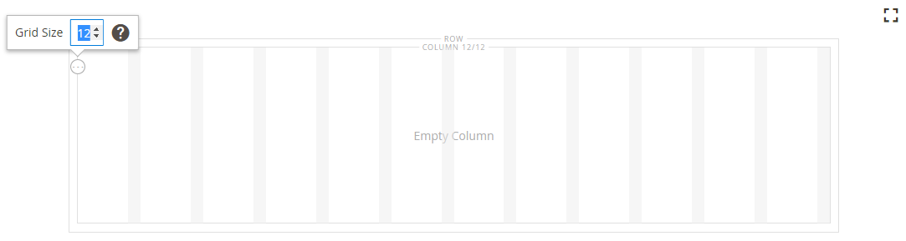

# 版面 — 欄

使用&#x200B;_資料行_&#x200B;內容型別將頁面分割為[[!DNL Page Builder] 階段](workspace.md#stage)中的多個資料行。 當您將欄新增到列或索引標籤或直接新增到舞台時，欄群組最初會分成兩個寬度相等的欄。 您可以視需要新增或移除欄。 拖曳兩欄之間的框線，即可調整欄大小。 下一欄的寬度會調整為填滿列、標籤或舞台內的可用空間。 單一欄可延伸舞台或其容器的完整寬度。

{width="600" zoomable="yes"}

{{$include /help/_includes/page-builder-save-timeout.md}}

## 2.4.5版的更新

頁面產生器功能已在2.4.5版本中更新，因此使用者現在可將&#x200B;_[!DNL Columns]_作為個別欄的父容器。 此新容器也支援背景屬性，且不需要以列繞排欄。 它可減少不必要的標示，並可更精細地控制店面的顯示和體驗。

您可以拖曳群組內其他欄上方或下方的欄，以變更[!DNL Columns]容器的版面配置，並加以棧疊。 這開啟了各種新的可能版面組合，開發人員無需自訂即可實現。

觀看此影片以示範如何使用[!DNL Columns]容器來調整您的頁面配置：

>[!VIDEO](https://video.tv.adobe.com/v/345828?quality=12&learn=on)

## 欄工具箱

每欄都有一個選項工具箱，當您將游標停留在容器上時，就會顯示這些選項。

| 工具 | 圖示 | 說明 |
|--- |--- |--- |
| 移動 | {width="25"} | 將欄及其內容移動到相對於其他欄的另一個位置。 |
| （標籤） | 欄 | 將目前的容器識別為欄。 將滑鼠指標暫留在欄容器上以顯示工具箱。 |
| 設定 | {width="25"} | 開啟「編輯欄」頁面，您可以在此變更容器的屬性。 |
| 複製 | {width="25"} | 製作目前欄的副本。 |
| 移除 | {width="25"} | 刪除目前欄及其內容。 |

{style="table-layout:auto"}

## 欄格線

[格線](workspace.md)可確保內容在欄中保持一致，並幫助頁面在案頭和行動裝置上正確轉譯。 如需詳細資訊，請參閱[!DNL Page Builder]設定的[進階內容工具](setup.md)區段。

{width="500" zoomable="yes"}

在下列兩欄範例中，每個欄容器頂端邊界括弧中的數字(6/12)表示每個欄的網格分割數目以及分割總數。 在此範例中，欄的寬度為6個格線單位，總共12個。

{width="600" zoomable="yes"}

## 新增欄

1. 在&#x200B;_[!UICONTROL Layout]_下的[!DNL Page Builder]面板中，將&#x200B;**[!UICONTROL Column]**拖曳到舞台。

   {width="600" zoomable="yes"}

   欄群組現在分成兩個寬度相等的欄。 每一欄都是個別的內容容器，且有自己的一組工具箱選項。

   {width="600" zoomable="yes"}

1. 在欄群組的左上角，按一下&#x200B;_格線_&#x200B;工具（）並視需要調整格線大小。

   將內容放置在格線有助於讓內容保持一致，並在桌上型電腦和行動裝置上正確呈現頁面。 如需詳細資訊，請參閱[!DNL Page Builder]設定的[進階內容工具](../configuration-reference/general/content-management.md)區段。

   {width="600" zoomable="yes"}

## 調整欄大小

1. 將滑鼠停留在兩欄之間的邊框上。

   邊框會反白顯示，選取欄的工具箱會出現。

   {width="600" zoomable="yes"}

1. 按住滑鼠鍵以顯示格點，並將邊框拖曳至格點上的新位置。

   兩欄的寬度會調整以反映變更。 每個欄的新寬度會顯示在標籤後面，例如`4/12` （12個中有4個）和`8/12` （12個中有8個）。

   {width="600" zoomable="yes"}

## 移除欄

1. 將滑鼠停留在您要移除的資料行上，以顯示工具箱，並選擇&#x200B;_移除_ （{width="20"} ）圖示。

   {width="600" zoomable="yes"}

1. 如果欄包含內容，請按一下&#x200B;**[!UICONTROL OK]**&#x200B;確認。

   若要在日後加速處理程式，您可以選取&#x200B;**[!UICONTROL Do not show this again]**&#x200B;核取方塊以略過確認步驟。

   欄群組現在有單一欄(12/12)和格線。 因為格線僅適用於欄，所以您可以使用此技巧來顯示格線。

   {width="600" zoomable="yes"}

1. 如果您希望欄群組將剩餘的欄延伸至列或舞台的完整寬度：

   - 將滑鼠懸停在欄上以顯示工具箱，然後選擇&#x200B;_設定_ （ {width="20"} ）圖示。

   - 向下捲動至&#x200B;_[!UICONTROL Advanced]_區段，並將所有四個&#x200B;**[!UICONTROL Padding]**值設定為`0`。

     {width="600" zoomable="yes"}

   - 在右上角，按一下&#x200B;**[!UICONTROL Save]**&#x200B;以關閉&#x200B;_[!UICONTROL Edit Column]_頁面。

1. 按一下工作區右上角的&#x200B;_關閉全熒幕_ （{width="20"} ）圖示，然後按一下右上角的&#x200B;**[!UICONTROL Save]**。

## 變更欄設定

1. 將滑鼠懸停在欄上以顯示工具箱，然後選擇&#x200B;_設定_ （ {width="20"} ）圖示。

   {width="600" zoomable="yes"}

1. 視需要變更&#x200B;**[!UICONTROL Appearance]**&#x200B;設定。

   - 選擇對齊方式設定，以決定欄相對於其容器的位置。

     | 選項 | 說明 |
     | ------ | ----------- |
     | `Full Height` | 欄會延伸其容器的完整高度。 |
     | `Top Aligned` | 欄會對齊其容器的頂端。 |
     | `Centered` | 在中的欄位於其容器的中央。 |
     | `Bottom Aligned` | 欄會對齊其容器的底部。 |

     {style="table-layout:auto"}

   - 如有需要，請為欄輸入&#x200B;**[!UICONTROL Minimum Height]**。 例如，您可以設定最低高度以符合背景影像的高度。

   - 若您設定最小高度，請設定&#x200B;**[!UICONTROL Vertical Alignment]**&#x200B;以控制新增至資料行（`Top`、`Center`或`Bottom`）的內容容器的位置。

1. 變更欄內容的背景。

   - **[!UICONTROL Background Color]** — 選擇色票、按一下檢色器，或輸入有效的顏色名稱或對應的十六進位值，以指定顏色。 此設定決定欄的背景顏色。

   - **[!UICONTROL Background Image]** — 如有需要，請使用提供的工具選擇要套用至欄的背景影像：

     | 工具 | 說明 |
     | ------ | ----------- |
     | [!UICONTROL Upload] | 將影像檔案從本機電腦上傳到相簿，然後將其套用為欄的背景影像。 |
     | [!UICONTROL Select from Gallery] | 提示您從相簿中選擇現有影像作為欄的背景影像。 |
     | {width="25"} | 可讓您將影像拖曳至相機圖磚，或瀏覽至本機檔案系統中的影像。 |

     {style="table-layout:auto"}

   - **[!UICONTROL Background Mobile Image]** — 如有需要，請使用相同的工具來選擇不同的背景影像，以便在行動裝置上顯示。

   - **[!UICONTROL Background Size]** — 變更此設定以決定背景影像相對於欄寬縮放的方式：

     | 選項 | 說明 |
     | ------ | ----------- |
     | `Cover` | 背景影像涵蓋欄的全部寬度。 |
     | `Contain` | 背景影像僅限於內容區域的寬度。 |
     | `Auto` | 套用目前佈景主題樣式表中指定的預設背景大小。 |

     {style="table-layout:auto"}

   - **[!UICONTROL Background Position]** — 變更此設定以決定與欄相關的影像錨點。 選項： `Top Left`、`Top Center`、`Top Right`、`Center Left`、`Center`、`Center Right`、`Bottom Left`、`Bottom Center`或`Bottom Right`

   - **[!UICONTROL Background Attachment]** — 變更此設定以決定背景影像相對於捲動頁面的移動方式：

     | 選項 | 說明 |
     | ------ | ----------- |
     | `Scroll` | 背景影像會同步處理為隨著頁面捲動而向下移動。 |
     | `Fixed` | （不適用於行動裝置）當容器捲動影像時，背景影像不會移動，且會固定在指定的背景位置。 |

     {style="table-layout:auto"}

   - **[!UICONTROL Background Repeat]** — 如果要重複背景影像以填滿空間，請變更此設定`Yes`。

1. 視需要更新&#x200B;_[!UICONTROL Advanced]_設定。

   - 若要控制新增至欄的內容容器的水平位置，請選擇&#x200B;**[!UICONTROL Alignment]**：

     | 選項 | 說明 |
     | ------ | ----------- |
     | `Default` | 套用目前佈景主題樣式表中指定的對齊預設設定。 |
     | `Left` | 將內容容器沿欄容器的左邊框對齊，並允許指定的任何邊框間距。 |
     | `Center` | 將內容容器對齊欄容器的中央，並允許指定的任何邊框間距。 |
     | `Right` | 將內容容器沿欄容器的右邊框對齊，並允許指定的任何邊框間距。 |

     {style="table-layout:auto"}

   - 設定套用至欄容器所有四個邊的&#x200B;**[!UICONTROL Border]**&#x200B;樣式：

     | 選項 | 說明 |
     | ------ | ----------- |
     | `Default` | 套用關聯樣式表所指定的預設邊框樣式。 |
     | `None` | 未提供任何容器框線的可見指示。 |
     | `Dotted` | 容器邊框會以虛線顯示。 |
     | `Dashed` | 容器邊框會以虛線顯示。 |
     | `Solid` | 容器邊框會以實線顯示。 |
     | `Double` | 容器邊框會以雙線顯示。 |
     | `Groove` | 容器框線會顯示為槽線。 |
     | `Ridge` | 容器框線會顯示為脊線。 |
     | `Inset` | 容器框線會顯示為內嵌線。 |
     | `Outset` | 容器邊框會顯示為外線。 |

     {style="table-layout:auto"}

   - 如果您設定了`None`以外的框線樣式，請完成框線顯示選項：

     | 選項 | 說明 |
     | ------ |------------ |
     | [!UICONTROL Border Color] | 選擇色票、按一下檢色器，或輸入有效的顏色名稱或相等的十六進位值，以指定顏色。 |
     | [!UICONTROL Border Width] | 輸入邊框線條寬度的畫素數。 |
     | [!UICONTROL Border Radius] | 輸入畫素數目，以定義用來將邊框每個角落倒圓角的半徑大小。 |

     {style="table-layout:auto"}

   - （選擇性）從目前的樣式表中指定要套用至欄容器的&#x200B;**[!UICONTROL CSS classes]**&#x200B;名稱。

     以空格分隔多個類別名稱。

   - 輸入&#x200B;**[!UICONTROL Margins and Padding]**&#x200B;的值（以畫素為單位），以指定欄的外部邊界與內部邊距。

     在欄容器圖表中輸入每個對應的值。

     | 容器區域 | 說明 |
     | -------------- | ----------- |
     | [!UICONTROL Margins] | 套用至容器所有側邊外部邊緣的空白空間量。 選項： `Top` / `Right` / `Bottom` / `Left` |
     | [!UICONTROL Padding] | 套用至容器所有邊內側邊緣的空白空間量。 選項： `Top` / `Right` / `Bottom` / `Left` |

     {style="table-layout:auto"}

1. 完成後，按一下&#x200B;**[!UICONTROL Save]**&#x200B;套用設定並返回[!DNL Page Builder]工作區。
