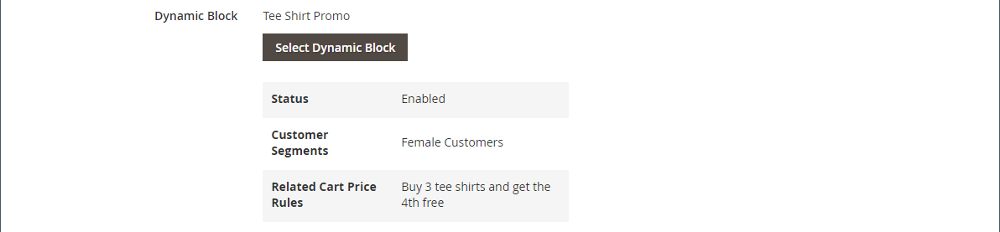

# 新增內容 — 動態區塊

使用動態區塊內容型別將現有的[動態區塊](../content-design/dynamic-blocks.md)新增至[[!DNL Page Builder] 階段](workspace.md#stage)。

店面上的{width="700" zoomable="yes"}

{{$include /help/_includes/page-builder-save-timeout.md}}

## 動態區塊工具箱

| 工具 | 圖示 | 說明 |
| --------- | ------------- | ----------------- |
| 移動 | {width="25"} | 將區塊容器及其內容移至舞台上的另一個位置。 |
| 設定 | {width="25"} | 開啟&#x200B;_編輯區塊_&#x200B;頁面，您可在其中選擇區塊並變更容器的屬性。 |
| 隱藏 | {width="25"} | 隱藏目前的區塊容器及其內容。 |
| 顯示 | {width="25"} | 顯示隱藏的區塊容器及其內容。 |
| 複製 | {width="25"} | 製作區塊容器及其內容的副本。 |
| 移除 | {width="25"} | 從階段中刪除區塊容器及其內容。 |

{style="table-layout:auto"}

{{$include /help/_includes/page-builder-hidden-element-note.md}}

## 將現有的動態區塊新增到舞台

1. 導覽至目標頁面、區塊、產品或類別上的[!DNL Page Builder]工作區。

1. 在[!DNL Page Builder]面板中，展開&#x200B;**[!UICONTROL Add Content]**&#x200B;並將&#x200B;**[!UICONTROL Dynamic Block]**&#x200B;預留位置拖曳到舞台。

   {width="600" zoomable="yes"}

1. 將滑鼠懸停在空的動態區塊容器上以顯示工具箱，然後選擇&#x200B;_設定_ （ {width="20"} ）圖示。

   {width="600" zoomable="yes"}

1. 在&#x200B;_編輯動態區塊_&#x200B;頁面上，按一下&#x200B;**[!UICONTROL Select Dynamic Block]**&#x200B;並使用清單來選取區塊。

   {width="600" zoomable="yes"}

   在清單中，找到您要插入的動態區塊，然後按一下&#x200B;**[!UICONTROL Select]**。 然後，按一下&#x200B;**[!UICONTROL Add Selected]**。

   {width="600" zoomable="yes"}

   動態區塊資訊的摘要會顯示於下方。

   {width="600" zoomable="yes"}

1. 將&#x200B;**[!UICONTROL Template]**&#x200B;設定為下列其中一項：

   | 選項 | 說明 |
   | ------ | ----------- |
   | `Dynamic Block Block Template` | 新增獨立區塊。 |
   | `Dynamic Block Inline Template` | 將區塊內容插入文字中。 |

   {style="table-layout:auto"}

   {width="200"}

1. 視需要完成「進階」設定。

1. 完成後，按一下&#x200B;**[!UICONTROL Save]**&#x200B;套用設定並返回[!DNL Page Builder]工作區。

### 進階設定

1. 若要控制動態區塊在父容器中的位置，請選擇&#x200B;**[!UICONTROL Alignment]**：

   | 選項 | 說明 |
   | ------ | ----------- |
   | `Default` | 套用目前佈景主題樣式表中指定的對齊預設設定。 |
   | `Left` | 沿著父容器的左邊框對齊清單，並允許指定的任何邊框間距。 |
   | `Center` | 將清單對齊父項容器的中心，並容許任何指定的內距。 |
   | `Right` | 沿著父容器的右邊框對齊區塊，並允許指定的任何邊框間距。 |

   {style="table-layout:auto"}

1. 設定套用至動態區塊容器所有四個側面的&#x200B;**[!UICONTROL Border]**&#x200B;樣式：

   | 選項 | 說明 |
   | ------ | ----------- |
   | `Default` | 套用關聯樣式表所指定的預設邊框樣式。 |
   | `None` | 未提供任何容器框線的可見指示。 |
   | `Dotted` | 容器邊框會以虛線顯示。 |
   | `Dashed` | 容器邊框會以虛線顯示。 |
   | `Solid` | 容器邊框會以實線顯示。 |
   | `Double` | 容器邊框會以雙線顯示。 |
   | `Groove` | 容器框線會顯示為槽線。 |
   | `Ridge` | 容器框線會顯示為脊線。 |
   | `Inset` | 容器框線會顯示為內嵌線。 |
   | `Outset` | 容器邊框會顯示為外線。 |

   {style="table-layout:auto"}

1. 如果您設定了`None`以外的框線樣式，請完成框線顯示選項：

   | 選項 | 說明 |
   | ------ |------------ |
   | [!UICONTROL Border Color] | 選擇色票、按一下檢色器，或輸入有效的顏色名稱或相等的十六進位值，以指定顏色。 |
   | [!UICONTROL Border Width] | 輸入邊框線條寬度的畫素數。 |
   | [!UICONTROL Border Radius] | 輸入畫素數目，以定義用來將邊框每個角落倒圓角的半徑大小。 |

   {style="table-layout:auto"}

1. （選擇性）從目前的樣式表中指定要套用至容器的&#x200B;**[!UICONTROL CSS classes]**&#x200B;名稱。

   以空格分隔多個類別名稱。

1. 輸入&#x200B;**[!UICONTROL Margins and Padding]**&#x200B;的值（以畫素為單位），以決定動態區塊容器的外部邊界和內邊距。

   在圖表中輸入對應的值。

   | 容器區域 | 說明 |
   | -------------- | ----------- |
   | [!UICONTROL Margins] | 套用至容器所有側邊外部邊緣的空白空間量。 選項： `Top` / `Right` / `Bottom` / `Left` |
   | [!UICONTROL Padding] | 套用至容器所有邊內側邊緣的空白空間量。 選項： `Top` / `Right` / `Bottom` / `Left` |

   {style="table-layout:auto"}

## 編輯動態區塊容器設定

1. 將游標停留在動態區塊容器上以顯示工具箱，然後選擇&#x200B;_設定_ （ {width="20"} ）圖示。

   {width="500" zoomable="yes"}

1. 如有需要，請變更動態區塊：

   - 按一下&#x200B;**[!UICONTROL Select Dynamic Block]**。

     {width="20"}

   - 在使用中動態區塊清單中，按一下您要新增區塊的&#x200B;**[!UICONTROL Select]**。

1. 視需要更新其餘的設定。

1. 完成後，按一下&#x200B;**[!UICONTROL Save]**&#x200B;套用設定並返回[!DNL Page Builder]工作區。

## 複製動態區塊

1. 將游標停留在動態區塊容器上以顯示工具箱，然後選擇&#x200B;_複製_ （ {width="20"} ）圖示。

   重複專案會出現在原始專案的正下方。

   {width="500" zoomable="yes"}

1. 若要將新的動態區塊移至其他位置，請將游標暫留在容器上，然後在工具箱中選擇&#x200B;_「移動_」（{width="20"}）。

1. 選取並拖曳動態區塊，直到紅色指引出現在新位置為止。

   移動動態區塊時，每個容器的頂端和底部邊界都會顯示為虛線。

## 從舞台移除動態區塊

1. 將游標停留在動態區塊容器上以顯示工具箱，然後選擇&#x200B;_移除_ （ {width="20"} ）圖示。

1. 提示確認時，按一下&#x200B;**[!UICONTROL OK]**。
