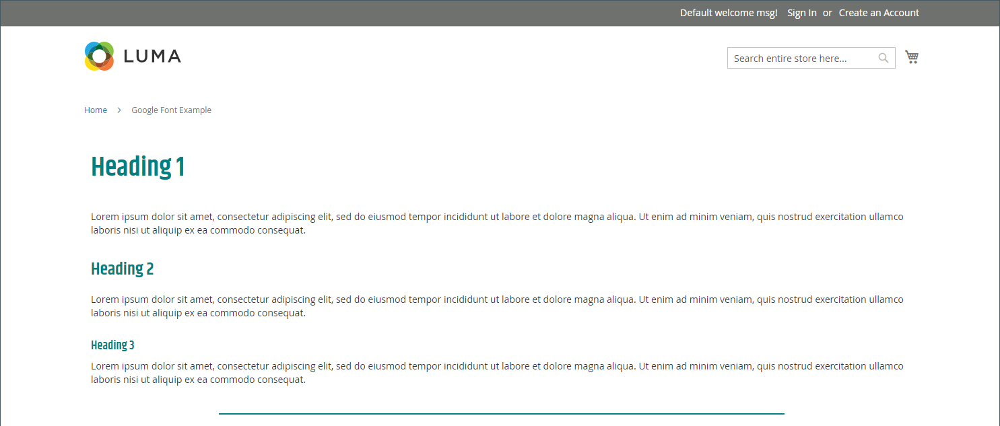

# 元素 — HTML代碼

使用 _HTML代碼_ 內容型別，用以新增HTML、CSS及JavaScript程式碼的片段 [[!DNL Page Builder] 階段](workspace.md#stage). 例如，您可能想要新增自訂HTML、宣告可套用至頁面上元素的CSS類別。 或者，您可能想要為您從第三方提供者收到的標誌、按鈕或橫幅新增程式碼片段。

## HTML程式碼工具箱

{width="500" zoomable="yes"}

| 工具 | 圖示 | 說明 |
| --------- | ---------- | ----------------- |
| 移動 | {width="25"} | 將HTML程式碼容器移至頁面上的另一個有效位置。 |
| 設定 | {width="25"} | 開啟「編輯HTML程式碼」頁面，您可在此變更容器屬性。 |
| 隱藏 | {width="25"} | 隱藏HTML程式碼容器。 |
| 顯示 | {width="25"} | 顯示隱藏的HTML程式碼容器。 |
| 複製 | {width="25"} | 製作HTML程式碼容器的副本。 |
| 移除 | {width="25"} | 從階段中刪除HTML程式碼容器及其內容。 |

{{$include /help/_includes/page-builder-hidden-element-note.md}}

## 新增HTML代碼

下列範例示範如何內嵌 [Google字型][1] 程式碼並宣告覆寫目前樣式表的自訂標題類別。

### 步驟1：選擇Google字型

1. 造訪 [Google Fonts][1] 網站並選擇您要使用的字型系列。

1. 複製要嵌入到中的已產生程式碼 `<head>` 區域，並將其暫時貼到文字編輯器中。

   - 內嵌字型代碼
   - CSS規則

1. 將字型系列規則新增至每個標題類別，並將標題類別括在 `<style>` 標籤之間。

   此程式碼已貼入 [!DNL Page Builder].

   ```html
   <style>
      h1 {color: teal; font-family: 'Khand', sans-serif; }
      h2 {color: teal; font-family: 'Khand', sans-serif; }
      h3 {color: teal; font-family: 'Khand', sans-serif; }
   </style>
   ```

### 步驟2：將程式碼新增至頁面

1. 在 _管理員_ 請前往商店的側欄 **[!UICONTROL Content]** > _[!UICONTROL Elements]_>**[!UICONTROL Pages]**.

1. 尋找字型可用的頁面，並以編輯模式開啟。

1. 向下捲動並展開 **[!UICONTROL Content]** 區段。

1. 在 [!DNL Page Builder] 面板，展開 **[!UICONTROL Elements]** 並拖曳 **[!UICONTROL HTML Code]** 舞台上的列、欄或標籤集的預留位置。

   使用紅色指引將分隔線放置在列、欄或索引標籤集中另一個內容容器之前或之後。

   {width="600" zoomable="yes"}

1. 將游標停留在HTML容器上以顯示工具箱，然後選擇 _設定_ ( {width="20"} )，圖示。

1. 在文字方塊中，貼上您準備的內嵌Google字型程式碼和樣式宣告。

   為了更方便閱讀，您可以輸入一些空格來縮排程式碼。

   {width="500" zoomable="yes"}

1. 視需要更新其餘的設定(請參閱 [變更HTML碼設定](#html-settings) 以取得詳細資訊)。

1. 在右上角，按一下 **[!UICONTROL Save]** 以套用設定並返回 [!DNL Page Builder] 工作區。

   透過瀏覽器檢視頁面時，新字型會呈現。

### 步驟3：預覽頁面

1. 在 _[!UICONTROL Currently Active]_部分，設定&#x200B;**[!UICONTROL Enable Page]**至 `Yes`.

   {width="600" zoomable="yes"}

1. 在右上角，按一下 **[!UICONTROL Save]** 箭頭並選擇 **[!UICONTROL Save & Close]**.

1. 在格線中尋找頁面並選取 **[!UICONTROL View]** 在 _[!UICONTROL Actions]_欄。

   {width="700" zoomable="yes"}

## 變更HTML碼設定 {#html-settings}

1. 將游標停留在HTML容器上以顯示工具箱，然後選擇 _設定_ ( {width="20"} )圖示。

1. 在文字方塊中，視需要編輯程式碼。

   支援HTML、CSS和JavaScript程式碼。 屬於的程式碼片段 `<head>` 的區段可在此處輸入。

   編輯器也提供在程式碼中插入特殊元素的按鈕：

   | 按鈕 | 說明 |
   | ------ | ----------- |
   | 插入Widget... | 按一下，在HTML文字方塊中的游標位置處插入Widget。 |
   | 插入影像…… | 按一下，在HTML文字方塊中的游標位置處插入來自相簿的上傳影像或影像。 |
   | 插入變數…… | 按一下，在HTML文字方塊中的游標位置處插入變數。 |

1. 更新 _[!UICONTROL Advanced]_設定。

   - 若要控制程式碼在父容器中的位置，請選擇 **[!UICONTROL Alignment]**：

     | 選項 | 說明 |
     | ------ | ----------- |
     | `Default` | 套用目前佈景主題樣式表中指定的對齊預設設定。 |
     | `Left` | 沿著父容器的左邊框對齊清單，並允許指定的任何邊框間距。 |
     | `Center` | 將清單對齊父項容器的中心，並容許任何指定的內距。 |
     | `Right` | 沿著父容器的右邊框對齊區塊，並允許指定的任何邊框間距。 |

     在下列範例中，選項設定為使用演算後程式碼區塊的置中對齊。

     {width="600" zoomable="yes"}

   - 設定 **[!UICONTROL Border]** 套用至程式碼容器所有四個邊的樣式：

     | 選項 | 說明 |
     | ------ | ----------- |
     | `Default` | 套用關聯樣式表所指定的預設邊框樣式。 |
     | `None` | 未提供任何容器框線的可見指示。 |
     | `Dotted` | 容器邊框會以虛線顯示。 |
     | `Dashed` | 容器邊框會以虛線顯示。 |
     | `Solid` | 容器邊框會以實線顯示。 |
     | `Double` | 容器邊框會以雙線顯示。 |
     | `Groove` | 容器框線會顯示為槽線。 |
     | `Ridge` | 容器框線會顯示為脊線。 |
     | `Inset` | 容器框線會顯示為內嵌線。 |
     | `Outset` | 容器邊框會顯示為外線。 |

   - 如果您設定的邊框樣式不是 `None`，完成邊框顯示選項：

     | 選項 | 說明 |
     | ------ |------------ |
     | [!UICONTROL Border Color] | 選擇色票、按一下檢色器，或輸入有效的顏色名稱或相等的十六進位值，以指定顏色。 |
     | [!UICONTROL Border Width] | 輸入邊框線條寬度的畫素數。 |
     | [!UICONTROL Border Radius] | 輸入畫素數目，以定義用來將邊框每個角落倒圓角的半徑大小。 |

     {style="table-layout:auto"}

   - （選擇性）指定下列專案的名稱： **[!UICONTROL CSS classes]** 從目前的樣式表套用至容器。

     以空格分隔多個類別名稱。

   - 以畫素為單位，輸入 **[!UICONTROL Margins and Padding]** 以決定程式碼容器的外部邊界和內邊距。

     在圖表中輸入對應的值。

     | 容器區域 | 說明 |
     | -------------- | ----------- |
     | [!UICONTROL Margins] | 套用至容器所有側邊外部邊緣的空白空間量。 選項： `Top` / `Right` / `Bottom` / `Left` |
     | [!UICONTROL Padding] | 套用至容器所有邊內側邊緣的空白空間量。 選項： `Top` / `Right` / `Bottom` / `Left` |

[1]: https://fonts.google.com/
