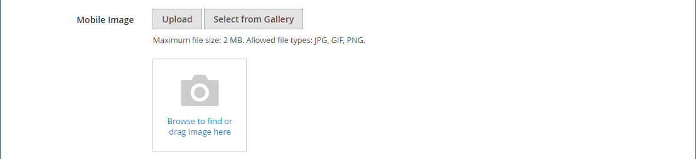

# 媒體 — 影像

使用&#x200B;_影像_&#x200B;內容型別將JPG、GIF或PNG影像新增至[[!DNL Page Builder] 舞台](workspace.md#stage)。 除了預設的案頭影像之外，您還可以指定行動裝置的次要影像。 您也可以新增出現在影像下方的標題，並將影像連結至任何URL、產品、類別或頁面。

>[!TIP]
>
>您可以使用[Adobe Stock整合](../content-design/adobe-stock.md)，在[Adobe Stock](https://stock.adobe.com)提供的數百萬個資產中，尋找並儲存適當的資產。 請參閱[使用Adobe Stock影像](../content-design/adobe-stock-manage.md)，以取得有關如何搜尋、調整Adobe Stock資產並將其儲存到相簿中的詳細資訊。

{{$include /help/_includes/page-builder-save-timeout.md}}

## 影像工具箱

當您將游標停留在影像容器上時，影像工具箱就會出現。

{width="500" zoomable="yes"}

| 工具 | 圖示 | 說明 |
|--- |--- |--- |
| 移動 | {width="25"} | 將影像移至舞台上的另一個位置。 |
| （標籤） | 影像 | 以影像識別目前的內容容器。 將滑鼠停留在影像容器上可檢視工具箱。 |
| 設定 | {width="25"} | 開啟&#x200B;_編輯影像_&#x200B;頁面，您可以在此變更影像和容器的屬性。 |
| 隱藏 | {width="25"} | 隱藏目前的影像。 |
| 顯示 | {width="25"} | 顯示隱藏的影像。 |
| 複製 | {width="25"} | 製作影像副本。 |
| 移除 | {width="25"} | 從舞台刪除影像。 |
| 上傳新影像 |  | 將影像從您的本機檔案系統上傳到相簿。 |
| 從相簿選取 |  | 從影像庫選擇現有影像。 |

{style="table-layout:auto"}

{{$include /help/_includes/page-builder-hidden-element-note.md}}

## 新增影像

1. 在[!DNL Page Builder]面板中，展開&#x200B;**[!UICONTROL Media]**&#x200B;並將&#x200B;**[!UICONTROL Image]**&#x200B;預留位置拖曳至目標容器。

   您可以將影像新增至列、欄或索引標籤。 在下列範例中，將影像拖曳至空白欄。

   {width="600" zoomable="yes"}

1. 使用下列其中一種方法來新增影像資產：

   {width="500" zoomable="yes"}

   >[!NOTE]
   >
   >檔案大小上限為4 MB。 支援的檔案型別為JPG、GIF和PNG。

   - _&#x200B;**上傳新影像**&#x200B;_：使用此方法從您的系統上傳新影像檔案。

      - 按一下&#x200B;**[!UICONTROL Upload Image]**。

      - 找出並選擇影像，將其新增至相簿和目標容器。

     或者，您也可以從系統拖曳影像檔案，並將它拖放到&#x200B;_攝影機_ （ {width="20"} ）圖示上。

   - _&#x200B;**選取現有資產**&#x200B;_：使用此方法從媒體儲存/媒體集選取現有影像資產。

      - 按一下&#x200B;**[!UICONTROL Select from Gallery]**。

      - 使用樹狀結構導覽至影像。

      - 按一下縮圖並按一下&#x200B;**[!UICONTROL Add Selected]**。

        {width="600" zoomable="yes"}

   - _&#x200B;**搜尋並選取Adobe Stock影像**&#x200B;_：使用此方法從Adobe Stock尋找影像。

     >[!NOTE]
     >
     >此方法需要為您的管理員設定[Adobe Stock整合](../content-design/adobe-stock.md)。

      - 按一下&#x200B;**[!UICONTROL Search Adobe Stock]**&#x200B;並搜尋影像。

      - 將預覽或授權的影像儲存至相簿。

        如需使用Adobe Stock資產的詳細資訊，請參閱[使用Adobe Stock影像](../content-design/adobe-stock-manage.md)。

      - 選取相簿中的資產縮圖，然後按一下&#x200B;**[!UICONTROL Add Selected]**。

   影像會顯示在預留位置的目標容器中。 不同於背景影像，您可以將影像移至目前容器內的不同位置或不同容器。

   >[!NOTE]
   >
   >[橫幅](banner.md)和[滑桿](slider.md)內容型別也包含&#x200B;_上傳影像_&#x200B;和&#x200B;_從相簿選取_&#x200B;選項以新增影像。

   {width="500" zoomable="yes"}

## 變更影像設定

1. 將滑鼠懸停在影像容器上以顯示工具方塊，並選擇&#x200B;_設定_ （{width="20"} ）圖示。
檔案名稱、尺寸和檔案大小會顯示在目前影像的下方。

   {width="600" zoomable="yes"}

1. 若要變更目前的&#x200B;**[!UICONTROL Image]**，請執行下列其中一個動作：

   - _&#x200B;**上傳新影像**&#x200B;_：使用此方法從您的系統上傳新影像檔案。

      - 按一下&#x200B;**[!UICONTROL Upload Image]**。

      - 找出並選擇影像，將其新增至相簿和目標容器。

   - _&#x200B;**選取現有資產**&#x200B;_：使用此方法從媒體儲存/媒體集選取現有影像資產。

      - 按一下&#x200B;**[!UICONTROL Select from Gallery]**。

      - 使用樹狀結構導覽至影像。

      - 按一下縮圖並按一下&#x200B;**[!UICONTROL Add Selected]**。

        {width="600" zoomable="yes"}

   - **搜尋並選取Adobe Stock影像**：使用此方法從Adobe Stock尋找影像。

     >[!NOTE]
     >
     >此方法需要為您的管理員設定[Adobe Stock整合](../content-design/adobe-stock.md)。

      - 按一下&#x200B;**[!UICONTROL Search Adobe Stock]**&#x200B;並搜尋影像。

      - 將預覽或授權的影像儲存至相簿。

        如需使用Adobe Stock資產的詳細資訊，請參閱[使用Adobe Stock影像](../content-design/adobe-stock-manage.md)。

      - 選取相簿中的資產縮圖，然後按一下&#x200B;**[!UICONTROL Add Selected]**。

1. 若要新增&#x200B;**[!UICONTROL Mobile Image]**，請使用上一步所述的相同方法，選取要在行動裝置上顯示的影像。

   {width="600" zoomable="yes"}

1. 如有需要，請為影像指定&#x200B;**[!UICONTROL Link]**。

   連結是客戶按一下影像時顯示的目的地頁面。 您可以使用下列三種連結型別之一：

   - **[!UICONTROL URL]** — 連結至相對或完整URL。

   - **[!UICONTROL Product]** — 根據產品名稱或SKU識別目的地頁面。 根據部分或完整名稱依名稱搜尋產品。 從搜尋結果清單中選擇產品。

     {width="600" zoomable="yes"}

   - **[!UICONTROL Category]** — 將目的地頁面識別為類別樹狀結構中的特定類別或子類別。 根據部分或完整名稱搜尋類別。 從所顯示樹狀結構的展開區段中選擇類別。

     {width="600" zoomable="yes"}

   - **[!UICONTROL Page]** — 將目的地頁面識別為特定內容頁面。 根據部分或完整名稱來搜尋頁面。 從搜尋結果清單中選擇頁面。

     {width="600" zoomable="yes"}

   如果您要防止訪客離開您的商店，請選取「**[!UICONTROL Open in new tab]**」核取方塊。 清除核取方塊後，連結的目的地會在相同的瀏覽器標籤中開啟，這樣可以有效地導覽訪客離開您的商店。

1. 若要新增&#x200B;**[!UICONTROL Image Caption]**，請輸入您要顯示在影像下方的文字。

   註解的格式由與目前主題關聯的樣式表決定。

   註解通常會顯示在影像下方，為訪客和搜尋引擎提供有關影像的資訊。 如果您的網站提供多種語言版本，您可以使用相同的影像，但需翻譯標題。 在HTML中，`<figcaption>`標籤是`<figure>`標籤的子集。`<figcaption>This is the image caption</figcaption>`

1. 視需要更新任何其他設定：

   - [搜尋引擎最佳化](#search-engine-optimization)
   - [進階](#advanced)

1. 完成後，按一下&#x200B;**[!UICONTROL Save]**&#x200B;套用設定並返回[!DNL Page Builder]工作區。

## 移動影像

1. 將滑鼠停留在影像容器上以顯示工具箱，然後選擇&#x200B;_移動_ （{width="20"} ）圖示。

   {width="500" zoomable="yes"}

1. 選取並將影像拖曳到新的位置，正好在紅色指引的下方。

   {width="500" zoomable="yes"}

## 移除影像

1. 將滑鼠懸停在影像容器上以顯示工具箱，然後選擇&#x200B;_移除_ （ {width="20"} ）圖示。

1. 提示確認時，按一下&#x200B;**[!UICONTROL OK]**。

## 搜尋引擎最佳化

搜尋引擎可以看到這些設定的文字，並改善頁面編制索引的方式。

- 針對&#x200B;**[!UICONTROL Alternative Text]**，輸入要顯示之數位協助工具的&#x200B;_alt_&#x200B;文字說明。

  替代文字的使用是協助工具的最佳實務，在某些地區是法律所要求。 在HTML中，`alt`屬性是`image`標籤的子集： `<image title="tooltip" alt="description" src="image.jpg">`。

- 針對&#x200B;**[!UICONTROL Title Attribute]**，輸入要顯示為滑鼠懸停工具提示的文字。

  最佳實務是選擇描述性、關鍵字豐富的標題，以改進搜尋引擎為影像編制索引的方式。 在HTML中，`title`屬性是`image`標籤的子集： `<image title="tooltip" alt="description" src="image.jpg">`。

## [!UICONTROL Advanced]

- 若要控制新增至容器的影像水平位置，請選擇&#x200B;**[!UICONTROL Alignment]**。

  | 選項 | 說明 |
  | ------ | ----------- |
  | `Default` | 套用目前佈景主題樣式表中指定的對齊預設設定。 |
  | `Left` | 沿著影像容器的左邊框對齊影像內容，並容許任何指定的邊框間距。 |
  | `Center` | 將影像內容對齊影像容器的中央，並容許任何指定的邊框間距。 |
  | `Right` | 沿著影像容器的右邊框對齊影像內容，並容許任何指定的邊框間距。 |

  {style="table-layout:auto"}

- 設定套用至影像容器所有四個側面的&#x200B;**[!UICONTROL Border]**&#x200B;樣式：

  | 選項 | 說明 |
  | ------ | ----------- |
  | `Default` | 套用關聯樣式表所指定的預設邊框樣式。 |
  | `None` | 未提供任何容器框線的可見指示。 |
  | `Dotted` | 容器邊框會以虛線顯示。 |
  | `Dashed` | 容器邊框會以虛線顯示。 |
  | `Solid` | 容器邊框會以實線顯示。 |
  | `Double` | 容器邊框會以雙線顯示。 |
  | `Groove` | 容器框線會顯示為槽線。 |
  | `Ridge` | 容器框線會顯示為脊線。 |
  | `Inset` | 容器框線會顯示為內嵌線。 |
  | `Outset` | 容器邊框會顯示為外線。 |

  {style="table-layout:auto"}

- 如果您設定了`None`以外的框線樣式，請完成框線顯示選項：

  {width="600" zoomable="yes"}

  | 選項 | 說明 |
  | ------ |------------ |
  | [!UICONTROL Border Color] | 選擇色票、按一下檢色器，或輸入有效的顏色名稱或相等的十六進位值，以指定顏色。 |
  | [!UICONTROL Border Width] | 輸入邊框線條寬度的畫素數。 |
  | [!UICONTROL Border Radius] | 輸入畫素數目，以定義用來將邊框每個角落倒圓角的半徑大小。 |

  {style="table-layout:auto"}

- （選擇性）從目前的樣式表中指定要套用至影像容器的&#x200B;**[!UICONTROL CSS classes]**&#x200B;名稱。

  以空格分隔多個類別名稱。

- 輸入&#x200B;**[!UICONTROL Margins and Padding]**&#x200B;的值（以畫素為單位），以指定影像容器的外部邊界和內邊距。

  在影像容器圖表中輸入每個對應的值。

  | 容器區域 | 說明 |
  | -------------- | ----------- |
  | [!UICONTROL Margins] | 套用至容器所有側邊外部邊緣的空白空間量。 |
  | [!UICONTROL Padding] | 套用至容器所有邊內側邊緣的空白空間量。 |

  {style="table-layout:auto"}
