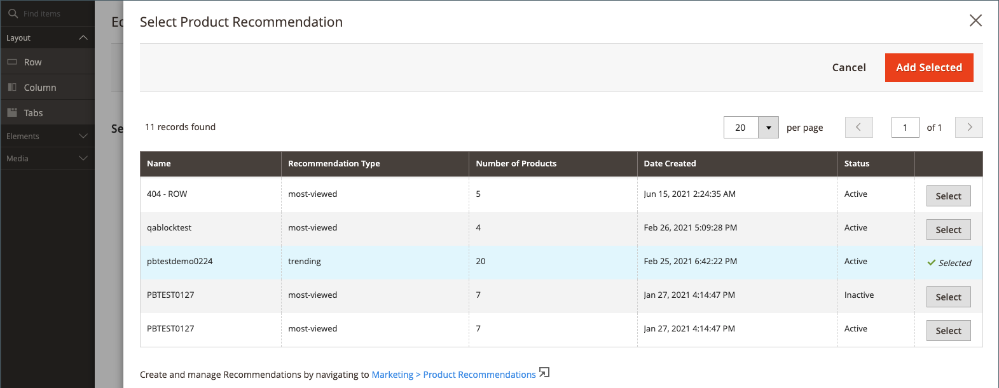
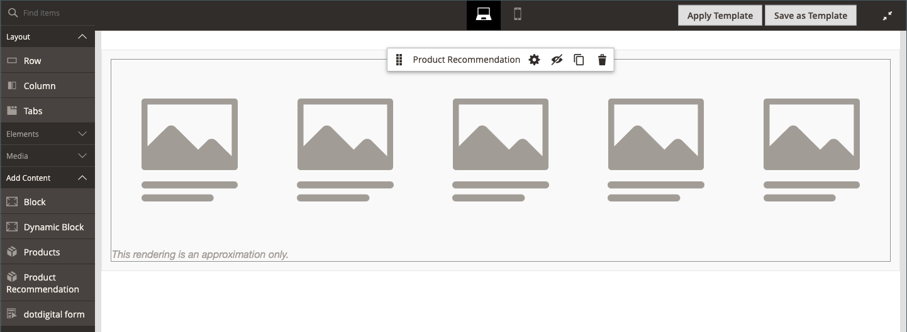

# 新增內容 — 產品Recommendations

使用 _產品Recommendations_ 內容型別，用於新增現有的、作用中的 [推薦單位](https://experienceleague.adobe.com/en/docs/commerce-merchant-services/product-recommendations/admin/create) 至 [[!DNL Page Builder] 階段](workspace.md#stage) CMS頁面、區塊或動態區塊。

>[!NOTE]
>
>此 [!DNL Page Builder] _產品Recommendations_ Adobe Commerce 2.4.4及更高版本支援內容型別，並且可在以下位置取得： [產品Recommendations中繼套件3.0.x版或更新版本](https://commercemarketplace.adobe.com/magento-product-recommendations.html). 新增 [!DNL Page Builder] 支援產品Recommendations， [請參閱安裝資訊](https://experienceleague.adobe.com/en/docs/commerce-merchant-services/product-recommendations/getting-started/install-configure). **此內容型別不適用於Magento Open Source。**

{{$include /help/_includes/page-builder-save-timeout.md}}

## 產品Recommendations工具箱

| 工具 | 圖示 | 說明 |
| --- | --| --- |
| 移動 | {width="25"} | 將產品推薦容器及其內容移至舞台上的另一個位置。 |
| 設定 | {width="25"} | 開啟「編輯產品建議」頁面，您可在其中選擇建議單位並變更容器屬性。 |
| 隱藏 | {width="25"} | 隱藏目前的產品推薦容器及其內容。 |
| 顯示 | {width="25"} | 顯示隱藏的產品推薦容器及其內容。 |
| 複製 | {width="25"} | 製作產品推薦容器及其內容的重複副本。 |
| 移除 | {width="25"} | 從階段刪除產品推薦容器及其內容。 |

{style="table-layout:auto"}

{{$include /help/_includes/page-builder-hidden-element-note.md}}

## 新增現有的建議單位

1. 確定您已擁有 [已建立建議單位](https://experienceleague.adobe.com/en/docs/commerce-merchant-services/product-recommendations/admin/create) 針對 [!DNL Page Builder] 頁面型別。

>[!NOTE]
>
>您可以為以下專案建立建議單位： [!DNL Page Builder] 頁面型別僅在預設商店檢視中顯示。

1. 在編輯模式中開啟頁面、區塊或動態區塊。

1. 展開 _[!UICONTROL Content]_區段並按一下&#x200B;**[!UICONTROL Edit with Page Builder]**或內容預覽區域內以開啟 [!DNL Page Builder] 工作區。

1. 在 [!DNL Page Builder] 下的面板 _[!UICONTROL Layout]_，拖曳&#x200B;**[!UICONTROL Row]**舞台的預留位置。

1. 在 [!DNL Page Builder] 下的面板 _[!UICONTROL Add Content]_，拖曳&#x200B;**[!UICONTROL Product Recommendation]**列的預留位置。

   {width="600" zoomable="yes"}

1. 執行下列任一項作業：

   - 按一下 **[!UICONTROL Edit Product Recommendation]**.
   - 將滑鼠懸停在空白容器上以顯示工具箱，然後按一下 _設定_ ()圖示。

   {width="600" zoomable="yes"}

1. 在 _[!UICONTROL Selection]_區段，按一下&#x200B;**[!UICONTROL Select]**.

1. 在有效產品建議清單中，找到包含您要新增之建議單位的列，然後按一下 **[!UICONTROL Select]** 在最後一欄。

   {width="600" zoomable="yes"}

1. 在右上角，按一下 **[!UICONTROL Add Selected]**.

   所選產品推薦的名稱會顯示在 _[!UICONTROL Selection]_的區段_[!UICONTROL Edit Product Recommendation]_ 頁面。

1. 進行必要的變更 [進階設定](#advanced-settings).

   {width="600" zoomable="yes"}

1. 完成後，請執行下列動作：

   - 如果使用完全最大化的瀏覽器視窗，請按一下 _關閉全熒幕_ ()圖示中依視覺效果標示。

   - 按一下 **[!UICONTROL Save]** 以套用設定並返回 [!DNL Page Builder] 工作區。

   當您回到舞台時，產品預留位置影像會出現在容器中。

## 編輯建議單位設定

1. 將滑鼠停留在建議單位容器上以顯示工具箱，然後按一下 _設定_ ()圖示。

   {width="600" zoomable="yes"}

1. 進行必要的變更 [進階設定](#advanced-settings).

1. 完成後，按一下 **[!UICONTROL Save]** 以套用設定並返回 [!DNL Page Builder] 工作區。

## 複製建議單位

1. 將滑鼠停留在建議單位容器上以顯示工具箱，然後按一下 _複製_ ()圖示。

   重複專案會出現在原始專案的正下方。

1. 若要將重複的建議單位移至新位置，請將游標移至容器上，然後按一下 _移動_ ()圖示。

1. 選取並拖曳建議單位，直到紅色指引出現在新位置為止。

   移動建議單位時，每個容器的頂端和底部邊界都會顯示為虛線。

## 從階段中移除建議單位

1. 將游標停留在建議單位容器上，然後按一下 _移除_ ( )圖示。

1. 提示確認時，按一下 **[!UICONTROL OK]**.

## 進階設定

1. 若要控制上層容器中「產品Recommendations」單位的位置，請選擇 **[!UICONTROL Alignment]**：

   | 選項 | 說明 |
   | ------ | ----------- |
   | `Default` | 套用目前佈景主題樣式表中指定的對齊預設設定。 |
   | `Left` | 將單位沿父容器的左邊框對齊，並允許指定的任何邊框間距。 |
   | `Center` | 將單位對齊父容器的中心，並容許任何指定的內距。 |
   | `Right` | 將單位沿父容器的右邊框對齊，並容許任何指定的內距。 |

   {style="table-layout:auto"}

1. 設定 **[!UICONTROL Border]** 套用至「產品Recommendations」單位所有四個側面的樣式：

   | 選項 | 說明 |
   | ------ | ----------- |
   | `Default` | 套用關聯樣式表所指定的預設邊框樣式。 |
   | `None` | 未提供任何單位框線的可見指示。 |
   | `Dotted` | 單位邊框會以虛線顯示。 |
   | `Dashed` | 單位邊框會以虛線顯示。 |
   | `Solid` | 單位邊框顯示為實線。 |
   | `Double` | 單位邊框會以雙線顯示。 |
   | `Groove` | 單位邊界會顯示為凹槽線。 |
   | `Ridge` | 單位邊界會顯示為脊線。 |
   | `Inset` | 單位框線會顯示為內嵌線。 |
   | `Outset` | 單位邊界會顯示為外線。 |

   {style="table-layout:auto"}

1. 如果您設定的邊框樣式不是 `None`，完成邊框顯示選項：

   | 選項 | 說明 |
   | ------ |------------ |
   | [!UICONTROL Border Color] | 選擇色票、按一下檢色器，或輸入有效的顏色名稱或相等的十六進位值，以指定顏色。 |
   | [!UICONTROL Border Width] | 輸入邊框線條寬度的畫素數。 |
   | [!UICONTROL Border Radius] | 輸入畫素數目，以定義用來將邊框每個角落倒圓角的半徑大小。 |

   {style="table-layout:auto"}

1. （選擇性）指定下列專案的名稱： **[!UICONTROL CSS classes]** 從目前樣式表套用至單位。

   以空格分隔多個類別名稱。

1. 以畫素為單位，輸入 **[!UICONTROL Margins and Padding]** 以決定單位的外邊界和內邊距。

   在圖表中輸入對應的值。

   | 容器區域 | 說明 |
   | ------ | ----------- |
   | [!UICONTROL Margins] | 套用至單位所有側邊外部邊緣的空白空間量。 選項： `Top` / `Right` / `Bottom` / `Left` |
   | [!UICONTROL Padding] | 套用至單位所有側邊內邊的空白空間量。 選項： `Top` / `Right` / `Bottom` / `Left` |

   {style="table-layout:auto"}
