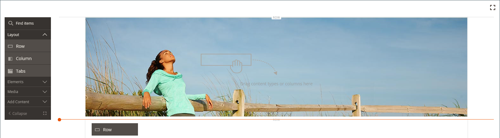
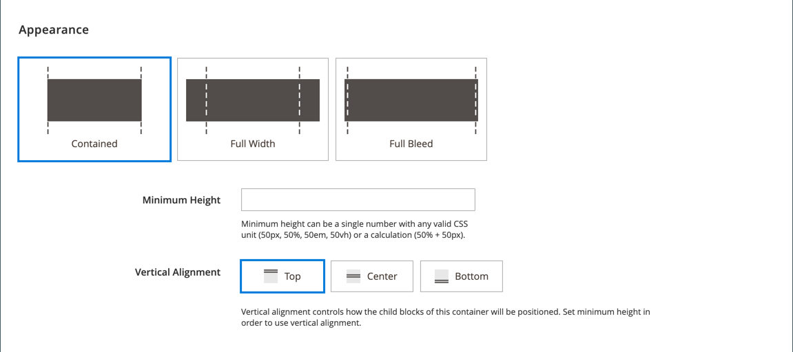
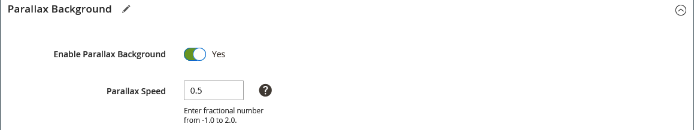

# 版面 — 列

使用 _列_ 內容型別，以在 [[!DNL Page Builder] 階段](workspace.md#stage).

{{$include /help/_includes/page-builder-save-timeout.md}}

## 列工具箱

當您將滑鼠游標停留在列容器上時，列工具箱就會出現。 工具箱包括移動、隱藏、複製、編輯或移除列的選項。 選取的設定決定資料列的外觀、背景和版面。 其他內容元素可以拖曳至列，從 [!DNL Page Builder] 面板顯示。

{width="600" zoomable="yes"}

| 工具 | 圖示 | 說明 |
| --------- | ---------- | ----------- |
| 移動 | {width="25"} | 將列移動到相對於舞台上其他列的另一個位置。 |
| （標籤） | [!UICONTROL Row] | 以列識別目前的內容容器。 將滑鼠停留在容器上可檢視工具箱。 |
| 設定 | {width="25"} | 開啟「編輯列」頁面，您可以在此變更容器的屬性。 |
| 隱藏 | {width="25"} | 隱藏目前的列。 |
| 顯示 | {width="25"} | 顯示隱藏列。 |
| 複製 | {width="25"} | 製作列的副本。 |
| 移除 | {width="25"} | 從階段中刪除列容器及其內容。 |

{style="table-layout:auto"}

{{$include /help/_includes/page-builder-hidden-element-note.md}}

## 新增列

1. 在 [!DNL Page Builder] 下的面板 _[!UICONTROL Layout]_，拖曳新的&#x200B;**[!UICONTROL Row]**到舞台，在第一列的正下方。

1. 若要格式化列，請將游標停留在列容器上以顯示工具箱，然後選擇 _設定_ ( {width="20"} )圖示。

   請於下列各節中取得有關完成可用設定的詳細資訊。

   {width="600" zoomable="yes"}

## 變更列設定

1. 將滑鼠懸停在列容器上以顯示工具箱，然後選擇 _設定_ ( {width="20"} )圖示。

   {width="600" zoomable="yes"}

1. 請於下列章節中取得有關更新可用設定的詳細資訊。

1. 完成後，按一下 **[!UICONTROL Save]** 以套用設定並返回 [!DNL Page Builder] 工作區。

## 外觀

使用 _外觀_ 用來決定內容在列中的顯示方式的設定。

{width="600" zoomable="yes"}

- 若要判斷背景顏色和/或背景影像如何與內容區域的容器和寬度產生關聯，請選擇對齊方式：

  | 選項 | 說明 |
  | ------ | ----------- |
  | [!UICONTROL Contained] | 背景顏色或影像限製為主題所定義的最大頁面寬度。 |
  | [!UICONTROL Full Width] | 將內容限制在主題所定義的最大頁面寬度。 背景顏色和/或影像不受限制，並會延伸列的完整寬度。 |
  | [!UICONTROL Full Bleed] | 內容與背景影像及/或顏色不受限制，並會延伸列的完整寬度。 完全出血只能用於 [主題](../content-design/themes.md) 支援版面配置。 |

  {style="table-layout:auto"}

- 輸入 **[!UICONTROL Minimum Height]** 用於該列。 此值可以是具有任何有效CSS單位的數字(例如 `100px`， `50%`， `50em`， `100vh`)或計算式(例如 `100vh - 237px`)。

  例如，您可以設定列的最小高度來延伸頁面的完整高度，為全頁背景影像和視訊提供引人入勝的選項。

- 選擇 **[!UICONTROL Vertical Alignment]** 此設定可對齊新增至列的任何內容容器（「頂端」、「置中」或「底部」）。

## 背景

定義列的背景顯示時，有許多選項。 您可以套用簡單的顏色或背景影像，並管理更複雜的效果。

### 背景顏色

藉由選擇色票、按一下檢色器或輸入有效的顏色名稱或相等的十六進位值來指定背景顏色。 此設定決定列的背景顏色。 您也可以調整顏色的不透明度。

{width="200"}

您可以透過下列三種方式之一設定值：

- 預先定義的顏色名稱，例如 `White`
- 顏色的十六進位顏色值，例如 `#ffffff`
- 顏色的rgba值（含不透明度百分比），例如 `rgba(255, 255, 255, 0.75)`

如果要選擇顏色，請按一下 _無色彩_ 方塊。

{width="600" zoomable="yes"}

如果您按一下顏色方塊來再次開啟檢色器，滑桿下方的方塊會顯示目前的紅色、綠色、藍色和Alpha值(rgba)。 最後一個數字以小數表示目前的不透明度百分比。 您可以使用滑桿來調整不透明度，或輸入所需的十進位值。

{width="600" zoomable="yes"}

>[!NOTE]
>
>[!DNL Page Builder] 也支援透明圖層，或 _Alpha色版_，在背景影像中，這些影像可用來建立具有不同不透明度的背景。

### [!UICONTROL Background Type]

背景型別可以是影像或視訊。 [!DNL Page Builder] 預設為 `Image` 和會顯示各種影像設定。 如果您選取 `Video`， [!DNL Page Builder] 將影像設定與視訊設定交換。 這兩種背景型別的說明如下。

{width="200"}

### 影像型別設定

如果您設定 _[!UICONTROL Background Type]_至 `Image`，使用下列設定來定義背景影像顯示。

{width="600" zoomable="yes"}

- **[!UICONTROL Background Image]**  — 如有需要，請使用提供的工具來選擇要套用至列的背景影像：

  | 選項 | 說明 |
  | ------ | ----------- |
  | [!UICONTROL Upload] | 將影像檔案從本機電腦上傳到相簿，然後將其套用為列的背景影像。 |
  | [!UICONTROL Select from Gallery] | 提示您從相簿中選擇現有影像作為列的背景影像。 |
  | {width="25"} | 可讓您將影像拖曳至相機圖磚，或瀏覽至本機檔案系統中的影像。 |

  {style="table-layout:auto"}

- **[!UICONTROL Background Mobile Image]**  — 如有需要，請使用相同的工具，選擇不同的背景影像以便在行動裝置上顯示。

- **[!UICONTROL Background Size]**  — 設定此選項以決定背景影像相對於列寬縮放的方式：

  | 選項 | 說明 |
  | ------ | ----------- |
  | `Cover` | 背景影像涵蓋列的完整寬度。 |
  | `Contain` | 背景影像僅限於內容區域的寬度。 |
  | `Auto` | 套用目前樣式表的大小。 |

  {style="table-layout:auto"}

  {width="250"}

- **[!UICONTROL Background Position]**  — 設定此選項可決定背景影像相對於列的錨定方式：

  | 錨點 | 位置 |
  | ------ | ----------- |
  | `Top` | 左/中/右 |
  | `Center` | 左/中/右 |
  | `Bottom` | 左/中/右 |

  {style="table-layout:auto"}

  錨點就像推入圖釘，可將影像附加至指定背景位置的列。

- **[!UICONTROL Background Attachment]**  — 設定附件型別，以決定背景影像相對於捲動頁面的移動方式：

  | 選項 | 說明 |
  | ------ | ----------- |
  | `Scroll` | 當頁面捲動時，附加的背景影像會同步處理為向下移動。 使用「視差背景」來控制捲動速度。 |
  | `Fixed` | （不適用於行動裝置）當容器捲動影像時，背景影像不會移動，且會固定在指定的背景位置。 |

  {style="table-layout:auto"}

- **[!UICONTROL Background Repeat]**  — 設為 `Yes` 重複背景影像以填滿列中的可用空間。

### 視訊型別設定

如果您設定 _背景型別_ 至 `Video`，使用下列設定來定義背景影像顯示。

- **[!UICONTROL Video URL]**  — 輸入有效的視訊URL。 有效的視訊URL可以連結至：

   - YouTube影片： `https://youtu.be/CoDhMRUUjeI`
   - Vimeo影片： `https://vimeo.com/190156113`
   - 有效的視訊檔案(`.mp4` 建議使用)： `https://myvideos.com/spiral.mp4`

  {width="300"}

- **[!UICONTROL Overlay Color]**  — 選取色彩以套用透明色調至視訊。

- **[!UICONTROL Infinite Loop]**  — 設為 `No` 讓視訊播放一次並停止。 當此選項設定為 `Yes` （預設），視訊會在無限回圈中重複。

- **[!UICONTROL Lazy Load]**  — 設為 `No` 以使用頁面載入視訊，即使視訊不可見亦然。 當此選項設定為 `Yes` （預設），視訊只有在熒幕上顯示時，才會從來源載入。

- **[!UICONTROL Play Only When Visible]**  — 設為 `No` 讓影片在載入後立即開始播放，無論影片是否可見。 當此選項設定為 `Yes` （預設），視訊只有在可見時才會開始播放。

- **[!UICONTROL Fallback Image]**  — 如有需要，在視訊載入前，如果視訊因某項原因未載入，請指定要在畫面上顯示的影像。

## 視差背景

使用這些選項可控制相對於頁面捲動的背景影像或視訊的捲動速度。 背景可以設定為更緩慢的捲動，以營造沈浸感。

- 設定 **啟用視差背景** 至 `Yes`.
- 輸入 **視差速度** 作為介於以下範圍的十進位值： `-1.0` 和 `2.0`.

{width="600" zoomable="yes"}

## 進階

- 若要控制新增至列的內容容器的水平位置，請選擇 **[!UICONTROL Alignment]**：

  | 選項 | 說明 |
  | ------ | ----------- |
  | `Default` | 套用目前佈景主題樣式表中指定的對齊預設設定。 |
  | `Left` | 將內容容器沿列容器的左邊框對齊，並允許指定的任何邊框間距。 |
  | `Center` | 將內容容器對齊列容器的中央，並允許指定的任何邊框間距。 |
  | `Right` | 將內容容器沿列容器的右邊框對齊，並允許指定的任何邊框間距。 |

  {style="table-layout:auto"}

- 設定 **[!UICONTROL Border]** 套用至列容器所有四個邊的樣式：

  | 選項 | 說明 |
  | ------ | ----------- |
  | `Default` | 套用關聯樣式表所指定的預設邊框樣式。 |
  | `None` | 未提供任何容器框線的可見指示。 |
  | `Dotted` | 容器邊框會以虛線顯示。 |
  | `Dashed` | 容器邊框會以虛線顯示。 |
  | `Solid` | 容器邊框會以實線顯示。 |
  | `Double` | 容器邊框會以雙線顯示。 |
  | `Groove` | 容器框線會顯示為槽線。 |
  | `Ridge` | 容器框線會顯示為脊線。 |
  | `Inset` | 容器框線會顯示為內嵌線。 |
  | `Outset` | 容器邊框會顯示為外線。 |

  {style="table-layout:auto"}

- 如果您設定的邊框樣式不是 `None`，完成邊框顯示選項：

  {width="600" zoomable="yes"}

  | 選項 | 說明 |
  | ------ |------------ |
  | [!UICONTROL Border Color] | 選擇色票、按一下檢色器，或輸入有效的顏色名稱或相等的十六進位值，以指定顏色。 |
  | [!UICONTROL Border Width] | 輸入邊框線條寬度的畫素數。 |
  | [!UICONTROL Border Radius] | 輸入畫素數目，以定義用來將邊框每個角落倒圓角的半徑大小。 |

  {style="table-layout:auto"}

  下列範例中的列的邊框半徑為15。

  {width="500"}

- （選擇性）指定下列專案的名稱： **[!UICONTROL CSS classes]** 從目前的樣式表套用至列容器。

  以空格分隔多個類別名稱。

- 以畫素為單位，輸入 **[!UICONTROL Margins and Padding]** 指定列的外邊界和內邊距。

  在列容器圖表中輸入每個對應的值。

  | 容器區域 | 說明 |
  | -------------- | ----------- |
  | [!UICONTROL Margins] | 套用至容器所有側邊外部邊緣的空白空間量。 選項： `Top` / `Right` / `Bottom` / `Left` |
  | [!UICONTROL Padding] | 套用至容器所有邊內側邊緣的空白空間量。 選項： `Top` / `Right` / `Bottom` / `Left` |

  {style="table-layout:auto"}

  {width="600" zoomable="yes"}
