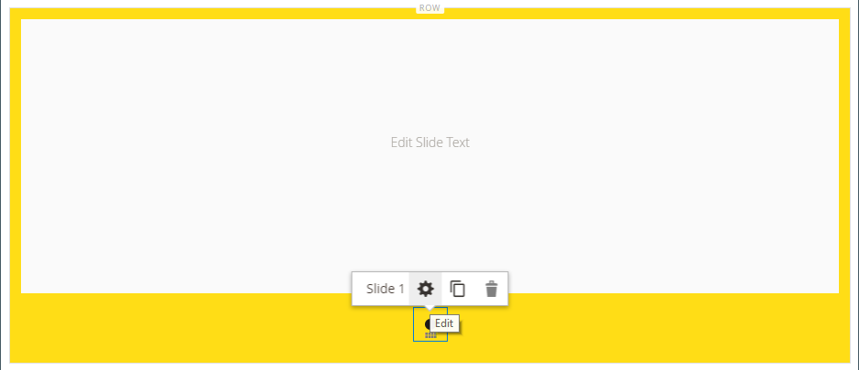
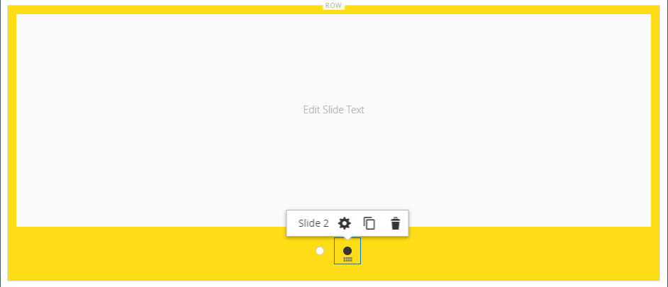
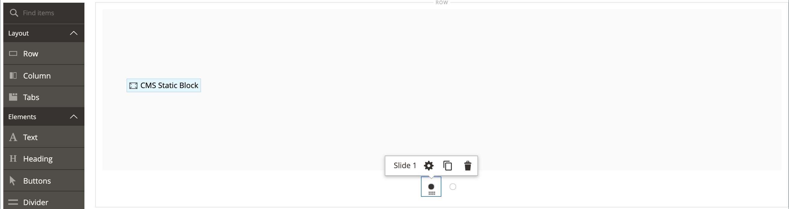
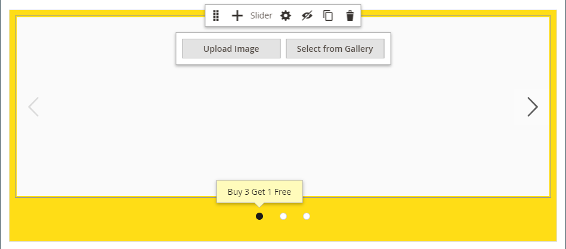
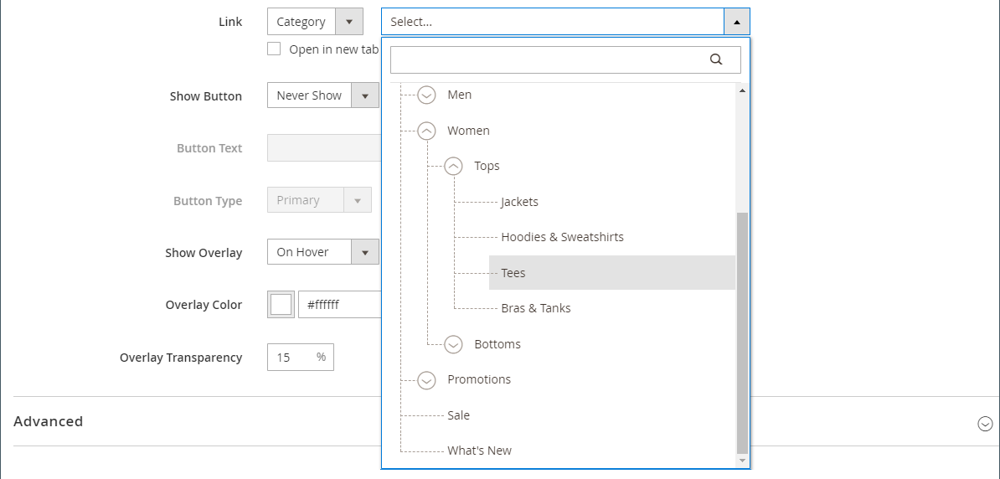
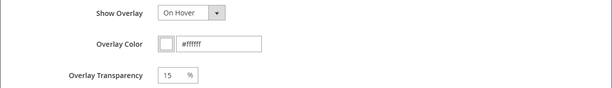
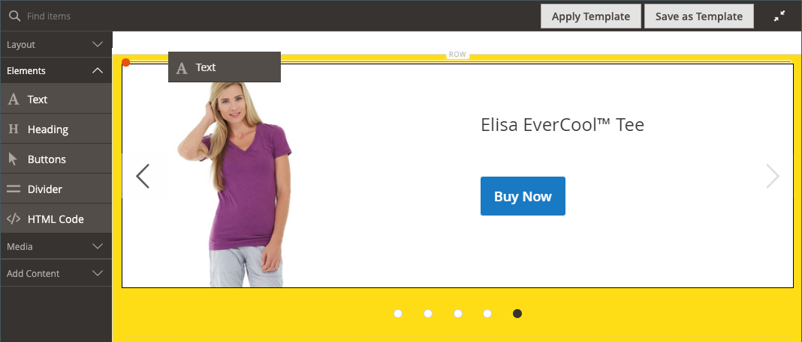
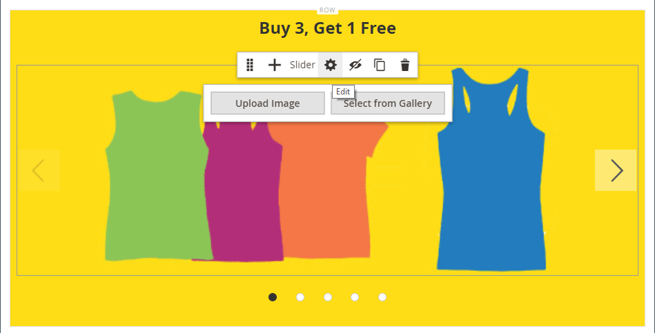
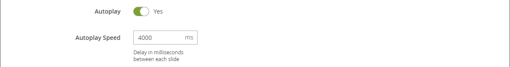
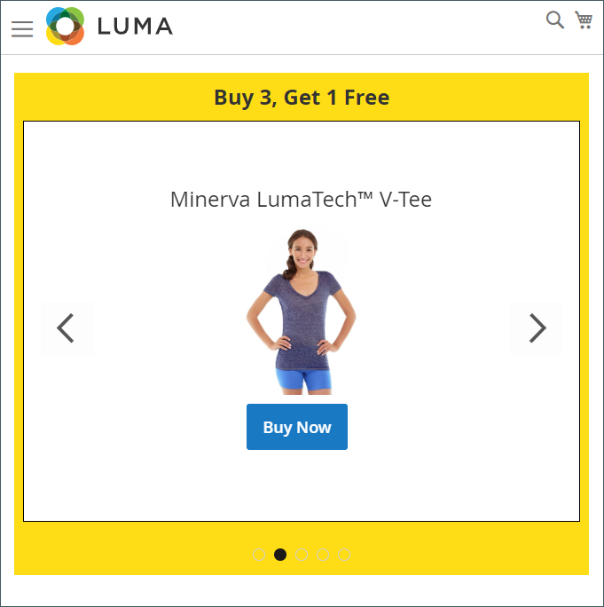

# 媒體 — 滑桿

使用&#x200B;_Slider_&#x200B;內容型別將影像投影片新增至[[!DNL Page Builder] 舞台](workspace.md#stage)。 您可以上傳新影像，或從相簿或產品目錄選擇現有影像。 滑桿可以設定為自動播放，或使用導覽按鈕手動控制。 若要將滑桿與特定促銷活動建立關聯，請參閱[動態區塊](dynamic-block.md)。

店面上的{width="700" zoomable="yes"}

{{$include /help/_includes/page-builder-save-timeout.md}}

## 工具箱

使用Slider內容型別時，您可以新增並編輯個別投影片，以及容納一或多個投影片的滑塊容器。 每張投影片都有自己的工具箱，可用來在[!DNL Page Builder]舞台上設計投影片。

## 個別投影片工具箱

{width="500" zoomable="yes"}

| 工具 | 圖示 | 說明 |
|--- |--- |--- |
| 移動 | {width="25"} | 將幻燈片移至滑杆上的另一個位置。 |
| （標籤） | 投影片編號 | 識別目前幻燈片的編號。 |
| 設定 | {width="25"} | 開啟&#x200B;_[!UICONTROL Edit Slide]_頁面，您可以在此變更目前幻燈片的屬性。 |
| 複製 | {width="25"} | 製作目前幻燈片的復本。 |
| 移除 | {width="25"} | 從滑桿刪除目前的幻燈片。 |

{style="table-layout:auto"}

## 滑桿工具箱

| 工具 | 圖示 | 說明 |
|--- |--- |--- |
| 移動 | {width="25"} | 將滑桿移至舞台上的另一個位置。 |
| （標籤） | [!UICONTROL Slider] | 識別滑桿容器。 |
| 設定 | {width="25"} | 開啟&#x200B;_[!UICONTROL Edit Slider]_頁面，您可以在此變更視訊和容器的屬性。 |
| 隱藏 | {width="25"} | 隱藏目前的滑桿。 |
| 顯示 | {width="25"} | 顯示隱藏的滑桿。 |
| 複製 | {width="25"} | 製作滑桿副本。 |
| 移除 | {width="25"} | 從舞台刪除滑桿。 |

{style="table-layout:auto"}

{{$include /help/_includes/page-builder-hidden-element-note.md}}

## 新增個別幻燈片

1. 開啟您要放置滑桿的頁面、區塊或動態區塊，並展開&#x200B;**[!UICONTROL Content]**&#x200B;區段。

1. 在[!DNL Page Builder]面板中，展開&#x200B;**[!UICONTROL Media]**&#x200B;並將&#x200B;**[!UICONTROL Slider]**&#x200B;預留位置拖曳到舞台上的列、欄或索引標籤。

   在下列範例中，列的背景顏色是黃色(`#fffd16`)。

   {width="600" zoomable="yes"}

   滑桿容器會以單一空白幻燈片顯示在舞台上。

1. 按一下滑桿容器以顯示[文字編輯器](../content-design/editor.md)，並輸入第一張幻燈片的內容。

   您也可以使用[Content](#content)設定包含更複雜的橫幅內容。

1. 按一下滑桿底部的導覽點，以顯示個別幻燈片的工具箱，並選擇&#x200B;_設定_ （ {width="20"} ）圖示。

   滑桿有兩個工具箱。 請確定您使用的是底部的投影片工具箱。

1. 視需要根據下列章節完成設定：

   - [[!UICONTROL Appearance]](#appearance)
   - [[!UICONTROL Background]](#background)
   - [[!UICONTROL Content]](#content)
   - [[!UICONTROL Search Engine Optimization]](#seo)
   - [[!UICONTROL Advanced]](#advanced)

1. 完成後，按一下&#x200B;**[!UICONTROL Save]**&#x200B;套用設定並返回[!DNL Page Builder]工作區。

## 新增更多幻燈片

以下章節說明從個別幻燈片開始建立回應式滑桿並連結至特定產品的一系列步驟。 如果您還沒有個別投影片，請依照之前的指示，將個別投影片加入舞台。

若要新增投影片，請使用下列方法之一或組合：

### 方法1：複製現有幻燈片

您可以複製已設定所需設定的幻燈片，以節省時間。

1. 按一下投影片下方的導覽點以顯示工具箱，然後選擇&#x200B;_複製_ （{width="20"} ）圖示。

   {width="500" zoomable="yes"}

1. 按一下新幻燈片的導覽點，並顯示工具箱，然後選擇&#x200B;_設定_ （{width="20"} ）圖示。

1. 視需要修改設定，請遵循下列章節：

   - [[!UICONTROL Appearance]](#appearance)
   - [[!UICONTROL Background]](#background)
   - [[!UICONTROL Content]](#content)
   - [[!UICONTROL Advanced]](#advanced)

1. 完成後，按一下&#x200B;**[!UICONTROL Save]**&#x200B;套用設定並返回[!DNL Page Builder]工作區。

### 方法2：新增一張空白幻燈片

1. 將滑桿容器暫留在頂端以顯示工具箱，然後選擇&#x200B;_新增_ （ {width="20"} ）圖示。

   {width="500" zoomable="yes"}

   新的空白投影片具有自己的導覽點與工具箱，會新增至滑桿，並顯示在舞台上。

   {width="500" zoomable="yes"}新增投影片

1. 按一下新幻燈片的導覽點，並顯示工具箱，然後選擇&#x200B;_設定_ （{width="20"} ）圖示。

1. 視需要修改設定，請遵循下列章節：

   - [[!UICONTROL Appearance]](#appearance)
   - [[!UICONTROL Background]](#background)
   - [[!UICONTROL Content]](#content)
   - [[!UICONTROL Advanced]](#advanced)

1. 完成後，按一下右上角的&#x200B;**[!UICONTROL Save]**&#x200B;以關閉&#x200B;_[!UICONTROL Edit Slide]_頁面。

### 在幻燈片上新增Widget

您可以使用下列步驟，將任何[Widget型別](../content-design/widgets.md#widget-types)新增至[!DNL Page Builder]階段的投影片：

1. [建立您要在幻燈片上看到的Widget](../content-design/widget-create.md)。

1. 開啟您要放置滑桿的頁面、區塊或動態區塊，並展開&#x200B;**[!UICONTROL Content]**&#x200B;區段。

1. 在[!DNL Page Builder]面板中，展開&#x200B;**[!UICONTROL Media]**&#x200B;並將&#x200B;**[!UICONTROL Slider]**&#x200B;預留位置拖曳到舞台上的列、欄或索引標籤。

1. 按一下滑桿容器以顯示[文字編輯器](../content-design/editor.md)工具列，然後按一下&#x200B;_插入Widget_ （{width="20"} ）圖示。

1. 選取所需的&#x200B;**[!UICONTROL Widget Type]**。

1. 指定視介面工具集型別而異的設定

   {width="600" zoomable="yes"}

1. 完成後，按一下右上角的&#x200B;**[!UICONTROL Insert Widget]**。

1. 視需要修改其他設定。

1. 完成後，按一下右上角的&#x200B;**[!UICONTROL Save]**。

   {width="600" zoomable="yes"}

### 檢視每張幻燈片

若要在舞台上顯示每張幻燈片，請按一下目前顯示幻燈片下方的下一個點。

{width="500" zoomable="yes"}

上例中的投影片有背景影像、透明行動影像，以及從文字編輯器新增的內嵌影像。 此技巧在行動裝置上可正常運作，方法是關閉背景影像，並僅顯示較小的內嵌影像。 此範例中的產品投影片具有下列額外設定：

| 選項 | 範例設定 |
|--- |--- |
| [!UICONTROL Appearance] | `Collage Right` |
| [!UICONTROL Background Color] | `#ffffff` （白色） |
| [!UICONTROL Background Image] | 此投影片上的影像已從產品頁面儲存，並上傳至相簿。 |
| [!UICONTROL Mobile Background Image] | 行動背景影像是透明影像，面積為10畫素正方形。 在行動裝置中使用空白影像，就能有效地將標準背景影像取代為不可見的影像。 |
| [!UICONTROL Background Size] | `Auto` |
| [!UICONTROL Message Text] | `Minerva LumaTech&trade; V-Tee` （置中對齊）與以40%縮放的插入影像（置中對齊） |
| [!UICONTROL Link] | `Product` |
| [!UICONTROL Show Button] | `Always` |
| [!UICONTROL Button Text] | `Buy Now` |
| [!UICONTROL Show Overlay] | `Never Show` |
| [!UICONTROL Alignment] | `Center` （對齊按鈕） |
| [!UICONTROL Border] | `Solid` |
| [!UICONTROL Border Color] | `#000000` （黑色） |
| [!UICONTROL Border Width] | `1 px` |

{style="table-layout:auto"}

## 變更個別投影片設定

1. 變更舞台上的滑桿顯示，並檢視您要變更的滑桿。

1. 在個別的投影片工具箱上，選擇&#x200B;_設定_ （ {width="20"} ）圖示，並視需要根據下列章節完成設定。

1. 在右上角，按一下&#x200B;**[!UICONTROL Save]**&#x200B;以套用設定並返回[!DNL Page Builder]工作區。

### [!UICONTROL Appearance]

1. 選擇下列其中一種投影片放置型別：

   | 型別 | 說明 |
   | ---- | ----------- |
   | `Poster` | 將滑桿容器中的投影片內容置中。 覆蓋圖（若已使用）會延伸滑塊的完整寬度。 |
   | `Collage Left` | 將投影片內容放置在滑桿容器左側的已定義區域中。 覆蓋圖（若使用）只會覆蓋定義的區域。 |
   | `Collage Center` | 將投影片內容放置在已定義的區域中，此區域會置中於滑動器容器上。 覆蓋圖（若使用）只會覆蓋定義的區域。 |
   | `Collage Right` | 將投影片內容放置在滑桿容器右側的已定義區域中。 覆蓋圖（若使用）只會覆蓋定義的區域。 |

   {style="table-layout:auto"}

   {width="600" zoomable="yes"}

1. 輸入&#x200B;**[!UICONTROL Slide Name]**。

   當您在編輯模式下工作時，幻燈片名稱會以工具提示的形式顯示在導覽點上方。 從店面看不到幻燈片名稱。

   導覽中的{width="500" zoomable="yes"}

1. 輸入投影片的&#x200B;**[!UICONTROL Minimum Height]**。

   最小高度可以是具有任何有效CSS單位（例如`100px`、`50%`、`50em`、`100vh`）的數字，或是計算（例如`100vh - 237px`）。

   例如，您可以設定投影片的最低高度以涵蓋頁面的整個高度，然後使用背景影像和視訊來吸引設計選項。

   >[!NOTE]
   >
   >當幻燈片設定為頁面的完整高度(100vh)時，包含幻燈片的滑桿也會延伸頁面的完整高度，以符合幻燈片的高度。

## [!UICONTROL Background]

定義幻燈片的背景顯示有許多選項。 您可以套用簡單的顏色或背景影像，並管理更複雜的效果。

### [!UICONTROL Background Color]

選擇色票、按一下檢色器，或輸入有效的顏色名稱或對應的十六進位值，以指定背景顏色。 此設定決定列的背景顏色。 您也可以調整顏色的不透明度。

{width="200"}

您可以透過下列三種方式之一設定值：

- 預先定義的色彩名稱，例如`White`
- 顏色的十六進位顏色值，例如`#ffffff`
- 顏色的rgba值，具有不透明度百分比，例如`rgba(255, 255, 255, 0.75)`

如果要選擇顏色，請按一下&#x200B;_無顏色_&#x200B;方塊左側的色票。

{width="600" zoomable="yes"}

如果您按一下顏色方塊來再次開啟檢色器，滑桿下方的方塊會顯示目前的紅色、綠色、藍色和Alpha值(rgba)。 最後一個數字以小數表示目前的不透明度百分比。 您可以使用滑桿來調整不透明度，或輸入所需的十進位值。

{width="600" zoomable="yes"}

>[!NOTE]
>
>[!DNL Page Builder]也支援背景影像中的透明圖層，或&#x200B;_Alpha色版_，這些影像可用來建立不同不透明度的背景。

### [!UICONTROL Background Type]

背景型別可以是影像或視訊。 [!DNL Page Builder]預設為`Image`並顯示各種影像設定。 如果您選取`Video`，[!DNL Page Builder]會將影像設定與視訊設定交換。 以下各節將說明兩種背景型別設定。

{width="400"}

### 影像型別設定

如果您將&#x200B;_[!UICONTROL Background Type]_設為`Image`，請使用下列設定來定義背景影像顯示。

{width="600" zoomable="yes"}

- **[!UICONTROL Background Image]** — 如有需要，請使用提供的工具選擇要套用至橫幅的背景影像：

  | 工具 | 說明 |
  | ---- | ----------- |
  | [!UICONTROL Upload] | 將影像檔案從本機電腦上傳到相簿，然後將其套用為橫幅的背景影像。 |
  | [!UICONTROL Select from Gallery] | 提示您從相簿中選擇現有影像作為橫幅的背景影像。 |
  | {width="25"} | 可讓您將影像拖曳至相機圖磚，或瀏覽至本機檔案系統中的影像。 |

  {style="table-layout:auto"}

- **[!UICONTROL Background Mobile Image]** — 如有需要，請使用相同的工具來選擇不同的背景影像，以便在行動裝置上顯示。

- **[!UICONTROL Background Size]** — 選擇背景影像相對於橫幅寬度的縮放方式：

  | 選項 | 說明 |
  | ------ | ----------- |
  | `Cover` | 背景影像涵蓋橫幅的整個寬度。 |
  | `Contain` | 背景影像僅限於內容區域的寬度。 |
  | `Auto` | 套用目前樣式表的大小。 |

  {style="table-layout:auto"}

  {width="400"}

- **[!UICONTROL Background Position]** — 選擇背景影像與橫幅的錨定方式：

  | 錨點 | 位置 |
  | ------------ | -------- |
  | `Top` | 左/中/右 |
  | `Center` | 左/中/右 |
  | `Bottom` | 左/中/右 |

  {style="table-layout:auto"}

  錨點就像推送圖釘，會將影像附加至指定背景位置的橫幅上。

- **[!UICONTROL Background Repeat]** — 如果要重複背景影像以填滿空間，請變更此設定`Yes`。

### 視訊型別設定

如果您將&#x200B;_背景型別_&#x200B;設定為`Video`，請使用下列設定來定義背景影像顯示。

- **[!UICONTROL Video URL]** — 輸入有效的視訊URL。 有效的視訊URL可以連結至：

   - YouTube影片： `https://youtu.be/CoDhMRUUjeI`
   - Vimeo影片： `https://vimeo.com/190156113`
   - 有效的視訊檔案（建議使用`.mp4`）： `https://myvideos.com/spiral.mp4`

  {width="500"}

- **[!UICONTROL Overlay Color]** — 選取要套用透明色調至視訊的色彩。

- **[!UICONTROL Infinite Loop]** — 設為`No`，讓視訊播放一次並停止。 當此選項設定為`Yes` （預設）時，視訊會在無限回圈中重複。

- **[!UICONTROL Lazy Load]** — 設為`No`，讓視訊載入頁面，即使未顯示。 當此選項設定為`Yes` （預設）時，視訊只有在熒幕上顯示時才從來源載入。

- **[!UICONTROL Play Only When Visible]** — 設為`No`，無論視訊是否顯示，都可在視訊載入後立即開始播放。 當此選項設定為`Yes` （預設）時，視訊僅在可見時開始播放。

- **[!UICONTROL Fallback Image]** — 如有需要，在視訊載入前，如果視訊因某項原因未載入，請指定要在熒幕上顯示的影像。

## [!UICONTROL Content]

您可以直接在舞台上修改投影片內容，或在變更設定時修改投影片內容。 這些設定提供更複雜的內容功能，例如幻燈片連結和按鈕以及覆蓋。 內容的位置反映[外觀](#appearance)位置設定。

### 舞台上的簡單內容

1. 按一下預留位置或現有文字，然後輸入要顯示在幻燈片上的新文字。

   編輯器工具列會顯示在文字方塊上方。

1. 使用編輯器工具列來輸入和格式化文字，以及插入元素，例如連結、影像和Widget。

   {width="500" zoomable="yes"}

### 設定中的複雜內容

1. 按一下滑桿底部的導覽點，以顯示個別幻燈片的工具箱，並選擇&#x200B;_設定_ （ {width="20"} ）圖示。

1. 在&#x200B;_[!UICONTROL Content]_區段中，輸入您要與投影片一起出現的&#x200B;**[!UICONTROL Message Text]**。

1. 向下捲動至&#x200B;_[!UICONTROL Content]_區段，並使用&#x200B;**[!UICONTROL Message Text]**編輯器輸入橫幅文字並設定其格式。

   您也可以插入元素，例如文字連結、影像和Widget。

1. 使用編輯器工具列，視需要格式化文字。

   此範例中的第一張投影片有背景影像，但沒有訊息文字。 滑杆上方的`Buy 3 Get 1 Free`文字位於文字容器中（稍後新增）。

1. 如有需要，請為投影片指定&#x200B;**[!UICONTROL Link]**。

   此連結是客戶按一下幻燈片區域時顯示的目的地頁面。 您可以使用下列三種連結型別之一：

   - **[!UICONTROL URL]** — 連結至相對或完整URL。

   - **[!UICONTROL Product]** — 根據產品名稱或SKU識別目的地頁面。 根據部分或完整名稱依名稱搜尋產品。 從搜尋結果清單中選擇產品。

     {width="600" zoomable="yes"}

   - **[!UICONTROL Category]** — 將目的地頁面識別為類別樹狀結構中的特定類別或子類別。 根據部分或完整名稱搜尋類別。 從所顯示樹狀結構的展開區段中選擇類別。

     {width="600" zoomable="yes"}

   - **[!UICONTROL Page]** — 將目的地頁面識別為特定內容頁面。 根據部分或完整名稱來搜尋頁面。 從搜尋結果清單中選擇頁面。

     {width="600" zoomable="yes"}

   

   自2.4.1版開始，[!DNL Page Builder]不再支援連結投影片和巢狀文字內的連結，因為店面無法顯示。 如果您在_[!UICONTROL Message Text]_中使用連結，則無法設定_[!UICONTROL Link]_選項。 如果您想要在整個投影片中使用單一連結，您可以從文字中移除所有連結。

   {width="300"}
   

   如果您要防止訪客離開您的商店，請選取「**[!UICONTROL Open in new tab]**」核取方塊。 清除核取方塊後，連結的目的地會在相同的瀏覽器標籤中開啟，這樣可以有效地導覽訪客離開您的商店。

1. 如有需要，可新增按鈕以提示客戶追隨連結。

   投影片&#x200B;_外觀_&#x200B;位置會將單一連結或按鈕置於文字下方。 完成您要新增之連結或按鈕的屬性。

   {width="600" zoomable="yes"}

   >[!NOTE]
   >
   >您也可以將[區塊](block.md)新增至橫幅，以使用多個按鈕或連結。 為避免衝突，請將所有連結或按鈕保留在單獨的區塊中，並且不要將連結或按鈕直接新增到橫幅中。

   - 將&#x200B;**[!UICONTROL Show Button]**&#x200B;設定為下列其中一項：

     | 選項 | 說明 |
     | ------ | ----------- |
     | `Always` | 幻燈片上永遠都會出現一個按鈕。 |
     | `On Hover` | 只有在暫留時，按鈕才會出現在幻燈片上。 |
     | `Never Show` | 幻燈片上絕不會出現按鈕。 |

     {style="table-layout:auto"}

   - 輸入要顯示在按鈕上的&#x200B;**[!UICONTROL Button Text]**。

   - 將&#x200B;**[!UICONTROL Button Type]**&#x200B;設定為下列其中一項：

     | 選項 | 說明 |
     | ------ | ----------- |
     | `Primary` | 從目前的樣式表套用主要按鈕樣式。 |
     | `Secondary` | 套用目前樣式表中的次要按鈕樣式（如果適用）。 |
     | `Link` | 建立超連結而非按鈕。 |

     {style="table-layout:auto"}

     目前主題的按鈕樣式決定按鈕格式。 通常，主要按鈕的背景顏色會比次要按鈕更突出。

1. 將&#x200B;**[!UICONTROL Show Overlay]**&#x200B;設定為下列其中一項：

   | 選項 | 說明 |
   | ------ | ----------- |
   | `Always` | 覆蓋圖一律可見。 |
   | `On Hover` | 覆蓋圖只會出現在游標暫留上。 |
   | `Never Show` | 覆蓋圖不可見。 |

   {style="table-layout:auto"}

   您可以使用覆蓋將背景顏色套用至由「外觀」設定所定義的作用中內容區域。 幻燈片背景影像在幻燈片的整個寬度內仍保持可見。

   {width="600" zoomable="yes"}

   如果您選擇顯示覆蓋，請設定&#x200B;**[!UICONTROL Overlay Color]**：

   - 按一下&#x200B;_無色彩_&#x200B;色票，然後選擇色票。
   - 在&#x200B;**[!UICONTROL Color]**&#x200B;欄位中，輸入有效的顏色名稱或十六進位值。

   {width="600" zoomable="yes"}

## [!UICONTROL Search Engine Optimization] {#seo}

搜尋引擎可以看到這些設定的文字，並改善頁面編制索引的方式。

- 針對&#x200B;**[!UICONTROL Alternative Text]**，輸入要顯示之數位協助工具的&#x200B;_alt_&#x200B;文字說明。

  替代文字的使用是協助工具的最佳實務，在某些地區是法律所要求。 在HTML中，`alt`屬性是`image`標籤的子集： `<image title="tooltip" alt="description" src="image.jpg">`。

- 針對&#x200B;**[!UICONTROL Title Attribute]**，輸入要顯示為滑鼠懸停工具提示的文字。

  最佳實務是選擇描述性、關鍵字豐富的標題，以改進搜尋引擎為影像編制索引的方式。 在HTML中，`title`屬性是`image`標籤的子集： `<image title="tooltip" alt="description" src="image.jpg">`。

## [!UICONTROL Advanced]

1. 若要控制新增至投影片的內容水平位置，請選擇&#x200B;**[!UICONTROL Alignment]**：

   | 選項 | 說明 |
   | ------ | ----------- |
   | `Default` | 套用目前佈景主題樣式表中指定的對齊預設設定。 |
   | `Left` | 將內容沿投影片的左邊框對齊，並允許指定的任何邊框間距。 |
   | `Center` | 將內容對齊投影片的中心，允許指定的任何邊框間距。 |
   | `Right` | 將內容對齊幻燈片的右邊框，並容許任何指定的邊框間距。 |

   {style="table-layout:auto"}

1. 設定套用至投影片所有四個邊的&#x200B;**[!UICONTROL Border]**&#x200B;樣式：

   | 選項 | 說明 |
   | ------ | ----------- |
   | `Default` | 套用關聯樣式表所指定的預設邊框樣式。 |
   | `None` | 不提供幻燈片邊框的任何可見指示。 |
   | `Dotted` | 容器邊框會以虛線顯示。 |
   | `Dashed` | 容器邊框會以虛線顯示。 |
   | `Solid` | 容器邊框會以實線顯示。 |
   | `Double` | 容器邊框會以雙線顯示。 |
   | `Groove` | 容器框線會顯示為槽線。 |
   | `Ridge` | 容器框線會顯示為脊線。 |
   | `Inset` | 容器框線會顯示為內嵌線。 |
   | `Outset` | 容器邊框會顯示為外線。 |

   {style="table-layout:auto"}

1. 如果您設定了`None`以外的框線樣式，請完成框線顯示選項：

   {width="600" zoomable="yes"}

   | 選項 | 說明 |
   | ------ |------------ |
   | [!UICONTROL Border Color] | 選擇色票、按一下檢色器，或輸入有效的顏色名稱或相等的十六進位值，以指定顏色。 |
   | [!UICONTROL Border Width] | 輸入邊框線條寬度的畫素數。 |
   | [!UICONTROL Border Radius] | 輸入畫素數目，以定義用來將邊框每個角落倒圓角的半徑大小。 |

   {style="table-layout:auto"}

1. （選擇性）從目前的樣式表中指定要套用至幻燈片的&#x200B;**[!UICONTROL CSS classes]**&#x200B;名稱。

   以空格分隔多個類別名稱。

1. 輸入&#x200B;**[!UICONTROL Margins and Padding]**&#x200B;的值（以畫素為單位），以指定幻燈片的外部邊界和內邊距。

   在投影片圖表中輸入每個對應的值。

   | 容器區域 | 說明 |
   | -------------- | ----------- |
   | [!UICONTROL Margins] | 套用至幻燈片所有側邊外部邊緣的空白空間量。 |
   | [!UICONTROL Padding] | 套用至幻燈片所有側邊的內側邊緣的空白空間量。 |

   {style="table-layout:auto"}

## 新增滑桿標題

如果您想要在滑杆上方加上標題，只要在滑杆上方新增[文字內容型別]即可。 然後，視需要格式化文字。

1. 在[!DNL Page Builder]面板中，展開&#x200B;**[!UICONTROL Elements]**&#x200B;並將&#x200B;**文字**&#x200B;預留位置拖曳至舞台上的列、欄或索引標籤集。

   拖曳時，紅色指引會標籤滑杆上方的插入點。

   {width="600" zoomable="yes"}

1. 視需要使用編輯器來格式化文字。

   {width="500" zoomable="yes"}

## 變更滑桿設定

1. 將滑桿容器暫留在滑桿容器上以顯示主工具箱，並選擇&#x200B;_設定_ （ {width="20"} ）圖示。

   {width="500" zoomable="yes"}

1. 輸入投影片的&#x200B;**[!UICONTROL Minimum Height]**。

   最小高度可以是具有任何有效CSS單位（例如`100px`、`50%`、`50em`、`100vh`）的數字，或是計算（例如`100vh - 237px`）。

   例如，您可以設定滑桿的最小高度來延伸頁面的完整高度，為全頁背景影像和視訊提供引人入勝的選項。

   {width="400"}

1. 如果您希望滑桿在頁面載入時開始，請將&#x200B;**[!UICONTROL Autoplay]**&#x200B;設為`Yes`，並將&#x200B;**[!UICONTROL Autoplay Speed]**&#x200B;設為幻燈片之間延遲的毫秒數。

   依預設，速度設為4000毫秒，即4秒。 如果您將自動播放設為`No`，則預設會顯示第一張幻燈片，客戶必須按一下幻燈片導覽（點或箭頭）來依序顯示下一張幻燈片。

   {width="600" zoomable="yes"}

1. 若要平滑轉換從一張投影片到下一張投影片，請將&#x200B;**[!UICONTROL Fade]**&#x200B;設定為`Yes`。

   淡入淡出後，投影片看起來會原地不動，但內容會隨著移動而平滑變化。 若不淡化，您會看到幻燈片之間的水準移動。

   {width="600" zoomable="yes"}

1. 若要在頁面開啟時無限期重複投影片放映，請將&#x200B;**[!UICONTROL Infinite Loop]**&#x200B;設為`Yes`。

1. 若要選擇滑塊的導覽控制項型別，請執行下列動作：

   - 若要在每個投影片的左右兩側包含&#x200B;_下一個_&#x200B;和&#x200B;_上一個_&#x200B;箭頭，請將&#x200B;**[!UICONTROL Show Arrows]**&#x200B;設為`Yes`。

   - 若要在滑桿下方包含一組導覽點，請將&#x200B;**[!UICONTROL Show Dots]**&#x200B;設為`Yes`。

   {width="600" zoomable="yes"}

1. 視需要完成[進階](#slider-advanced)滑桿設定。

1. 完成後，按一下&#x200B;**[!UICONTROL Save]**&#x200B;套用設定並返回[!DNL Page Builder]工作區。

### 進階 — 滑桿 {#slider-advanced}

1. 若要控制上層滑桿容器中幻燈片的位置，請選擇&#x200B;**[!UICONTROL Alignment]**：

   | 選項 | 說明 |
   | ------ | ----------- |
   | `Default` | 套用目前佈景主題樣式表中指定的對齊預設設定。 |
   | `Left` | 沿著滑桿容器的左邊框對齊幻燈片，並允許指定的任何邊框間距。 |
   | `Center` | 對齊滑桿容器中央的幻燈片，並容許任何指定的內距。 |
   | `Right` | 沿著滑桿容器的右邊框對齊幻燈片，並允許指定的任何邊框間距。 |

   {style="table-layout:auto"}

1. 設定套用至滑桿容器所有四個側面的&#x200B;**[!UICONTROL Border]**&#x200B;樣式：

   | 選項 | 說明 |
   | ------ | ----------- |
   | `Default` | 套用關聯樣式表所指定的預設邊框樣式。 |
   | `None` | 未提供任何容器框線的可見指示。 |
   | `Dotted` | 容器邊框會以虛線顯示。 |
   | `Dashed` | 容器邊框會以虛線顯示。 |
   | `Solid` | 容器邊框會以實線顯示。 |
   | `Double` | 容器邊框會以雙線顯示。 |
   | `Groove` | 容器框線會顯示為槽線。 |
   | `Ridge` | 容器框線會顯示為脊線。 |
   | `Inset` | 容器框線會顯示為內嵌線。 |
   | `Outset` | 容器邊框會顯示為外線。 |

   {style="table-layout:auto"}

1. 如果您設定了`None`以外的框線樣式，請完成框線顯示選項：

   | 選項 | 說明 |
   | ------ |------------ |
   | [!UICONTROL Border Color] | 選擇色票、按一下檢色器，或輸入有效的顏色名稱或相等的十六進位值，以指定顏色。 |
   | [!UICONTROL Border Width] | 輸入邊框線條寬度的畫素數。 |
   | [!UICONTROL Border Radius] | 輸入畫素數目，以定義用來將邊框每個角落倒圓角的半徑大小。 |

   {style="table-layout:auto"}

1. （選擇性）從目前的樣式表中指定要套用至滑桿容器的&#x200B;**[!UICONTROL CSS classes]**&#x200B;名稱。

   以空格分隔多個類別名稱。

1. 輸入&#x200B;**[!UICONTROL Margins and Padding]**&#x200B;的值（以畫素為單位），以決定滑桿容器的外部邊界和內邊距。

   在圖表中輸入對應的值。

   | 容器區域 | 說明 |
   | -------------- | ----------- |
   | [!UICONTROL Margins] | 套用至容器所有側邊外部邊緣的空白空間量。 |
   | [!UICONTROL Padding] | 套用至容器所有邊內側邊緣的空白空間量。 |

   {style="table-layout:auto"}

## 測試滑桿

1. 開啟您已包含滑桿的頁面，將&#x200B;**[!UICONTROL Enable Page]**&#x200B;設定為`Yes`。

1. 在右上角，按一下&#x200B;**[!UICONTROL Save]**&#x200B;箭頭並選擇&#x200B;**[!UICONTROL Save & Close]**。

1. 在&#x200B;_頁面_&#x200B;格線中尋找頁面，並在&#x200B;**[!UICONTROL View]**&#x200B;欄中選取&#x200B;_[!UICONTROL Action]_。

   {width="600" zoomable="yes"}

   預覽滑桿時，請調整視窗大小，以便檢視視窗在行動裝置上的顯示方式。

   {width="400" zoomable="yes"}

<!-- Last updated from includes: 2023-09-11 14:30:19 -->
