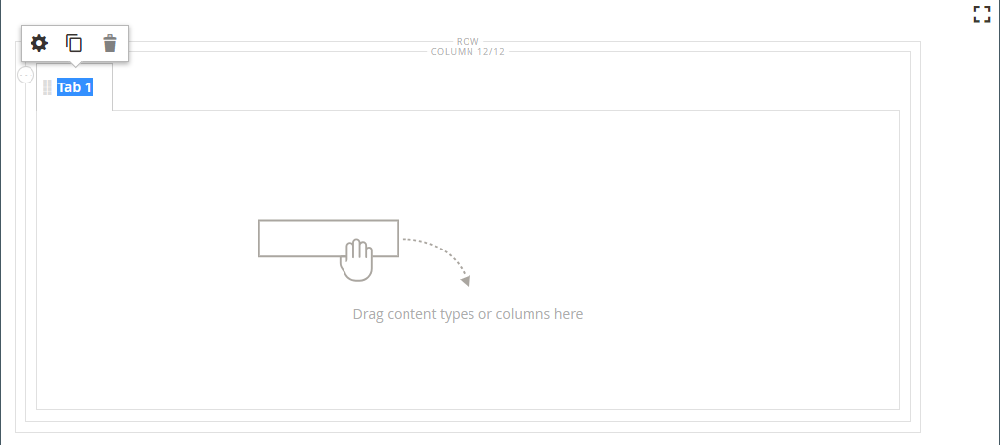
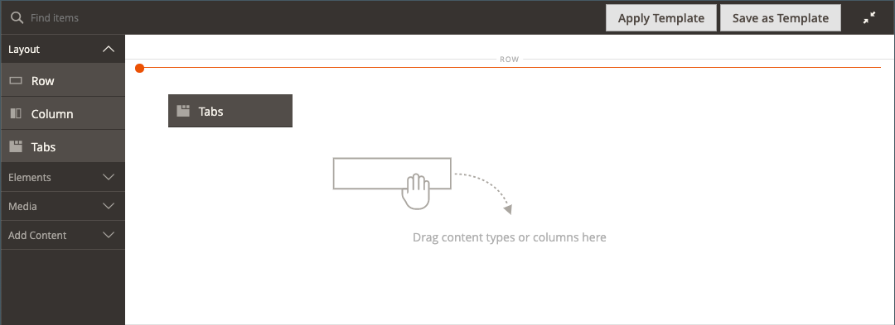
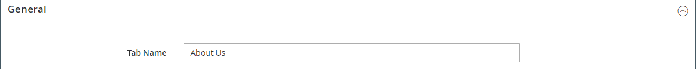
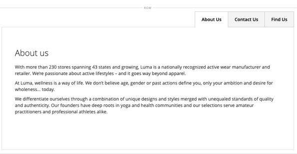

# 版面 — 索引標籤

使用&#x200B;_標籤_&#x200B;內容型別在[[!DNL Page Builder] 階段](workspace.md#stage)中新增一組標籤。 當您從面板將「定位點」預留位置拖曳到舞台時，一開始會顯示單一預設定位點。 您可以新增更多索引標籤以建立完整的索引標籤集。 標籤集的寬度由其上層容器的寬度和邊框間距設定決定。

{width="500" zoomable="yes"}

{{$include /help/_includes/page-builder-save-timeout.md}}

## 工具箱

當您使用&#x200B;_標籤_&#x200B;內容型別時，您可以新增並編輯個別標籤以及容納一或多個標籤的標籤容器。 每個標籤都有自己的工具箱，可用來設計[!DNL Page Builder]舞台上的標籤。

### 個別標籤工具箱

{width="500" zoomable="yes"}

| 工具 | 圖示 | 說明 |
|--- |--- |--- |
| 移動 | {width="25"} | 標籤標籤旁的這個控制項可用來將個別標籤移動到標籤集中的另一個位置。 |
| 設定 | {width="25"} | 開啟「編輯標籤」頁面，您可以在此變更個別標籤的屬性。 |
| 複製 | {width="25"} | 製作索引標籤的副本。 |
| 移除 | {width="25"} | 從標籤集刪除標籤。 |

{style="table-layout:auto"}

### 索引標籤容器工具箱

{width="500" zoomable="yes"}

| 工具 | 圖示 | 說明 |
|--- |--- |--- |
| 移動 | {width="25"} | 將索引標籤組移至父容器中格線上的另一個位置。 |
| 新增 | {width="25"} | 將索引標籤新增至索引標籤集。 |
| （標籤） | [!UICONTROL Tabs] | 將目前容器識別為索引標籤集。 將滑鼠懸停在容器的上邊框上可檢視工具箱。 |
| 設定 | {width="25"} | 開啟「編輯標籤」頁面，您可以在此變更容器的屬性。 |
| 隱藏 | {width="25"} | 隱藏索引標籤容器。 |
| 顯示 | {width="25"} | 顯示隱藏的標籤容器。 |
| 複製 | {width="25"} | 製作目前索引標籤的副本。 |
| 移除 | {width="25"} | 從舞台刪除目前的標籤集。 |

{style="table-layout:auto"}

{{$include /help/_includes/page-builder-hidden-element-note.md}}

## 新增個別索引標籤

1. 在&#x200B;_[!UICONTROL Layout]_&#x200B;下方的[!DNL Page Builder]面板中，將&#x200B;**[!UICONTROL Tabs]**&#x200B;預留位置直接拖曳至舞台或舞台上的列或欄。

   {width="600" zoomable="yes"}

1. 按一下「**[!UICONTROL Tab 1]**」標籤以顯示個別標籤工具箱，然後選擇「_設定_」（「{width="20"}）圖示。

1. 輸入您要做為標籤的&#x200B;**[!UICONTROL Tab Name]**。

   {width="600" zoomable="yes"}

1. 如有需要，請輸入索引標籤的&#x200B;**[!UICONTROL Minimum Height]**。

   此值可以是具有任何有效CSS單位（例如`100px`、`50%`、`50em`、`100vh`）的數字，或是計算（例如`100vh - 237px`）。

1. 選擇&#x200B;**[!UICONTROL Vertical Alignment]**&#x200B;設定，對齊新增到索引標籤的任何內容容器（「頂端」、「置中」或「底部」）。

1. 如有需要，請使用下列章節作為指引，設定其他選項：

   - [[!UICONTROL Background]][background]
   - [[!UICONTROL Advanced]][advanced]

1. 在右上角，按一下&#x200B;**[!UICONTROL Save]**&#x200B;以套用設定並返回[!DNL Page Builder]工作區。

## 新增一組標籤

下列步驟從個別標籤開始，並在標籤容器中建立一組三個標籤。 如果您還沒有個別索引標籤，請依照之前的指示，將單一索引標籤新增至舞台。

1. 將滑鼠懸停在索引標籤容器上以顯示工具箱，然後選擇&#x200B;_新增_ （ {width="20"} ）圖示。

1. 按一下&#x200B;**[!UICONTROL Tab 2]**&#x200B;標籤以顯示游標，並輸入您自己的標籤給索引標籤。

1. 再次按一下舞台上的第二個索引標籤，然後選擇&#x200B;_複製_ （{width="20"} ）圖示。

1. 按一下YourName **[!UICONTROL Copy]**&#x200B;標籤以顯示游標，並為第三個標籤輸入您自己的標籤。

{width="600" zoomable="yes"}比對索引標籤集

## 在集合內移動標籤

1. 按一下您要移動的標籤。

1. 選取並將標籤標籤文字前方顯示的&#x200B;_移動_ （{width="20"} ）圖示拖曳到標籤集內的新位置。

## 將內容新增至索引標籤

您可以將任何內容型別新增至標籤，就像新增至列一樣。 使用下列步驟新增文字內容型別作為範例。

1. 按一下您要新增內容的標籤。

1. 在[!DNL Page Builder]面板中，展開&#x200B;**[!UICONTROL Elements]**&#x200B;並將&#x200B;**文字**&#x200B;預留位置拖曳至索引標籤。

1. 在編輯器中輸入或貼上一些文字，然後視需要使用編輯器工具列來格式化它。

   如需有關使用文字內容型別的詳細資訊，請參閱[元素 — 文字](text.md)。

   {width="500" zoomable="yes"}

1. 按一下右上角的&#x200B;**[!UICONTROL Save]**。

## 變更個別索引標籤設定

1. 將滑鼠停留在個別標籤上以顯示工具箱，並選擇&#x200B;_設定_ （ {width="20"} ）圖示。

1. 如有需要，請變更索引標籤的任何基本設定：

   - **[!UICONTROL Tab Name]** — 輸入索引標籤修訂過的文字。 您也可以直接在舞台上修改標籤。

   - **[!UICONTROL Minimum Height]** — 如果您要覆寫自動高度，請輸入畫素。 例如，您可以設定最低高度以符合背景影像的高度，以確保可看見完整影像。

   - **[!UICONTROL Vertical Alignment]** — 選擇內容容器的垂直位置以新增到索引標籤。

1. 視需要使用下列區段變更其他設定以取得詳細資訊。

1. 完成後，按一下&#x200B;**[!UICONTROL Save]**&#x200B;套用設定並返回[!DNL Page Builder]工作區。

### 背景

- **[!UICONTROL Background Color]** — 選擇色票、按一下檢色器，或輸入有效的顏色名稱或對應的十六進位值，以指定背景顏色。 此設定決定列的背景顏色。 您也可以調整顏色的不透明度。

  {width="200"}

  您可以透過三種方式輸入值：

   - 預先定義的色彩名稱，例如`White`

   - 顏色的十六進位顏色值，例如`#ffffff`

   - 顏色的rgba值，具有不透明度百分比，例如`rgba(255, 255, 255, 0.75)`

  如果要選擇顏色，請按一下&#x200B;_無顏色_&#x200B;方塊左側的色票。

  {width="600" zoomable="yes"}

  如果您按一下顏色方塊來再次開啟檢色器，滑桿下方的方塊會顯示目前的紅色、綠色、藍色和Alpha值(rgba)。 最後一個數字以小數表示目前的不透明度百分比。 您可以使用滑桿來調整不透明度，或輸入所需的十進位值。

  {width="600" zoomable="yes"}

  >[!NOTE]
  >
  >[!DNL Page Builder]也支援背景影像中的透明圖層，或&#x200B;_Alpha色版_，這些影像可用來建立不同不透明度的背景。

- **[!UICONTROL Background Image]** — 如有需要，請使用提供的工具選擇要套用至索引標籤的背景影像：

  | 工具 | 說明 |
  |--- |--- |
  | [!UICONTROL Upload] | 將影像檔案從本機電腦上傳到影像中心，然後將其套用為索引標籤的背景影像。 |
  | [!UICONTROL Select from Gallery] | 提示您從影像庫中選擇現有的影像作為標籤的背景影像。 |
  | {width="25"} | 可讓您將影像拖曳至相機圖磚，或瀏覽至本機檔案系統中的影像。 |

  {style="table-layout:auto"}

- **[!UICONTROL Background Mobile Image]** — 如有需要，請使用相同的工具來選擇不同的背景影像，以便在行動裝置上顯示。

- **[!UICONTROL Background Size]** — 選擇背景影像相對於標籤寬度的縮放方式：

  | 選項 | 說明 |
  |--- |--- |
  | `Cover` | 背景影像涵蓋標籤的全部寬度。 |
  | `Contain` | 背景影像會限制在標籤區域的寬度內。 |
  | `Auto` | 套用目前樣式表的大小。 |

  {style="table-layout:auto"}

- **[!UICONTROL Background Position]** — 選擇背景影像如何錨定與索引標籤： `Top Left` / `Top Center` / `Top Right` / `Center Left` / `Center` / `Center Right` / `Bottom Left` / `Bottom Center` / `Bottom Right`

- **[!UICONTROL Background Attachment]** — 選擇附件型別以決定背景影像相對於捲動頁面的移動方式：

  | 選項 | 說明 |
  | --- | --- |
  | `Scroll` | 當頁面捲動時，附加的背景影像會同步處理為向下移動。 |
  | `Fixed` | （不適用於行動裝置）當容器捲動影像時，背景影像不會移動，且會固定在指定的背景位置。 |

  {style="table-layout:auto"}

- **[!UICONTROL Background Repeat]** — 設定為`Yes`可重複背景影像以填滿索引標籤中的可用空間。

### 進階

- 若要控制新增至標籤的內容容器的水準對齊方式，請選擇&#x200B;**[!UICONTROL Alignment]** 。

  | 選項 | 說明 |
  | --- | --- |
  | `Default` | 套用目前佈景主題樣式表中指定的對齊預設設定。 |
  | `Left` | 將內容容器沿標籤左邊框對齊，並允許指定的任何邊框間距。 |
  | `Center` | 將內容容器對齊標籤的中央，並允許指定的任何邊框間距。 |
  | `Right` | 將內容容器對齊索引標籤的右邊框，並允許指定的任何邊框間距。 |

  {style="table-layout:auto"}

- 設定套用至索引標籤容器所有四個側面的&#x200B;**[!UICONTROL Border]**&#x200B;樣式：

  | 選項 | 說明 |
  | --- | --- |
  | `Default` | 套用關聯樣式表所指定的預設邊框樣式。 |
  | `None` | 未提供任何容器框線的可見指示。 |
  | `Dotted` | 容器邊框會以虛線顯示。 |
  | `Dashed` | 容器邊框會以虛線顯示。 |
  | `Solid` | 容器邊框會以實線顯示。 |
  | `Double` | 容器邊框會以雙線顯示。 |
  | `Groove` | 容器框線會顯示為槽線。 |
  | `Ridge` | 容器框線會顯示為脊線。 |
  | `Inset` | 容器框線會顯示為內嵌線。 |
  | `Outset` | 容器邊框會顯示為外線。 |

  {style="table-layout:auto"}

- 如果您設定了`None`以外的框線樣式，請完成框線顯示選項：

  {width="600" zoomable="yes"}

  | 選項 | 說明 |
  | ------ |------------ |
  | [!UICONTROL Border Color] | 選擇色票、按一下檢色器，或輸入有效的顏色名稱或相等的十六進位值，以指定顏色。 |
  | [!UICONTROL Border Width] | 輸入邊框線條寬度的畫素數。 |
  | [!UICONTROL Border Radius] | 輸入畫素數目，以定義用來將邊框每個角落倒圓角的半徑大小。 |

  {style="table-layout:auto"}

  下列範例中的列的邊框半徑為15。

  邊框半徑為15{width="500"}的列

- （選擇性）從目前的樣式表中指定要套用至欄容器的&#x200B;**[!UICONTROL CSS classes]**&#x200B;名稱。

  以空格分隔多個類別名稱。

- 輸入&#x200B;**[!UICONTROL Margins and Padding]**&#x200B;的值（以畫素為單位），以指定欄的外部邊界與內部邊距。

  在索引標籤容器圖表中輸入每個對應的值。

  | 容器區域 | 說明 |
  | -------------- | ---------- |
  | [!UICONTROL Margins] | 套用至容器所有側邊外部邊緣的空白空間量。 選項： `Top` / `Right` / `Bottom` / `Left` |
  | [!UICONTROL Padding] | 套用至容器所有邊內側邊緣的空白空間量。 選項： `Top` / `Right` / `Bottom` / `Left` |

  {style="table-layout:auto"}

## 變更索引標籤集設定

1. 將滑鼠懸停在索引標籤集容器的上邊框以顯示工具箱，並選擇&#x200B;_設定_ （ {width="20"} ）圖示。

1. 如有需要，請變更&#x200B;**[!UICONTROL Default Active Tab]**。

   在頁面載入時，選擇要在集中啟用的索引標籤。

1. 若要覆寫定位點集的自動高度，請輸入&#x200B;**[!UICONTROL Minimum Height]** （畫素）。

1. 若要將導覽標籤沿標籤組頂端定位，請選擇&#x200B;**[!UICONTROL Tab Navigation Alignment]** （`Left`、`Center`或`Right`）。

   {width="500" zoomable="yes"}

1. 設定標籤集的進階選項：

   - 若要控制標籤集在父容器中的位置，請選擇&#x200B;**[!UICONTROL Alignment]**：

     | 選項 | 說明 |
     | ------ | ---------- |
     | `Default` | 套用目前佈景主題樣式表中指定的對齊預設設定。 |
     | `Left` | 將標籤集沿父容器的左邊框對齊，並允許指定的任何邊框間距。 |
     | `Center` | 對齊父容器中央的標籤集，並允許指定的任何內距。 |
     | `Right` | 將標籤集對齊父容器的右邊框，並允許指定的任何內距。 |

     {style="table-layout:auto"}

   - 設定套用至索引標籤容器所有四個側面的&#x200B;**[!UICONTROL Border]**&#x200B;樣式：

     | 選項 | 說明 |
     | ------ | ---------- |
     | `Default` | 套用關聯樣式表所指定的預設邊框樣式。 |
     | `None` | 未提供任何容器框線的可見指示。 |
     | `Dotted` | 容器邊框會以虛線顯示。 |
     | `Dashed` | 容器邊框會以虛線顯示。 |
     | `Solid` | 容器邊框會以實線顯示。 |
     | `Double` | 容器邊框會以雙線顯示。 |
     | `Groove` | 容器框線會顯示為槽線。 |
     | `Ridge` | 容器框線會顯示為脊線。 |
     | `Inset` | 容器框線會顯示為內嵌線。 |
     | `Outset` | 容器邊框會顯示為外線。 |

     {style="table-layout:auto"}

   - 如果您設定了`None`以外的框線樣式，請完成框線顯示選項：

     | 選項 | 說明 |
     | ------ |------------ |
     | [!UICONTROL Border Color] | 選擇色票、按一下檢色器，或輸入有效的顏色名稱或相等的十六進位值，以指定顏色。 |
     | [!UICONTROL Border Width] | 輸入邊框線條寬度的畫素數。 |
     | [!UICONTROL Border Radius] | 輸入畫素數目，以定義用來將邊框每個角落倒圓角的半徑大小。 |

     {style="table-layout:auto"}

   - （選擇性）從目前的樣式表中指定要套用至索引標籤容器的&#x200B;**[!UICONTROL CSS classes]**&#x200B;名稱。

     以空格分隔多個類別名稱。

   - 輸入&#x200B;**[!UICONTROL Margins and Padding]**&#x200B;的值（以畫素為單位），以決定定位點容器的外部邊界和內邊距。

     在索引標籤容器圖表中輸入對應的值。

     | 容器區域 | 說明 |
     | -------------- | ---------- |
     | [!UICONTROL Margins] | 套用至容器所有側邊外部邊緣的空白空間量。 選項： `Top` / `Right` / `Bottom` / `Left` |
     | [!UICONTROL Padding] | 套用至容器所有邊內側邊緣的空白空間量。 選項： `Top` / `Right` / `Bottom` / `Left` |

     {style="table-layout:auto"}

1. 完成後，按一下&#x200B;**[!UICONTROL Save]**&#x200B;套用設定並返回[!DNL Page Builder]工作區。

[background]: #background
[advanced]: #advanced
