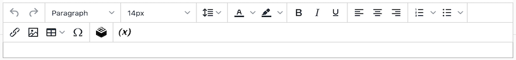
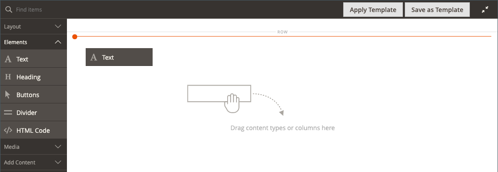

# 元素 — 文字

使用&#x200B;_文字_&#x200B;內容型別，在[[!DNL Page Builder] 階段](workspace.md#stage)中使用WYSIWYG (「What You See Is What You Get」)編輯器新增文字容器。 此外，您可以從編輯器工具列將連結、影像、[變數](../systems/variables-predefined.md)和Widget新增至文字。

橫幅上的{width="700"}

{{$include /help/_includes/page-builder-save-timeout.md}}

## 文字編輯器工具

您可以直接從舞台或設定頁面存取文字編輯器。 直接對階段所做的變更會自動儲存。 如需詳細資訊，請參閱[使用編輯器](../content-design/editor.md)。

{width="600"}

## 文字容器工具箱

{width="600"}

| 工具 | 圖示 | 說明 |
| --------- | --------------------- | -------------- |
| 移動 | {width="25"} | 將文字容器移至頁面上的另一個有效位置。 |
| （標籤） | 文字 | 將目前的容器識別為文字元素。 |
| 設定 | {width="25"} | 在編輯模式中開啟文字容器屬性。 |
| 隱藏 | {width="25"} | 隱藏文字容器。 |
| 顯示 | {width="25"} | 顯示隱藏的文字容器。 |
| 複製 | {width="25"} | 製作文字容器的副本。 |
| 移除 | {width="25"} | 從舞台刪除文字容器及其內容。 |

{style="table-layout:auto"}

{{$include /help/_includes/page-builder-hidden-element-note.md}}

## 新增文字

1. 在[!DNL Page Builder]面板中，展開&#x200B;**[!UICONTROL Elements]**&#x200B;並將&#x200B;**[!UICONTROL Text]**&#x200B;預留位置拖曳至舞台上的列、欄或索引標籤集。

   {width="600" zoomable="yes"}

1. 視需要使用編輯器來輸入文字並設定其格式。

   如需詳細資訊，請參閱[使用編輯器](../content-design/editor.md)。

   包含內容的{width="600"}

## 建立連結

編輯器中的「插入連結」按鈕可讓您輕鬆在相簿中新增影像的超連結。 不過，如果您有預先設定的URL，也可以使用文字建立內嵌連結。 與Widget按鈕不同，插入/編輯連結按鈕未與存放區中的頁面、產品或類別整合。

若要建立電話號碼或電子郵件的連結，請參閱[新增自訂變數](../systems/variables-custom.md)。

1. 在店面中，導覽至將成為連結目標目的地的頁面，並複製連結資訊。

   您可以使用完整URL或省略商店網域參照的相對URL。

   完整URL - `https://mystore.com/women/tops-women/tees-women.html`

   相對URL - `../women/tops-women/tees-women.html`

1. 選取編輯器空間中的文字，然後按一下編輯器工具列上的&#x200B;_插入/編輯連結_ （{width="20"}）。

   {width="500" zoomable="yes"}

1. 針對&#x200B;**[!UICONTROL URL]**，輸入您準備的相對連結。

1. 將&#x200B;**[!UICONTROL Target]**&#x200B;設為`None`。

   此設定會在相同的瀏覽器視窗中開啟頁面，而非開啟新標籤。

1. 針對&#x200B;**[!UICONTROL Title]**，輸入`Shop Tees`。

   某些瀏覽器會使用`Title`連結屬性作為工具提示。

1. 若要儲存連結並返回[!DNL Page Builder]工作區，請按一下&#x200B;**[!UICONTROL OK]**。

   {width="500" zoomable="yes"}

## 插入影像

1. 將游標置於您要插入影像的文字中。

1. 按一下編輯器工具列上的&#x200B;_插入/編輯影像_ （{width="20"}）。

1. 針對&#x200B;**[!UICONTROL Source]**，按一下搜尋圖示，即可使用媒體儲存來尋找及選取影像。

1. 針對&#x200B;**[!UICONTROL Image Description]**，輸入影像的描述文字。

   此文字會填入影像的`alt`連結屬性，並被某些瀏覽器用於協助工具。

1. 輸入寬度和高度&#x200B;**[!UICONTROL Dimensions]** （以畫素為單位），以呈現頁面上的影像。

   保持選取&#x200B;**[!UICONTROL Constrain proportions]**&#x200B;核取方塊，以自動維持影像的外觀比例。

1. 若要插入影像然後返回[!DNL Page Builder]工作區，請按一下&#x200B;**[!UICONTROL OK]**。

## 變更文字設定

1. 將滑鼠懸停在文字容器上以顯示工具箱，然後選擇&#x200B;_設定_ （ {width="20"} ）圖示。

   >[!NOTE]
   >
   >因為文字容器已緊密巢狀內嵌於另一個容器中，請確定您有正確的工具箱。

1. 視需要更新內容。

1. 視需要更新&#x200B;_[!UICONTROL Advanced]_&#x200B;設定。

   - 若要控制文字在父容器中的位置，請選擇&#x200B;**[!UICONTROL Alignment]**：

     | 選項 | 說明 |
     | ------ |------------ |
     | `Default` | 套用目前佈景主題樣式表中指定的對齊預設設定。 |
     | `Left` | 沿著父容器的左邊框對齊清單，並允許指定的任何邊框間距。 |
     | `Center` | 將清單對齊父項容器的中心，並容許任何指定的內距。 |
     | `Right` | 沿著父容器的右邊框對齊區塊，並允許指定的任何邊框間距。 |

     {style="table-layout:auto"}

   - 設定套用至文字容器所有四個側面的&#x200B;**[!UICONTROL Border]**&#x200B;樣式：

     | 選項 | 說明 |
     | ------ |------------ |
     | `Default` | 套用關聯樣式表所指定的預設邊框樣式。 |
     | `None` | 未提供任何容器框線的可見指示。 |
     | `Dotted` | 容器邊框會以虛線顯示。 |
     | `Dashed` | 容器邊框會以虛線顯示。 |
     | `Solid` | 容器邊框會以實線顯示。 |
     | `Double` | 容器邊框會以雙線顯示。 |
     | `Groove` | 容器框線會顯示為槽線。 |
     | `Ridge` | 容器框線會顯示為脊線。 |
     | `Inset` | 容器框線會顯示為內嵌線。 |
     | `Outset` | 容器邊框會顯示為外線。 |

     {style="table-layout:auto"}

   - 如果您設定了`None`以外的框線樣式，請完成框線顯示選項：

     | 選項 | 說明 |
     | ------ |------------ |
     | [!UICONTROL Border Color] | 選擇色票、按一下檢色器，或輸入有效的顏色名稱或相等的十六進位值，以指定顏色。 |
     | [!UICONTROL Border Width] | 輸入邊框線條寬度的畫素數。 |
     | [!UICONTROL Border Radius] | 輸入畫素數目，以定義用來將邊框每個角落倒圓角的半徑大小。 |

     {style="table-layout:auto"}

   - （選擇性）從目前的樣式表中指定要套用至容器的&#x200B;**[!UICONTROL CSS classes]**&#x200B;名稱。

     以空格分隔多個類別名稱。

   - 輸入&#x200B;**[!UICONTROL Margins and Padding]**&#x200B;的值（以畫素為單位），以決定文字容器的外邊界和內邊距。

     在圖表中輸入對應的值。

     | 容器區域 | 說明 |
     | -------------- |------------ |
     | [!UICONTROL Margins] | 套用至容器所有側邊外部邊緣的空白空間量。 選項： `Top` / `Right` / `Bottom` / `Left` |
     | [!UICONTROL Padding] | 套用至容器所有邊內側邊緣的空白空間量。 選項： `Top` / `Right` / `Bottom` / `Left` |

     {style="table-layout:auto"}

1. 完成後，按一下&#x200B;**[!UICONTROL Save]**&#x200B;套用設定並返回[!DNL Page Builder]工作區。

<!-- Last updated from includes: 2023-09-11 14:30:19 -->
