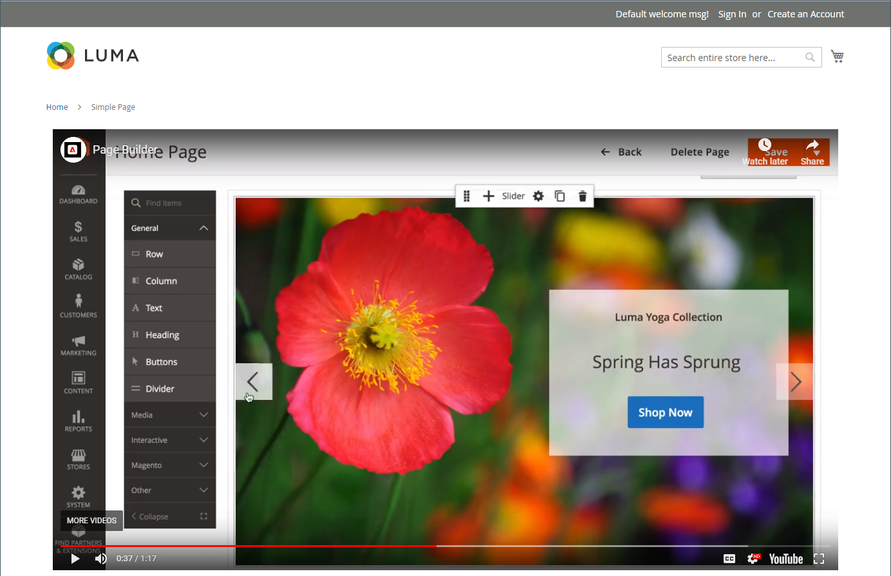
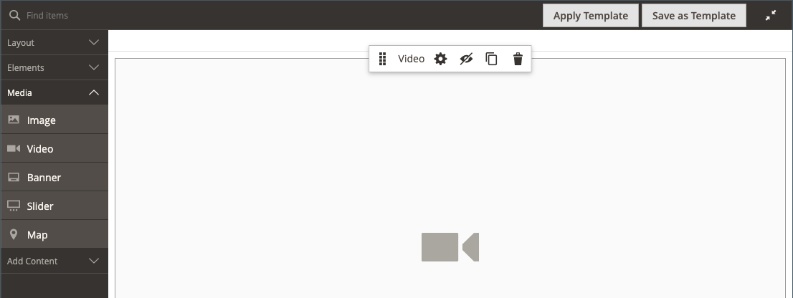

# 媒體 — 影片

使用&#x200B;_視訊_&#x200B;內容型別將託管於[YouTube](https://www.youtube.com/)或[Vimeo](https://vimeo.com/)的視訊新增至[[!DNL Page Builder] 階段](workspace.md#stage)。 將視訊嵌入頁面或區塊，或產品與類別說明中相當容易。

店面首頁上的{width="700" zoomable="yes"}

{{$include /help/_includes/page-builder-save-timeout.md}}

## 視訊工具箱

{width="600" zoomable="yes"}

| 工具 | 圖示 | 說明 |
|--- |--- |--- |
| 移動 | {width="25"} | 將視訊移至舞台上的另一個位置。 |
| （標籤） | [!UICONTROL Video] | 將目前的內容容器識別為視訊。 將滑鼠停留在影像容器上可檢視工具箱。 |
| 設定 | {width="25"} | 開啟&#x200B;_[!UICONTROL Edit Video]_頁面，您可以在此變更視訊和容器的屬性。 |
| 隱藏 | {width="25"} | 隱藏目前的視訊。 |
| 顯示 | {width="25"} | 顯示隱藏的視訊。 |
| 複製 | {width="25"} | 製作視訊副本。 |
| 移除 | {width="25"} | 從舞台刪除視訊。 |

{style="table-layout:auto"}

{{$include /help/_includes/page-builder-hidden-element-note.md}}

## 新增視訊

1. 開始之前，請導覽至您要內嵌的[YouTube](https://www.youtube.com/)或[Vimeo](https://vimeo.com/)影片，並複製連結。

   另外，您也可以複製有效視訊檔案的直接連結。 如需有效的連結，請參閱[基本視訊設定](#basic-video-settings)。

1. 在[!DNL Commerce]管理員中，返回您要新增視訊的[!DNL Page Builder]工作區。

1. 在[!DNL Page Builder]面板中，展開&#x200B;**[!UICONTROL Media]**&#x200B;並將&#x200B;**[!UICONTROL Video]**&#x200B;預留位置拖曳到舞台。

   {width="600" zoomable="yes"}

1. 將滑鼠懸停在視訊容器上以顯示工具箱，然後選擇&#x200B;_設定_ （ {width="20"} ）圖示。

1. 針對&#x200B;**[!UICONTROL Video URL]**，貼上您複製之視訊的URL。

   此範例中使用的[!DNL Page Builder]視訊的URL是： `https://www.youtube.com/watch?v=Y0KNS7C5dZA`。

1. 若要限制視訊的&#x200B;**[!UICONTROL Maximum Width]**，請輸入最大寬度（畫素）。

   如果留白，視訊寬度將和容器一樣寬，可允許邊界和邊框間距。

1. 在右上角，按一下&#x200B;**[!UICONTROL Save]**&#x200B;以套用設定並返回[!DNL Page Builder]工作區。

## 變更視訊設定

1. 將滑鼠懸停在視訊容器上以顯示工具箱，然後選擇&#x200B;_設定_ （ {width="20"} ）圖示。

1. 請依照下列章節修改設定：

   - [基本](#basic-video-settings)
   - [進階](#advanced)

1. 在右上角，按一下&#x200B;**[!UICONTROL Save]**&#x200B;以套用設定並返回[!DNL Page Builder]工作區。

### 基本視訊設定

1. 若要變更目前的視訊，請更新&#x200B;**[!UICONTROL Video URL]**。

   請輸入有效的視訊URL。 有效的視訊URL可以連結至：

   - YouTube影片： `https://youtu.be/CoDhMRUUjeI`
   - Vimeo影片： `https://vimeo.com/190156113`
   - 有效的視訊檔案（建議使用`.mp4`）： `https://myvideos.com/spiral.mp4`

1. 若要變更店面中視訊允許的寬度，請輸入新的&#x200B;**[!UICONTROL Maximum Width]**&#x200B;畫素。

   如果留白，視訊會延伸容器的完整寬度，減去邊界和邊框間距的裕量。

1. 若要在頁面載入後自動啟動視訊，請將&#x200B;**[!UICONTROL Autoplay]**&#x200B;設為`Yes`。

   如果「自動播放」設定為`Yes`，則視訊會根據原則在播放時設為靜音。 不過，即使使用此設定，行動裝置也無法自動播放您的視訊。 如需這些原則的詳細資訊，請參閱下列開發人員資源：

   - [來自Vimeo的自動播放原則](https://vimeo.zendesk.com/hc/en-us/articles/115004485728-Autoplaying-and-looping-embedded-videos)
   - [Google (Chrome/YouTube)的自動播放原則](https://developer.chrome.com/blog/autoplay/)
   - [本機視訊的自動播放原則](https://developer.mozilla.org/en-US/docs/Web/Media/Autoplay_guide)

   如果「自動播放」設定為`No`，則視訊只會依使用者要求播放。

### [!UICONTROL Advanced]

1. 若要控制視訊在容器中的水平位置，請選擇&#x200B;**[!UICONTROL Alignment]**：

   | 選項 | 說明 |
   | ------ | ----------- |
   | `Default` | 套用目前佈景主題樣式表中指定的對齊預設設定。 |
   | `Left` | 沿著視訊容器的左邊框對齊內容，並允許指定的任何邊框間距。 |
   | `Center` | 對齊視訊容器中央的內容，並容許指定的任何邊框間距。 |
   | `Right` | 沿著視訊容器的右邊框對齊內容，並容許任何指定的邊框間距。 |

   {style="table-layout:auto"}

- 設定套用至視訊容器所有四個側面的&#x200B;**[!UICONTROL Border]**&#x200B;樣式：

  | 選項 | 說明 |
  | ------ | ----------- |
  | `Default` | 套用關聯樣式表所指定的預設邊框樣式。 |
  | `None` | 未提供任何容器框線的可見指示。 |
  | `Dotted` | 容器邊框會以虛線顯示。 |
  | `Dashed` | 容器邊框會以虛線顯示。 |
  | `Solid` | 容器邊框會以實線顯示。 |
  | `Double` | 容器邊框會以雙線顯示。 |
  | `Groove` | 容器框線會顯示為槽線。 |
  | `Ridge` | 容器框線會顯示為脊線。 |
  | `Inset` | 容器框線會顯示為內嵌線。 |
  | `Outset` | 容器邊框會顯示為外線。 |

  {style="table-layout:auto"}

- 如果您設定了`None`以外的框線樣式，請完成框線顯示選項：

  {width="600" zoomable="yes"}

  | 選項 | 說明 |
  | ------ |------------ |
  | [!UICONTROL Border Color] | 選擇色票、按一下檢色器，或輸入有效的顏色名稱或相等的十六進位值，以指定顏色。 |
  | [!UICONTROL Border Width] | 輸入邊框線條寬度的畫素數。 |
  | [!UICONTROL Border Radius] | 輸入畫素數目，以定義用來將邊框每個角落倒圓角的半徑大小。 |

  {style="table-layout:auto"}

- （選擇性）從目前的樣式表中指定要套用至視訊容器的&#x200B;**[!UICONTROL CSS classes]**&#x200B;名稱。

  以空格分隔多個類別名稱。

- 輸入&#x200B;**[!UICONTROL Margins and Padding]**&#x200B;的值（以畫素為單位），以指定視訊容器的外部邊界和內邊距。

  在視訊容器圖表中輸入每個對應的值。

  | 容器區域 | 說明 |
  | -------------- | ----------- |
  | [!UICONTROL Margins] | 套用至容器所有側邊外部邊緣的空白空間量。 |
  | [!UICONTROL Padding] | 套用至容器所有邊內側邊緣的空白空間量。 |

  {style="table-layout:auto"}

## 移動視訊

1. 將滑鼠懸停在視訊容器上以顯示工具箱，然後選擇&#x200B;_移動_ （ {width="20"} ）圖示。

   {width="500" zoomable="yes"}

1. 選取視訊並將其拖曳到新的位置，正好在紅色指引的下方。

   {width="500" zoomable="yes"}

## 從舞台移除影片

1. 將滑鼠懸停在視訊容器上以顯示工具箱，然後選擇&#x200B;_移除_ （）圖示。

1. 提示確認時，按一下&#x200B;**[!UICONTROL OK]**。

<!-- Last updated from includes: 2023-09-11 14:30:19 -->
