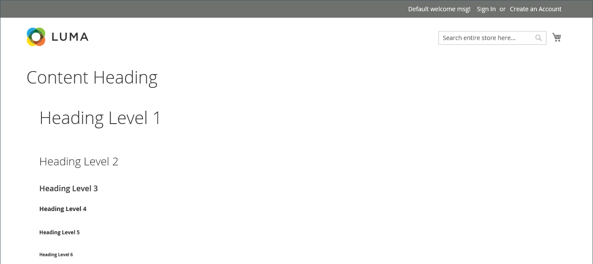
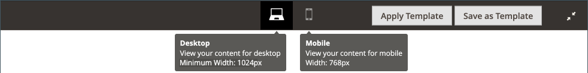
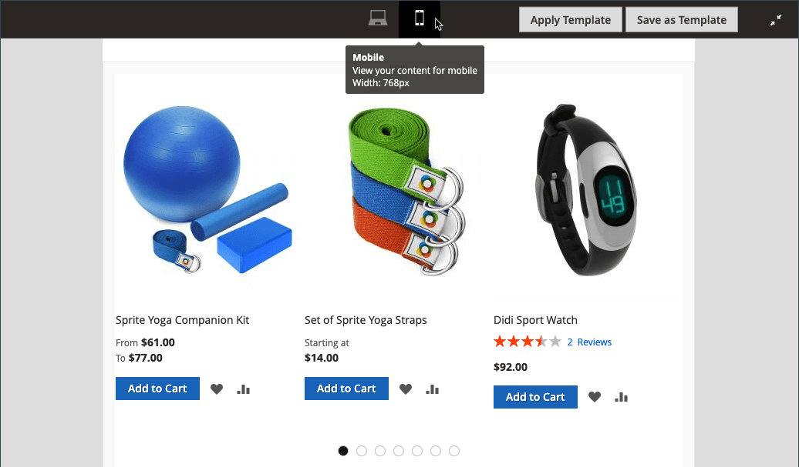
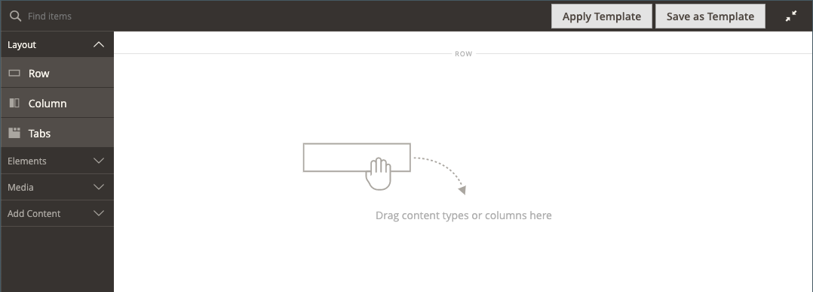
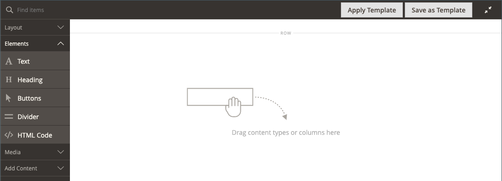
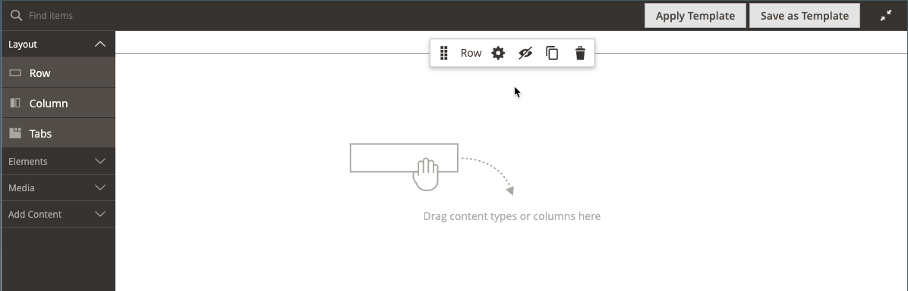

# [!DNL Page Builder] Workspace

當[[!DNL Page Builder] 啟用](setup.md)時，會修改&#x200B;_[!UICONTROL Content]_&#x200B;區段和內容建立程式，以利用CMS [頁面](../content-design/page-add.md)、[產品](../catalog/product-content.md)和[類別](../catalog/categories-content-settings.md)頁面、[區塊](../content-design/block-add.md)和[動態區塊](../content-design/dynamic-blocks.md)的進階[!DNL Page Builder]工具。 此區段包含_&#x200B;內容標題&#x200B;_欄位、內容預覽，以及全熒幕[!DNL Page Builder]工作區的輕鬆存取。

![預覽為[!DNL Page Builder]的內容區段](./assets/pb-content-preview.png){width="700" zoomable="yes"}

## 內容標題

由於搜尋引擎會尋找第一級(H1)標題，因此新增第一級標題是確保頁面正確編制索引的簡單方法。

>[!NOTE]
>
>顯示在頁面頂端的&#x200B;_[!UICONTROL Content Heading]_&#x200B;欄位是支援使用舊版[!DNL Commerce]建立的內容的舊版欄位。 但它不是[!DNL Page Builder]的一部分。 根據與目前主題關聯的樣式表，[!UICONTROL Content Heading]會格式化為H1標題。 它位於由[!DNL Page Builder]階段定義的使用中內容區域正上方。

為了最佳控制所有層級標題的位置和格式，建議您將&#x200B;_[!UICONTROL Content Heading]_&#x200B;欄位保留空白，並使用[!DNL Page Builder] [標題](heading.md)內容型別。

{width="700" zoomable="yes"}

## 預覽

當您展開「_[!UICONTROL Content]_」區段，而且有使用「[!DNL Page Builder]」建立的現有內容時，它會顯示內容預覽，如同顯示在頁面中的情形。 按一下「**[!UICONTROL Edit with Page Builder]**」或內容預覽區域內的「[!DNL Page Builder]」工作區以開啟，您可在此進行任何需要的更新。

{width="500" zoomable="yes"}

>[!NOTE]
>
>對於產品和類別表單，此內容預覽預設為啟用，但可停用。 如果效能因載入預覽而受到影響，您可以在[內容管理組態](../configuration-reference/general/content-management.md#advanced-content-tools)設定中停用預覽。

## 階段

當您從預覽開啟[!DNL Page Builder]工作區時，舞台是您建立內容及格式化，甚至快速編輯即時內容的主要工作區。 舞台最初是空的，它提供了設計表面，您可以從左側面板中拖曳列、欄和標籤。

>[!NOTE]
>
>自2.4.1版開始，內容編輯現在僅針對[!DNL Page Builder]控制的所有區域提供全熒幕功能，包括CMS頁面、產品和類別頁面、區塊及動態區塊。 全熒幕編輯將焦點放在您的內容上，並提供更符合店面使用者體驗的檢視。

{width="600" zoomable="yes"}

{{$include /help/_includes/page-builder-save-timeout.md}}

## 檢視區

_檢視區_&#x200B;是使用者看到的網頁可見區域。 在全熒幕設計模式中，檢視區按鈕會顯示在[!DNL Page Builder]舞台上方，當網站使用者在店面看到內容時，就會顯示內容。

{width="500" zoomable="yes"}

[!DNL Page Builder]也會定義檢視區的中斷點。 中斷點會定義套用特定樣式的最小和最大寬度。 [!DNL Page Builder]檢視區提供下列內容中斷點：

- **案頭中斷點**—`min-width: 1024px`。 此中斷點會套用為測量1024畫素及更大範圍的檢視區寬度定義的樣式。
- **行動中斷點**—`max-width: 768px, min-width: 640px`。 這些中斷點會套用為檢視區寬度定義的樣式（介於768畫素和640畫素之間）。

[!DNL Page Builder]檢視區提供兩種功能： **_內容預覽_**&#x200B;和&#x200B;**_中斷點設定_**。

### 內容預覽

依預設，[!DNL Page Builder]提供兩個檢視區預覽：

- **案頭** — 顯示沒有預先定義寬度的內容預覽。 案頭定義的樣式（使用中斷點最小寬度1024畫素）仍會套用至頁面。 但案頭檢視區寬度是由容器內容型別（例如列）的設定所定義。 選取案頭檢視區會顯示瀏覽器頁面寬度為1024畫素及更大時，內容在店面上的樣式設定方式。

  {width="500" zoomable="yes"}

- **行動裝置** — 以預先定義的寬度768畫素顯示內容預覽。 不像案頭檢視區，行動檢視區的確會以768畫素的寬度顯示您的頁面內容，以及為中斷點寬度768畫素（最大值）和640畫素（最小值）定義的樣式。

  {width="500" zoomable="yes"}

### 中斷點設定

檢視區按鈕也提供根據所選檢視區將不同中斷點樣式套用至內容型別的選項。 依預設，[!DNL Page Builder]會為列、欄、標籤、標籤專案、橫幅、滑桿和幻燈片的&#x200B;_[!UICONTROL Minimum Height]_&#x200B;欄位提供中斷點設定。 當您選取行動檢視區，然後開啟其中一種內容型別的編輯器時，您可以輸入行動檢視區中斷點的特定欄位值。 允許特定中斷點設定的內容型別欄位在欄位右側顯示一個圖示，類似於以下列範例：

中斷點設定的{width="400"}

## 面板

[!DNL Page Builder]面板位於舞台左側，並包含可拖曳到舞台的內容型別。 內容型別專屬的容器隨即顯示，其中包含選項工具箱。 內容型別在面板中的組織方式如下：

### 版面配置

[!DNL Page Builder]面板的&#x200B;_[!UICONTROL Layout]_&#x200B;區段可用來將列、欄或索引標籤新增至舞台。 將內容型別從面板拖曳到舞台時，會出現一個容器，其中包含內容型別專屬的選項工具箱。

根據預設，[!DNL Page Builder]階段是空的。 將版面配置內容型別從面板拖曳到舞台時，可以將它們放置在頁面上的其他版面配置容器的上方、下方或內部。 只能將列直接新增到舞台中。

具有版面配置內容型別和階段{width="600" zoomable="yes"}的[!DNL Page Builder]面板

| 配置內容型別 | 說明 |
| ------------------- |------------ |
| [列](row.md) | 新列只能從面板拖曳到舞台，並放置在另一個列、索引標籤或欄群組的上方或下方。 您也可以使用「複製」選項來複製現有列。 |
| [資料行](column.md) | 欄可以從面板拖曳到舞台，或拖曳到列和索引標籤中。 可新增的資料行數目上限是由[組態](setup.md)中指定的格線區段數目所決定。 |
| [標籤](tabs.md) | 單一標籤可從面板拖曳到舞台，或拖曳到列與欄。 您可以從工具箱中新增其他標籤。 |

{style="table-layout:auto"}

### 元素

使用[!DNL Page Builder]面板的&#x200B;_[!UICONTROL Elements]_&#x200B;區段，將文字、標題、按鈕、分隔線和HTML程式碼新增至[[!DNL Page Builder] 階段](workspace.md#stage)上的任何配置容器。 當您從面板將內容型別拖曳至列或欄，或拖曳至舞台上的標籤組時，容器隨即出現。 使用內容型別工具箱來存取特定於型別的設定。

具有元素內容型別{width="600" zoomable="yes"}的[!DNL Page Builder]面板

| 元素內容型別 | 說明 |
| -------------------- | ----------- |
| [文字](text.md) | 在階段中新增文字容器和編輯器。 |
| [標題](heading.md) | 在階段中新增標題容器。 |
| [按鈕](buttons.md) | 將個別按鈕或一組按鈕的容器新增至舞台。 |
| [分隔線](divider.md) | 在階段中新增分隔線的容器。 |
| [HTML碼](html-code.md) | 將HTML程式碼的容器新增至階段。 |

{style="table-layout:auto"}

### 媒體

使用[!DNL Page Builder]面板的&#x200B;_[!UICONTROL Media]_&#x200B;區段將影像、視訊、橫幅、滑桿和[!DNL Google Maps]新增至[[!DNL Page Builder] 舞台](workspace.md#stage)上的任何配置容器。 將媒體內容型別從面板拖曳到舞台時，會出現一個容器，其中包含內容型別專屬的選項工具箱。

具有媒體內容型別的![[!DNL Page Builder]面板](./assets/pb-media-content-types.png){width="600" zoomable="yes"}

| 媒體內容型別 | 說明 |
| ------------------- | ------------------------------------------ |
| [影像](image.md) | 將影像容器新增至「舞台」。 |
| [影片](video.md) | 將視訊容器新增至舞台。 |
| [橫幅](banner.md) | 將橫幅容器新增至舞台。 |
| [滑桿](slider.md) | 將滑桿容器新增至舞台。 |
| [地圖](map.md) | 將[!DNL Google Maps]容器新增至階段。 |

{style="table-layout:auto"}

### 新增內容

使用[!DNL Page Builder]面板的&#x200B;_[!UICONTROL Add Content]_&#x200B;區段將現有內容新增到[[!DNL Page Builder] 階段](workspace.md#stage)。 將媒體內容型別從面板拖曳至舞台時，畫面會顯示一個容器。 使用內容型別工具箱來存取該型別專屬的_&#x200B;設定&#x200B;_。

![[!DNL Page Builder]面板包含新增內容型別](./assets/pb-add-content.png){width="600" zoomable="yes"}

| 內容型別 | 說明 |
| ---------------------------------------------------------------- | -------------------------------------------- |
| [區塊](block.md) | 將現有區塊新增至階段。 |
| [動態區塊](dynamic-block.md) | 將現有的動態區塊新增至舞台。 |
| [產品](products.md) | 將產品清單新增至階段。 |
|  [產品Recommendations](recommendations.md) | 將建議單位新增至階段。 |

{style="table-layout:auto"}

## Toolbox

舞台上的每個內容容器都有一個選項工具箱。 選項因內容型別而異，但通常包括「移動」、「設定」、「隱藏/顯示」、「複製」和「移除」。

### 顯示工具箱

將滑鼠停留在容器上以顯示工具箱，並選擇一個選項。

{width="600" zoomable="yes"}

### 工具箱選項

| 選項 | 圖示 | 說明 |
| --------- | ---------------------------------------- | ------------ |
| 移動 | {width="25"} | 將目前的內容容器移至舞台上的另一個位置。 |
| 新增 | {width="25"} | 新增子元素，例如按鈕、投影片或定位點。 |
| （標籤） |           | 識別容器內容型別。 |
| 設定 | {width="25"} | 在編輯模式中開啟內容容器屬性。 |
| 隱藏 | {width="25"} | 隱藏目前的內容容器。 |
| 顯示 | {width="25"} | 顯示目前的內容容器。 |
| 複製 | {width="25"} | 製作目前內容容器的副本。 |
| 移除 | {width="25"} | 從舞台刪除目前的內容容器。 |

{style="table-layout:auto"}

{{$include /help/_includes/page-builder-hidden-element-note.md}}
