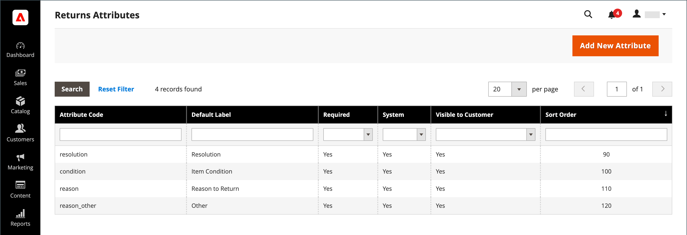
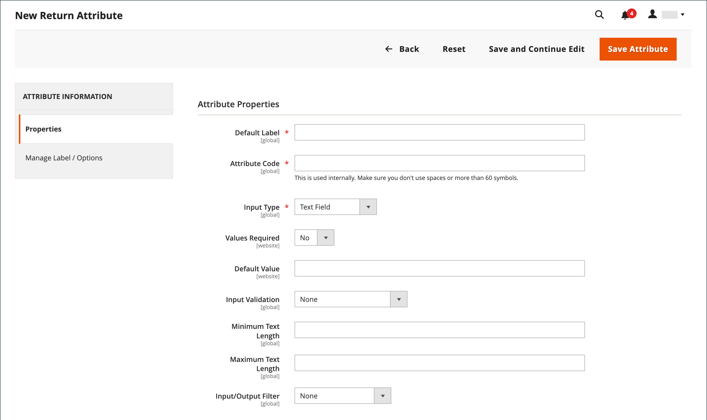

# 傳回屬性

{{ee-feature}}

退貨屬性是用來儲存產品退貨程式期間所需的資訊。 預設屬性包括傳回產品的條件、傳回原因，以及指出如何解決傳回的欄位。 建立傳回屬性的程式與建立[客戶屬性](../customers/attribute-properties.md)類似。

{width="700" zoomable="yes"}

## 建立傳回屬性

1. 在&#x200B;_管理員_&#x200B;側邊欄上，移至&#x200B;**[!UICONTROL Stores]** > _[!UICONTROL Attributes]_>**[!UICONTROL Returns]**。

1. 按一下右上角的&#x200B;**[!UICONTROL Add New Attribute]**。

   {width="600" zoomable="yes"}

### 定義屬性

1. 若要在資料輸入期間識別屬性，請設定&#x200B;**[!UICONTROL Default Label]**。

1. 針對&#x200B;**[!UICONTROL Attribute Code]**，輸入識別系統內屬性的程式碼。

1. 若要判斷資料輸入所使用的輸入控制項型別，請將&#x200B;**[!UICONTROL Input Type]**&#x200B;設定為下列其中一項：

   - `Text Field`
   - `Text Area`
   - `Dropdown`
   - `Yes/No`
   - `File`
   - `Image File`

1. 若要讓欄位成為必要專案，請將&#x200B;**[!UICONTROL Values Required]**&#x200B;設為`Yes`。

1. 若要指派初始值給欄位，請輸入&#x200B;**[!UICONTROL Default Value]**。

1. 若要在儲存記錄之前驗證輸入到欄位中的資料是否準確，請將&#x200B;**[!UICONTROL Input Validation]**&#x200B;設定為下列其中一項：

   - `None`
   - `Alphanumeric`
   - `Alphanumeric with Space`
   - `Numeric Only`
   - `Alpha Only`
   - `URL`
   - `Email`

1. 對於`Text Field`和`Text Area`輸入型別，請輸入&#x200B;**[!UICONTROL Minimum Text Length]**&#x200B;和&#x200B;**[!UICONTROL Maximum Text Length]**。

1. 若要套用前置處理篩選，請將&#x200B;**[!UICONTROL Input/Output Filter]**&#x200B;設定為下列其中一項：

   - `None`
   - `Strip HTML Tags`
   - `Escape  HTML Entities`

1. 若要讓客戶看到屬性，請在&#x200B;_[!UICONTROL Storefront Properties]_&#x200B;區段中將&#x200B;**[!UICONTROL Show on Storefront]**&#x200B;設為`Yes`。

1. （選擇性）為&#x200B;**[!UICONTROL Sort Order]**&#x200B;輸入數字，以決定此屬性在頁面的相同部分中相對於其他屬性的顯示位置。 （`0` =第一個，`1` =第二個，`2` =第三個，依此類推。）

### 管理標籤/選項

1. 在左側面板中選擇&#x200B;**[!UICONTROL Manage Labels/Options]**。

1. 在&#x200B;**[!UICONTROL Manage Titles (Size, Color, etc.)]**&#x200B;區段中，輸入每個商店檢視的標籤。

   {width="600" zoomable="yes"}

1. 如果屬性的&#x200B;**[!UICONTROL Input Type]**&#x200B;是`Dropdown`，請管理&#x200B;**[!UICONTROL Manage Options (Values of Your Attribute)]**&#x200B;區段中的選項。

   - 若要新增選項，請按一下&#x200B;**[!UICONTROL Add Option]**，然後輸入管理員和每個商店檢視的標籤。
   - 若要將選項設為選取的預設值，請選擇&#x200B;**[!UICONTROL Is Default]**。
   - 若要移除選項，請按一下&#x200B;**[!UICONTROL Delete]**。

1. 若要儲存變更，請按一下&#x200B;**[!UICONTROL Save Attribute]**。
