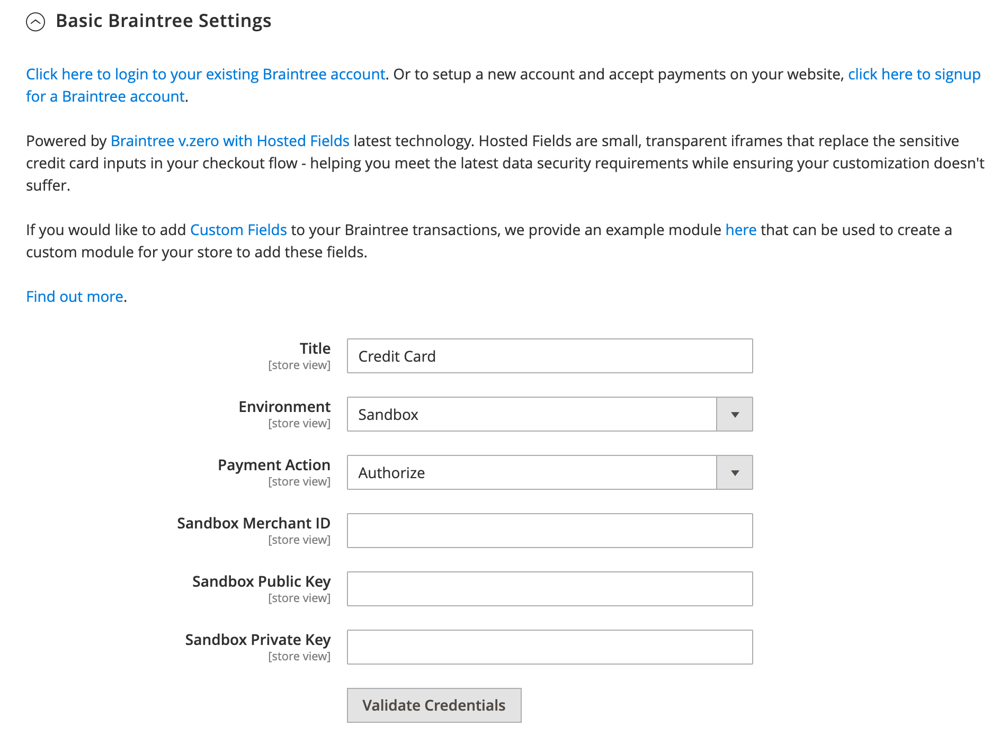
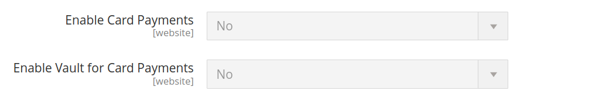
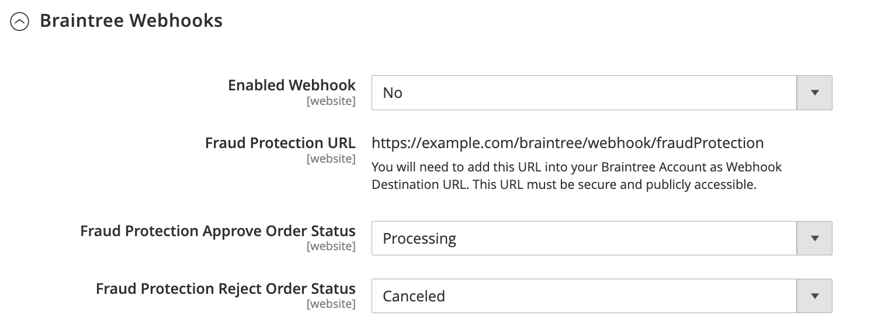
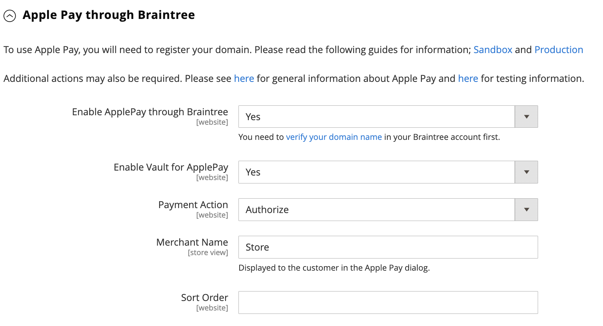
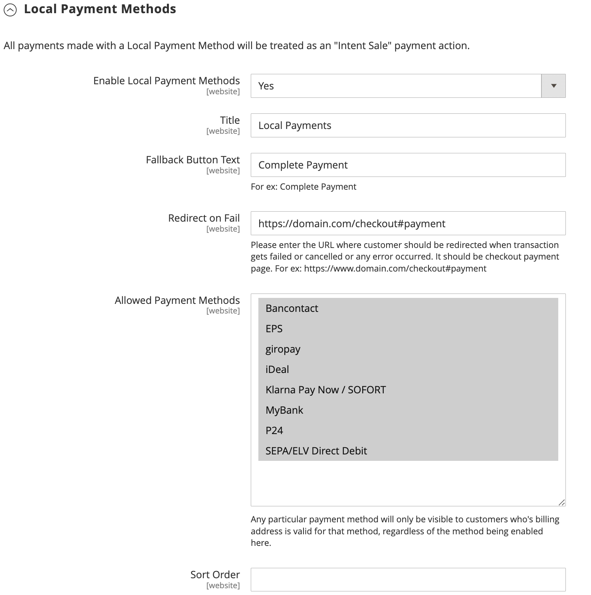
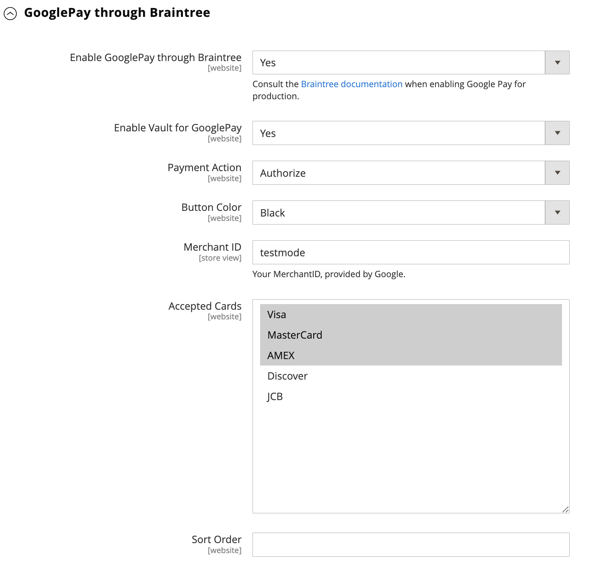
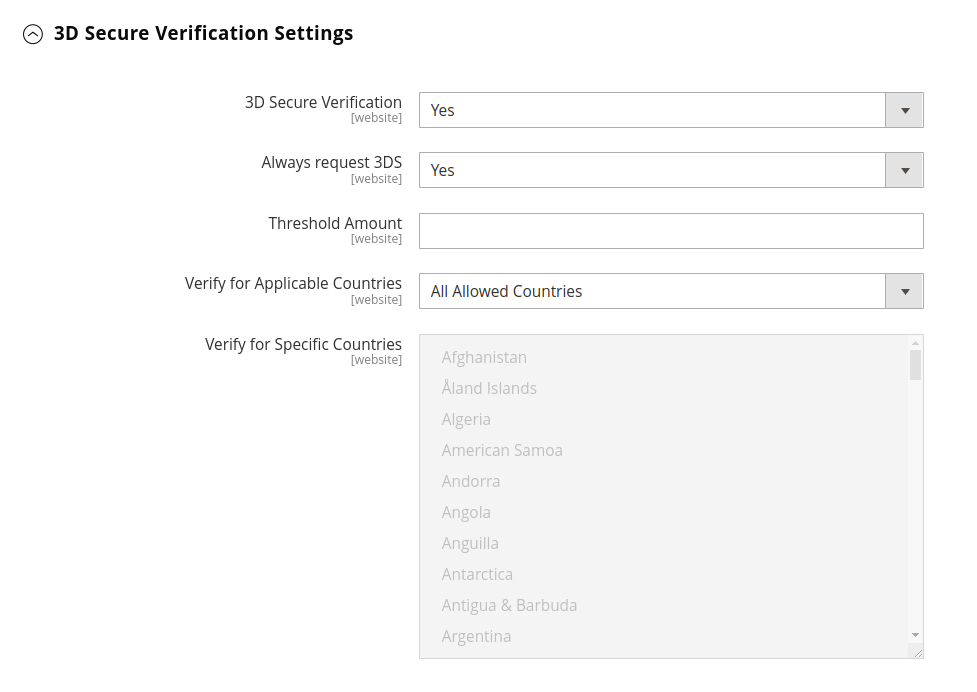
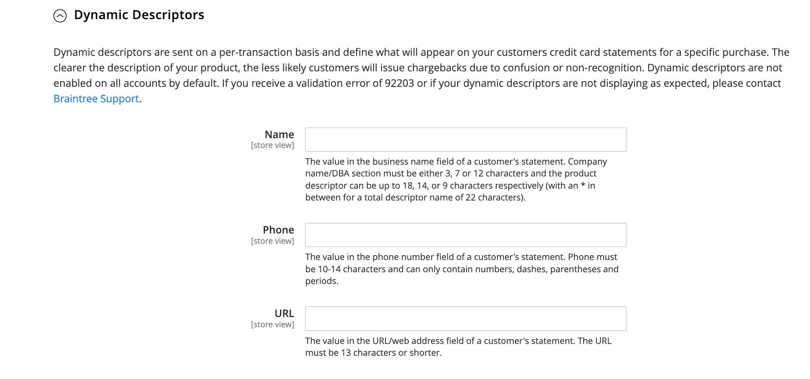

# Braintree

Braintree提供完全可自訂的結帳體驗，包含詐騙偵測和PayPal整合。 它支援 [!DNL Apple Pay]， [!DNL Google Pay]、ACH、Venmo和本地支付方式。 Braintree可減輕商戶的PCI法規遵循負擔，因為交易是在Braintree系統上進行。 「Braintree付款」整合的開發者為 [GENE Commerce](https://www.gene.co.uk/gene-braintree-payments/).

>[!NOTE]
>
>如果您要從舊版Adobe Commerce升級至2.4.x，或安裝了來自Magento Open Source的Braintree擴充功能的Commerce Marketplace，請參閱 [2.4升級注意事項](#24-upgrade-notes) 在本頁結尾處。

## 步驟1：取得您的Braintree認證

前往 [Braintree付款][1] 並註冊帳戶。

## 步驟2：完成基本設定

1. 在 _管理員_ 側欄，前往 **[!UICONTROL Stores]** > _[!UICONTROL Settings]_>**[!UICONTROL Configuration]**.

1. 在左側面板中，展開 **[!UICONTROL Sales]** 並選擇 **[!UICONTROL Payment Methods]**.

   - 如果您的Commerce安裝有多個網站、商店或檢視，請在左上角選擇 **[!UICONTROL Store View]** 組態適用的位置。

   - 在 _[!UICONTROL Merchant Location]_區段，確認&#x200B;**[!UICONTROL Merchant Country]**設為企業的所在位置。

1. 在 _[!UICONTROL Recommended Solutions]_，在_[!UICONTROL Braintree Payments] (作者： [GENE Commerce](https://www.gene.co.uk/gene-braintree-payments/) v4.6.1 - [發行說明](https://support.gene.co.uk/support/solutions/articles/35000228529)_區段，按一下&#x200B;**[!UICONTROL Configure]**.

   {width="600" zoomable="yes"}

1. 的 **[!UICONTROL Title]**，輸入在結帳時將Braintree識別為付款選項的標題。

1. 設定目前的作業中 **[!UICONTROL Environment]** 用於Braintree交易至 `Sandbox` 或 `Production`

   在沙箱中測試設定時，僅使用 [信用卡號碼][2] 由Braintree建議。 當您準備好透過Braintree前往生產時，請設定 **[!UICONTROL Environment]** 至 `Production`.

   {width="600" zoomable="yes"}

1. 設定 **[!UICONTROL Payment Action]** 變更為下列其中一項：

   - `Authorize Only`  — 核准購買並保留資金。 在銷售完成之前，不會從客戶的銀行帳戶提取金額 _已擷取_ 由商家提供。|
   - `Intent Sale`   — 採購金額已獲授權，並立即從客戶帳戶中提取。 **_注意：_** 此值是  _授權與擷取_ （在2.3.x及舊版中）。|

1. 輸入 **[!UICONTROL Sandbox Merchant ID / Merchant ID]** 從您的Braintree帳戶。

1. 從您的Braintree帳戶輸入下列認證：

   - **[!UICONTROL Sandbox Public Key / Public Key]**
   - **[!UICONTROL Sandbox Private Key / Private Key]**

   >[!NOTE]
   >
   >兩者都有個別欄位 **（沙箱和生產）** 環境和其他欄位會根據選取的環境進行轉譯。

1. 在儲存設定之前，按一下 **[!UICONTROL Validate Credentials]** 以驗證您的認證。

1. 設定 **[!UICONTROL Enable Card Payments]** 至 `Yes`.

   {width="600" zoomable="yes"}

   如果您想要能夠安全地儲存客戶資訊，以便客戶不需要在每次購買時都重新輸入，請設定 **[!UICONTROL Enable Vault for Card Payments]** 至 `Yes`.

## 步驟3：完成進階設定

1. 展開  此 **[!UICONTROL Advanced Braintree Settings]** 區段。

   {width="550" zoomable="yes"}

1. 的 **[!UICONTROL Vault Title]**，輸入描述性標題供您參考，以識別儲存客戶卡資訊的儲存庫。

1. 輸入 **[!UICONTROL Merchant Account ID]** 從您的Braintree帳戶。

   如果您未指定要使用的貿易商科目，則Braintree會使用您的預設貿易商科目來處理交易。

1. 為了在結帳程式開始時使用「快速付款」選項(包括PayPal、PayLater、Apple Pay和Google Pay)提供更快速的結帳體驗，請設定 **[!UICONTROL Enable Checkout Express Payments]** 至 `Yes`.

1. 如果您要防止在進階詐騙工具檢查時傳送交易以進行評估，請透過管理員下達的訂單上設定 **[!UICONTROL Skip Fraud Checks on Admin Orders]** 至 `Yes`.

1. 設定 **[!UICONTROL Bypass Fraud Protection Threshold]** 如此 `Advanced Fraud Protection` 當達到或超過臨界值時，會略過檢查。

   將此欄位保留空白會停用此選項。

1. 如果您希望系統儲存存放區與Braintree之間互動的記錄檔，請設定 **[!UICONTROL Debug]** 至 `Yes`.

1. 若要要求客戶從信用卡背面提供三位數的安全代碼，請設定 **[!UICONTROL CVV Verification]** 至 `Yes`.

   如果使用CVV驗證，請務必在「 」中啟用AVS和/或CVV _設定/處理_ Braintree部分。

1. 若要針對所有付款方式傳送購物車明細專案，請設定 **[!UICONTROL Send Card Line Items]** 至 `Yes`.

1. 的 **[!UICONTROL Credit Card Types]**，選取您的商店接受以透過Braintree付款的每個信用卡。

   若要選取多種卡片型別，請按住Ctrl鍵(PC)或Command鍵(Mac)並按一下每個選項。

1. 的 **[!UICONTROL Sort Order]**，請輸入數字，以決定結帳期間與其他付款方法一起列出Braintree時的顯示順序。

## 步驟4：完成Braintreewebhook設定

{width="600" zoomable="yes"}

1. 設定 **[!UICONTROL Enable Webhook]** 至 `Yes` 啟用webhook功能以防範詐騙、ACH付款及本機付款方法。

1. 將URL複製到 **[!UICONTROL Fraud Protection URL]** 欄位並將其新增到您的Braintree帳戶，作為 _[!UICONTROL Webhook Destination URL]_.

   >[!IMPORTANT]
   >
   >此URL必須是安全的並可公開存取。

1. 設定 **[!UICONTROL Fraud Protection Approve Order Status]** 用於判斷Braintree何時核准詐騙保護的欄位。

   選取的訂單狀態會指派給商務訂單。

1. 設定 **[!UICONTROL Fraud Protection Reject Order Status]** 用於判斷Braintree何時拒絕詐騙保護的欄位。

   選取的訂單狀態會指派給商務訂單。

## 步驟5：完成國家/地區專屬設定

1. 設定 **[!UICONTROL Payment from Applicable Countries]** 變更為下列其中一項：

   - `All Allowed Countries`  — 來自所有客戶的客戶 [國家/地區](../getting-started/store-details.md#country-options) 在商店設定中指定的可使用此付款方式。
   - `Specific Countries`  — 選擇此選項後， _[!UICONTROL Payment from Specific Countries]_清單隨即顯示。 按住Ctrl鍵(PC)或Command鍵(Mac)，並在清單中選取客戶可在您的商店購買產品的國家/地區。

   {width="600" zoomable="yes"}

1. 若要設定 **[!UICONTROL Country Specific Credit Card Types]**：

   - 按一下 **[!UICONTROL Add]**.

   - 設定 **[!UICONTROL Country]** 並選擇每個 **[!UICONTROL Allowed Credit Card Type]**.

   - 重複此步驟以識別每個國家/地區接受的信用卡。

## 步驟6：透過Braintree設定完成ACH

{width="600" zoomable="yes"}

1. 若要將ACH納入為Braintree的付款選項，請設定 **[!UICONTROL Enable ACH Direct Debit]** 至 `Yes`.

1. 客戶可儲存其單次使用的ACH Direct Debit支付方式，並將其儲存以供日後使用。 一旦儲存起來，客戶就可以重複使用ACH Direct Debit直接扣款，不需要重新輸入或驗證其付款資訊（若已設定） **[!UICONTROL Enable Vault for ACH Direct Debit]** 至 `Yes`.

1. 的 **[!UICONTROL Sort Order]**，請輸入數字，以決定結帳期間與其他付款選項一起列出時，BraintreeACH付款選項出現的順序。

## 步驟7：完成 [!UICONTROL Apple Pay] 透過Braintree設定

{width="600" zoomable="yes"}

1. 要包含 [!DNL Apple Pay] 作為Braintree的付款選項，請設定 **[!UICONTROL Enable ApplePay through Braintree]** 至 `Yes`.

   確定 [驗證您的網域名稱](https://developer.paypal.com/braintree/docs/guides/apple-pay/configuration/javascript/v3) 在您的Braintree帳戶中。

1. 如果您想要能夠安全地儲存客戶資訊，以便客戶每次使用Apple Pay購買時都不需要重新輸入，請設定 **[!UICONTROL Enable Vault for ApplePay]** 至 `Yes`.

1. 設定 **[!UICONTROL Payment Action]** 變更為下列其中一項：

   - `Authorize Only`  — 核准購買並保留資金。 在銷售完成之前，不會從客戶的銀行帳戶提取金額 _已擷取_ 由商家提供。
   - `Intent Sale`  — 採購金額已獲授權，並立即從客戶帳戶中提取。

1. 的 **[!UICONTROL Merchant Name]**，輸入文字，指定在Apple支付對話方塊中向客戶顯示的標籤。

1. 的 **[!UICONTROL Sort Order]**，請輸入數字以決定順序 [!DNL Apple Pay] 在結帳期間與其他付款選項一起列出時，會顯示付款選項。

## 步驟8：完成本機付款方式的設定

1. 若要將當地付款方式納入為Braintree的付款選項，請設定 **[!UICONTROL Enable Local Payment Methods]** 至 `Yes`.

1. 的 **[!UICONTROL Title]**，輸入用於顯示在「結帳付款方式」區段上的標籤的文字(預設值： `Local Payments`)。

1. 的 **[!UICONTROL Fallback Button Text]**，輸入用於後援Braintree頁面上顯示的按鈕的文字，以將客戶帶回網站(例如， `Complete Checkout`)。

1. 的 **[!UICONTROL Redirect on Fail]**，輸入當本機付款方式交易取消、失敗或發生錯誤時，應重新導向客戶的URL。 它應該是結帳付款頁面(例如， `https://www.domain.com/checkout#payment`)。

1. 的 **[!UICONTROL Allowed Payment Methods]**，選取要啟用的本機付款方式。

   選項： `Bancontact` / `EPS` / `giropay` / `iDeal` / `Klarna Pay Now` / `SOFORT` / `MyBank` / `P24` / `SEPA/ELV Direct Debit` （尚未支援）

   {width="600" zoomable="yes"}

   >[!NOTE]
   >
   >套件式Braintree擴充功能不支援 [Braintree開發人員檔案](https://developer.paypal.com/braintree/docs/guides/local-payment-methods/overview). 正在開發其他本機付款方法，未來版本將支援這些方法。

1. 的 **[!UICONTROL Sort Order]**，請輸入數字，以決定結帳期間與其他付款選項一起列出時本機付款方式出現的順序。

## 步驟9：完成 [!DNL Google Pay] 透過Braintree設定

{width="600" zoomable="yes"}

1. 要包含 [!DNL Google Pay] 作為Braintree的付款選項，請設定 **[!UICONTROL Enable GooglePay Through Braintree]** 至 `Yes`.

1. 如果您想要能夠安全地儲存客戶資訊，以便客戶每次使用Google Pay購買時都不需要重新輸入，請設定 **[!UICONTROL Enable Vault for GooglePay]** 至 `Yes`.

1. 設定 **[!UICONTROL Payment Action]** 變更為下列其中一項：

   - `Authorize Only`  — 核准購買並保留資金。 在銷售完成之前，不會從客戶的銀行帳戶提取金額 _已擷取_ 由商家提供。
   - `Intent Sale`   — 採購金額已獲授權，並立即從客戶帳戶中提取。

1. 設定 **[!UICONTROL Button Color]** 以決定 [!DNL Google Pay] 按鈕： `White` 或 `Black`

1. 的 **[!UICONTROL Merchant ID]**，輸入您的MerchantID (由Google提供)。

1. 的 **[!UICONTROL Accepted Cards]**，選取客戶可使用來下訂單的卡片型別 [!DNL Google Pay].

   選項： `Visa` / `MasterCard` / `AMEX` / `Discover` / `JCB`

1. 的 **[!UICONTROL Sort Order]**，請輸入數字以決定順序 [!DNL Google Pay] 在結帳期間與其他付款選項一起列出時出現。

## 步驟10：透過Braintree設定完成Venmo

1. 若要包含Venmo作為Braintree的付款選項，請設定 **[!UICONTROL Enable Venmo through Braintree]** 至 `Yes`.

1. 設定 **[!UICONTROL Enable Vault for Venmo]** 至 `Yes` 啟用安全儲存庫來儲存客戶的Venmo帳戶，這樣客戶就不需要再次登入其Venmo帳戶即可進行未來的交易。

   {width="600" zoomable="yes"}

1. 設定 **[!UICONTROL Payment Action]** 變更為下列其中一項：

   - `Authorize Only`  — 核准購買並保留資金。 在銷售完成之前，不會從客戶的銀行帳戶提取金額 _已擷取_ 由商家提供。
   - `Intent Sale`   — 採購金額已獲授權，並立即從客戶帳戶中提取。

1. 的 **[!UICONTROL Sort Order]**，請輸入數字，以決定結帳期間Venmo與其他付款選項一起列出時的顯示順序。

## 步驟11：透過Braintree設定完成PayPal

{width="550" zoomable="yes"}

1. 若要包含PayPal作為Braintree的付款選項，請設定 **[!UICONTROL Enable PayPal through Braintree]** 至 `Yes`.

1. 透過Braintree付款方式指定您的PayPal：

   >[!NOTE]
   >
   >兩者之一 **[!DNL PayPal Credit]** 或 **[!DNL PayPal PayLater]** 可以啟用。 無法同時啟用這兩種方法。

   - 要包含 [!DNL PayPal Credit] 作為Braintree的付款選項，請設定 **[!UICONTROL Enable PayPal Credit through Braintree]** 至 `Yes`.

     時間 **透過Braintree啟用PayPal** 設為 `Yes`，則只會顯示此欄位。

     >[!NOTE]
     >
     >PayPal信用僅在美國及英國提供。 如果為以下專案選取的值，則會停用PayPal點數 _[!UICONTROL Merchant Country]_欄位不是 `US` 或 `UK`.

   - 要包含 [!DNL PayPal PayLater] 作為Braintree的付款選項，請設定 **[!UICONTROL Enable PayPal PayLater through Braintree]** 至 `Yes`.

     時間 **[!UICONTROL Enable PayPal PayLater through Braintree]** 設為 `Yes`，則只會顯示此欄位。

     您可以在您的網站上顯示優惠的PayLater訊息，例如 _付款單位3_，客戶可每月以三筆免息款項付款。 Braintree整合可在您的網站上顯示訊息，以推廣此功能。 您無法將PayLater優惠方案與任何其他內容、行銷或資料一起促銷。

1. 的 **[!UICONTROL Title]**，輸入標題，以在結帳時識別透過PayPal選項的Braintree付款。

1. 設定 **[!UICONTROL Vault Enabled]** 至 `Yes` 以使用安全儲存庫來儲存客戶的PayPal帳戶。 存放的PayPal帳戶可用於未來的交易，減少客戶的步驟數。

1. 設定 **[!UICONTROL Send Cart Line Items for PayPal]** 至 `Yes` 將明細專案（訂購專案）連同禮品卡、專案禮品包裝、訂購禮品包裝、商店退款、送貨和稅捐一起傳送至PayPal。

1. 的 **[!UICONTROL Sort Order]**，請輸入數字，以決定結帳期間BraintreePayPal付款選項與其他付款選項一起列出時的顯示順序。

1. 若要以不同於中定義的方式顯示您的商家名稱，請執行下列步驟： [存放區設定](../getting-started/store-details.md#store-information)，請在 **[!UICONTROL Override Merchant Name]** 欄位顯示的方式。

1. 設定 **[!UICONTROL Payment Action]** 變更為下列其中一項：

   - `Authorize Only`  — 核准購買並保留資金。 在銷售完成之前，不會從客戶的銀行帳戶提取金額 _已擷取_ 由商家提供。
   - `Authorize and Capture`  — 採購金額已獲授權，並立即從客戶帳戶中提取。

1. 設定 **[!UICONTROL Payment from Applicable Countries]** 針對PayPal所處理的Braintree交易，變更為下列其中一項：

   - `All Allowed Countries`  — 來自所有客戶的客戶 [國家/地區](../getting-started/store-details.md#country-options) 在商店設定中指定的可使用此付款方式。
   - `Specific Countries`  — 選擇此選項後， _[!UICONTROL Payment from Specific Countries]_清單隨即顯示。 按住Ctrl鍵(PC)或Command鍵(Mac)，並在清單中選取客戶可在您的商店購買產品的國家/地區。

1. 若要要求客戶提供帳單地址，請設定 **[!UICONTROL Require Customer's Billing Address]** 至 `Yes`.

   >[!NOTE]
   >
   >您的帳戶必須由PayPal技術支援啟用此功能。

1. 若要透過Braintree儲存商店與PayPal之間互動的記錄檔，請設定 **[!UICONTROL Debug]** 至 `Yes`.

1. 若要在迷你購物車和購物車頁面上顯示PayPal按鈕，請設定 **[!UICONTROL Display on Shopping Cart]** 至 `Yes`.

## 步驟12：設定樣式設定

1. 的 **[!UICONTROL Location]**，選擇轉譯PayPal按鈕和訊息的位置： `Mini-Cart and Cart Page`， `Checkout Page`，或 `Product Page`

   {width="600" zoomable="yes"}

### [!UICONTROL Mini-Cart and Cart Page]

本節中的選項和設定會因 _[!UICONTROL Location]_欄位。

1. 設定 **[!UICONTROL PayPal Button Type]** 三種按鈕型別之一： `PayPal Button` / `PayPal Pay Later Button` / `PayPal Credit Button`

**[!UICONTROL PayPal Button]**

本節中的選項和設定會因在中選取的按鈕型別而異。 _[!UICONTROL PayPal Button Type]_欄位。

1. 若要在選取位置的店面上顯示PayPal按鈕，請設定 **[!UICONTROL Show PayPal Button]** 至 `Yes`.

1. 的 **[!UICONTROL Button Label]**，選取PayPal按鈕標籤： `Paypal`， `Checkout`， `Buynow`，或 `Pay`

1. 的 **[!UICONTROL Color]**，選取PayPal按鈕色彩： `Blue`， `Black`， `Gold`，或 `Silver`

1. 的 **[!UICONTROL Shape]**，選取PayPal按鈕形狀： `Pill` 或 `Rectangle`

1. 的 **[!UICONTROL Size (Deprecated)]**，選取PayPal按鈕大小： `Medium`， `Large`，或 `Responsive`

>[!NOTE]
>
>此 **[!DNL Size(Deprecated)]** 設定欄位已過時，不用於設定PayPal按鈕的樣式。

**[!UICONTROL PayLater Messaging]**

1. 顯示 [!DNL PayLater] 在選取位置的店面傳訊，設定 **[!UICONTROL Show PayLater Messaging]** 至 `Yes`.

   此傳訊功能會顯示 [!DNL PayLater] 傳送訊息給可用的優惠方案([限制套用](https://developer.paypal.com/docs/checkout/pay-later/us/))。

1. 的 **[!UICONTROL Message Layout]**，選取 [!DNL PayLater] 訊息配置： `Text` 或 `Flex`

1. 的 **[!UICONTROL Logo]**，選取PayPal標誌型別： `Inline`， `Primary`， `Alternative`，或 `None`

1. 的 **[!UICONTROL Logo Position]**，選取PayPal標誌位置： `Left`， `Right`，或 `Top`

1. 的 **[!UICONTROL Text Color]**，選取 [!DNL PayLater] 訊息文字色彩： `Black`， `White`， `Monochrome`，或 `Grayscale`

設定這些選項後，您可以看到PayPal按鈕和PayLater訊息的預覽。 有些控制項可用來套用設定或重設值：

- 若要儲存按鈕和PayLater訊息的選取樣式設定，並將它們套用至目前位置和目前的按鈕型別，請按一下 **[!UICONTROL Apply]**.

- 若要儲存按鈕和PayLater訊息值的選取樣式設定，並將它們套用至所有按鈕型別和位置，請按一下 **[!UICONTROL Apply to All Buttons]**.

- 若要將樣式設定恢復為按鈕和PayLater訊息的建議預設值，並將其套用至所有按鈕型別和位置，請按一下 **[!UICONTROL Reset to Recommended Defaults]**.

## 步驟13：完成3D驗證設定

1. 如果您要為使用已註冊驗證方案(例如 _由VISA驗證_)，設定 **[!UICONTROL 3D Secure Verification]** 至 `Yes`.

   在處理期間，會針對送出進行授權的金額，檢查送出進行驗證的交易金額。

2. 若要一律對所有交易挑戰3D Secure要求，請設定 **[!UICONTROL Always request 3DS]** 至 `Yes`.

3. 的 **[!UICONTROL Threshold Amount]**，請輸入觸發3D驗證所需的最小訂購量。

4. 設定 **[!UICONTROL Verify for Applicable Countries]** 變更為下列其中一項：

   - `All Allowed Countries`  — 來自所有客戶的客戶 [國家/地區](../getting-started/store-details.md#country-options) 在商店設定中指定的可使用此付款方式。
   - `Specific Countries`  — 選擇此選項後， _[!UICONTROL Verify for Specific Countries]_清單隨即顯示。 按住Ctrl鍵(PC)或Command鍵(Mac)，並在清單中選取客戶可在您的商店購買產品的國家/地區。

   {width="600" zoomable="yes"}

## 步驟14：設定Braintree動態描述元

以下描述元可用來識別客戶信用卡對帳單上的購買專案。 您可以明確識別與每次購買相關聯的公司，以減少費用回傳次數。 如果您的帳戶未啟用動態描述元，請聯絡Braintree支援。

{width="600" zoomable="yes"}

1. 輸入以下專案的動態描述項： **[!UICONTROL Name]**， **[!UICONTROL Phone]**、和 **[!UICONTROL URL]** 根據以下准則：

   - **[!UICONTROL Name]**  — 名稱描述項分為兩部分，以星號(*)分隔。 例如：

     `company*myproduct`

     描述項的第一部分可識別公司或DBA，第二部分則可識別產品。 的長度 `company` 和 `product` 部分描述項可以透過以下方式配置，合併長度最多為22個字元。

     **_名稱描述項中的字元_**

     _選項1：_ `Company` 必須為三個字元， `Product` 最多可包含18個字元

     _選項2：_ `Company` 必須為七個字元， `Product` 最多可包含14個字元

     _選項3_： `Company` 必須為12個字元， `Product` 最多可包含9個字元

   - **[!UICONTROL Phone]**  — 電話描述元的長度必須是10到14個字元，而且只能包含數字、破折號、括弧和句點。 例如：

     `9999999999`

     `(999) 999-9999`

     `999.999.9999`

   - **[!UICONTROL URL]** - URL描述項代表您的網域名稱，長度最多為13個字元。 例如：

     `company.com`

1. 當您的Braintree設定完成後，按一下 **[!UICONTROL Save Config]**.

## 2.4升級注意事項

從Adobe Commerce和Magento Open Source2.4.0開始，Braintree擴充功能已包含在發行版本中。 如果您要從已安裝MarketplaceBraintree擴充功能的2.4.0之前版本移轉至Commerce 2.4.x，您必須解除安裝該擴充功能(`paypal/module-braintree` 或 `gene/module-braintree`)並更新任何程式碼自訂，以使用 `PayPal_Braintree` 名稱空間而非 `Magento_Braintree`. 來自核心「商務Braintree付款」套件擴充功能的組態設定以及在Commerce Marketplace上散佈的擴充功能會持續存在，而且仍可正常擷取、作廢或退款這些舊版本的付款。

[1]: https://www.braintreepayments.com/
[2]: https://developers.braintreepayments.com/reference/general/testing/php
