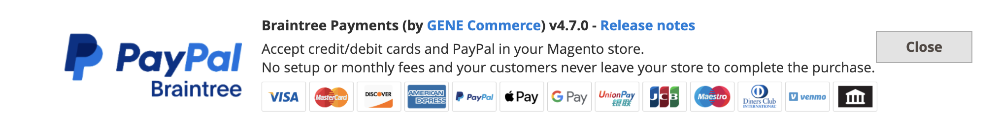
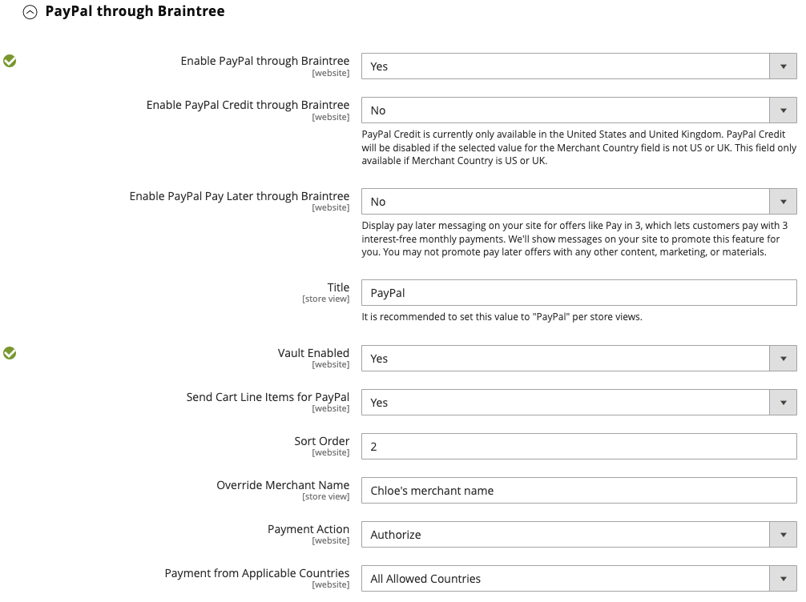

# Braintree

>[!IMPORTANT]
>
>如果您需要有關卡片意外費用的協助，請造訪[取消訂閱](https://helpx.adobe.com/manage-account/using/cancel-subscription.html)頁面以取得協助。

Braintree提供完全可自訂的結帳體驗，包含詐騙偵測和PayPal整合。 它支援[!DNL Apple Pay]、[!DNL Google Pay]、ACH、Venmo和本機付款方法。 Braintree可減輕商戶的PCI法規遵循負擔，因為交易是在Braintree系統上進行。 Braintree Payments整合是由[GENE Commerce](https://www.gene.co.uk/gene-braintree-payments/)開發。

>[!NOTE]
>
>如果您要從舊版Adobe Commerce或Magento Open Source升級為2.4.x，並安裝Commerce Marketplace的Braintree擴充功能，請參閱本頁結尾的[2.4升級說明](#24-upgrade-notes)。

## 步驟1：取得您的Braintree認證

移至[Braintree Payments][1]並註冊帳戶。

## 步驟2：完成基本設定

1. 在&#x200B;_管理員_&#x200B;側邊欄上，移至&#x200B;**[!UICONTROL Stores]** > _[!UICONTROL Settings]_>**[!UICONTROL Configuration]**。

1. 在左側面板中，展開&#x200B;**[!UICONTROL Sales]**&#x200B;並選擇&#x200B;**[!UICONTROL Payment Methods]**。

   - 如果您的Commerce安裝有多個網站、商店或檢視，請在左上角選擇套用設定的&#x200B;**[!UICONTROL Store View]**。

   - 在&#x200B;_[!UICONTROL Merchant Location]_&#x200B;區段中，確認&#x200B;**[!UICONTROL Merchant Country]**&#x200B;已設定為您的公司所在位置。

1. 在&#x200B;_[!UICONTROL Recommended Solutions]_&#x200B;底下，在_[!UICONTROL Braintree Payments] (由[GENE Commerce](https://www.gene.co.uk/gene-braintree-payments/) v4.7.0 - [發行說明](https://support.gene.co.uk/support/solutions/articles/35000278668)_區段中，按一下&#x200B;**[!UICONTROL Configure]**。

   {width="600" zoomable="yes"}

1. 對於 **[!UICONTROL Title]**，請輸入一個標題，用於在結帳時將Braintree標識為支付選項。

1. 將Braintree交易的目前作業&#x200B;**[!UICONTROL Environment]**&#x200B;設定為`Sandbox`或`Production`

   在沙箱中測試設定時，請只使用Braintree建議的[信用卡號碼][2]。 當您準備好透過Braintree前往生產環境時，請將&#x200B;**[!UICONTROL Environment]**&#x200B;設為`Production`。

   {width="600" zoomable="yes"}

1. 將&#x200B;**[!UICONTROL Payment Action]**&#x200B;設定為下列其中一項：

   - `Authorize Only` — 核准購買並保留資金。 在銷售由商家擷取&#x200B;__&#x200B;之前，不會從客戶的銀行帳戶提取金額。|
   - `Intent Sale`  - 購買金額已獲得授權並立即從客戶的帳戶中提取。 **_注意：_** 此值在 2.3.x 和更早版本中為  _授權和Capture_ 。|

1. 輸入「 **[!UICONTROL Sandbox Merchant ID / Merchant ID]** 從您的Braintree帳戶。

1. 從您的Braintree帳戶輸入以下憑據：

   - **[!UICONTROL Sandbox Public Key / Public Key]**
   - **[!UICONTROL Sandbox Private Key / Private Key]**

   >[!NOTE]
   >
   >（沙箱和生產）**環境都有**&#x200B;單獨的欄位，其他字段根據選擇的環境進行呈現。

1. 在保存配置之前，請按兩下以 **[!UICONTROL Validate Credentials]** 驗證您的憑據。

1. 設為 **[!UICONTROL Enable Card Payments]** `Yes`。

1. 如果您希望能夠安全地商店客戶信息，以便客戶不必在每次購買時重新輸入信息，請設置為 **[!UICONTROL Enable Vault for Card Payments]** `Yes`。

1. 如果您希望客戶在每次購買時驗證其保險倉庫卡片的 CVV 編號，請設定為 **[!UICONTROL Enable Vault CVV Re-verification]** `Yes`。

## 第 3 步：完整應用程式高級設置

1. 展開**[!UICONTROL Advanced Braintree Settings]**&#x200B;展開。

   {width="550" zoomable="yes"}

1. 針對&#x200B;**[!UICONTROL Vault Title]**，輸入描述性標題作為參考，以識別儲存客戶卡資訊的儲存庫。

1. 輸入您Braintree帳戶中的&#x200B;**[!UICONTROL Merchant Account ID]**。

   如果您未指定要使用的商家帳戶，Braintree會使用您的預設商家帳戶來處理交易。

1. 若要在結帳程式開始時使用「快速付款」選項(包括PayPal、PayLater、Apple Pay及Google Pay)提供更快速的結帳體驗，請將&#x200B;**[!UICONTROL Enable Checkout Express Payments]**&#x200B;設為`Yes`。

1. 如果您要防止在進階詐騙工具檢查期間傳送交易以進行評估，請透過管理員下單，將&#x200B;**[!UICONTROL Skip Fraud Checks on Admin Orders]**&#x200B;設為`Yes`。

1. 設定&#x200B;**[!UICONTROL Bypass Fraud Protection Threshold]**，以便在達到或超過臨界值時略過`Advanced Fraud Protection`檢查。

   將此欄位保留空白會停用此選項。

1. 如果您希望系統儲存商店與Braintree之間互動的記錄檔，請將&#x200B;**[!UICONTROL Debug]**&#x200B;設為`Yes`。

1. 若要要求客戶從信用卡背面提供三位數的安全碼，請將&#x200B;**[!UICONTROL CVV Verification]**&#x200B;設為`Yes`。

   如果使用CVV驗證，請務必在Braintree帳戶的&#x200B;_設定/處理_&#x200B;區段中啟用AVS和/或CVV。

1. 若要針對所有付款方式傳送購物車明細專案，請將&#x200B;**[!UICONTROL Send Card Line Items]**&#x200B;設為`Yes`。

1. 針對&#x200B;**[!UICONTROL Credit Card Types]**，選取商店接受的每一張信用卡，以透過Braintree付款。

   若要選取多種卡片型別，請按住Ctrl鍵(PC)或Command鍵(Mac)並按一下每個選項。

1. 針對&#x200B;**[!UICONTROL Sort Order]**，輸入數字以決定結帳期間列出其他付款方式時，Braintree出現的順序。

## 步驟4：完成Braintree webhook設定

{width="600" zoomable="yes"}

1. 將&#x200B;**[!UICONTROL Enable Webhook]**&#x200B;設為`Yes`以啟用webhook功能以進行詐騙保護、ACH付款和本機付款方法。

1. 複製「**[!UICONTROL Fraud Protection URL]**」欄位中的URL，並將其新增至您的Braintree帳戶，做為&#x200B;_[!UICONTROL Webhook Destination URL]_。

   >[!IMPORTANT]
   >
   >此URL必須是安全的並可公開存取。

1. 設定&#x200B;**[!UICONTROL Fraud Protection Approve Order Status]**&#x200B;欄位以判斷Braintree何時核准詐騙保護。

   選取的訂單狀態會指派給Commerce訂單。

1. 設定&#x200B;**[!UICONTROL Fraud Protection Reject Order Status]**&#x200B;欄位以判斷Braintree何時拒絕詐騙保護。

   選取的訂單狀態會指派給Commerce訂單。

## 步驟5：完成國家/地區專屬設定

1. 將&#x200B;**[!UICONTROL Payment from Applicable Countries]**&#x200B;設定為下列其中一項：

   - `All Allowed Countries` — 來自您商店組態中指定的所有[國家/地區](../getting-started/store-details.md#country-options)的客戶都可以使用此付款方式。
   - `Specific Countries` — 選擇此選項後，_[!UICONTROL Payment from Specific Countries]_&#x200B;清單會出現。 按住Ctrl鍵(PC)或Command鍵(Mac)，並在清單中選取客戶可在您的商店購買產品的國家/地區。

   {width="600" zoomable="yes"}

1. 若要設定&#x200B;**[!UICONTROL Country Specific Credit Card Types]**：

   - 按一下&#x200B;**[!UICONTROL Add]**。

   - 設定&#x200B;**[!UICONTROL Country]**&#x200B;並選擇每個&#x200B;**[!UICONTROL Allowed Credit Card Type]**。

   - 重複此步驟以識別每個國家/地區接受的信用卡。

## 步驟6：透過Braintree設定完成ACH

透過Braintree{width="600" zoomable="yes"}

1. 若要將ACH納入為Braintree的付款選項，請將&#x200B;**[!UICONTROL Enable ACH Direct Debit]**&#x200B;設為`Yes`。

1. 客戶可儲存其單次使用的ACH Direct Debit支付方式，並將其儲存以供日後使用。 一旦儲存起來，客戶就可以重複使用ACH Direct Debit，不需要重新輸入或驗證其付款資訊（如果設定&#x200B;**[!UICONTROL Enable Vault for ACH Direct Debit]**&#x200B;為`Yes`）。

1. 針對&#x200B;**[!UICONTROL Sort Order]**，請輸入數字，以決定結帳期間與其他付款選項一起列出時，Braintree ACH付款選項出現的順序。

## 步驟7：透過Braintree設定完成[!UICONTROL Apple Pay]

透過Braintree設定{width="600" zoomable="yes"}

1. 若要包含[!DNL Apple Pay]作為Braintree的付款選項，請將&#x200B;**[!UICONTROL Enable ApplePay through Braintree]**&#x200B;設為`Yes`。

   請務必 [先在您的Braintree帳戶中驗證您的域名](https://developer.paypal.com/braintree/docs/guides/apple-pay/configuration/javascript/v3) 。

1. 如果您希望能夠安全地商店客戶信息，這樣客戶就不必在每次使用 Apple Pay 進行購買時重新輸入信息，請設置為 **[!UICONTROL Enable Vault for ApplePay]** `Yes`。

1. 將&#x200B;**[!UICONTROL Payment Action]**&#x200B;設定為下列其中一項：

   - `Authorize Only` — 核准購買並保留資金。 在銷售為&#x200B;_擷取_&#x200B;之前，不會從客戶的銀行帳戶提取金額。
   - `Intent Sale` — 已授權並立即從客戶帳戶中取用購買的金額。

1. 針對&#x200B;**[!UICONTROL Merchant Name]**，輸入文字，指定在Apple付款對話方塊中向客戶顯示的標籤。

1. 針對&#x200B;**[!UICONTROL Sort Order]**，輸入數字以決定結帳期間與其他付款選項一起列出時，[!DNL Apple Pay]付款選項出現的順序。

## 步驟8：完整應用程式本地付款方式的設置

1. 要將本地付款方式作為Braintree支付選項，請設定為 **[!UICONTROL Enable Local Payment Methods]** `Yes`。

1. 對於 **[!UICONTROL Title]**，輸入要用於結帳付款方式部分上顯示的標籤的文本（預設值： `Local Payments`）。

1. 對於 **[!UICONTROL Fallback Button Text]**，輸入要用于後援Braintree按鈕頁面將客戶帶回網站的文字（例如 `Complete Checkout`）。

1. 對於 **[!UICONTROL Redirect on Fail]**，輸入本地付款方式交易記錄被取消、失敗或遇到錯誤時應重定向客戶的URL。 它應該是結帳付款頁面 （例如 `https://www.domain.com/checkout#payment`）。

1. 對於 **[!UICONTROL Allowed Payment Methods]**，選擇要啟用的本地付款方式。

   選項： `Bancontact` / `EPS` / `giropay` / `iDeal` / `Klarna Pay Now` / `SOFORT` / `MyBank` / `P24` / `SEPA/ELV Direct Debit` （尚未支援）

   {width="600" zoomable="yes"}

   >[!NOTE]
   >
   >套件式Braintree擴充功能不支援[Braintree開發人員檔案](https://developer.paypal.com/braintree/docs/guides/local-payment-methods/overview)中列出的所有本機付款方法。 正在開發其他本機付款方法，未來版本將支援這些方法。

1. 針對&#x200B;**[!UICONTROL Sort Order]**，請輸入數字，以決定結帳期間列出其他付款選項時本機付款方式出現的順序。

## 步驟9：透過Braintree設定完成[!DNL Google Pay]

{width="600" zoomable="yes"}

1. 若要包含[!DNL Google Pay]作為Braintree的付款選項，請將&#x200B;**[!UICONTROL Enable GooglePay Through Braintree]**&#x200B;設為`Yes`。

1. 如果您想要能夠安全地儲存客戶資訊，以便客戶每次透過Google Pay購買時都不需要重新輸入，請將&#x200B;**[!UICONTROL Enable Vault for GooglePay]**&#x200B;設為`Yes`。

1. 將&#x200B;**[!UICONTROL Payment Action]**&#x200B;設定為下列其中一項：

   - `Authorize Only` — 核准購買並保留資金。 在銷售為&#x200B;_擷取_&#x200B;之前，不會從客戶的銀行帳戶提取金額。
   - `Intent Sale` — 已授權並立即從客戶帳戶中取用購買的金額。

1. 設定&#x200B;**[!UICONTROL Button Color]**&#x200B;以決定[!DNL Google Pay]按鈕的色彩： `White`或`Black`

1. 針對&#x200B;**[!UICONTROL Merchant ID]**，輸入您的MerchantID (由Google提供)。

1. 針對&#x200B;**[!UICONTROL Accepted Cards]**，選取客戶可使用[!DNL Google Pay]下訂單的卡片型別。

   選項： `Visa` / `MasterCard` / `AMEX` / `Discover` / `JCB`

1. 針對&#x200B;**[!UICONTROL Sort Order]**，輸入數字以決定結帳期間與其他付款選項一起列出[!DNL Google Pay]時出現的順序。

## 步驟10：透過Braintree設定完成Venmo

1. 若要將Venmo納入為Braintree的付款選項，請將&#x200B;**[!UICONTROL Enable Venmo through Braintree]**&#x200B;設為`Yes`。

1. 將&#x200B;**[!UICONTROL Enable Vault for Venmo]**&#x200B;設為`Yes`以啟用安全儲存庫來儲存客戶的Venmo帳戶，這樣客戶就不需要再次登入其Venmo帳戶進行未來的交易。

   {width="600" zoomable="yes"}

1. 將&#x200B;**[!UICONTROL Payment Action]**&#x200B;設定為下列其中一項：

   - `Authorize Only` — 核准購買並保留資金。 在銷售為&#x200B;_擷取_&#x200B;之前，不會從客戶的銀行帳戶提取金額。
   - `Intent Sale` — 已授權並立即從客戶帳戶中取用購買的金額。

1. 針對&#x200B;**[!UICONTROL Sort Order]**，請輸入數字，以決定結帳期間Venmo與其他付款選項一起列出時的顯示順序。

## 步驟11：透過Braintree設定完成PayPal

透過Braintree設定{width="550" zoomable="yes"}

1. 若要將PayPal納入為Braintree的付款選項，請將&#x200B;**[!UICONTROL Enable PayPal through Braintree]**&#x200B;設為`Yes`。

1. 透過Braintree付款方式指定您的PayPal：

   >[!NOTE]
   >
   >可以啟用&#x200B;**[!DNL PayPal Credit]**&#x200B;或&#x200B;**[!DNL PayPal PayLater]**。 無法同時啟用這兩種方法。

   - 若要包含[!DNL PayPal Credit]作為Braintree的付款選項，請將&#x200B;**[!UICONTROL Enable PayPal Credit through Braintree]**&#x200B;設為`Yes`。

     當&#x200B;**透過Braintree啟用PayPal**&#x200B;設定為`Yes`時，只會出現此欄位。

     >[!NOTE]
     >
     >PayPal信用僅在美國及英國提供。 如果&#x200B;_[!UICONTROL Merchant Country]_&#x200B;欄位的選取值不是`US`或`UK`，則PayPal點數已停用。

   - 若要包含[!DNL PayPal PayLater]作為Braintree的付款選項，請將&#x200B;**[!UICONTROL Enable PayPal PayLater through Braintree]**&#x200B;設為`Yes`。

     當&#x200B;**[!UICONTROL Enable PayPal PayLater through Braintree]**&#x200B;設定為`Yes`時，只會出現此欄位。

     您可以在您的網站上顯示PayLater訊息，以取得優惠方案，例如&#x200B;_在3_&#x200B;內付款，讓客戶每月可支付三筆免息款項。 Braintree整合可在您的網站上顯示訊息，以推廣此功能。 您無法將PayLater優惠方案與任何其他內容、行銷或資料一起促銷。

1. 針對&#x200B;**[!UICONTROL Title]**，輸入在結帳時識別透過PayPal選項Braintree付款的標題。

1. 將&#x200B;**[!UICONTROL Vault Enabled]**&#x200B;設為`Yes`以啟用安全儲存庫來儲存客戶的PayPal帳戶。 存放的PayPal帳戶可用於未來的交易，減少客戶的步驟數。

1. 將&#x200B;**[!UICONTROL Send Cart Line Items for PayPal]**&#x200B;設為`Yes`，將明細專案（訂單專案）連同禮品卡、專案禮品包裝、訂單禮品包裝、商店退款、送貨及稅捐一併傳送至PayPal。

1. 針對&#x200B;**[!UICONTROL Sort Order]**，請輸入數字，以決定結帳期間與其他付款選項一起列出時，Braintree PayPal付款選項出現的順序。

1. 若要以不同於[存放區組態](../getting-started/store-details.md#store-information)中定義的方式顯示您的商家名稱，請在&#x200B;**[!UICONTROL Override Merchant Name]**&#x200B;欄位中輸入您想要顯示的名稱。

1. 將&#x200B;**[!UICONTROL Payment Action]**&#x200B;設定為下列其中一項：

   - `Authorize Only` — 核准購買並保留資金。 在銷售為&#x200B;_擷取_&#x200B;之前，不會從客戶的銀行帳戶提取金額。
   - `Authorize and Capture` - 購買金額已獲得授權並立即從客戶的帳戶中提取。

1. **[!UICONTROL Payment from Applicable Countries]**&#x200B;對於PayPal處理的Braintree事務，設置為下列值之一：

   - `All Allowed Countries` — 來自您商店組態中指定的所有[國家/地區](../getting-started/store-details.md#country-options)的客戶都可以使用此付款方式。
   - `Specific Countries` — 選擇此選項後，_[!UICONTROL Payment from Specific Countries]_&#x200B;清單會出現。 按住Ctrl鍵(PC)或Command鍵(Mac)，並在清單中選取客戶可在您的商店購買產品的國家/地區。

   透過Braintree設定{width="550" zoomable="yes"}

1. 若要要求客戶提供帳單地址，請將&#x200B;**[!UICONTROL Require Customer's Billing Address]**&#x200B;設為`Yes`。

   >[!NOTE]
   >
   >您的帳戶必須由PayPal技術支援啟用此功能。

1. 若要略過PayPal Express的訂單稽核頁面，請將&#x200B;**[!UICONTROL Skip Order Review Step]**&#x200B;設為`Yes`。

   使用PayPal Express付款的客戶：如果您希望客戶在完成付款前重新導向至複查頁面，請將此項設為`No`。 如果您希望客戶略過評論頁面，請將其設為`Yes`。

1. 若要透過Braintree儲存商店與PayPal互動的記錄檔，請將&#x200B;**[!UICONTROL Debug]**&#x200B;設為`Yes`。

1. 若要在迷你購物車和購物車頁面上顯示PayPal按鈕，請將&#x200B;**[!UICONTROL Display on Shopping Cart]**&#x200B;設為`Yes`。

1. 若要傳送封裝追蹤資訊至PayPal，請將&#x200B;**[!UICONTROL Send Package Tracking]**&#x200B;設為`Yes`。

   套件追蹤資訊只會針對PayPal交易/訂單傳送至PayPal。 您必須啟用[!UICONTROL Send Cart Line Items for PayPal]設定欄位，[!UICONTROL Package Tracking]功能才能正常運作。

1. 若要透過PayPal通知購買者或付款者包裹追蹤更新，請將&#x200B;**[!UICONTROL Use PayPal's "Notify Payer" functionality]**&#x200B;設為`Yes`。

## 步驟12：設定樣式設定

1. 針對&#x200B;**[!UICONTROL Location]**，選擇轉譯PayPal按鈕和訊息的位置： `Mini-Cart and Cart Page`、`Checkout Page`或`Product Page`

   {width="600" zoomable="yes"}

### [!UICONTROL Mini-Cart and Cart Page]

此區段中的選項和設定會根據&#x200B;_[!UICONTROL Location]_&#x200B;欄位中的設定而有所不同。

1. 將&#x200B;**[!UICONTROL PayPal Button Type]**&#x200B;設為三種按鈕型別之一： `PayPal Button` / `PayPal Pay Later Button` / `PayPal Credit Button`

**[!UICONTROL PayPal Button]**

此區段中的選項和設定會根據在&#x200B;_[!UICONTROL PayPal Button Type]_&#x200B;欄位中選取的按鈕型別而有所不同。

1. 若要在選取位置的店面顯示PayPal按鈕，請將&#x200B;**[!UICONTROL Show PayPal Button]**&#x200B;設為`Yes`。

1. 針對&#x200B;**[!UICONTROL Button Label]**，選取PayPal按鈕標籤： `Paypal`、`Checkout`、`Buynow`或`Pay`

1. 針對&#x200B;**[!UICONTROL Color]**，選取PayPal按鈕色彩： `Blue`、`Black`、`Gold`或`Silver`

1. 針對&#x200B;**[!UICONTROL Shape]**，選取PayPal按鈕圖形： `Pill`或`Rectangle`

1. 針對&#x200B;**[!UICONTROL Size (Deprecated)]**，選取PayPal按鈕大小： `Medium`、`Large`或`Responsive`

>[!NOTE]
>
>**[!DNL Size(Deprecated)]**&#x200B;設定欄位已過時，未用來設定PayPal按鈕的樣式。

設定這些選項後，您可以看到PayPal按鈕預覽。 有些控制項可用來套用設定或重設值：

- 若要儲存按鈕和PayLater訊息的選取樣式設定，並將它們套用至目前位置和目前的按鈕型別，請按一下&#x200B;**[!UICONTROL Apply]**。

- 若要儲存按鈕和PayLater訊息值的選取樣式設定，並將它們套用至所有按鈕型別和位置，請按一下&#x200B;**[!UICONTROL Apply to All Buttons]**。

- 若要將樣式設定恢復為按鈕和PayLater訊息的建議預設值，並將它們套用至所有按鈕型別和位置，請按一下&#x200B;**[!UICONTROL Reset to Recommended Defaults]**。

## 步驟13：稍後付款訊息

**[!UICONTROL Product Page]**

{width="600" zoomable="yes"}

1. 若要在產品頁面的店面上顯示[!DNL Pay Later]訊息，請將&#x200B;**[!UICONTROL Show PayLater Messaging]**&#x200B;設為`Yes`。

   顯示可用優惠的「稍後付款」訊息。 限制適用。 請參閱[PayPal的檔案](https://developer.paypal.com/studio/checkout/pay-later/us)。

1. 針對&#x200B;**[!UICONTROL Message Layout]**，選取[!DNL Pay Later]訊息配置： `Text`或`Flex`

1. 針對&#x200B;**[!UICONTROL Logo]**，選取PayPal標誌型別： `Inline`、`Primary`、`Alternative`或`None`

1. 針對&#x200B;**[!UICONTROL Logo Position]**，選取PayPal標誌位置： `Left`、`Right`或`Top`

1. 針對&#x200B;**[!UICONTROL Text Color]**，選取[!DNL PayLater]訊息文字色彩： `Black`、`White`、`Monochrome`或`Grayscale`

**[!UICONTROL Cart]**

{width="600" zoomable="yes"}

1. 若要在迷你購物車或購物車頁面的店面上顯示[!DNL Pay Later]訊息，請將&#x200B;**[!UICONTROL Show PayLater Messaging]**&#x200B;設為`Yes`。

   顯示可用優惠的「稍後付款」訊息。 限制適用。 請參閱[PayPal的檔案](https://developer.paypal.com/studio/checkout/pay-later/us)。

1. 針對&#x200B;**[!UICONTROL Message Layout]**，選取[!DNL Pay Later]訊息配置： `Text`或`Flex`

1. 針對&#x200B;**[!UICONTROL Logo]**，選取PayPal標誌型別： `Inline`、`Primary`、`Alternative`或`None`

1. 針對&#x200B;**[!UICONTROL Logo Position]**，選取PayPal標誌位置： `Left`、`Right`或`Top`

1. 針對&#x200B;**[!UICONTROL Text Color]**，選取[!DNL PayLater]訊息文字色彩： `Black`、`White`、`Monochrome`或`Grayscale`

**[!UICONTROL Checkout]**

{width="600" zoomable="yes"}

1. 若要在結帳時於店面顯示[!DNL Pay Later]訊息，請將&#x200B;**[!UICONTROL Show PayLater Messaging]**&#x200B;設為`Yes`。

   顯示可用優惠的「稍後付款」訊息。 限制適用。 請參閱[PayPal的檔案](https://developer.paypal.com/studio/checkout/pay-later/us)。

1. 針對&#x200B;**[!UICONTROL Text Align]**，選取[!DNL Pay Later]訊息的文字對齊： `Text`、`Center`或`Right`

1. 針對&#x200B;**[!UICONTROL Text Color]**，選取[!DNL Pay Later]訊息文字色彩： `Black`，`White`

## 步驟14：完成3D驗證設定

1. 如果您想要為使用已註冊驗證計畫（例如&#x200B;_由VISA驗證_）之信用卡的客戶新增驗證步驟，請將&#x200B;**[!UICONTROL 3D Secure Verification]**&#x200B;設為`Yes`。

   在處理期間，會針對送出進行授權的金額，檢查送出進行驗證的交易金額。

2. 若要一律對所有交易挑戰3D Secure要求，請將&#x200B;**[!UICONTROL Always request 3DS]**&#x200B;設為`Yes`。

3. 針對&#x200B;**[!UICONTROL Threshold Amount]**，輸入觸發3D驗證所需的最小訂購量。

4. 將&#x200B;**[!UICONTROL Verify for Applicable Countries]**&#x200B;設定為下列其中一項：

   - `All Allowed Countries` — 來自您商店組態中指定的所有[國家/地區](../getting-started/store-details.md#country-options)的客戶都可以使用此付款方式。
   - `Specific Countries` — 選擇此選項後，_[!UICONTROL Verify for Specific Countries]_&#x200B;清單會出現。 按住Ctrl鍵(PC)或Command鍵(Mac)，並在清單中選取客戶可在您的商店購買產品的國家/地區。

   {width="600" zoomable="yes"}

## 步驟15：設定Braintree動態描述元

以下描述元可用來識別客戶信用卡對帳單上的購買專案。 您可以明確識別與每次購買相關聯的公司，以減少費用回傳次數。 如果您的帳戶未啟用動態描述元，請聯絡Braintree支援。

{width="600" zoomable="yes"}

1. 依照下列准則，輸入&#x200B;**[!UICONTROL Name]**、**[!UICONTROL Phone]**&#x200B;和&#x200B;**[!UICONTROL URL]**&#x200B;的動態描述項：

   - **[!UICONTROL Name]** — 名稱描述項分為兩部分，以星號(*)分隔。 例如：

     `company*myproduct`

     描述項的第一部分可識別公司或DBA，第二部分則可識別產品。 描述項的`company`和`product`部分長度可依下列方式配置，合併長度最多為22個字元。

     名稱描述項中有&#x200B;**_個字元_**

     _選項1：_ `Company`必須是三個字元，`Product`最多可包含18個字元

     _選項2：_ `Company`必須是7個字元，`Product`最多可以是14個字元

     _選項3_： `Company`必須是12個字元，`Product`最多可以是9個字元

   - **[!UICONTROL Phone]** — 電話描述元的長度必須是10到14個字元，而且只能包含數字、破折號、括弧和句點。 例如：

     `9999999999`

     `(999) 999-9999`

     `999.999.9999`

   - **[!UICONTROL URL]** - URL描述項代表您的網域名稱，長度最多可為13個字元。 例如：

     `company.com`

1. 當您的Braintree設定完成時，請按一下&#x200B;**[!UICONTROL Save Config]**。

## 2.4升級注意事項

從Adobe Commerce和Magento Open Source 2.4.0開始，Braintree擴充功能已包含在發行版本中。 如果您要從已安裝Marketplace Braintree擴充功能的2.4.0之前版本移轉至Commerce 2.4.x，您必須解除安裝該擴充功能（`paypal/module-braintree`或`gene/module-braintree`），並更新任何程式碼自訂，以使用`PayPal_Braintree`名稱空間而非`Magento_Braintree`。 來自核心Commerce Braintree Payments套件擴充功能的組態設定和分佈於Commerce Marketplace上的擴充功能持續存在，且仍可正常擷取、作廢或退款這些舊版本的付款。

[1]: https://www.braintreepayments.com/
[2]: https://developers.braintreepayments.com/reference/general/testing/php
