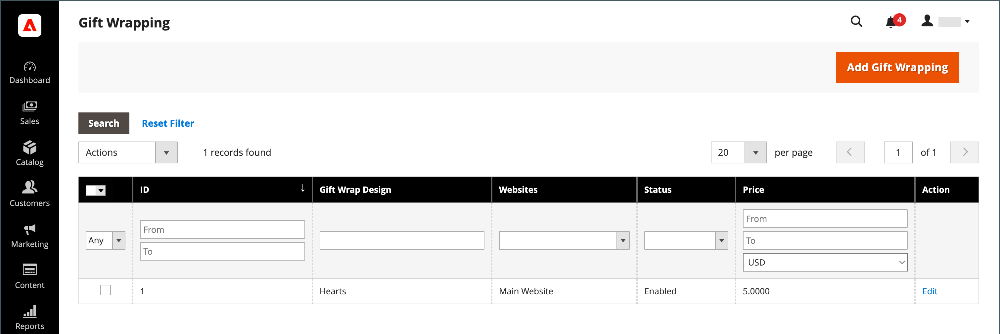

# 購物車設定

購物車設定會決定購物車如何為商店客戶運作，包括何時將客戶重新導向購物車頁面，以及哪些影像用於產品縮圖。 您也可以在結帳程式開始之前，要求訂單達到最小數量、指定報價的保留天數，以及指定中的料號順序。 _訂單總計_ 區段。

[**迷你購物車**](#mini-cart)  — 設定此選項以判斷購物車連結/圖示是否顯示購物車中不同產品（或SKU）的數量，或所有專案的總數量。

[**迷你購物車連結**](#configure-the-cart-link)  — 設定此選項以判斷當客戶按一下商店頁面頂端購物車圖示中的專案數時，迷你購物車是否出現。

[**重新導向到購物車**](#redirect-to-cart) — 設定此選項，以判斷將專案新增至購物車時，購物車頁面是否顯示，或客戶選擇移至頁面時是否顯示。

[**報價期限**](#quote-lifetime)  — 設定此選項以指定價格的有效時間。

[**最小訂單金額**](#minimum-order-amount)  — 設定這些選項，以指定套用折扣後必須符合訂單小計的最小金額，以及購物車中顯示的訊息。

[**最小訂購數量**](#minimum-order-quantity)  — 設定這些選項，以指定下單所需的最小專案數量。

[**購物車縮圖**](#cart-thumbnails)   — 設定購物車縮圖選項，以決定購物車中顯示的分組或可設定產品的縮圖。

[**贈品選項**](#gift-options)  — 設定贈品選項，以判斷客戶是否可以新增贈品訊息或賀卡，以及是否有可用的贈品包裝選項。

>[!NOTE]
>
>如需有關設定出庫程式的資訊，請參閱 [簽出選項](checkout-process.md).

## 迷你購物車

此 _迷你購物車_ 顯示購物車中的專案摘要。 此功能預設為啟用，當您按一下頁面頂端的「購物車」連結時，就會顯示。
連結可以設定為顯示購物車中不同產品（或SKU）的數量，或所有專案的總數量。

{width="700" zoomable="yes"}

>[!NOTE]
>
>針對 _已註冊_ 在客戶中，有時迷你購物車可能不會自動跨多部裝置和瀏覽器同步。 在這種情況下，若要同步Mini Cart，客戶只需開啟 [購物車](cart.md) 該裝置或瀏覽器上的頁面。

### 設定迷你購物車

1. 在 _管理員_ 側欄，前往 **[!UICONTROL Stores]** > _[!UICONTROL Settings]_>**[!UICONTROL Configuration]**.

1. 在左側面板中，展開 **[!UICONTROL Sales]** 並選擇 **[!UICONTROL Checkout]**.

1. 展開  此 _[!UICONTROL Mini Cart]_區段。

   {width="600" zoomable="yes"}

1. 如果設定是針對特定商店檢視， [選擇商店檢視](../configuration-reference/scope-change.md#set-the-scope) 組態適用的位置。

   出現提示時，按一下 **[!UICONTROL OK]** 以繼續。

1. 設定 **[!UICONTROL Display Mini Cart]** 變更為下列其中一項：

   - `Yes`  — 在商店頁面上顯示迷你購物車。 側邊欄的外觀取決於主題。
   - `No`  — 停用商店頁面上迷你購物車的顯示。

1. 如果已啟用顯示，請更新其他選項以設定顯示：

   - 的 **[!UICONTROL Number of Items to Display Scrollbar]**，輸入在卷軸觸發前可顯示在側邊欄中的專案數。
   - 的 **[!UICONTROL Maximum Display Recently Added Item(s)]**，輸入您最近新增要出現在迷你購物車中的專案最大數量。

1. 按一下 **[!UICONTROL Save Config]**.

### 設定購物車連結

1. 在 _管理員_ 側欄，取得 **[!UICONTROL Stores]** > _[!UICONTROL Settings]_>**[!UICONTROL Configuration]**.

1. 在左側面板中，展開 **[!UICONTROL Sales]** 並選擇 **[!UICONTROL Checkout]**.

1. 展開  此 **[!UICONTROL My Cart Link]** 區段。

1. 設定 **[!UICONTROL Display Cart Summary]** 變更為下列其中一項設定：

   - `Display item quantities`  — 此設定會顯示購物車中的產品總數，以及每項產品的數量。
   - `Display number of items in cart`  — 此設定會顯示購物車中的產品專案數，不考慮數量。

   {width="600" zoomable="yes"}

1. 按一下 **[!UICONTROL Save Config]**.

## 重新導向到購物車

可將購物車頁面設定為每當將專案新增至購物車時顯示，或僅在客戶選擇前往頁面時顯示。 有關目前購物車中專案的基本資訊一律可在以下連結中使用： [迷你購物車](#mini-cart). 決定是要平衡讓客戶繼續購物的好處與鼓勵客戶結帳的好處。 這可能是個人喜好的簡單事項。 不過，如果您想使用數字來備份，則可執行A/B測試，以檢視哪一種方法可產生較高的轉換率。

**_若要設定購物車出現的時間：_**

1. 在 _管理員_ 側欄，前往 **[!UICONTROL Stores]** > _[!UICONTROL Settings]_>**[!UICONTROL Configuration]**.

1. 在左側面板中，展開 **[!UICONTROL Sales]** 並選擇 **[!UICONTROL Checkout]**.

1. 展開  此 **[!UICONTROL Shopping Cart]** 區段。

   {width="600" zoomable="yes"}

1. 如果設定是針對特定商店檢視， [選擇商店檢視](../configuration-reference/scope-change.md#set-the-scope) 組態適用的位置。

   出現提示時，按一下 **[!UICONTROL OK]** 以繼續。

1. 設定 **[!UICONTROL After Adding a Product Redirect to Shopping Cart]** 變更為下列其中一項：

   - `Yes`  — 將產品加入購物車後，立即顯示購物車頁面。
   - `No`  — 將產品新增到購物車後，停用重新導向至購物車。

1. 按一下 **[!UICONTROL Save Config]**.

## 報價期限

針對Adobe Commerce安裝及啟用B2B後，您就可以新增對 _引號_ 功能。 此功能可讓授權採購員透過從購物車提交請求來啟動價格議價處理。 此 _引號_ grid會列出收到的每一份報價，並維護買賣雙方之間的通訊記錄。 如需有關B2B功能的詳細資訊，請參閱 [交涉報價](../b2b/quotes.md) 在 _Adobe Commerce適用的B2B使用指南_.

您可以在設定中設定購物車報價期限，藉此判斷價格的有效時間。 例如，如果購物者在幾天後離開購物車而無人看管，則某些商品的報價可能不再相同。 報價期限預設為30天。

**_設定報價期限：_**

1. 在 _管理員_ 側欄，前往 **[!UICONTROL Stores]** > _[!UICONTROL Settings]_>**[!UICONTROL Configuration]**.

1. 在左側面板中，展開 **[!UICONTROL Sales]** 並選擇 **[!UICONTROL Checkout]**.

1. 展開  此 **[!UICONTROL Shopping Cart]** 區段。

   {width="600" zoomable="yes"}

1. 如果設定是針對特定商店檢視， [選擇商店檢視](../configuration-reference/scope-change.md#set-the-scope) 組態適用的位置。

   出現提示時，按一下 **[!UICONTROL OK]** 以繼續。

1. 的 **[!UICONTROL Quote Lifetime (days)]**，輸入報價保持有效的天數。

1. 按一下 **[!UICONTROL Save Config]**.

## 最小訂單金額

此組態可讓您指定套用折扣後的最小金額，訂單小計必須符合此金額。 送貨至多個地址的訂單必須符合每個地址的最低訂單金額。 只有在達到最小訂購量後，「結帳」按鈕才可用。

{width="700" zoomable="yes"}

**_若要設定最小訂單金額，請執行下列步驟：_**

1. 在 _管理員_ 側欄，前往 **[!UICONTROL Stores]** > _[!UICONTROL Settings]_>**[!UICONTROL Configuration]**.

1. 在左側面板中，展開 **[!UICONTROL Sales]** 並選擇 **[!UICONTROL Sales]** 底下。

1. 展開  此 **[!UICONTROL Minimum Order Amount]** 區段。

   {width="600" zoomable="yes"}

1. 若要要求最小訂單金額，請設定 **[!UICONTROL Enable]** 至 `Yes`.

1. 如果已啟用最小訂單，請設定下列選項以設定需求：

   - 輸入 **[!UICONTROL Minimum Amount]** 套用折扣後，小計所需的金額。

   - 設定 **[!UICONTROL Include Discount Amount]** 變更為下列其中一項：

      - `Yes`  — 要求小計符合包含任何折扣的最小金額。 以$50為最小值的範例來說，如果購物車包含$60的上方並套用25%的折扣，則結果小計為$45，且購物車不符合最小值。
      - `No`  — 要求小計符合不含任何折扣的最小金額。

   - 設定 **[!UICONTROL Include Tax to Amount]** 變更為下列其中一項：

      - `Yes`  — 小計必須符合包含稅捐的最小金額。
      - `No`  — 需要小計以符合不含稅的最小金額。

1. 選擇性地自訂最低訂單金額訊息設定：

   - 的 **[!UICONTROL Description Message]**，輸入當您想要使用的文字，以自訂小計不符合最小數量時，顯示在購物車頂端的訊息。

   - 的 **[!UICONTROL Error to Show in Shopping Cart]**，輸入您要用來自訂購物車錯誤訊息的文字。

   將訊息說明欄位保留空白可使用預設訊息。

1. 如有需要，請設定多重地址訂單的最小訂單金額設定：

   - 若要要求多重地址訂單中的每個地址均符合最小訂單金額，請設定 **[!UICONTROL Validate Each Address Separately in Multi-address Checkout]** 至 `Yes`.

   - 選擇性地自訂最低訂單金額訊息設定：

      - **[!UICONTROL Multi-address Description Message]**  — 針對不符合下限的多重地址訂單，輸入您要用來自訂購物車頂端所顯示訊息的文字。

      - **[!UICONTROL Multi-address Error to Show in Shopping Cart]**  — 針對不符合最小值的多重地址訂單，輸入您要用來自訂購物車錯誤訊息的文字，在方塊中輸入文字。

     將訊息說明欄位保留空白可使用預設訊息。

1. 按一下 **[!UICONTROL Save Config]**.

## 最小訂購數量

您可以設定訂單允許的最小數量。 也可以根據每個客戶群組來設定最小數量。

1. 前往 **[!UICONTROL Stores]** > _[!UICONTROL Settings]_>**[!UICONTROL Configuration]**.

1. 在左側面板中，展開 **[!UICONTROL Catalog]** 並選擇 **[!UICONTROL Inventory]**.

1. 展開  此 **[!UICONTROL Product Stock Options]** 區段。

   {width="600" zoomable="yes"}

1. 的 **[!UICONTROL Minimum Qty Allowed in Shopping Cart]**，設定訂單產品的最小數量。

   如有需要，請清除 **[!UICONTROL Use system value]** 核取方塊以修改這些設定。

   - 變更 **[!UICONTROL Customer Group]** 設定至特定群組，然後輸入 **[!UICONTROL Minimum Qty]** 代表該群組。 若要新增其他群組和數量限制，請按一下 **[!UICONTROL Add Minimum Qty]**.

   - 若要為所有客戶設定相同的最低數量限制，請保留 `ALL GROUPS` 並輸入 **[!UICONTROL Minimum Qty]**.

1. 按一下 **[!UICONTROL Save Config]**.

   {width="700" zoomable="yes"}

## 購物車縮圖

 (僅限Adobe Commerce)

購物車中顯示的縮圖影像可讓客戶快速瞭解他們即將購買的專案。 不過，若為具有多個選項的產品，影像可能不會符合購物車中產品的變化。 如果客戶購買特定顏色的專案，理想情況下，購物車中的縮圖應該相符。

群組和可設定產品的縮圖影像都可以設定為顯示「上層」產品或產品變數的影像。

{width="700" zoomable="yes"}

**_若要設定購物車縮圖：_**

1. 在 _管理員_ 側欄，前往 **[!UICONTROL Stores]** > _[!UICONTROL Settings]_>**[!UICONTROL Configuration]**.

1. 在左側面板中，展開 **[!UICONTROL Sales]** 並選擇 **[!UICONTROL Checkout]**.

1. 展開  此 **[!UICONTROL Shopping Cart]** 區段。

   {width="600" zoomable="yes"}

1. 設定 **[!UICONTROL Grouped Product Image]** 以決定購物車中使用的縮圖 [分組的產品](../catalog/product-create-grouped.md)：

   - `Product Thumbnail Itself`  — 使用指派給加入購物車之產品變數的縮圖。
   - `Parent Product Thumbnail`  — 使用指派給上層產品的縮圖。

1. 設定 **[!UICONTROL Configurable Product Image]** 以決定購物車中使用的縮圖 [可設定的產品](../catalog/product-create-configurable.md)：

   - `Product Thumbnail Itself`  — 使用指派給加入購物車之產品變數的縮圖。
   - `Parent Product Thumbnail`  — 使用指派給上層產品的縮圖。

1. 按一下 **[!UICONTROL Save Config]**.

## 贈品選項

在結帳程式開始之前，購物車中會顯示可用的贈品選項選項。 贈品選項設定會決定客戶是否可以新增贈品訊息或賀卡，以及是否提供贈品包裝選項。 訂單中的每個專案都可以有個別的訊息和贈品包裝。 沖銷整張訂單時，客戶也可以新增禮品收據與賀卡。

{width="700" zoomable="yes"}

「贈品選項」設定會套用至整個網站，但可在產品層級覆寫。

### 啟用贈品選項

1. 在 _管理員_ 側欄，前往 **[!UICONTROL Stores]** > _[!UICONTROL Settings]_>**[!UICONTROL Configuration]**.

1. 在左側面板中，展開 **[!UICONTROL Sales]** 並選擇 **[!UICONTROL Sales]** 底下。

1. 展開  **[!UICONTROL Gift Options]** 在頁面上。

   {width="600" zoomable="yes"}

1. 根據您的偏好設定贈品訊息選項：

   - 的 **[!UICONTROL Allow Gift Messages on Order Level]**，選取 `Yes` 啟用整個訂單的單一禮品訊息。
   - 的 **[!UICONTROL Allow Gift Messages for Order Items]**，選取 `Yes` 啟用為客戶購物車中的個別專案新增個別的禮品訊息。

1.  (僅限Adobe Commerce)根據您的偏好設定贈品包裝選項：

   - 的 **[!UICONTROL Allow Gift Wrapping on Order Level]**，選取 `Yes` 啟用整個訂單的單一贈品包裝。
   - 的 **[!UICONTROL Allow Gift Wrapping for Order Items]**，選取 `Yes` 啟用向客戶購物車中的每個專案個別新增贈品包裝。

   您也可以定義不同的 [贈品包裝設計](#gift-wrap) 以便客戶選擇包裝。

1.  (僅限Adobe Commerce)若要提供客戶包含禮品收據的選項，請設定 **[!UICONTROL Allow Gift Receipt]** 至 `Yes`.

1.  (僅適用於Adobe Commerce)為客戶提供包含列印卡片的選項，請設定 **[!UICONTROL Allow Printed Card]** 至 `Yes`.

1.  (僅限Adobe Commerce)輸入 **[!UICONTROL Default Price for Printed Card]**.

1. 按一下 **[!UICONTROL Save Config]**.

### 禮物包裝

 (僅限Adobe Commerce)

贈品包裝適用於任何可出貨的產品，也可用於個別專案或整個訂單。 您可以針對每個禮品包裝設計收取個別價格，並為每個出現在購物車中作為產品選項的設計上傳縮圖影像。 當客戶按一下禮品包裝縮圖時，會出現全尺寸影像。 在結帳檢閱期間，禮品包裝費用會與其他費用一起顯示 [結帳總計](checkout-totals-sort-order.md) 在 _訂單摘要_ 區段。

禮品包裝影像應是顯示重複模式的色票，也可以包含要使用的色帶範例。 您可以掃描紙張，或拍攝包裹的像片。 上傳的影像可以是GIF、JPG或PNG影像，且應為正方形。 在以下範例中，上傳的禮品包裝影像為230 x 230畫素。

{width="700" zoomable="yes"}

#### 新增禮品包裝設計

1. 在 _管理員_ 側欄，前往 **[!UICONTROL Stores]** > _[!UICONTROL Other Settings]_>**[!UICONTROL Gift Wrapping]**.

   {width="700" zoomable="yes"}

1. 在右上角，按一下 **[!UICONTROL Add Gift Wrapping]**.

1. 輸入的名稱 **[!UICONTROL Gift Wrapping Design]** 以於結帳時顯示。

   如有需要，您可以變更 **[!UICONTROL Scope]** 並為每個商店檢視設定不同的名稱。

1. 選取 **[!UICONTROL Websites]** 提供禮品包裝設計的位置。

1. 設定 **[!UICONTROL Status]** 至 `Enabled`.

   如果您有季節性環繞選項，可將其設為 `Disabled` 不想讓選項可用時。

1. 輸入 **[!UICONTROL Price]** 贈品包裝設計的標籤。

   此設定可由產品層次的禮品包裝價格集覆寫。

   {width="600" zoomable="yes"}

1. 若要上傳縮圖 **[!UICONTROL Image]** 在贈品包裝中，按一下 **[!UICONTROL Choose File]** 並從您的目錄中選取要上傳的檔案。

   影像縮圖會出現在 _[!UICONTROL Gift Wrapping Information]_在儲存記錄之後。

1. 按一下 **[!UICONTROL Save]**.

#### 編輯禮品包裝設計

1. 在 _管理員_ 側欄，前往 **[!UICONTROL Stores]** > _[!UICONTROL Other Settings]_>**[!UICONTROL Gift Wrapping]**.

1. 在清單中尋找禮品包裝記錄。

1. 在 _動作_ 欄，按一下 **[!UICONTROL Edit]**.

   {width="600" zoomable="yes"}

1. 進行必要的變更。

1. 按一下 **[!UICONTROL Save]**.

#### 刪除禮品包裝設計

使用 _贈品包裝_ 格點開啟，使用下列方法之一來刪除環繞設計。

**_方法1：刪除單一禮品包裝設計_**

1. 在編輯模式中開啟贈品包裝設計。

1. 在工作區頂端，按一下 **[!UICONTROL Delete]**.

1. 出現提示時，按一下 **[!UICONTROL OK]** 以確認。

**_方法2：刪除多個禮品包裝設計_**

1. 在 _贈品包裝_ 格線中，選取您要刪除之每個禮品包裝設計的核取方塊。

1. 設定 **[!UICONTROL Actions]** 控制項至 `Delete`.

1. 按一下 **[!UICONTROL Submit]**.

### 贈品選項稅捐

 (僅限Adobe Commerce)

禮品包裝和列印的禮品卡價格可以設定為含稅或免稅，或者同時顯示兩個選項。 您也可以在全域或網站層次，指定這些專案的稅捐類別。

**_若要設定贈品選項稅捐，請執行下列步驟：_**

1. 在 _管理員_ 側欄，前往 **[!UICONTROL Stores]** > _[!UICONTROL Settings]_>**[!UICONTROL Configuration]**.

1. 在左側面板中，展開 **[!UICONTROL Sales]** 並選擇 **[!UICONTROL Tax]**.

1. 展開  此 **[!UICONTROL Tax Classes]** 區段。

   {width="600" zoomable="yes"}

1. 設定 **[!UICONTROL Tax Class for Gift Options]** 至適用稅捐類別。

1. 展開  此 **[!UICONTROL Orders, Invoices, Credit Memos Display Settings]** 區段。

   {width="600" zoomable="yes"}

1. 設定 **[!UICONTROL Display Gift Wrapping Prices]** 變更為下列其中一項：

   - `Excluding Tax`
   - `Including Tax`
   - `Including and Excluding Tax`

1. 設定 **[!UICONTROL Display Printed Card Prices]** 變更為下列其中一項：

   - `Excluding Tax`
   - `Including Tax`
   - `Including and Excluding Tax`

1. 按一下 **[!UICONTROL Save Config]**.
