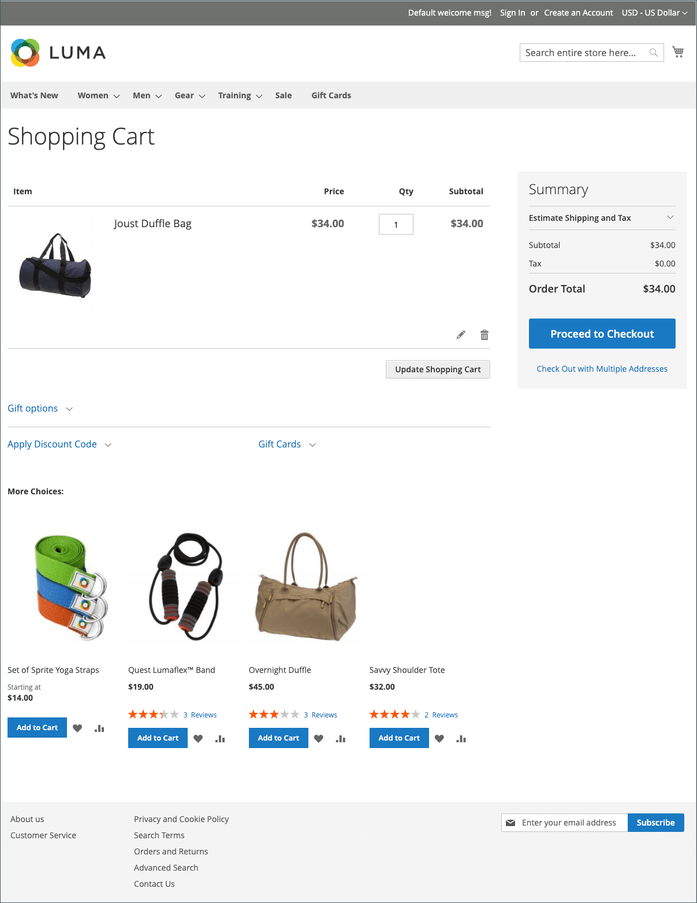

# 購物車

購物車位於購買路徑的結尾，位於&#x200B;_購買_&#x200B;和&#x200B;_放棄_&#x200B;的交集，是您商店中最重要的頁面之一。 購物車是計算訂單總計、折扣券以及預估運費和稅金的位置。 這是展示您信任徽章和印章的絕佳地方，也是提供最後一個專案的理想機會。 只要有特定專案出現在購物車中，您就可以選擇要提供作為交叉銷售衝動購買的專案。

{width="700" zoomable="yes"}產品的工具

- 設定[購物車選項](cart-configuration.md)以決定購物者可以使用哪些工具，並修改顯示畫面。
- 設定[購物車持續性](cart-persistent.md)行為，協助購物者保留購物車的內容。
- 新增[Order by SKU](order-by-sku.md) Widget以方便所有購物者，或僅限特定客戶群組中的購物者，直接在頁面中輸入SKU和數量資訊。
