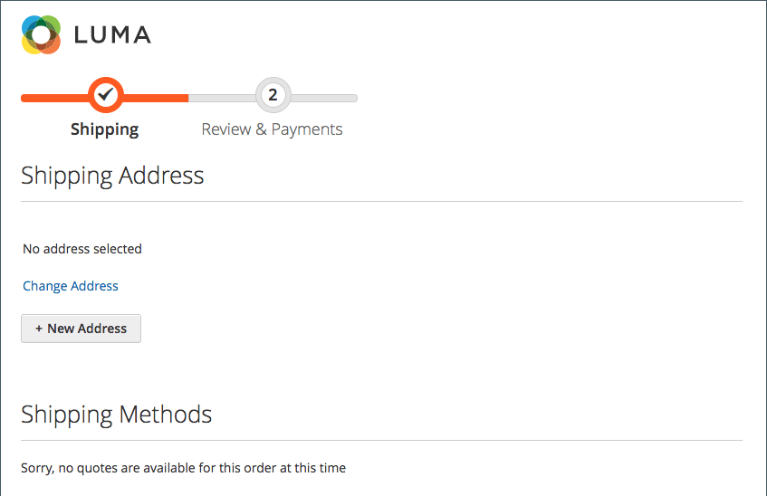

# 結帳時的地址搜尋

{{ee-feature}}

您的客戶在通訊錄中可能有許多已儲存的地址和資訊，尤其是定期回頭的客戶或輸入多個訂單和出貨地點的公司。 顯示許多位址可能會大幅減慢結帳載入與程式的速度，並導致購物體驗不佳。 為協助提高結帳的回應速度，建議您啟用並設定網站的位址搜尋。

>[!NOTE]
>
>預設不會啟用地址搜尋。 您可以設定此功能以包含您網站上的功能。

當啟用此功能且客戶的儲存地址數量符合或超過設定的限制時， _送貨_ 和 _稽核與付款_ 步驟僅顯示一個地址（預設）。 客戶可以按一下「 」，變更選取的地址 **變更地址** 然後依城市、州/省、街道或郵遞區號搜尋正確的地址。 此功能也支援贈品註冊結帳的地址選擇。

{width="700" zoomable="yes"}

如果客戶沒有預設送貨地址，則 _送貨_ 頁面顯示 _未選取任何地址_. 在此情況下，客戶必須按一下 **變更地址** 以選取已儲存的地址，或按一下 **新地址** 以新增並選取位址，然後再繼續結帳。 如果客戶沒有預設帳單地址，則 _稽核與付款_ 頁面會顯示為運送所選取的地址，以及 _變更地址_ 選項。

{width="600" zoomable="yes"}

## 引號的鎖定位址搜尋

 (僅適用於Adobe Commerce B2B)

啟用地址搜尋也會影響從報價建立的訂單結帳，其中客戶的儲存地址數目符合或超過設定的限制。 當報價單完成且客戶進行結帳時，只會顯示選取的送貨地址。 此頁面也會顯示訊息，指出送貨地址已鎖定，且只能在報價單中變更。

{width="600" zoomable="yes"}

## 啟用地址搜尋

1. 在 _管理員_ 側欄，前往 **[!UICONTROL Stores]** > _[!UICONTROL Settings]_>**[!UICONTROL Configuration]**.

1. 在左側面板中，展開 **[!UICONTROL Sales]** 並選擇 **[!UICONTROL Checkout]**.

1. 展開  此 **[!UICONTROL Checkout Options]** 區段。

   {width="700" zoomable="yes"}

   如需這些組態設定的詳細說明，請參閱 [簽出選項](../configuration-reference/sales/checkout.md#checkout-options) 在 _設定參考指南_.

1. 設定 **[!UICONTROL Enable Address Search]** 至 `Yes`.

1. 若要指定包含位址搜尋功能的臨界值，請設定 **[!UICONTROL Number of Customer Addresses Limit]** 選項。

   如有必要，請清除 **[!UICONTROL Use system value]** 核取方塊來進行此變更。

   當客戶的儲存地址數目達到或超過此限制時，頁面會顯示預設地址（如果客戶有預設地址）或 _未選取任何地址_ 使用 _變更地址_ 選項。 預設限製為 `10`.

1. 按一下 **[!UICONTROL Save Config]**.
