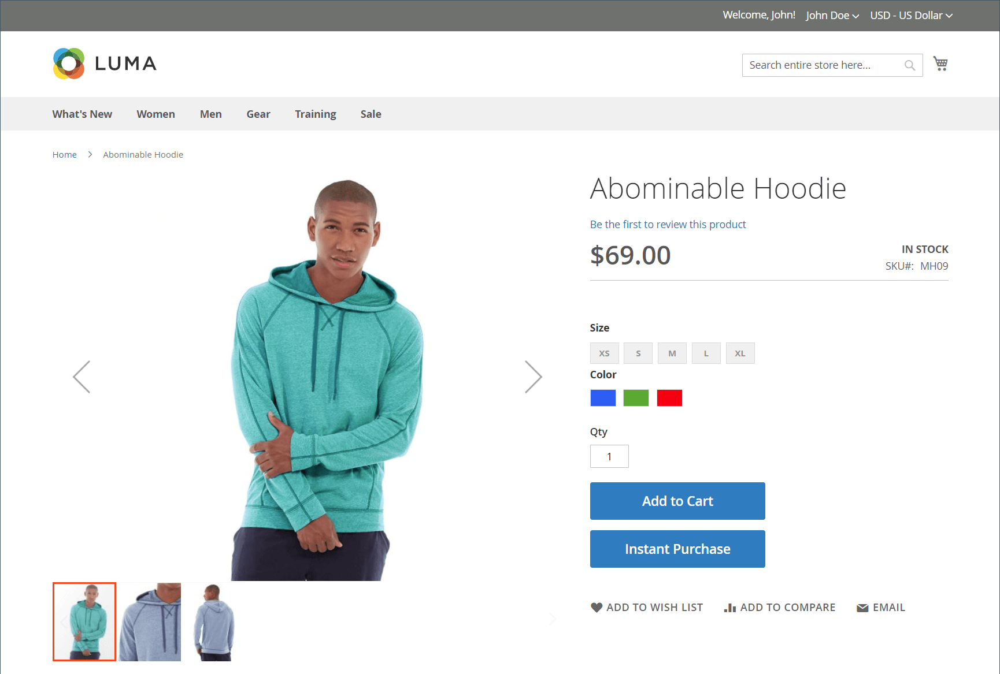

# 立即購買

_立即購買_ 可讓客戶使用儲存在其帳戶中的資訊，加速結帳程式。 啟用時， _立即購買_ 按鈕會出現在 _加入購物車_ 「產品」頁面上的按鈕，供符合需求的客戶使用。

{width="700" zoomable="yes"}

## 客戶需求

- 客戶為 [已登入](../customers/customer-sign-in.md) 至其帳戶。

- 客戶帳戶具有 [預設帳單和送貨地址](../customers/account-dashboard-address-book.md).

- 至少一個 [送貨方法](delivery.md) 適用於預設送貨地址中指定的國家/地區。

- 客戶帳戶具有 [已儲存付款](../stores-purchase/stored-payment-methods.md) 已啟用儲存庫的方法。

  下列付款方式可用於提供對已儲存信用卡資訊的安全存取：

   - [Braintree信用卡](braintree.md) (如果啟用3D Secure，即時購買功能無法與Braintree信用卡搭配使用。)
   - [已啟用PayPal的Braintree](braintree.md)
   - [PayPal Payflow Pro](paypal-payflow-pro.md)

## 在店面立即購買

1. 在店面，客戶前往要購買專案的產品頁面。

1. 選取所需選項並按一下 **[!UICONTROL Instant Purchase]**.

   {width="500" zoomable="yes"}

1. 檢閱 **[!UICONTROL Instant Purchase Confirmation]** 資訊與點按 **[!UICONTROL OK]** 以完成交易。

   產品頁面頂端會顯示確認訊息和訂單編號。

## 設定立即購買

### 步驟1：開啟設定頁面

1. 在 _管理員_ 側欄，前往 **[!UICONTROL Stores]** > _[!UICONTROL Settings]_>**[!UICONTROL Configuration]**.

### 步驟2：設定付款方式儲存庫

您可以搭配Adobe Commerce和Magento Open Source的Braintree或付款服務使用立即購買。 必須啟用儲存庫，購物者才能使用「立即購買」功能。

瞭解如何設定付款方式並啟用Braintree或付款服務的儲存庫：

- [Braintree](braintree.md)
- [付款服務檔案](https://experienceleague.adobe.com/docs/commerce-merchant-services/payment-services/guide-overview.html)

### 步驟3：啟用立即購買

1. 在左側面板中的 _[!UICONTROL Sales]_區段，選擇&#x200B;**[!UICONTROL Sales]**.

1. 展開  此 **[!UICONTROL Instant Purchase]** 區段。

1. 如果這項變更是針對特定商店檢視， [選擇商店檢視](../configuration-reference/scope-change.md#set-the-scope) 組態適用的位置。

   出現提示時，按一下 **[!UICONTROL OK]** 以繼續。

1. 設定 **[!UICONTROL Enabled]** 至 `Yes`.

1. 輸入 **[!UICONTROL Button Text]** 要顯示在按鈕上的資訊。

   可針對每個商店檢視變更按鈕文字，或變更語言。 依預設，按鈕文字為 `Instant Purchase`.

   {width="600" zoomable="yes"}

   如需這些組態設定的詳細說明，請參閱 [立即購買](../configuration-reference/sales/sales.md#instant-purchase) 在 _設定參考指南_.

1. 按一下 **[!UICONTROL Save Config]**.

1. 提示更新快取時，按一下 **[!UICONTROL Cache Management]** 並依照指示清除快取。
