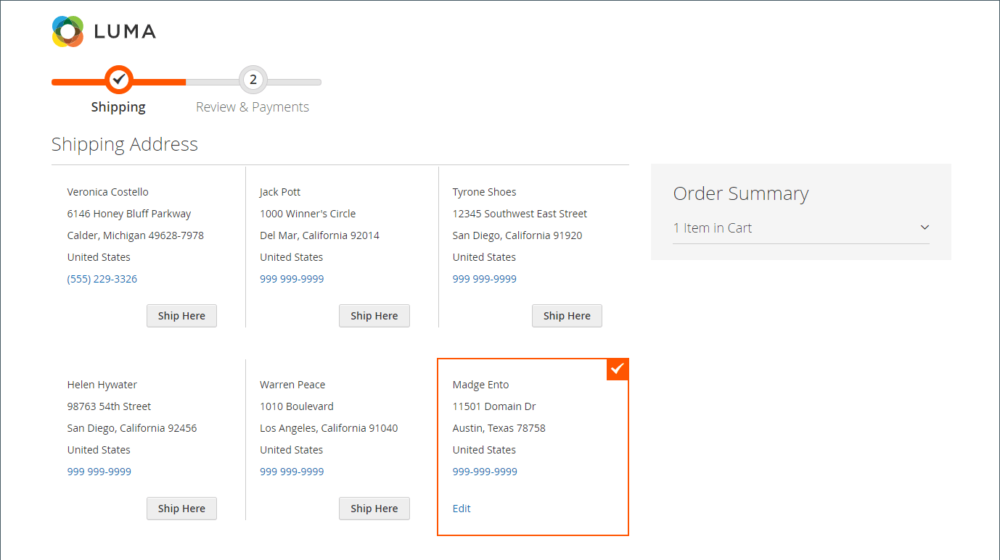
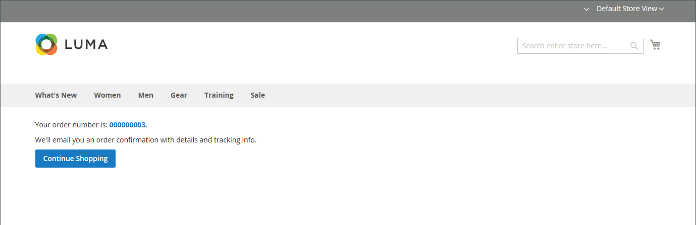

# 結帳程式與選項

當結帳程式開始時，交易會轉移到安全的加密通道。 瀏覽器位址列中出現掛鎖符號，且URL從`http`變更為`https`。

## 程式

結帳程式的目標是收集完成交易所需的資訊。 _結帳_&#x200B;頁面會引導客戶完成程式的每個步驟。 已登入帳戶的客戶可以快速完成結帳，因為許多資訊已存在於其帳戶中。 與使用採購單的公司帳戶相關聯的客戶工作流程稍有不同。

### 送貨

結帳程式的第一個步驟是讓客戶完成送貨地址資訊，並選擇送貨方式。 如果客戶有帳戶，則系統會自動輸入送貨地址，但如有需要，也可以進行變更。

 (僅限Adobe Commerce)收件者和寄件者的街道地址格式由[客戶地址屬性](../customers/address-attributes.md)的屬性決定。 輸入驗證設定會決定可用於送貨地址的有效字元。

頁面頂端的進度列會依循結帳程式的每個步驟，而「訂單摘要」會顯示目前為止所輸入的資訊。

結帳程式期間的{width="600" zoomable="yes"}

#### 送貨至其他地址

1. 如果通訊錄中有其他專案，客戶會尋找要送出訂單的地址。

1. 若要選取地址，請按一下&#x200B;**[!UICONTROL Ship Here]**。

#### 新增地址

1. 在&#x200B;_[!UICONTROL Shipping Address]_區段底部，客戶按一下&#x200B;**[!UICONTROL + New Address]**。

1. 完成&#x200B;_[!UICONTROL Shipping Address]_表單。

   依預設，客戶的名字和姓氏最初會顯示在表單中。

   {width="600" zoomable="yes"}

1. 若要將新地址儲存在通訊錄中，客戶會選取表單底部的核取方塊。

1. 按一下&#x200B;**[!UICONTROL Save Address]**。

   新地址現在被選為送貨地址。

   {width="600" zoomable="yes"}

#### 選擇送貨方法

1. 在[送貨](delivery.md)方法的清單中，客戶選擇想要使用的選項。

   {width="600" zoomable="yes"}

1. 按一下&#x200B;**[!UICONTROL Next]**&#x200B;以繼續。

### 複查與付款 — 一般訂單

在結帳程式的第二個步驟中，客戶選擇[付款方式](payments.md)，並將任何含促銷代碼的優惠券套用至購買。 您可以檢閱所有資訊，並視需要加以編輯。 如果啟用，客戶必須在下訂單前同意銷售條款與條件。

>[!NOTE]
>
>雖然Commerce可設定多個優惠券代碼，但客戶只能將一個優惠券代碼套用至購物車。 （如需詳細資訊，請參閱[優惠券代碼](../merchandising-promotions/price-rules-cart-coupon.md)。）

{width="700" zoomable="yes"}

### 複查與付款 — 採購單

 (僅適用於Adobe Commerce B2B)

當客戶與已啟用[採購單](../b2b/purchase-order-flow.md)的公司相關聯時，所有訂單都會以採購單處理。 可用的付款方式取決於公司帳戶設定。

1. 客戶選取付款方式。

   使用&#x200B;_帳戶付款_&#x200B;方法時，[!UICONTROL Custom Reference Number]欄位可用來參考發票號碼。

1. 客戶按一下&#x200B;**[!UICONTROL Place Purchase Order]**。

   已下採購單。

如果公司已設定[核准規則](../b2b/account-dashboard-approval-rules.md)，則採購單會通過核准程式。 否則，會立即處理。

{width="700" zoomable="yes"}

### 訂單摘要中顯示的專案數

管理員使用者可以在結帳時變更訂單摘要中顯示的專案數量上限，以精簡顯示並減少產品數量。 預設情況下，此值設定為10。

{width="700" zoomable="yes"}

1. 在&#x200B;_管理員_&#x200B;側邊欄上，移至&#x200B;**[!UICONTROL Stores]** > _[!UICONTROL Settings]_>**[!UICONTROL Configuration]**。

1. 在左側面板中，展開&#x200B;**[!UICONTROL Sales]**&#x200B;並選擇&#x200B;**[!UICONTROL Checkout]**。

1. 展開&#x200B;**[!UICONTROL Checkout Options]**&#x200B;區段的。

1. 針對&#x200B;**[!UICONTROL Maximum Number of Items to Display in Order Summary]**，輸入要顯示的專案數目上限。

1. 按一下&#x200B;**[!UICONTROL Save Config]**。

   透過此更新，結帳時顯示的訂單摘要會限製為指定的料號數量。

### 訂單確認

訂購確認會在下單後顯示。 針對已註冊客戶，此頁面包含訂單編號，其中包含客戶帳戶的連結，以及產生收款的連結。 註冊客戶會收到通知，要求透過電子郵件取得訂單確認和追蹤資訊。 建議來賓建立帳戶以追蹤訂單。 註冊客戶可按一下連結來產生收據。

訂單確認頁面也稱為&#x200B;_Success_&#x200B;頁面，可供Analytics程式用來追蹤轉換。

{width="700" zoomable="yes"}

## 簽出選項

出庫選項可控制出庫頁面的各種屬性，包括版面。 您可以設定選項來限制籤出，包括允許來賓簽出，以及強制執行條款與條件協定。 在結帳過程中也有控制資訊顯示的選項。

{width="700" zoomable="yes"}

如需這些組態設定的詳細說明，請參閱&#x200B;_組態參考指南_&#x200B;中的[簽出選項](../configuration-reference/sales/checkout.md#checkout-options)。

### 變更籤出選項

1. 在&#x200B;_管理員_&#x200B;側邊欄上，移至&#x200B;**[!UICONTROL Stores]** > _[!UICONTROL Settings]_>**[!UICONTROL Configuration]**。
1. 在左側面板上，展開&#x200B;**[!UICONTROL Sales]**&#x200B;並選擇&#x200B;**[!UICONTROL Checkout]**。
1. 設定下列任何您需要的選項。
1. 按一下&#x200B;**[!UICONTROL Save Config]**。

1. 展開&#x200B;**[!UICONTROL Checkout Options]**&#x200B;區段的。

1. 如果設定是針對特定商店檢視，請[選擇組態套用的商店檢視](../configuration-reference/scope-change.md#set-the-scope)。

   出現提示時，按一下&#x200B;**[!UICONTROL OK]**&#x200B;以繼續。

1. 設定出庫選項。

1. 按一下&#x200B;**[!UICONTROL Save Config]**。

### 可用的簽出選項

| 欄位 | [領域](../getting-started/websites-stores-views.md#scope-settings) | 說明 |
|--- |--- |--- |
| [!UICONTROL Enable Onepage Checkout] | 存放區檢視 | 決定[單頁簽出](checkout-one-page.md)是否為預設簽出格式。 選項：是/否 |
| [!UICONTROL Allow Guest Checkout] | 存放區檢視 | 決定來賓是否可以在未註冊商店帳戶的情況下進行[簽出](checkout-guest.md)。 選項： `Yes` / `No` |
| [!UICONTROL Enable Terms and Conditions] | 存放區檢視 | 決定是否要求客戶在購買前同意銷售的[條款及條件](terms-and-conditions.md)。 選項： `Yes` / `No` |
| [!UICONTROL Display Billing Address On] | 存放區檢視 | 決定結帳時帳單地址的位置。 選項： `Payment Method` / `Payment Page` |
| [!UICONTROL Maximum Number of Items to Display in Order Summary] | 存放區檢視 | 決定結帳時可顯示在「訂單摘要」中的專案最大數量。 預設值為`10`。 |
| [!UICONTROL Enable Address Search] | 網站 |  (僅限Adobe Commerce)判斷客戶是否可以使用[地址搜尋](checkout-address-search.md)功能進行&#x200B;_送貨_，以及&#x200B;_檢閱與付款_&#x200B;步驟。 啟用此功能時，請使用&#x200B;_[!UICONTROL Number of Customer Addresses Limit]_設定在結帳期間啟用此功能所需的儲存位址數目。 選項： `Yes` / `No` |
| [!UICONTROL Number of Customer Addresses Limit] | 網站 |  (僅限Adobe Commerce)當地址搜尋為&#x200B;**[!UICONTROL Enabled]**&#x200B;時，會決定結帳期間啟用此功能所需的儲存地址數量。 當客戶的儲存地址數目符合或超過此數目時，僅會在&#x200B;_送貨_&#x200B;和&#x200B;_檢閱與付款_&#x200B;步驟中轉譯預設地址。 客戶可使用搜尋功能來變更選取的地址。 預設值為10。 |

{style="table-layout:auto"}
