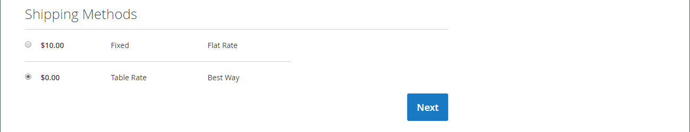

# 結帳程式與選項

當結帳程式開始時，交易會轉移到安全的加密通道。 掛鎖符號會顯示在瀏覽器的位址列中，且URL會從 `http` 至 `https`.

## 程式

結帳程式的目標是收集完成交易所需的資訊。 此 _簽出_ 頁面會引導客戶完成流程的每個步驟。 已登入帳戶的客戶可以快速完成結帳，因為許多資訊已存在於其帳戶中。 與使用採購單的公司帳戶相關聯的客戶工作流程稍有不同。

### 送貨

結帳程式的第一個步驟是讓客戶完成送貨地址資訊，並選擇送貨方式。 如果客戶有帳戶，則系統會自動輸入送貨地址，但如有需要，也可以進行變更。

 (僅限Adobe Commerce)收件者和寄件者的街道地址格式由 [客戶地址屬性](../customers/address-attributes.md). 輸入驗證設定會決定可用於送貨地址的有效字元。

頁面頂端的進度列會依循結帳程式的每個步驟，而「訂單摘要」會顯示目前為止所輸入的資訊。

{width="600" zoomable="yes"}

#### 送貨至其他地址

1. 如果通訊錄中有其他專案，客戶會尋找要送出訂單的地址。

1. 若要選取地址，請按一下 **[!UICONTROL Ship Here]**.

#### 新增地址

1. 在底部 _[!UICONTROL Shipping Address]_區段，客戶點按&#x200B;**[!UICONTROL + New Address]**.

1. 完成 _[!UICONTROL Shipping Address]_表單。

   依預設，客戶的名字和姓氏最初會顯示在表單中。

   {width="600" zoomable="yes"}

1. 若要將新地址儲存在通訊錄中，客戶會選取表單底部的核取方塊。

1. 點按次數 **[!UICONTROL Save Address]**.

   新地址現在被選為送貨地址。

   {width="600" zoomable="yes"}

#### 選擇送貨方法

1. 在清單中 [送貨](delivery.md) 方法，客戶會選擇想要使用的選項。

   {width="600" zoomable="yes"}

1. 點按次數 **[!UICONTROL Next]** 以繼續。

### 複查與付款 — 一般訂單

在結帳程式的第二個步驟中，客戶選擇 [付款方法](payments.md)，並將任何含促銷代碼的優惠券套用至購買。 您可以檢閱所有資訊，並視需要加以編輯。 如果啟用，客戶必須在下訂單前同意銷售條款與條件。

>[!NOTE]
>
>雖然Commerce可設定多個優惠券代碼，但客戶只能將一個優惠券代碼套用至購物車。 (請參閱 [抵用券代碼](../merchandising-promotions/price-rules-cart-coupon.md) 以取得詳細資訊。)

{width="700" zoomable="yes"}

### 複查與付款 — 採購單

 (僅適用於Adobe Commerce B2B)

當客戶與已啟用的公司相關聯時 [採購單](../b2b/purchase-order-flow.md)，則所有訂單都會以採購單處理。 可用的付款方式取決於公司帳戶設定。

1. 客戶選取付款方式。

   使用時 _分期付款_ 方法， [!UICONTROL Custom Reference Number] 欄位可用於參考商業發票號碼。

1. 客戶點按 **[!UICONTROL Place Purchase Order]**.

   已下採購單。

如果公司已設定 [核准規則](../b2b/account-dashboard-approval-rules.md)，則採購單會通過核准流程。 否則，會立即處理。

{width="700" zoomable="yes"}

### 訂單摘要中顯示的專案數

管理員使用者可以在結帳時變更訂單摘要中顯示的專案數量上限，以精簡顯示並減少產品數量。 預設情況下，此值設定為10。

{width="700" zoomable="yes"}

1. 在 _管理員_ 側欄，前往 **[!UICONTROL Stores]** > _[!UICONTROL Settings]_>**[!UICONTROL Configuration]**.

1. 在左側面板中，展開 **[!UICONTROL Sales]** 並選擇 **[!UICONTROL Checkout]**.

1. 展開  此 **[!UICONTROL Checkout Options]** 區段。

1. 的 **[!UICONTROL Maximum Number of Items to Display in Order Summary]**，輸入要顯示的最大專案數。

1. 按一下 **[!UICONTROL Save Config]**.

   透過此更新，結帳時顯示的訂單摘要會限製為指定的料號數量。

### 訂單確認

訂購確認會在下單後顯示。 針對已註冊客戶，此頁面包含訂單編號，其中包含客戶帳戶的連結，以及產生收款的連結。 註冊客戶會收到通知，要求透過電子郵件取得訂單確認和追蹤資訊。 建議來賓建立帳戶以追蹤訂單。 註冊客戶可按一下連結來產生收據。

訂單確認頁面也稱為 _成功_ 頁面，並由Analytics程式用來追蹤轉換。

{width="700" zoomable="yes"}

## 簽出選項

出庫選項可控制出庫頁面的各種屬性，包括版面。 您可以設定選項來限制籤出，包括允許來賓簽出，以及強制執行條款與條件協定。 在結帳過程中也有控制資訊顯示的選項。

{width="700" zoomable="yes"}

如需這些組態設定的詳細說明，請參閱 [簽出選項](../configuration-reference/sales/checkout.md#checkout-options) 在 _設定參考指南_.

### 變更籤出選項

1. 在 _管理員_ 側欄，前往 **[!UICONTROL Stores]** > _[!UICONTROL Settings]_>**[!UICONTROL Configuration]**.
1. 在左側面板，展開 **[!UICONTROL Sales]** 並選擇 **[!UICONTROL Checkout]**.
1. 設定下列任何您需要的選項。
1. 按一下 **[!UICONTROL Save Config]**.

1. 展開  此 **[!UICONTROL Checkout Options]** 區段。

1. 如果設定是針對特定商店檢視， [選擇商店檢視](../configuration-reference/scope-change.md#set-the-scope) 組態適用的位置。

   出現提示時，按一下 **[!UICONTROL OK]** 以繼續。

1. 設定出庫選項。

1. 按一下 **[!UICONTROL Save Config]**.

### 可用的簽出選項

| 欄位 | [範圍](../getting-started/websites-stores-views.md#scope-settings) | 說明 |
|--- |--- |--- |
| [!UICONTROL Enable Onepage Checkout] | 存放區檢視 | 決定是否 [單頁簽出](checkout-one-page.md) 是預設的結帳格式。 選項：是/否 |
| [!UICONTROL Allow Guest Checkout] | 存放區檢視 | 決定來賓是否可以通過 [不註冊即簽出](checkout-guest.md) 以取得您商店的帳戶。 選項： `Yes` / `No` |
| [!UICONTROL Enable Terms and Conditions] | 存放區檢視 | 決定是否要求客戶同意 [條款與條件](terms-and-conditions.md) 購買前的銷售額。 選項： `Yes` / `No` |
| [!UICONTROL Display Billing Address On] | 存放區檢視 | 決定結帳時帳單地址的位置。 選項： `Payment Method` / `Payment Page` |
| [!UICONTROL Maximum Number of Items to Display in Order Summary] | 存放區檢視 | 決定結帳時可顯示在「訂單摘要」中的專案最大數量。 預設值為 `10`. |
| [!UICONTROL Enable Address Search] | 網站 |  (僅限Adobe Commerce)判斷客戶是否可使用 [地址搜尋](checkout-address-search.md) 功能 _送貨_，以及 _稽核與付款_ 步驟。 啟用此函式時，請使用 _[!UICONTROL Number of Customer Addresses Limit]_設定在結帳期間啟動此功能所需的儲存地址數量。 選項： `Yes` / `No` |
| [!UICONTROL Number of Customer Addresses Limit] | 網站 |  (僅限Adobe Commerce)地址搜尋為 **[!UICONTROL Enabled]**，會決定結帳期間啟用此功能所需的儲存位址數量。 當客戶的儲存地址數目符合或超過此數目時，只會在 _送貨_ 和 _稽核與付款_ 步驟。 客戶可使用搜尋功能來變更選取的地址。 預設值為10。 |

{style="table-layout:auto"}
