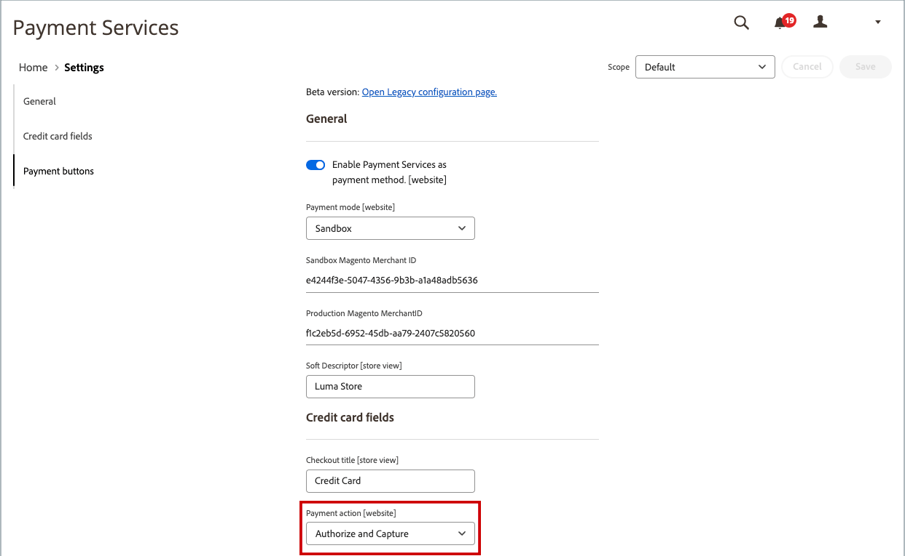
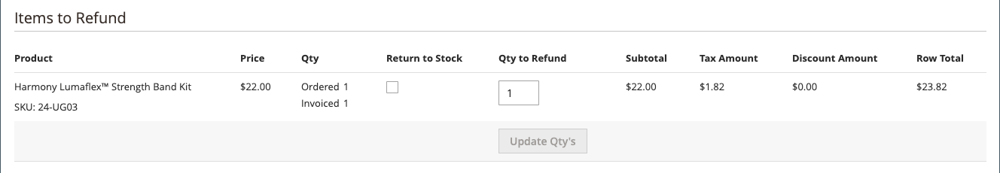
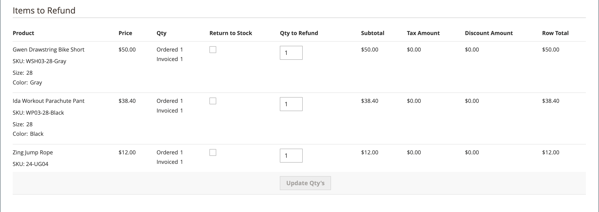
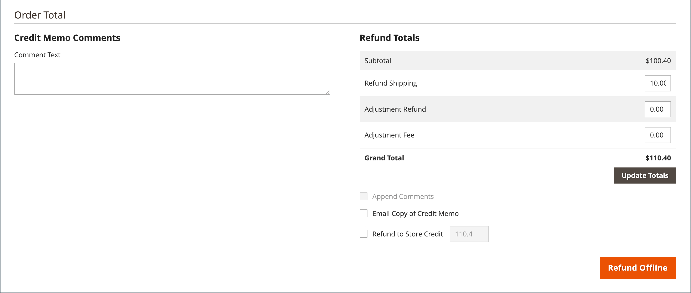

# 簽發銷退折讓單

必須先為[開立商業發票的訂單](invoices.md#create-an-invoice)產生銷退折讓單，才能列印銷退折讓單。 您可以根據付款方式，從未結銷退折讓單中發放線上與離線退款（部分或全部）。

-  (僅限Adobe Commerce)退款可套用至商店點數。
-  (可與Adobe Commerce B2B搭配使用)退款可套用至公司點數。
- 信用卡購物可線上上或離線退款。
- 支票或匯票的購買必須離線退款。

任何狀態為[未結狀態](order-status.md)的銷退折讓單，都有未結的到期退款。

有了銷退折讓單，您可以：

- 退回商業發票的全部金額。
- 退回商業發票的部分金額。
- 退款商業發票的多重部份金額。
- 每張訂單退款多張商業發票，不得超過訂單總金額。
- 退回一個明細專案的部份數量，例如訂單中五件襯衫的其中三件。

如需詳細資訊，請參閱[建立發票](invoices.md#create-an-invoice)。

## 付款動作設定

由信用卡支付之訂單的退款工作流程，是由每個可用付款方式之組態中的[付款動作設定](../configuration-reference/sales/payment-methods.md#payment-actions)所決定。 在交易結算之前，無法核發退款。

{width="600" zoomable="yes"}

- 如果您設定之付款方式的「付款作業」設為`Authorize`，您必須先從管理員產生商業發票，才能建立銷退折讓單。
- 若您設定之付款方式的「付款作業」設為`Authorize and Capture`，則付款處理程式已產生商業發票，但資金在交易結算前無法使用。 許多付款處理程式都建議將此短暫的等候期間作為安全性措施，而且通常可以自動處理。 您也可以使用付款處理程式，從您的商家帳戶手動結算交易。
-  (僅限Adobe Commerce)如果您針對包含禮品選項的訂單建立銷退折讓單，則禮品包裝及/或列印卡片的退款會顯示在銷退折讓單的「退款總計」區段中。 若要從要退款的金額中排除這些成本，請在「調整費用」中輸入金額。 如果針對同一訂單開立了多份銷退折讓單，則贈品選項的退款僅會出現在第一份銷退折讓單中。

## 建立銷退折讓單

決定您要核發的退款型別 — 針對[信用購買](#issue-a-refund-for-a-credit-purchase)、[支票或匯票](#issue-an-offline-refund-for-check-or-money-order) — 並產生銷退折讓單並核發退款。

### 為信用購買發出退款

1. 在&#x200B;_管理員_&#x200B;側邊欄上，移至&#x200B;**[!UICONTROL Sales]** > **[!UICONTROL Orders]**。

   {width="700" zoomable="yes"}

1. 尋找格線中的順序，然後按一下&#x200B;**[!UICONTROL View]**。

1. 如果&#x200B;_[!UICONTROL Credit Memo]_&#x200B;按鈕在按鈕列中可見，請執行下列任一項作業：

   - 若要發出`offline`退款，請前往步驟#6。
   - 若要發出`online`退款，請繼續步驟#4。

   如需離線與線上退款的詳細資訊，請參閱[銷退折讓單](credit-memos.md)。

1. 按一下左側面板中的&#x200B;**[!UICONTROL Invoices]**。

1. 在網格中尋找發票，然後按一下&#x200B;**[!UICONTROL View]**。

   {width="700" zoomable="yes"}

1. 向下捲動至發票的&#x200B;**[!UICONTROL Invoice Totals]**&#x200B;區段，確認發票已設為`Capture Online`，然後按一下&#x200B;**[!UICONTROL Submit Invoice]**。

   {width="600" zoomable="yes"}

   如果此選項無法使用，則商業發票已建立。 繼續進行下一個步驟。

1. 在發票頂端的按鈕列中，按一下&#x200B;**[!UICONTROL Credit Memo]**。

1. 驗證&#x200B;**[!UICONTROL Items to Refund]**&#x200B;區段中的資訊，並執行下列動作（如果適用）：

   - 若要將產品送回詳細目錄，請選取&#x200B;**[!UICONTROL Return to Stock]**&#x200B;核取方塊。

     如果&#x200B;_產品庫存選項_&#x200B;設定為`Automatically Return Credit Memo Item to Stock`，產品會自動恢復庫存。 啟用[Inventory management](../inventory-management/enable.md)後，專案會傳回至傳送出貨的來源。

   - 更新&#x200B;**[!UICONTROL Qty to Refund]**，然後按一下&#x200B;**[!UICONTROL Update Qty's]**。

     {width="600" zoomable="yes"}

1. 更新&#x200B;**[!UICONTROL Refunds Totals]**&#x200B;區段，如下所示：

   - 針對&#x200B;**[!UICONTROL Refund Shipping]**，輸入任何要從運費退款的金額。

     此欄位最初會顯示訂單中可退款的出貨總額。 這等於訂單的全部出貨金額，減去已退款的任何出貨金額。 和數量一樣，數量可以減少，但不能增加。

   - 針對&#x200B;**[!UICONTROL Adjustment Refund]**，輸入要新增至退款總金額的值，作為不適用於訂單任何特定部份（運費、料號或稅捐）的額外退款。 管理員想要先退款非虛擬付款方式時，也可以使用虛擬貨幣（例如禮品卡）進行部分退款。

     輸入的金額不能將總退款提高到高於已付金額的水準。

   - 針對&#x200B;**[!UICONTROL Adjustment Fee]**，輸入要從退款總額中減去的值。

     此金額不會從訂單的特定部份中扣除，例如運費、專案或稅金。

1. 若要新增註解，請在&#x200B;**[!UICONTROL Credit Memo Comments]**&#x200B;方塊中輸入文字。

   - 若要傳送電子郵件通知給客戶，請選取&#x200B;**[!UICONTROL Email Copy of Credit Memo]**&#x200B;核取方塊。

1. 按一下&#x200B;**[!UICONTROL Update Totals]**。

1. 視情況執行下列動作：

   -  (僅限Adobe Commerce)若要退回客戶商店退款的金額，請選取「**[!UICONTROL Refund to Store Credit]**」核取方塊。

   -  (可與Adobe Commerce B2B搭配使用)若要將金額退還給客戶的公司信用額度，請選取「**[!UICONTROL Refund to Company Credit]**」核取方塊。

   - 若要發出離線退款問題，請按一下&#x200B;**[!UICONTROL Refund Offline]**。

   - 若要發出線上退款，請按一下&#x200B;**[!UICONTROL Refund]**。

   -  (可與Adobe Commerce B2B搭配使用)如果購買是以公司信用支付，請按一下「**[!UICONTROL Refund to Company Credit]**」。

   如需離線與線上退款的詳細資訊，請參閱[銷退折讓單](credit-memos.md)。

   {width="600" zoomable="yes"}

### 簽發支票或匯票的離線退款

1. 在&#x200B;_管理員_&#x200B;側邊欄上，移至&#x200B;**[!UICONTROL Sales]** > **[!UICONTROL Orders]**。

1. 在格線中尋找已完成的訂單，然後按一下&#x200B;**[!UICONTROL View]**&#x200B;連結以開啟它。

1. 在頁面頂端的按鈕列中，按一下&#x200B;**[!UICONTROL Invoice]**。

1. 向下捲動至頁面底部，然後按一下&#x200B;**[!UICONTROL Submit Invoice]**。

1. 在發票頂端的按鈕列中，按一下&#x200B;**[!UICONTROL Credit Memo]**。

   {width="600" zoomable="yes"}

1. 驗證&#x200B;**[!UICONTROL Items to Refund]**&#x200B;區段中的資訊，並執行下列動作（如果適用）：

   {width="600" zoomable="yes"}

   - 如果您要將傳回的產品退回庫存中，請選取&#x200B;**[!UICONTROL Return to Stock]**&#x200B;核取方塊。

     啟用Inventory management後，存貨數量會傳回至送出貨的來源。 如果[產品庫存選項](../inventory-management/enable.md)設定為`Automatically Return Credit Memo Item to Stock`，產品會自動恢復庫存。

   - 更新&#x200B;**[!UICONTROL Qty to Refund]**&#x200B;並按一下&#x200B;**[!UICONTROL Update Qty's]**。

     要貸記的金額不能超過可退款的最大金額。

1. 更新&#x200B;**[!UICONTROL Refunds Totals]**&#x200B;區段（如果適用）：

   - 針對&#x200B;**[!UICONTROL Refund Shipping]**，輸入任何要從運費退款的金額。

     此欄位最初會顯示訂單中可退款的總出貨金額。 這等於訂單的全部出貨金額，減去已退款的任何出貨金額。 和數量一樣，數量可以減少，但不能增加。

   - 針對&#x200B;**[!UICONTROL Adjustment Refund]**，輸入要新增至退款總金額的值，作為不適用於訂單任何特定部份（運費、料號或稅捐）的額外退款。 管理員想要先退款非虛擬付款方式時，也可以使用虛擬貨幣（例如禮品卡）進行部分退款。

     輸入的金額不能將總退款提高到高於已付金額的水準。

   - 針對&#x200B;**[!UICONTROL Adjustment Fee]**，輸入要從退款總額中減去的值。

     此金額不會從訂單的特定部份中扣除，例如運費、專案或稅金。

   - 如果購買是以商店貸方支付，請選取&#x200B;**[!UICONTROL Refund to Store Credit]**&#x200B;核取方塊，將金額貸記至客戶帳戶餘額。

1. 若要新增註解，請在&#x200B;**[!UICONTROL Credit Memo Comments]**&#x200B;方塊中輸入文字，然後執行下列動作：

   - 若要傳送電子郵件通知給客戶，請選取&#x200B;**[!UICONTROL Email Copy of Credit Memo]**&#x200B;核取方塊。

   - 若要在電子郵件中包含您輸入的註解，請選取「**[!UICONTROL Append Comments]**」核取方塊。

     銷退折讓單通知的狀態會顯示在已完成的銷退折讓單中，並位於銷退折讓單編號旁。

     {width="600" zoomable="yes"}

1. 若要完成程式並發出退款，請按一下&#x200B;**[!UICONTROL Refund Offline]**。

## 欄位說明

### [!UICONTROL Order & Account Information]

| 欄位 | 說明 |
|--- |--- |
| [!UICONTROL Order Number] | 訂單編號會顯示在&#x200B;_訂單與帳戶資訊_&#x200B;中，後面會加上附註，指出是否已傳送確認電子郵件。 |
| [!UICONTROL Order Date] | 下訂單的日期和時間。 |
| [!UICONTROL Order Status] | 將訂單狀態顯示為`Complete`。 |
| [!UICONTROL Purchased From] | 表示下訂單的網站、商店和商店檢視。 |
| [!UICONTROL Placed from IP] | 表示下訂單所在電腦的IP位址。 |

{style="table-layout:auto"}

### [!UICONTROL Account Information]

| 欄位 | 說明 |
|--- |--- |
| [!UICONTROL Customer Name] | 下訂單的客戶或採購員名稱。 客戶名稱會連結至客戶設定檔。 |
| [!UICONTROL Email] | 客戶或購買者的電子郵件地址。 電子郵件地址已連結，以開啟新的電子郵件訊息。 |
| [!UICONTROL Customer Group] | 將客戶指派給之客戶群組或共用目錄的名稱。 |
| [!UICONTROL Company Name] |  (可與Adobe Commerce B2B搭配使用)與購買者相關聯且代表其下訂單的公司名稱。 公司名稱會連結至公司設定檔。 |

{style="table-layout:auto"}

### [!UICONTROL Address Information]

| 欄位 | 說明 |
|--- |--- |
| [!UICONTROL Billing Address] | 下訂單的客戶或購買者名稱，後面加上帳單地址、電話號碼和[VAT](vat.md) （如適用）。 電話號碼已連結到行動裝置上的自動撥號。 |
| [!UICONTROL Shipping Address] | 訂單應送貨之人員的名稱，然後是送貨地址與電話號碼。 電話號碼已連結到行動裝置上的自動撥號。 |

{style="table-layout:auto"}

### [!UICONTROL Payment & Shipping Method]

| 欄位 | 說明 |
|--- |--- |
| [!UICONTROL Payment Information] | 用於訂單的付款方式，以及採購單編號（如果適用的話），後面接著用於下訂單的幣別。 若使用[帳戶](../b2b/enable-basic-features.md#configure-payment-on-account)付款將訂單記入公司貸方，則會指出記入帳戶的金額。 |
| [!UICONTROL Shipping & Handling Information] | 要使用的送貨方式，以及適用的任何手續費。 |

{style="table-layout:auto"}

### [!UICONTROL Items to Refund]

| 欄位 | 說明 |
|--- |--- |
| [!UICONTROL Product] | 產品名稱、SKU和選項（如果適用）。 |
| [!UICONTROL Price] | 專案的購買價格。 若為Adobe Commerce B2B，此值會反映從共用目錄套用至專案的所有折扣（若適用）。 |
| [!UICONTROL Qty] | 訂購數量。 |
| [!UICONTROL Return to Stock] | 表示是否要將傳回的專案退回到庫存的核取方塊。 |
| [!UICONTROL Qty to Refund] | 表示產品傳回的單位數。 |
| [!UICONTROL Subtotal] | 小計是採購價格乘以退貨的產品單位數量。 |
| [!UICONTROL Tax Amount] | 以小數值形式套用至傳回專案的稅金金額。 |
| [!UICONTROL Tax Percent] | 以百分比形式套用至退回料號的稅捐百分比。 |
| [!UICONTROL Discount Amount] | 適用於退回料號的任何折扣。 |
| [!UICONTROL Row Total] | 明細專案總計，包括退回產品層次到期的適用稅捐，減去折扣。 |
| _訂單總計_ |  |

{style="table-layout:auto"}

### [!UICONTROL Credit Memo Comments]

| 欄位 | 說明 |
|--- |--- |
| [!UICONTROL Comment Text] | 用來輸入銷退折讓單相關備註給客戶的文字方塊。 |

{style="table-layout:auto"}

### [!UICONTROL Refund Totals]

| 欄位 | 說明 |
|--- |--- |
| [!UICONTROL Refund Shipping] | 要退款的運送金額。 |
| [!UICONTROL Adjustment Refund] | 新增至退款總金額的金額，作為不適用於訂單任何特定部分的額外退款，例如運費、專案或稅捐。 輸入的金額不能將總退款提高到高於已付金額的水準。 |
| [!UICONTROL Adjustment Fee] | 從退款總額中減去的金額，例如補貨費用，或與贈品包裝或贈品選項相關的金額。 |
| [!UICONTROL Grand Total] | 要退款的金額總計 |
| [!UICONTROL Append Comments] | 決定銷退折讓單中是否包含備註的核取方塊。 |
| [!UICONTROL Email Copy of Credit Memo] | 決定銷退折讓單是否以電子郵件寄出的核取方塊。 |
| [!UICONTROL Refund to Store Credit] |  (僅限Adobe Commerce)判斷總計是否要退款給[商店點數](../customers/store-credit-using.md)的核取方塊。 |
| [!UICONTROL Subtotal] |  (可與Adobe Commerce B2B搭配使用)要退款的所有明細專案總數。 |

{style="table-layout:auto"}

### 退款按鈕

訂單所用的付款方式會決定銷退折讓單可用的退款按鈕。

| 按鈕 | 說明 |
|--- |--- |
| **[!UICONTROL Refund]** | 如果原始購買是由信用卡透過付款閘道支付，則退款金額由付款處理者管理。 若要管理退款，請參閱付款提供者提供的檔案。 |
| **[!UICONTROL Refund Offline]** | 如果原先的購買是以支票或匯票支付，則退款會直接支付給客戶，如果您有實體店面，則發行支票、禮品卡或現金。 銷退折讓單會作為離線交易的記錄。 |
| **[!UICONTROL Refund to Company Credit]** |  (可與Adobe Commerce B2B搭配使用)若購買費用計入公司信用額度，則退款會退回至[公司帳戶](../b2b/credit-company.md)。 |

{style="table-layout:auto"}

## 列印銷退折讓單

若要列印或檢視完成的銷退折讓單，您必須安裝PDF讀取程式。 您可以免費下載[Adobe Reader](https://www.adobe.com/acrobat/pdf-reader.html "取得Adobe Reader")。

1. 在&#x200B;_管理員_&#x200B;側邊欄上，移至&#x200B;**[!UICONTROL Sales]** > _[!UICONTROL Operations]_>**[!UICONTROL Credit Memos]**。

1. 使用下列其中一種方法來列印銷退折讓單：

### 方法1：列印目前的銷退折讓單

1. 在網格中，開啟銷退折讓單。

1. 按一下&#x200B;**[!UICONTROL Print]**。

   {width="600" zoomable="yes"}

### 方式2：列印多份銷退折讓單

1. 在清單中，選取您要列印之各銷退折讓單的核取方塊。

1. 將&#x200B;**[!UICONTROL Actions]**&#x200B;控制項設為`PDF Credit Memos`並按一下&#x200B;**[!UICONTROL Submit]**。

   {width="600" zoomable="yes"}

1. 出現提示時，請執行下列任一項動作：

   - 若要儲存檔案，請按一下&#x200B;**[!UICONTROL Save]**，然後依照提示將檔案儲存到您的電腦。 下載完成後，在Adobe Reader中開啟PDF並列印檔案。

   - 若要檢視檔案，請按一下&#x200B;**[!UICONTROL Open]**。 列印就緒的PDF銷退折讓單會在Adobe Reader中開啟。 從這裡，您可以列印銷退折讓單或將其儲存到您的電腦。
