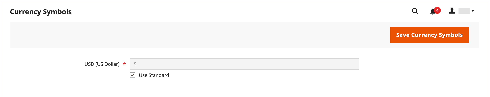

# 貨幣設定

在設定個別貨幣匯率之前，您必須先設定[基本貨幣](../configuration-reference/general/currency-setup.md)的範圍。 預設為全域，會將基本貨幣設定套用至整個[存放區階層](../getting-started/websites-stores-views.md)。 如果您已安裝多站台Adobe Commerce或Magento Open Source，您可以將範圍設定為網站層級，以管理多個基本貨幣。

您也指定您接受的貨幣，以及要在商店中顯示[價格](../catalog/catalog-price-scope.md)時使用的貨幣。 下圖中，基本貨幣的範圍在網站層級設定，因此每個網站可以有不同的基本貨幣。

{width="600" zoomable="yes"}

## 步驟1：選擇接受的幣別

1. 在&#x200B;_管理員_&#x200B;側邊欄上，移至&#x200B;**[!UICONTROL Stores]** > _[!UICONTROL Settings]_>**[!UICONTROL Configuration]**。

1. 在左上角，將&#x200B;**[!UICONTROL Scope]**&#x200B;設定為套用設定的存放區檢視。

1. 在左側面板的&#x200B;_一般_&#x200B;下，選擇&#x200B;**[!UICONTROL Currency Setup]**。

1. 展開 **[!UICONTROL Currency Options]**&#x200B;區段並設定下列選項：

   - **[!UICONTROL Base Currency]** — 設定為您用於線上交易的主要貨幣。

   - **[!UICONTROL Default Display Currency]** — 設定為您在商店檢視中顯示定價時所使用的貨幣。

   - **[!UICONTROL Allowed Currencies]** — 選取您在商店檢視中接受作為付款的所有貨幣。 也請務必選取您的主要貨幣。

     若要使用多種貨幣，請按住Ctrl鍵(PC)或Command鍵(Mac)，然後按一下每個選項。

   {width="600" zoomable="yes"}

   如需這些組態設定的詳細說明，請參閱&#x200B;_組態參考指南_&#x200B;中的[貨幣選項](../configuration-reference/general/currency-setup.md)。

1. 當提示重新整理快取時，按一下系統訊息右上角的&#x200B;_關閉_ （ ）。

   您稍後可以[重新整理快取](../systems/cache-management.md)。

1. 定義基本貨幣的範圍：

   - 在左側面板中，展開&#x200B;**[!UICONTROL Catalog]**&#x200B;並在下方選擇&#x200B;**[!UICONTROL Catalog]**。

   - 向下捲動並展開 **[!UICONTROL Price]**&#x200B;區段。 （此區段僅在範圍設定為&#x200B;**[!UICONTROL Store View:]** _預設設定_&#x200B;時顯示。）

   - 將&#x200B;**[!UICONTROL Catalog Price Scope]**&#x200B;設為`Global`或`Website`。

   {width="600" zoomable="yes"}

## 步驟2：設定匯入連線

1. 捲動至頁面頂端。

1. 在左側面板中，展開&#x200B;**[!UICONTROL General]**&#x200B;並選擇&#x200B;**[!UICONTROL Currency Setup]**。

1. 設定您的貨幣服務連線：

   有三個服務選項： _[!UICONTROL Fixer.io (legacy)]_、_[!UICONTROL Fixer Api (APILayer)]_&#x200B;和&#x200B;_[!UICONTROL Currency Converter API]_

   >[!IMPORTANT]
   >
   >從2.4.6版開始，[[!DNL Fixer.io]](https://fixer.io/)服務已過時，並由[[!DNL Fixer API] (APILayer)](https://apilayer.com/marketplace/fixer-api)服務取代。 強烈建議您使用APILayer帳戶，而非已棄用的[!DNL Fixer.io]帳戶。

   - _若要連線到[fixer.io服務](https://fixer.io/)：_

      - 展開&#x200B;**[!UICONTROL Fixer.io]**&#x200B;區段的。

      - 輸入您的fixer.io **[!UICONTROL API key]**。

      - 針對&#x200B;**[!UICONTROL Connection Timeout in Seconds]**，輸入連線逾時前允許閒置的秒數。

     {width="600" zoomable="yes"}

   - _若要連線到[[!DNL Fixer Api (APILayer)] 服務](https://apilayer.com/)：_

      - 展開&#x200B;**[!UICONTROL Fixer Api (APILayer)]**&#x200B;區段的。

      - 輸入您的[!DNL APILayer] **[!UICONTROL API key]**。

      - 針對&#x200B;**[!UICONTROL Connection Timeout in Seconds]**，輸入連線逾時前允許閒置的秒數。

     {width="600" zoomable="yes"}

   - _若要連線到[[!DNL Currency Convertor API] 服務](https://free.currencyconverterapi.com/)：_

      - 展開&#x200B;**[!UICONTROL Currency Convertor API]**&#x200B;區段的。

      - 輸入您的貨幣轉換器&#x200B;**[!UICONTROL API key]**。

      - 針對&#x200B;**[!UICONTROL Connection Timeout in Seconds]**，輸入連線逾時前允許閒置的秒數。

     {width="600" zoomable="yes"}

## 步驟3：設定排程的匯入設定

1. 繼續貨幣設定，展開 **[!UICONTROL Scheduled Import Settings]**&#x200B;區段。

   {width="600" zoomable="yes"}

1. 若要自動更新匯率，請將&#x200B;**[!UICONTROL Enabled]**&#x200B;設為`Yes`。

1. 設定更新選項：

   - **[!UICONTROL Service]** — 設定為費率提供者。 預設值為`Fixer.io (legacy)`。

   - **[!UICONTROL Start Time]** — 設定為依據排程更新費率的小時、分鐘和秒。

   - **[!UICONTROL Frequency]** — 若要決定更新費率的頻率，請設定為下列其中一項：

      - `Daily`
      - `Weekly`
      - `Monthly`

   - **[!UICONTROL Error Email Recipient]** — 輸入在匯入過程中發生錯誤時接收電子郵件通知之人員的電子郵件地址。

     若要輸入多個電子郵件地址，請以逗號分隔每個電子郵件地址。

   - **[!UICONTROL Error Email Sender]** — 設定為顯示為錯誤通知寄件者的[商店連絡人](../getting-started/store-details.md#store-email-addresses)。

   - **[!UICONTROL Error Email Template]** — 設定為用於錯誤通知的電子郵件範本。

1. 完成時，按一下&#x200B;**[!UICONTROL Save Config]**。

1. 當提示更新快取時，請按一下&#x200B;**[!UICONTROL Cache Management]**&#x200B;連結，然後重新整理無效的快取。

   {width="600" zoomable="yes"}

## 步驟4：更新匯率

在匯率生效之前，必須以目前的值更新匯率。 [手動更新匯率](currency-update.md)或自動匯入匯率。

## 步驟5：自訂貨幣符號（選擇性）

管理貨幣符號可讓您自訂與商店中接受為付款的每個貨幣相關聯的符號。

{width="600" zoomable="yes"}

1. 在&#x200B;_管理員_&#x200B;側邊欄上，移至&#x200B;**[!UICONTROL Stores]** > _[!UICONTROL Currency]_>**[!UICONTROL Currency Symbols]**。

   為商店啟用的每種貨幣都會顯示在&#x200B;_[!UICONTROL Currency]_&#x200B;清單中。

1. 視需要變更清單中的設定：

   - 為您要使用的每種貨幣輸入自訂符號，或選取每種貨幣的&#x200B;**[!UICONTROL Use Standard]**&#x200B;核取方塊。

   - 若要覆寫預設符號，請清除&#x200B;_[!UICONTROL Use Standard]_&#x200B;核取方塊並輸入您要使用的符號。

   >[!NOTE]
   >
   >貨幣符號的對齊方式不可能從左到右改變。

1. 完成時，按一下&#x200B;**[!UICONTROL Save Currency Symbols]**。

1. 當提示更新快取時，請按一下&#x200B;**[!UICONTROL Cache Management]**&#x200B;連結，然後重新整理任何無效的快取。
