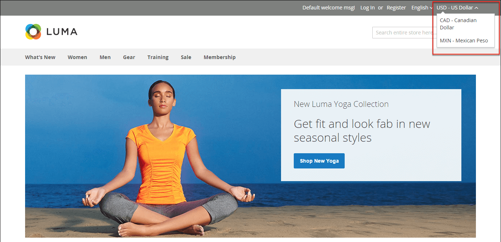

# 貨幣

Adobe Commerce可讓您接受來自全球200多個國家的貨幣。 如果存放區支援多種貨幣，則貨幣匯率[更新](currency-update.md)後，標題中會顯示&#x200B;_貨幣選擇器_。

>[!NOTE]
>
>如果您接受多幣別的付款，請務必監視幣別匯率設定，因為任何波動都會影響利潤率。

貨幣符號會出現在產品價格和銷售檔案中，例如訂單和發票。 您可以視需要自訂貨幣符號，也可以針對每個商店或檢視分別設定價格的顯示。

{width="700" zoomable="yes"}
