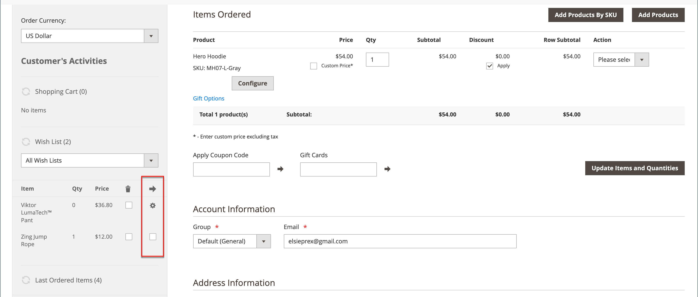
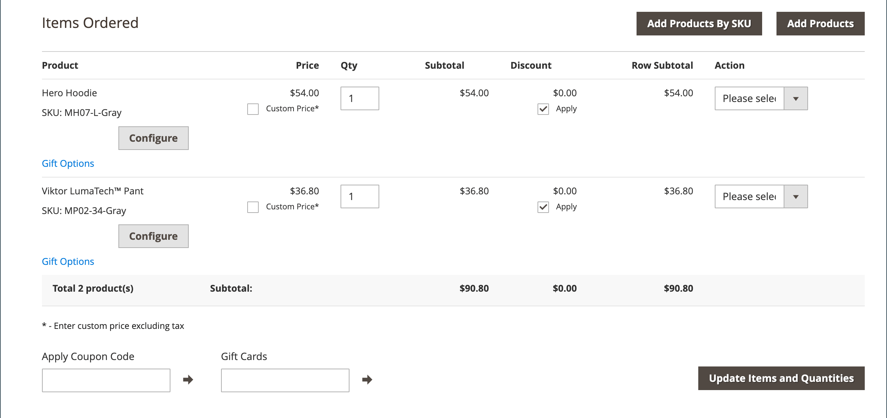
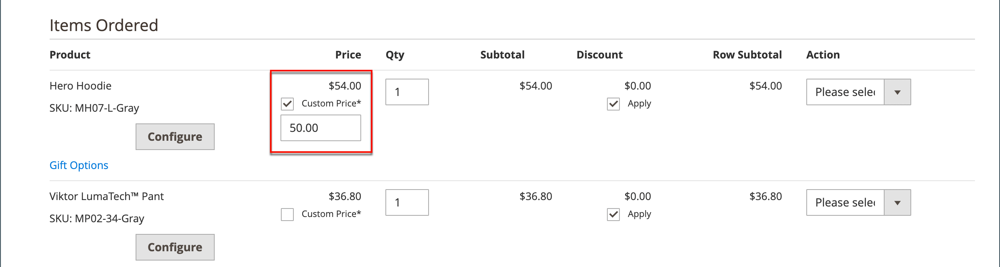

# 建立訂單

如需協助的註冊客戶，您可以直接向Admin建立整份訂單。 _[!UICONTROL Create New Order]_&#x200B;表單包含正常結帳程式所需的所有資訊，以及客戶帳戶儀表板的活動摘要。

{width="700" zoomable="yes"}

## 步驟1：建立訂單

1. 在&#x200B;_管理員_&#x200B;側邊欄上，按一下&#x200B;**[!UICONTROL Customers]**。

1. 在格線中尋找客戶。

1. 在&#x200B;_動作_&#x200B;資料行中，按一下&#x200B;**[!UICONTROL Edit]**。

1. 在工作區標題中，按一下&#x200B;**[!UICONTROL Create Order]**。

   {width="700" zoomable="yes"}

   您也可以按一下&#x200B;**[!UICONTROL Create New Order]**，在[訂單工作區](orders.md#orders-workspace)中建立訂單。

## 步驟2：新增產品

如果您的商店有多個檢視，請選擇將要下訂單的商店檢視。

### 從[!UICONTROL Customer's Activities]側欄新增產品

您可以從客戶的願望清單或最近檢視、比較或訂購的專案，將專案轉移至購物車。

1. 展開下列其中一個區段：

   - **[!UICONTROL Wish List]**
   - **[!UICONTROL Last Ordered Items]**
   - **[!UICONTROL Products in Comparison List]**
   - **[!UICONTROL Recently Compared Products]**
   - **[!UICONTROL Recently Viewed Products]**

1. 在左側面板中選取每個產品的核取方塊。

1. 向下捲動並按一下&#x200B;**[!UICONTROL Update Changes]**。

   專案會出現在訂購單中。

   {width="600" zoomable="yes"}

### 從目錄新增產品

1. 按一下&#x200B;**[!UICONTROL Add Products]**。

   {width="600" zoomable="yes"}

1. 在格線中，選取每個要新增至購物車的產品核取方塊，然後輸入要購買的&#x200B;**[!UICONTROL Qty]**。

   {width="600" zoomable="yes"}

   >[!NOTE]
   >
   >產品選擇格線一律會顯示產品的正常基本價格，不會套用折扣及任何購物車或群組價格規則。 只有在將產品新增至訂單/購物車時，才會計算最終產品價格。

1. 設定可用的產品選項：

   - 按一下&#x200B;**[!UICONTROL Configure]**。

   - 視需要完成選項。

   - 按一下&#x200B;**[!UICONTROL OK]**。

   - 按一下&#x200B;**[!UICONTROL Add Selected Product(s) to Order]**&#x200B;以更新購物車。

1. 如果產品設定為[贈品選項](../catalog/product-gift-options.md)，請視需要設定選項。

1. 如有需要，覆寫料號價格：

   - 選取「**[!UICONTROL Custom Price]**」核取方塊，然後在下列方塊中輸入新價格。

   - 若要更新購物車總計，請按一下&#x200B;**[!UICONTROL Update Items and Quantities]**。

   {width="600" zoomable="yes"}

1. 視需要為訂單完成下列章節：

   - [!UICONTROL Order Currency]
   - [!UICONTROL Apply Coupon Codes / Gift Card Code]
   - [!UICONTROL Payment Method]
   - [!UICONTROL Shipping Method]
   - [!UICONTROL Order Comments]

>[!NOTE]
>
>請參閱[Payment Services指南](https://experienceleague.adobe.com/en/docs/commerce/payment-services/guide-overview)，以取得有關安裝及設定Payment Services擴充功能時支援此功能的付款方法的詳細資訊。

## 步驟3：提交訂單

按一下&#x200B;**[!UICONTROL Submit Order]**。

確認已傳送給客戶，客戶可以從其帳戶檢視訂單詳細資料。
