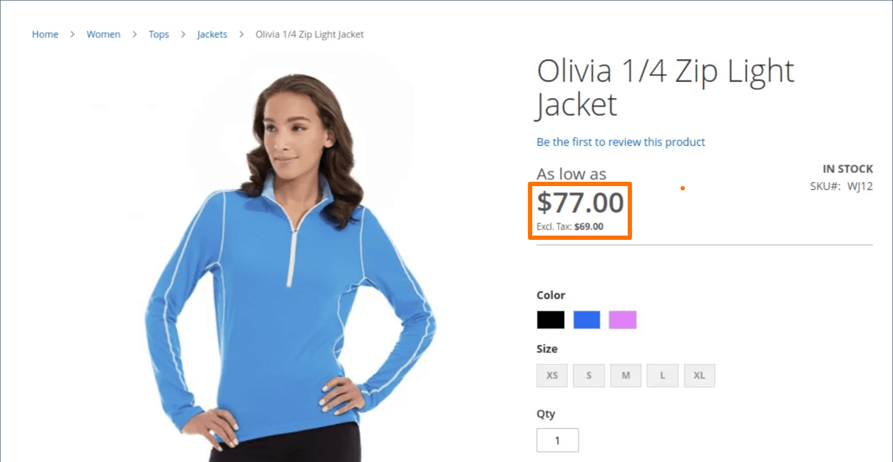

# 價格顯示設定

價格顯示設定可決定產品與送貨價格是否包含或排除稅捐，或顯示兩個版本的價格；一個含稅，另一個不含稅捐。

如果產品價格包含稅捐，則只有當有符合稅捐來源的稅捐規則，或客戶地址符合稅捐規則時，才會顯示稅捐。 可觸發比對的事件包括：客戶建立帳戶、登入，或從購物車產生稅金和運費估計時。

>[!IMPORTANT]
>
>顯示含稅與不含稅的價格，可能會讓客戶感到困惑。 若要避免觸發警告訊息，請參閱 [准則](international-tax-guidelines.md) 為您的國家/地區和 [建議的設定](taxes.md#warning-messages) 以避免警告訊息。

{width="600" zoomable="yes"}

如需這些組態設定的詳細說明，請參閱 [價格顯示設定](../configuration-reference/sales/tax.md#price-display-settings) 在 _設定參考指南_.

## 設定價格顯示設定

稅捐、稅率和類別的計算組態完成時，稅捐會根據這些設定進行計算。 不過，目錄、購物車、訂單、發票和銷退折讓單中的稅捐顯示也應該設定為支援店面的客戶體驗。

最佳實務是顯示價格和相關稅捐（包括稅捐，或同時包括稅捐與排除稅捐），讓客戶在下訂單前瞭解這些計算的套用方式。

### 步驟1：設定目錄價格顯示設定

1. 在 _管理員_ 側欄，前往 **[!UICONTROL Stores]** > _[!UICONTROL Settings]_>**[!UICONTROL Configuration]**.

1. 在左側面板中，展開 **[!UICONTROL Sales]** 並選擇 **[!UICONTROL Tax]**.

1. 展開  此 **[!UICONTROL Price Display Settings]** 區段。

1. 的 **[!UICONTROL Display Product Prices in Catalog]**，選擇下列其中一項：

   - `Excluding Tax`
   - `Including Tax`
   - `Including and Excluding Tax`

   >[!NOTE]
   >
   >如果您將此選項設為 `Including Tax`，則只有當有符合稅捐來源的稅捐規則，或是有符合稅捐規則的客戶地址時，才會顯示稅捐。 可觸發比對的事件包括客戶帳戶建立、登入，或在購物車中使用稅務和送貨預估工具。

1. 的 **[!UICONTROL Display Shipping Prices]**，選擇下列其中一項：

   - `Excluding Tax`
   - `Including Tax`
   - `Including and Excluding Tax`

如果您選擇同時顯示兩個價格（含稅與不含稅），店面外觀會類似於以下畫面：

{width="700" zoomable="yes"}

### 步驟2：設定購物車顯示設定

1. 展開  此 **[!UICONTROL Shopping Cart Display Settings]** 區段。

   {width="600" zoomable="yes"}

1. 的 **[!UICONTROL Display Prices]**，選擇下列其中一項：

   - `Excluding Tax`
   - `Including Tax`
   - `Including and Excluding Tax`

1. 的 **[!UICONTROL Display Subtotal]**，選擇下列其中一項：

   - `Excluding Tax`
   - `Including Tax`
   - `Including and Excluding Tax`

1. 的 **[!UICONTROL Display Shipping Amount]**，選擇下列其中一項：

   - `Excluding Tax`
   - `Including Tax`
   - `Including and Excluding Tax`

1.  (僅限Adobe Commerce)適用於 **[!UICONTROL Display Gift Wrapping Prices]**，選擇下列其中一項：

   - `Excluding Tax`
   - `Including Tax`
   - `Including and Excluding Tax`

1.  (僅限Adobe Commerce)適用於 **[!UICONTROL Display Printed Card Prices]**，選擇下列其中一項：

   - `Excluding Tax`
   - `Including Tax`
   - `Including and Excluding Tax`

1. 針對其餘各個選項，切換至 `Yes` 或 `No` 根據您的偏好：

   - **[!UICONTROL Include Tax in Order Total]**
   - **[!UICONTROL Display Full Tax Summary]**
   - **[!UICONTROL Display Zero Tax Subtotal]**

### 步驟3：設定訂單、商業發票及銷退折讓單顯示設定

1. 展開  此 **[!UICONTROL Orders, Invoices, Credit Memos Display Settings]** 區段。

   {width="600" zoomable="yes"}

1. 的 **[!UICONTROL Display Prices]**，選擇下列其中一項：

   - `Excluding Tax`
   - `Including Tax`
   - `Including and Excluding Tax`

1. 的 **[!UICONTROL Display Subtotal]**，選擇下列其中一項：

   - `Excluding Tax`
   - `Including Tax`
   - `Including and Excluding Tax`

1. 的 **[!UICONTROL Display Shipping Amount]**，選擇下列其中一項：

   - `Excluding Tax`
   - `Including Tax`
   - `Including and Excluding Tax`

1.  (僅限Adobe Commerce)適用於 **[!UICONTROL Display Gift Wrapping Prices]**，選擇下列其中一項：

   - `Excluding Tax`
   - `Including Tax`
   - `Including and Excluding Tax`

1.  (僅限Adobe Commerce)適用於 **[!UICONTROL Display Printed Card Prices]**，選擇下列其中一項：

   - `Excluding Tax`
   - `Including Tax`
   - `Including and Excluding Tax`

1. 針對其餘各個選項，切換至 `Yes` 或 `No` 根據您的偏好：

   - **[!UICONTROL Include Tax in Order Total]**
   - **[!UICONTROL Display Full Tax Summary]**
   - **[!UICONTROL Display Zero Tax Subtotal]**

1. 完成後，按一下 **[!UICONTROL Save Config]**.
