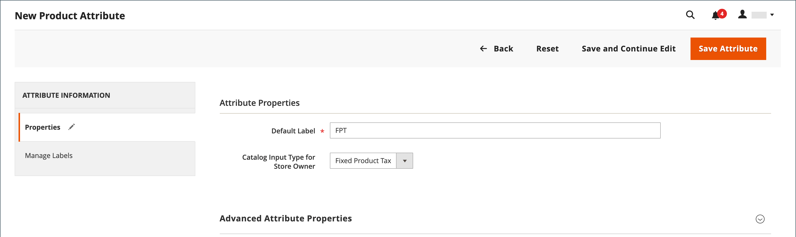
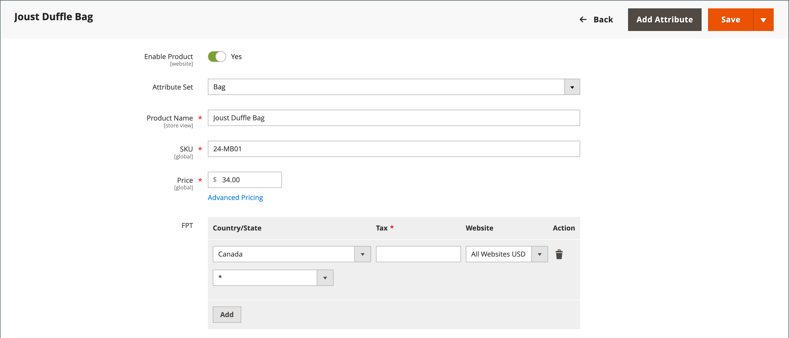

# 固定產品稅金(FPT)

有些稅捐管轄區有固定稅捐，必須新增至特定型別的產品。 您可以設定 _固定產品稅金_ (FPT)根據您商店的稅捐計算需求而定。 在某些國家，FPT可用於設定廢棄電子電氣裝置(WEEE)稅。 此稅金又稱為 _生態稅_ 或 _eco tax （工程變更稅）_，並收集至特定型別的電子產品，以抵消回收成本。 這是固定金額，而不是產品價格的百分比。

根據產品，在料號層次套用固定產品稅捐。 在某些管轄區中，此稅捐會以額外%的稅捐計算為準。 您的稅捐管轄區可能也會有規則，說明產品價格如何顯示給客戶，無論是否含稅。 請務必瞭解規則並據此設定FPT顯示選項。

在電子郵件中引用FPT價格時，請務必小心，因為價格的差異可能會影響客戶對其訂單的信心。 例如，如果您顯示「訂單複查」價格而沒有顯示FPT，則購買具有相關FPT之料號的客戶會看到包含FPT稅捐金額但不包含明細細分的總計。 價格差異可能會導致部分客戶捨棄購物車，因為總額與預期金額不同。

## FPT顯示價格

| FPT | 顯示設定和計算 | |
|--- |--- |---|
| 未納稅 | **[!UICONTROL Excluding FPT]** | FPT會在購物車中顯示為單獨的列，而值會用於適當的稅捐計算。 |
| | **[!UICONTROL Including FPT]** | FPT會加入至料號的基本價格；但不包含在稅捐規則計算中。 |
| | **[!UICONTROL Excluding FPT, FPT Description, Final Price]** | 價格不含FPT金額或說明。 FPT不包含在稅捐規則型計算中。 |
| 已納稅 | **[!UICONTROL Excluding FPT]** | FPT會在購物車中顯示為單獨的列，而值會用於適當的稅捐計算。 |
| | **[!UICONTROL Including FPT]** | FPT包含在料號的價格中，且不需要變更稅捐計算。 |
| | **[!UICONTROL Excluding FPT, FPT Description, Final Price]** | 價格不含FPT金額或說明。 不過，FPT會包含在以稅捐規則為基準的計算中。 |

{style="table-layout:auto"}

## 設定FPT

固定產品稅捐(FPT) [輸入型別](../catalog/attributes-input-types.md) 建立欄位區段，用於管理每個區域的稅捐。

下列指示顯示如何使用「工程變更稅」作為範例，來設定商店的固定產品稅。 在設定稅捐的範圍以及稅捐套用的國家/地區與州之後，根據您選擇的選項，輸入欄位可以根據當地需求變更。 若要深入瞭解，請參閱 [建立產品屬性](../catalog/attribute-product-create.md).

### 步驟1：啟用固定產品稅捐

1. 在 _管理員_ 側欄，前往 **[!UICONTROL Stores]** > _[!UICONTROL Settings]_>**[!UICONTROL Configuration]**.

1. 在左側面板中，展開 **[!UICONTROL Sales]** 並選擇 **[!UICONTROL Tax]**.

1. 展開  此 **[!UICONTROL Fixed Product Taxes]** 區段。

1. 設定 **[!UICONTROL Enable FPT]** 至 `Yes`.

1. 若要決定固定產品稅捐在商店價格中的使用方式，請選擇下列各價格顯示地點的FPT設定：

   - **[!UICONTROL Display Prices in Product Lists]**
   - **[!UICONTROL Display Prices on Product View Page]**
   - **[!UICONTROL Display Prices in Sales Modules]**
   - **[!UICONTROL Display Prices in Emails]**

   選項（每個選項相同）：

   - `Including FPT Only`
   - `Including FPT and FPT description`
   - `Excluding FPT. Including FPT description and final price`
   - `Excluding FPT`

1. 設定 **[!UICONTROL Apply Tax to FPT]** 視需要。

1. 設定 **[!UICONTROL Include FPT in Subtotal]** 視需要。

   {width="600" zoomable="yes"}

   如需這些組態設定的詳細說明，請參閱 [固定產品稅金](../configuration-reference/sales/tax.md#fixed-product-taxes) 在 _設定參考指南_.

1. 完成後，按一下 **[!UICONTROL Save Config]**.

### 步驟2：建立FPT屬性

1. 在 _管理員_ 側欄，前往 **[!UICONTROL Stores]** > _[!UICONTROL Attributes]_>**[!UICONTROL Product]**.

1. 在右上角，按一下 **[!UICONTROL Add New Attribute]** 並執行下列動作：

   - 的 **[!UICONTROL Default Label]**，輸入可識別屬性的標籤。

   - 設定 **[!UICONTROL Catalog Input for Store Owner]** 至 `Fixed Product Tax`.

   {width="600" zoomable="yes"}

1. 展開  此 **[!UICONTROL Advanced Attribute Properties]** 並設定屬性選項：

   - **[!UICONTROL Attribute Code]**  — 以小寫輸入唯一識別碼，不含空格或特殊字元。 長度上限為30個字元。 您可以將「預設標籤」欄位的文字保留為空白。

   - **[!UICONTROL Add to Column Options]**  — 如果您要快顯欄位出現在 [產品清單](../catalog/products-list.md)，設定為 `Yes`.

   - **[!UICONTROL Use in Filter Options]**  — 如果您想要能夠 [篩選](../getting-started/admin-workspace.md) 格線中的產品，根據FPT欄位的值，設定為 `Yes`.

   {width="600" zoomable="yes"}

1. （選用）在左側面板中，選擇 **[!UICONTROL Manage Labels]** 並輸入要使用的標籤，而非每個商店檢視的預設標籤。

   {width="600" zoomable="yes"}

1. 完成後，按一下 **[!UICONTROL Save Attribute]**.

1. 出現提示時，請重新整理 [快取](../systems/cache-management.md).

### 步驟3：將FPT屬性新增至屬性集

1. 在 _管理員_ 側欄，前往 **[!UICONTROL Stores]** > _[!UICONTROL Attributes]_>**[!UICONTROL Attribute Set]**.

1. 在清單中，按一下屬性集以在編輯模式中開啟記錄。

   {width="600" zoomable="yes"}

1. 從清單中拖曳FPT屬性 **[!UICONTROL Unassigned Attributes]** 在右側 **[!UICONTROL Groups]** 清單放在中心欄。

   每個群組資料夾都與產品資訊的某個區段相對應。 當產品以編輯模式開啟時，您可以將屬性放置到您希望出現的位置。

   {width="600" zoomable="yes"}

1. 完成後，按一下 **[!UICONTROL Save]**.

1. 請針對每個應包含固定產品稅捐的屬性集重複此步驟。

### 步驟4：將FPT套用至特定產品

1. 在 _管理員_ 側欄，前往 **[!UICONTROL Catalog]** > **[!UICONTROL Products]**.

1. 在編輯模式中開啟需要固定產品稅的產品。

1. 尋找 **[!UICONTROL FPT]** 欄位區段，您新增至屬性集並按一下 **[!UICONTROL Add Tax]**.

1. 指定產品的適用稅捐：

   {width="600" zoomable="yes"}

   - 如果您的Commerce執行個體有多個網站，請選擇適當的 **[!UICONTROL Website]** 和基準貨幣。 在此範例中，欄位預設設為 `All Websites [USD]`.

   - 設定 **[!UICONTROL Country/State]** 固定產品稅適用的區域。

   - 的 **[!UICONTROL Tax]**，輸入固定產品稅捐為小數金額。

1. 若要新增更多固定產品稅捐，請按一下 **[!UICONTROL Add Tax]** 並重複此程式。

1. 完成後，按一下 **[!UICONTROL Save]**.
