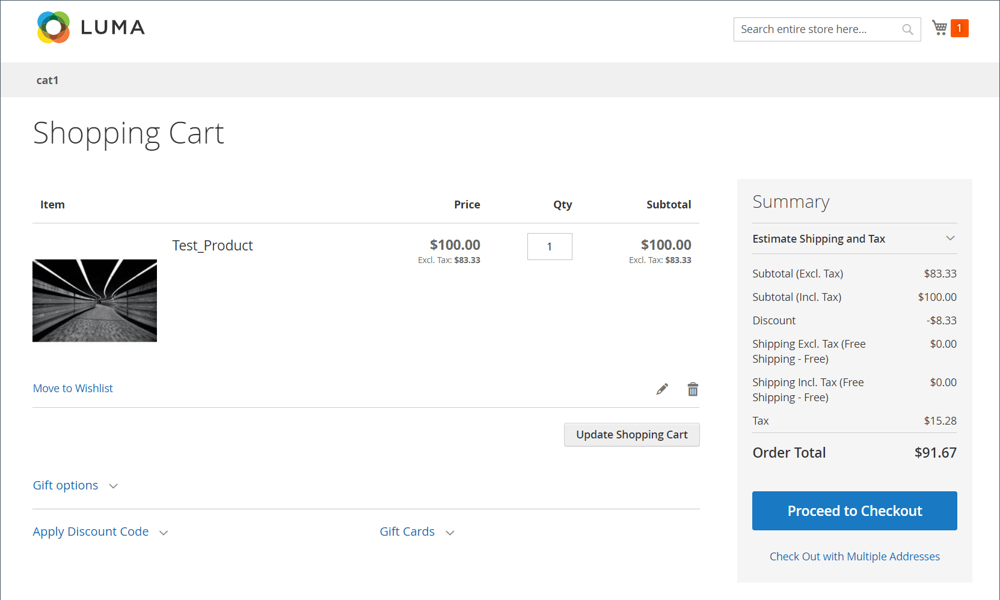

# 隱藏稅捐計算

_隱藏稅捐_ 是折扣金額的VAT金額。 當以下所有條件都為真時，為非零：

- 目錄價格包含稅金
- VAT稅率不是零
- 有折扣優惠

當有含稅的折扣時，Commerce會計算 _隱藏稅捐_ 計算折扣價格時加回的金額。

`discountedItemPrice = fullPriceWithoutTax - discountAmountOnFullPriceWithoutTax + vatAmountOnDiscountedPrice + hiddenTax`

## 範例

1. 料號的全價（含稅）：$100
1. 加值稅稅率：20%
1. 對料號價格排除稅捐套用10%折扣：

### 預期結果無效

- 不含折扣的稅後料號價格=100美元
- 不含折扣的稅前料號價格=100/1.2=83.33美元
- 折扣=83.33 \ *0.1=8.33美元
- 稅金=(83.33-8.33) \ *0.2=**15美元（無效）**
- 不含稅款的訂單總計=83.33-8.33=**75美元（無效）**
- 含稅訂單總計=75+15=**90美元（無效）**

### 購物車中的有效實際結果

{width="700" zoomable="yes"}

### 有效計算

1. 不含稅的料號完整價格為：$100 / 1.2 = **83.33美元**

1. 完整料號價格上的VAT金額為：$100 - $83.33 = $16.67

   _也可以計算為：$100 \ * (1 - 1/1.2)。_

1. 83.33美元可享受10%的折扣： **8.33美元** （不折扣稅金時）

1. 含稅料號的折扣價格為：$100 - $8.33 = $91.67

   >[!NOTE]
   >
   >此方程式可說明客戶對折扣套用方式的看法。

1. 不含稅的專案折扣價格為：$91.67 / 1.2 = $76.39

1. 折扣價的增值稅金額為：$91.67 - $76.39 = **$15.28 （有效）**

   _也可以計算為：$91.67 \ * (1 - 1/1.2)。_

1. 隱藏稅捐或 _折扣稅捐補償_ 全價與折扣價格的加值稅金額之間的差異：$16.67 - $15.28 = **$1.39**

   _另一種檢視方式：隱藏稅捐是以$8.33折扣內含的VAT金額：$8.33 \* (1 - 1/1.2)。_

1. 客戶通常如何瞭解折扣價格（訂單總計）：

   _包含稅捐的料號完整價格&#x200B;**較少**折扣金額：$100 - $8.33 = $91.67_

1. **Commerce計算折扣價格的方式** （請參閱前文的公式）：

   _$83.33 - $8.33 + 15.28 + 1.39 =**$91.67***_
