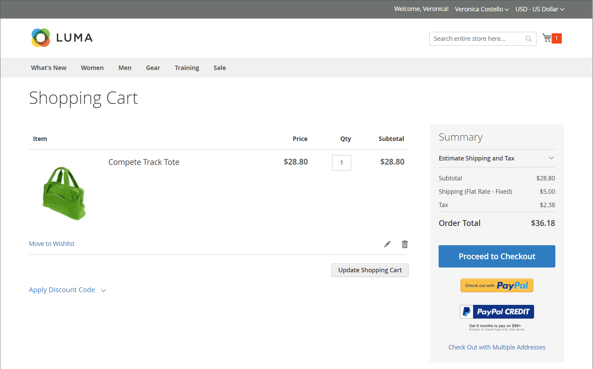

# 商店和購買體驗簡介

Adobe Commerce和Magento Open Source提供全方位的功能，可建構和管理您的線上商店和客戶的購買體驗。 在您的Commerce執行個體中，您可以管理網站、商店和檢視的商店階層。 您也可以針對多重地區設定執行商店所需的稅捐與幣別匯率，包括產品與客戶群組的稅捐類別。

## 存放區結構

Adobe Commerce或Magento Open Source的單一例項可支援使用不同屬性和內容的多個網站、商店或商店檢視。 常見的案例是在不同網域中設定具有不同選項的商店。 例如，您可能想要一個網域上的一組類別和產品，以及不同網域上另一組類別和產品使用另一種語言。 商家可以在「管理員」中設定網站、商店和商店檢視。

定義[階層](stores.md)時，您可以根據[範圍](../getting-started/websites-stores-views.md#scope-settings)套用組態設定，讓每個網站、商店和商店檢視都能提供您想要的產品目錄和店面體驗。

## 購買點

Adobe Commerce和Magento Open Source在提交訂單前，會自動驗證所有料號的SKU和可用性，以減少訂購錯誤。 您可以設定[購物車](cart.md)和[結帳選項](checkout-process.md)，以提供最佳的購買體驗（從交易到傳遞）。 已登入帳戶的客戶可以快速完成結帳，因為許多資訊已存在於其帳戶中。 _結帳_&#x200B;頁面會引導客戶完成訂單交易的每個程式。 若您啟用[立即購買](checkout-instant-purchase.md)，客戶可以使用儲存在其帳戶中的資訊，加速結帳程式。

>[!TIP]
>
>安裝並啟用Adobe Commerce B2B後，您就可以為與公司帳戶相關聯的客戶設定&#x200B;_快速訂單_。 當客戶知道要訂購產品的名稱或SKU時，此函式會將訂購流程簡化為幾次點按。 您也可以為公司帳戶設定可轉讓報價的支援。 如需B2B功能的詳細資訊，請參閱[Adobe Commerce B2B使用手冊](https://experienceleague.adobe.com/docs/commerce-admin/b2b/introduction.html)。

## 購物協助

客戶有時需要協助才能完成購買。 有些客戶喜歡線上購物，但偏好透過電話訂購。 已向您商店註冊帳戶的訪客和客戶均可提供即時協助。

- [管理購物車](shopping-assisted-cart-manage.md)
- [為註冊客戶建立訂單](customer-account-create-order.md)
- [更新訂單](order-update.md)

{width="700" zoomable="yes"}

觀看此影片，瞭解賣家輔助購物：

>[!VIDEO](https://video.tv.adobe.com/v/343662/?quality=12&learn=on)

## 訂單管理與作業

在「管理員」中，商戶可存取訂單工作流程與處理訂單各階段的資訊：

- [訂單](orders.md)頁面為商家提供可輕鬆存取的所有目前訂單清單，並包含編輯及處理現有訂單的工具，以及代表客戶建立訂單的工具。

- [商業發票](invoices.md)頁面列出商業發票是以暫存銷售訂單為基礎，並提供訂單的永久記錄。

- [出貨](shipments.md)頁面列出每張準備出貨的商業發票的出貨記錄。

- [銷退折讓單](credit-memos.md)頁面可讓商家處理及管理銷退折讓單，這是顯示缺客戶金額的檔案。 金額可用於購買或退款給客戶。

-  (僅限Adobe Commerce) [退貨](returns.md)頁面列出目前退貨要求(RMA)，並用來輸入新的退貨要求。

- [交易](transactions.md)頁面會列出您的商店與付款系統之間發生的所有付款活動，並提供更詳細資訊的存取權。

## 送貨與傳遞

研究表明，為客戶提供數種[傳遞方式](delivery.md)選擇的商店的轉換率，高於使用單一方式的商店。 管理員提供各種工具，商家可使用這些工具來設定多種傳遞方式和[運送公司](carriers.md)，以及列印[運送標籤](shipping-labels.md)。
