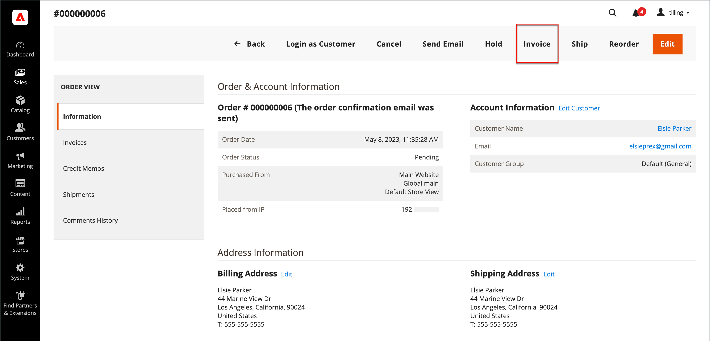
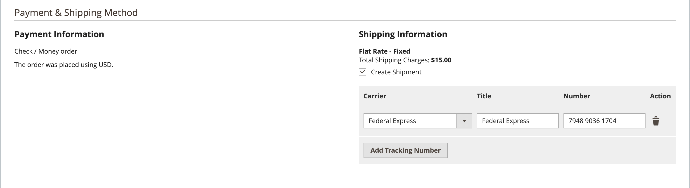
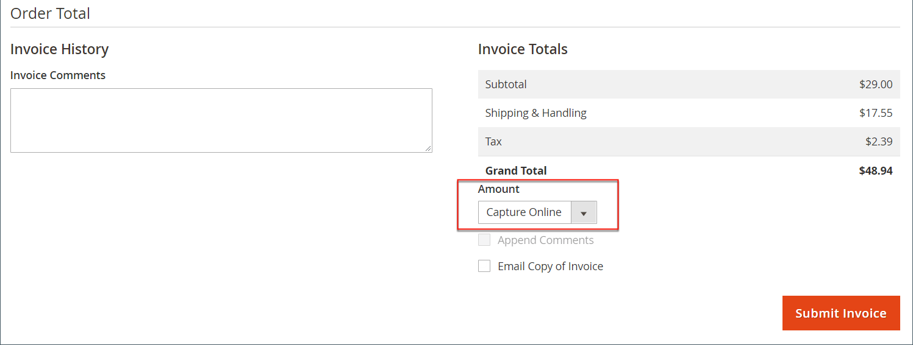
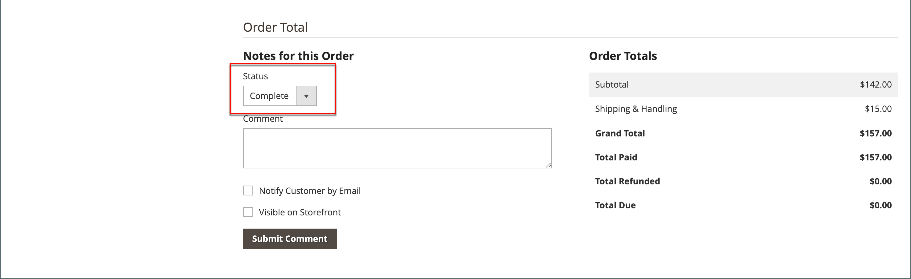
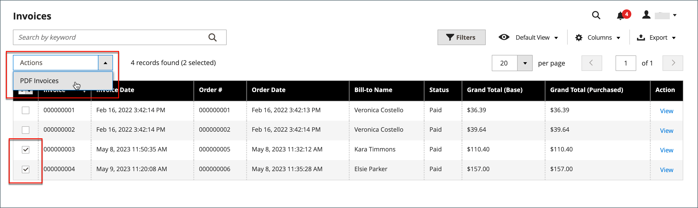

# 發票

商業發票是訂單付款記錄的記錄。 可以有多個發票 [已建立](#create-an-invoice) ，且每筆訂單可包含您指定的多或少量的已購買產品。 您也可以建立 [可列印的PDF發票](#print-invoices) 作為客戶的銷售檔案。

在 _管理員_ 側欄，前往 **[!UICONTROL Sales]** > _作業_ > **發票** 以開啟 _發票_ 並存取您建立的發票。

{width="700" zoomable="yes"}

## 欄說明

| 欄 | 說明 |
|--- |--- |
| [!UICONTROL Select] | 選取引號的核取方塊以遵循動作，或使用欄標題中的選取控制項。 選項： `Select All` / `Deselect All` |
| [!UICONTROL Invoice] | 從管理員提交商業發票時指派的唯一數值識別碼。 檢視商業發票明細時，此編號會顯示在頁面頂端，而非報價名稱。 |
| [!UICONTROL Invoice Date] | 管理員首次提交商業發票的日期和時間。 |
| [!UICONTROL Order#] | 當採購員下訂單時指派的唯一數值識別碼。 檢視商業發票明細時，此編號會顯示為「訂單與帳戶資訊」區塊中的連結。 |
| [!UICONTROL Order Date] | 客戶首次成功下訂單的日期和時間。 |
| [!UICONTROL Bill-to Name] | 負責支付訂單的人員名稱。 |
| [!UICONTROL Status] | 表示商業發票的目前狀態。 只能透過買方或賣方的動作來變更狀態。 |
| [!UICONTROL Grand Total (Base)] | 要購買的產品總價。 總金額會以網站的基本貨幣和店面的貨幣顯示。 |
| [!UICONTROL Grand Total (purchase)] | 訂單中購買的產品總數。 總金額會以網站的基本貨幣和店面的貨幣顯示。 |
| [!UICONTROL Purchased From] | 建立發票的網站/商店/商店檢視。 |
| [!UICONTROL Billing Address] | 下訂單的客戶的帳單地址。 |
| [!UICONTROL Shipping Address] | 訂單的送貨地址。 |
| [!UICONTROL Customer Name] | 接收商業發票之客戶的名字與姓氏。 |
| [!UICONTROL Email] | 接收商業發票之客戶的電子郵件地址。 |
| [!UICONTROL Customer Group] | 指定給接收商業發票之客戶的客戶群組。 |
| [!UICONTROL Payment Method] | 用於付款的付款方式。 |
| [!UICONTROL Shipping Information] | 用於出貨訂單的方法。 |
| [!UICONTROL Subtotal] | 訂單小計，不含運費與處理費以及稅金。 |
| [!UICONTROL Shipping and Handling] | 運費和處理費。 |
| [!UICONTROL Action] | **[!UICONTROL View]**  — 以編輯模式開啟發票。 |

{style="table-layout:auto"}

## 建立發票

建立訂單的商業發票會將其移至無法取消或變更的狀態。 新的發票頁面看起來類似已完成的訂單，包含一些額外的欄位。 與訂單相關的每個活動都會在發票的「備註」區段中註明。

通常會在出貨處理開始時，對訂單開立商業發票並擷取。 如果付款方式為採購單，或 [付款動作](../configuration-reference/sales/payment-methods.md#payment-actions) 設為 `Authorize and Capture`，則會在結帳時開立訂單並擷取付款。 您可以產生具有裝箱單的發票，也可以列印承運商帳戶的出貨標籤。 單一訂單可分成部份出貨，必要時會個別開立商業發票。

當新訂單的狀態設定為 `Processing`，的選項 _自動開立所有專案的發票_ 即可在設定中使用。 某些信用卡付款方式會在下列情況下，作為處理的一部份完成開立商業發票步驟： [付款動作](../configuration-reference/sales/payment-methods.md#payment-actions) 設為 `Authorize and Capture`. 在此情況下，「商業發票」按鈕不會出現，且訂單已準備出貨。

>[!NOTE]
>
>使用下訂單時，不會自動建立發票 `Gift Card`， `Store Credit`， `Reward Points`，或其他離線付款方法。

必須先產生訂單的商業發票，然後才能列印。 若要檢視或列印PDF，請先下載並安裝PDF讀取器，例如 [Adobe Acrobat Reader][1].

**_若要開立訂單商業發票，請執行下列步驟：_**

1. 在 _管理員_ 側欄，前往 **[!UICONTROL Sales]** > _[!UICONTROL Operations]_>**[!UICONTROL Orders]**.

1. 尋找狀態為「 」的銷售訂單 `Processing` 在格線中。 接著，執行下列動作：

1. 在 _動作_ 欄，按一下 **[!UICONTROL View]**.

1. 在銷售訂單的頁首中，選擇 **[!UICONTROL Invoice]** 選項。

   >[!NOTE]
   >
   >此 _[!UICONTROL Invoice]_選項未出現在 [付款動作](../configuration-reference/sales/payment-methods.md#payment-actions) 針對您的特定 [付款方法](../configuration-reference/sales/payment-methods.md) 設為 `Authorize and Capture`，自動產生發票。 如果下訂單且付款方式的付款作業設為，也會發生這種情況 `Authorize` 訂單已開立商業發票。

   {width="700" zoomable="yes"}

   新的發票頁面看起來與已完成的訂單頁面類似，還有其他可編輯的欄位。

1. 如果料號已準備出貨，請在建立商業發票的同時產生出貨的包裝單：

   - 在 _送貨資訊_ 區段，按一下 **[!UICONTROL Create Shipment]** 核取方塊加以選取。

     出貨記錄會在產生商業發票的同時建立。

   - 加入追蹤編號：

      - 按一下 **[!UICONTROL Add Tracking Number]**.
      - 輸入追蹤資訊： _[!UICONTROL Carrier]_，_[!UICONTROL Title]_、和 _[!UICONTROL Number]_

     {width="600" zoomable="yes"}

   - 選擇性地產生部份商業發票：

      - 在 _要開立商業發票的專案_ 區段，更新 **[!UICONTROL Qty to Invoice]** 欄位，僅包含商業發票上的特定專案。
      - 然後，按一下 **[!UICONTROL Update Qty's]**.

        {width="600" zoomable="yes"}

1. 如果訂單使用線上付款方式，請設定 **[!UICONTROL Amount]** 至適當的選項。

1. 若要在產生商業發票時透過電子郵件通知客戶，請執行下列步驟：

   - 選取 **[!UICONTROL Email Copy of Invoice]** 核取方塊。

   - 輸入任何 **[!UICONTROL Invoice Comments]**. 若要在通知電子郵件中加入註解，請將 **[!UICONTROL Append Comments]** 核取方塊。

1. 完成後，按一下 **[!UICONTROL Submit Invoice]** ，位於頁面底部。

   **_線上付款方式：_**

   {width="600" zoomable="yes"}

   **_離線付款方式：_**

   {width="600" zoomable="yes"}

   訂單狀態變更自 `Pending` 至 `Complete`.

   {width="600" zoomable="yes"}

## 列印發票

商業發票可以個別列印，也可以列印成批次。 不過，必須先為訂單產生商業發票，然後才能列印商業發票。 您可以為可列印的PDF發票上傳高解析度的標誌，並包含 [訂單ID](../stores-purchase/sales-documents.md#add-reference-ids) 在標題中。 若要使用您的標誌和地址自訂發票範本，請參閱 [PDF標誌需求](../stores-purchase/sales-documents.md#image-formats).

>[!NOTE]
>
>若要檢視或列印PDF，您必須有PDF讀取器。 您可以下載 [Adobe Reader][1] 免費。

### 列印單一發票

1. 在 _管理員_ 側欄，前往 **[!UICONTROL Sales]** > _[!UICONTROL Operations]_>**[!UICONTROL Invoices]**.

1. 在 _[!UICONTROL Invoices]_格線，找到發票，然後按一下&#x200B;**[!UICONTROL View]**在_&#x200B;動作&#x200B;_欄。

1. 在發票頂端，按一下 **[!UICONTROL Print]** 以產生商業發票的PDF。

1. 將產生的PDF儲存至檔案或列印。

### 列印多張商業發票

1. 在 _管理員_ 側欄，前往 **[!UICONTROL Sales]** > _[!UICONTROL Operations]_>**[!UICONTROL Invoices]**.

1. 在 _[!UICONTROL Invoices]_方格中，選取每個要列印商業發票的核取方塊。

1. 設定 **[!UICONTROL Actions]** 控制項至 `PDF Invoices`.

   {width="600" zoomable="yes"}

這些發票會儲存在單一PDF檔案中，可傳送至印表機或加以儲存。

## 疑難排解資源

如需疑難排解發票問題的說明，請參閱下列內容 _Commerce支援知識庫_ 文章：

- [無法以虛擬和簡單方式為套件組合產品開立發票](https://experienceleague.adobe.com/docs/commerce-knowledge-base/kb/support-tools/patches/v1-0-9/mdva-30889-magento-patch-can-t-invoice-bundle-products-virtual-and-simple.html)
- [沒有商店信用資訊的發票](https://experienceleague.adobe.com/docs/commerce-knowledge-base/kb/support-tools/patches/v1-0-8/mdva-31150-magento-patch-invoice-without-store-credit-info.html)
- [稅捐會出現在含100%折扣的商業發票上](https://experienceleague.adobe.com/docs/commerce-knowledge-base/kb/support-tools/patches/v1-0-22/mdva-35773-tax-appears-on-invoice-with-100-discount.html)
- [訂單商業發票未自動傳送](https://experienceleague.adobe.com/docs/commerce-knowledge-base/kb/support-tools/patches/v1-0-13/mdva-32545-magento-patch-order-invoices-don-t-send-automatically.html)

[1]: https://www.adobe.com/acrobat/pdf-reader.html "取得Adobe Reader"
