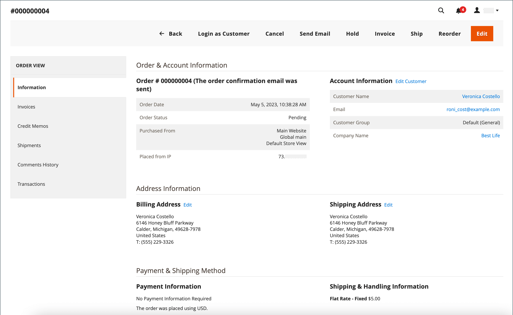
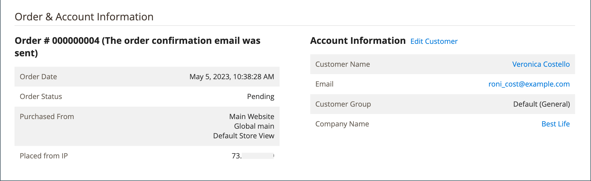
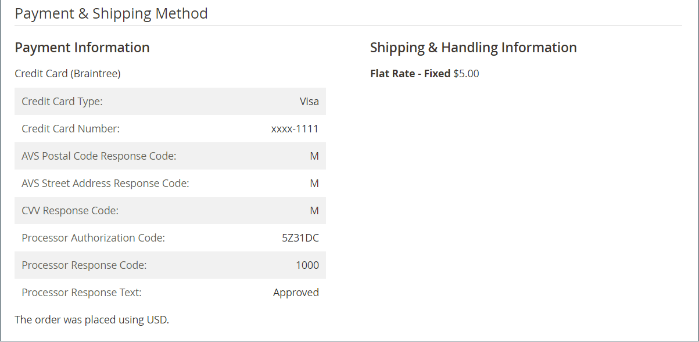

# 訂單工作流程與處理

當客戶下訂單時，銷售訂單會建立為交易的暫時記錄。 在「訂單」網格中，銷售訂單一開始的狀態為「暫緩」，而且可以在處理付款之前隨時取消。 確認付款後，便可對訂單開立商業發票並出貨。

**步驟1：下訂單** — 當購物者按一下購物車頁面上的&#x200B;**[!UICONTROL Go to Checkout]**&#x200B;或直接從他們的客戶帳戶[重新訂單](reorders-allow.md)時，結帳程式就會開始。

**步驟2：訂單擱置中** — 初始銷售訂單狀態為`Pending`。 在此狀態下，尚未處理付款，仍可編輯或取消訂單。 當付款方式設定為授權模式時，就會發生此狀態。

**步驟3：接收付款** — 收到或授權付款時，訂單狀態變更為`Processing`。 根據付款方式，您可能會在交易獲得授權或處理時收到通知。 當付款方式設定為擷取或意圖銷售模式時，此狀態會自動發生。

**步驟4：開立商業發票訂單** — 通常在收到付款後開立商業發票。 付款方式會決定訂單所需的開立商業發票選項。 產生並提交商業發票後，系統會將復本傳送給客戶。 如果付款方式設定為`capture`或`intent sale`付款動作，則當付款獲得授權並擷取時，會自動產生商業發票。

>[!NOTE]
>
>對於使用`Gift Card`、`Store Credit`、`Reward Points`或其他離線付款方式所下的訂單，不會自動建立發票。

**步驟5：預訂單一出貨** — 當出貨明細完成、出貨已預訂且出貨已設定時，訂單狀態會變更為`Complete`。 符合送貨要求，已列印包裝單並附上送貨標籤，或已選取&#x200B;_通知準備取貨_ （店內交貨方式）。 客戶收到通知，且封裝已送出。 如果使用追蹤編號，則可從客戶帳戶追蹤出貨。

>[!NOTE]
>
>如需訂單狀態與付款方式組態選項的詳細資訊，請參閱[訂單狀態](order-status.md)與[付款](payments.md)。

## 檢視訂單

1. 在&#x200B;_管理員_&#x200B;側邊欄上，移至&#x200B;**[!UICONTROL Sales]** > _[!UICONTROL Operations]_>**[!UICONTROL Orders]**。

1. 在格線中尋找順序。

1. 在&#x200B;_[!UICONTROL Action]_&#x200B;欄中按一下&#x200B;**[!UICONTROL View]**。

1. 檢查訂單狀態：

   - `Pending`訂單可以修改、保留、取消或開立商業發票與出貨。

   - `Processing`訂單無法再進行大幅編輯或取消，但帳單和送貨地址可以編輯。

   - 可以重新排序`Completed`訂單。

您可以透過編輯客戶，隨時在訂單工作流程中編輯客戶的電子郵件。 如果訂單是由來賓下達，則無法編輯電子郵件。

未結訂單的左側面板可讓您存取與訂單相關的不同型別資訊。

{width="700" zoomable="yes"}

## 處理訂單

當客戶下訂單時，銷售訂單會建立為交易的暫時記錄。 在收到付款之前，銷售訂單的狀態為`Pending`。 處於`Pending`狀態時，可以編輯或取消訂單，直到收到付款並產生發票為止。 簡單來說，訂單會變成商業發票，而商業發票會變成出貨。 「訂單」格線會列出所有訂單，無論這些訂單在工作流程中的位置為何。 若要瞭解如何協助客戶處理訂單，請參閱[更新訂單](order-update.md)。

{width="700" zoomable="yes"}

若要開啟`Pending`訂單，請按一下右上角的&#x200B;**[!UICONTROL Edit]**。

>[!NOTE]
>
>訂單只能在`Pending`狀態下編輯。 不同狀態的訂單或以[議價報價單](../b2b/quotes.md)為基礎的訂單不會顯示「編輯」按鈕。

{width="600" zoomable="yes"}

使用欄位說明作為參考，複查銷售訂單中的下列區段。

### 訂單檢視說明

| 標籤 | 說明 |
|--- |--- |
| [!UICONTROL Information] | 顯示訂單與帳戶的詳細資訊，包括帳單與出貨地址、付款與交貨方式、料號訂單、總計及備註。 |
| [!UICONTROL Invoices] | 列出與訂單相關聯的每張商業發票。 |
| [!UICONTROL Credit Memos] | 列出與訂單相關聯的每個銷退折讓單。 |
| [!UICONTROL Shipments] | 列出與訂單相關聯的每筆出貨記錄。 |
| [!UICONTROL Comments History] | 列出與訂單相關的所有附註。 |

{style="table-layout:auto"}

>[!NOTE]
>
>系統管理員使用者必須擁有其角色範圍的&#x200B;**[!UICONTROL Sales / Archive]** [許可權](../systems/permissions-user-roles.md)，才能檢視&#x200B;_發票_、_銷退折讓單_&#x200B;及&#x200B;_出貨_&#x200B;訂單標籤。

### 按鈕列

| 按鈕 | 說明 |
|--- |--- |
| **[!UICONTROL Back]** | 返回「訂單」頁面而不儲存變更。 |
| **[!UICONTROL Cancel]** | 取消銷售訂單。 |
| **[!UICONTROL Send Email]** | 傳送有關訂單的電子郵件給客戶。 |
| **[!UICONTROL Hold]** / **[!UICONTROL Unhold]** | 將銷售訂單的狀態變更為`On Hold`。 若要解除銷售訂單的保留，請選擇&#x200B;**[!UICONTROL Unhold]**。 |
| **[!UICONTROL Invoice]** | 將訂單轉換為商業發票，以從銷售訂單建立商業發票。 |
| **[!UICONTROL Ship]** | 建立訂單的出貨記錄。 |
| **[!UICONTROL Notify Order is Ready for Pickup]** | 僅在下訂單作為店內交貨時顯示。 通知客戶訂單已準備好取貨。 |
| **[!UICONTROL Reorder]** | 根據目前訂單建立銷售訂單。 |
| **[!UICONTROL Edit]** | 在編輯模式中開啟擱置訂單。 狀態為`Processing`的訂單或基於議價報價的訂單不會顯示「編輯」按鈕。 |

{style="table-layout:auto"}

### 取消訂單

您可以[取消](order-update.md)尚未開立商業發票的訂單。 如果客戶要在開立商業發票（擷取付款）後取消訂單，則必須簽發[銷退折讓單](credit-memos.md)。

如果訂單為`Pending`或`Processing`，且付款未擷取或未完全擷取，您可以[使訂單](#void-an-order)失效，而非取消訂單。

若要還原已取消的訂單，請按一下&#x200B;**[!UICONTROL Reorder]**&#x200B;按鈕，並建立狀態為`Pending`的新訂單。

>[!NOTE]
>
>取消訂單也會產生作廢，但作廢訂單不會觸發取消。

### 讓訂單失效

只有未開立商業發票、狀態為`Processing`且[付款整合設定為`Authorize`](../configuration-reference/sales/payment-methods.md#payment-actions)的銷售訂單，才能[作廢](order-update.md#void-a-processing-order)。 取消訂單後，即可取消訂單。

### [!UICONTROL Order and Account Information]

{width="600" zoomable="yes"}

#### 訂單資訊

| 欄位 | 說明 |
|--- |--- |
| [!UICONTROL Order Number] | 訂單編號會顯示在銷售訂單的頂端，後面會附註以指出是否已傳送確認電子郵件。 |
| [!UICONTROL Order Date] | 下訂單的日期和時間。 |
| [!UICONTROL Purchased From] | 表示下訂單的網站、商店和商店檢視。 |
| [!UICONTROL Placed from IP] | 表示下訂單所在電腦的IP位址。 |
| [!UICONTROL Order Placed from Quote] |  (可與Adobe Commerce B2B搭配使用)指出產生訂單的[報價單](../b2b/quotes.md) （若適用）。 報價名稱會連結至報價。 |

{style="table-layout:auto"}

#### 帳戶資訊

| 欄位 | 說明 |
|--- |--- |
| [!UICONTROL Customer Name] | 下訂單的客戶或採購員名稱。 客戶名稱會連結至客戶設定檔。 |
| [!UICONTROL Email] | 客戶或購買者的電子郵件地址。 電子郵件地址已連結，以開啟新的電子郵件訊息。 |
| [!UICONTROL Customer Group] | 將客戶指派給之客戶群組或共用目錄的名稱。 |
| [!UICONTROL Company Name] |  (可與Adobe Commerce B2B搭配使用)與購買者相關聯且代表其下訂單的公司名稱。 公司名稱已連結至[公司設定檔](../b2b/account-companies.md)。 |

{style="table-layout:auto"}

### [!UICONTROL Address Information]

{width="600" zoomable="yes"}

| 欄位 | 說明 |
|--- |--- |
| [!UICONTROL Billing Address] | 下訂單的客戶或購買者名稱，後面加上帳單地址、電話號碼和[VAT](vat.md) （如適用）。 電話號碼已連結到行動裝置上的自動撥號。 |
| [!UICONTROL Shipping Address] | 訂單應送貨之人員的名稱，然後是送貨地址與電話號碼。 電話號碼已連結到行動裝置上的自動撥號。 |

{style="table-layout:auto"}

### [!UICONTROL Payment & Shipping Method]

{width="600" zoomable="yes"}

| 欄位 | 說明 |
|--- |--- |
| [!UICONTROL Payment Information] | 用於訂單的付款方式，以及採購單編號（如果適用的話），後面接著用於下訂單的幣別。 若使用[帳戶](../b2b/enable-basic-features.md#configure-payment-on-account)付款將訂單記入公司貸方，則會指出記入帳戶的金額。 |
| [!UICONTROL Shipping & Handling Information] | 要使用的送貨方式，以及適用的任何手續費。 |

{style="table-layout:auto"}

### 檢閱訂購的專案

已訂購{width="600" zoomable="yes"}

在&#x200B;**[!UICONTROL Order Total]**&#x200B;區段中，執行下列動作：

1. 輸入要納入訂單的&#x200B;**[!UICONTROL Comment]**。

1. 如果您要透過電子郵件將註解傳送給客戶，請選取「**[!UICONTROL Notify Customer by Email]**」核取方塊。

1. 如果您希望註解顯示在客戶帳戶中，請選取「**[!UICONTROL Visible on Storefront]**」核取方塊。

   {width="600" zoomable="yes"}

1. 如果您已準備好開立商業發票，請按一下&#x200B;**[!UICONTROL Invoice]**&#x200B;並依照指示[建立商業發票](invoices.md#create-an-invoice)。

#### [!UICONTROL Items Ordered]

| 欄位 | 說明 |
|--- |--- |
| [!UICONTROL Product] | 產品名稱、SKU和選項（如適用）。 |
| [!UICONTROL Item Status] | 表示專案的狀態。 值： `Ordered` |
| [!UICONTROL Original Price] | 折扣前料號的原始型錄價格。 |
| [!UICONTROL Price] | 專案的購買價格。 此值會反映從共用目錄套用至專案的任何折扣（若適用）。 |
| [!UICONTROL Qty] | 訂購數量。 |
| [!UICONTROL Subtotal] | 小計是採購價格乘以數量。 |
| [!UICONTROL Tax Amount] | 以小數值形式套用至專案的稅金金額。 |
| [!UICONTROL Tax Percent] | 以百分比形式套用至此專案的稅捐百分比。 |
| [!UICONTROL Discount Amount] | 適用於此專案的折扣。 如果訂單是以報價為基礎，則折扣值為零。 |
| [!UICONTROL Row Total] | 明細專案總計，包括產品層次到期的適用稅捐，減去折扣。 |

{style="table-layout:auto"}

#### [!UICONTROL Notes for this Order]

| 欄位 | 說明 |
|--- |--- |
| [!UICONTROL Status] | 顯示銷售訂單的狀態。 |
| [!UICONTROL Comment] | 一個文字方塊，用來輸入訂單隨附之客戶的註解。  **[!UICONTROL Notify Customer by Email]**— 如果您要將註解以個別電子郵件的形式傳送給客戶，請選取核取方塊。 **[!UICONTROL Visible on Storefront]** — 如果您希望評論從客戶的帳戶中可見，請選取核取方塊。  **[!UICONTROL Update]**— 新增註解並傳送電子郵件（如果適用）。 |

{style="table-layout:auto"}

#### [!UICONTROL Order Totals]

| 欄位 | 說明 |
|--- |--- |
| [!UICONTROL Shipping & Handling] | 運費和手續費的金額。 |
| [!UICONTROL Tax] | 適用於訂單的稅捐金額（若適用）。 |
| [!UICONTROL Grand Total] | 訂單總計。 |
| [!UICONTROL Total Paid] | 支付給訂單的總金額（若適用）。 |
| [!UICONTROL Total Refunded] | 從訂單退款的金額總計（若適用）。 |
| [!UICONTROL Total Due] | 到期的總金額。 |
| [!UICONTROL Store Credit] |  (僅限Adobe Commerce)套用至訂單的可用商店信用額度（若適用）。 |
| [!UICONTROL Catalog Total Price] |  (可與Adobe Commerce B2B搭配使用)報價單中的料號總價（不含稅金），根據共用型錄或標準型錄中作為報價單基礎的定價而定。 如果店面顯示貨幣與基本貨幣不同，值會以兩種貨幣顯示，而店面會以方括弧顯示。 |
| [!UICONTROL Negotiated Discount] |  (可與Adobe Commerce B2B搭配使用)買方與賣家之間議價的折扣。 如果店面顯示貨幣與基本貨幣不同，值會以兩種貨幣顯示，而店面會以方括弧顯示。 |
| [!UICONTROL Subtotal] |  (可與Adobe Commerce B2B搭配使用)目錄總價減去議價折扣。 |

{style="table-layout:auto"}

## 訂單處理示範

觀看此影片，並深入瞭解訂單處理與狀態：

>[!VIDEO](https://video.tv.adobe.com/v/343935/?quality=12&learn=on)
