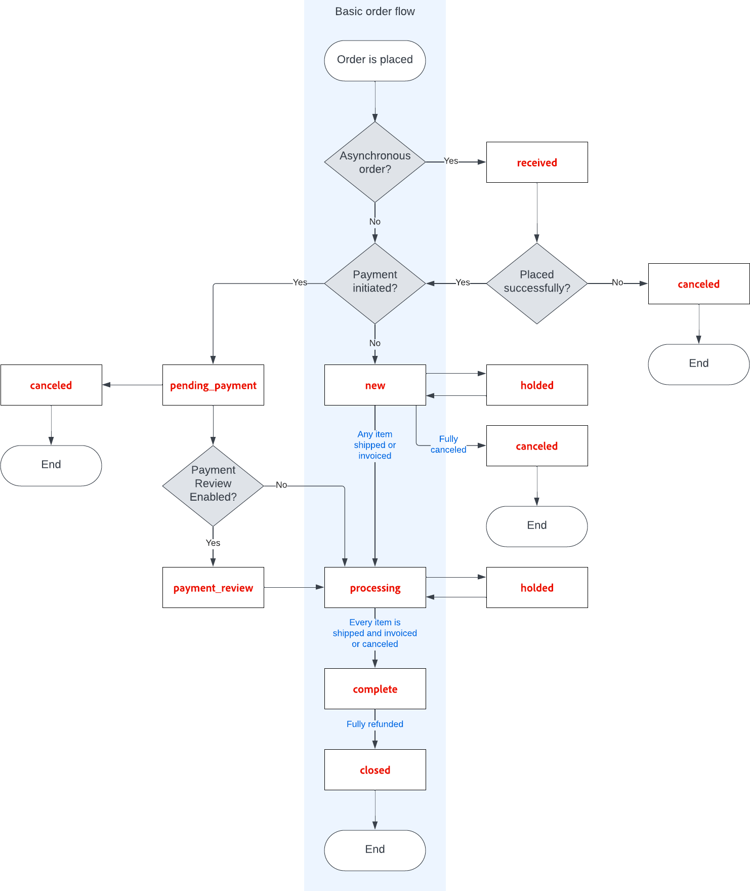

# 訂單狀態

所有訂單的訂單狀態都與訂單處理中的階段相關聯 [工作流程](order-processing.md).\
順序狀態和順序狀態之間的差異在於 **[!UICONTROL order states]** 會以程式設計方式使用。 客戶或管理員使用者看不到這些專案。 它們決定訂單的流程，以及特定狀態中訂單可能進行的作業。\
**[!UICONTROL Order statuses]** 用於向客戶和管理員使用者傳達訂單的狀態。
您可以建立其他訂單狀態，以符合您的營運需求。 訂單狀態可方便在Adobe Commerce外部顯示進度，例如訂單撿料和交貨進度。 它們對訂單處理工作流程沒有影響。\
每個訂單狀態都與一個訂單狀態相關聯。 您的商店有一組預先定義的訂單狀態和訂單狀態設定。

{width="700" zoomable="yes"}

每個訂單的狀態會顯示在 _狀態_ 的欄 _訂購_ 格線。

{width="700" zoomable="yes"}

>[!TIP]
>
>部份退款的訂單仍保留在 `Processing` 狀態結束日期 **_全部_** 已出貨的訂購料號（包括退款料號）。 訂單狀態未變更為 `Complete` 直到訂單中的每個料號都已出貨。

## 訂單狀態工作流程

## 預先定義的狀態

| 訂單狀態 | 狀態代碼 |                                                                                                                                                                                                                                                                                        |
|--------------------------|----------------------------|----------------------------------------------------------------------------------------------------------------------------------------------------------------------------------------------------------------------------------------------------------------------------------------|
| 已接收 | `received` | 此狀態是啟用非同步下單時所下訂單的初始狀態。 |
| 疑似詐騙 | `fraud` | 有時透過PayPal或其他付款閘道支付的訂單會標示為 _疑似詐騙_. 此狀態表示訂單沒有開立商業發票，也不會傳送確認電子郵件。 |
| 處理中 | `processing` | 當新訂單的狀態設為「處理中」時， _自動開立所有專案的發票_ 選項即可在設定中使用。 對於使用禮品卡、商店信用、獎勵點數或其他離線付款方式所下的訂單，不會自動建立發票。 |
| 未決付款 | `pending_payment` | 如果訂單已建立且使用PayPal或類似的付款方式，則會使用此狀態。 這表示客戶已導向付款閘道網站，但尚未收到退貨資訊。 當客戶付款時，此狀態會變更。 |
| 付款複查 | `payment_review` | 開啟PayPal付款稽核時，此狀態就會顯示。 |
| 擱置中 | `pending` | 此狀態表示尚未提交商業發票與出貨。 |
| 保留 | `holded` | 此狀態只能手動指派。 您可以保留任何訂單。 |
| 完成 | `complete` | 此狀態表示訂單已建立、已付款且已出貨給客戶。 |
| 已關閉 | `closed` | 此狀態表示訂單已指定銷退折讓單，且客戶已收到退款。 |
| 已取消 | `canceled` | 此狀態會在「管理員」中手動指派，或針對某些付款閘道，在客戶未在指定時間內付款時指派。 |
| 已拒絕 | `rejected` | 此狀態表示訂單在非同步訂單處理期間遭到拒絕。 非同步下單期間發生en錯誤時，就會發生此狀況。 |
| PayPal已取消迴轉 | `paypay_canceled_reversal` | 此狀態表示PayPal已取消迴轉。 |
| 擱置中的PayPal | `pending_paypal` | 此狀態表示PayPal已收到訂單，但尚未處理付款。 |
| PayPal已回覆 | `paypal_reversed` | 此狀態表示PayPal已迴轉交易。 |

{style="table-layout:auto"}

## 自訂訂單狀態

除了預設的訂單狀態設定外，您也可以建立自己的自訂訂單狀態設定、將其指派給訂單狀態，以及設定訂單狀態的預設訂單狀態。 訂單狀態會指出訂單在訂單處理工作流程中的位置，而訂單狀態會將有意義的可翻譯標籤指定給訂單的位置。 例如，您可能需要自訂訂單狀態，例如 `packaging"`， `backordered`或特定於您需求的狀態。 您可以為自訂狀態建立描述性名稱，並將其指派給工作流程中的關聯訂單狀態。

>[!NOTE]
>
>訂單工作流程中只會使用預設的自訂訂單狀態值。 未設定為預設的自訂狀態值只能用於訂單的註解區段。

{width="700" zoomable="yes"}

### 建立自訂訂單狀態

1. 在 _管理員_ 側欄，前往 **[!UICONTROL Stores]** > _[!UICONTROL Settings]_>**[!UICONTROL Order Status]**.

1. 在右上角，按一下 **[!UICONTROL Create New Status]**.

   {width="600" zoomable="yes"}

1. 更新 _[!UICONTROL Order Status Information]_區段：

   - 輸入 **[!UICONTROL Status Code]** 以供內部參考。 第一個字元必須是字母(a-z)，其餘字元可以是字母和數字(0-9)的任意組合。 請使用底線字元，而非空格。

   - 的 **[!UICONTROL Status Label]**，在管理員和店面中輸入可識別狀態設定的標籤。

1. 在 _[!UICONTROL Store View Specific Labels]_區段，輸入不同商店檢視所需的任何標籤。

1. 按一下 **[!UICONTROL Save Status]**.

### 將訂單狀態指派給狀態

1. 在 _訂單狀態_ 頁面，按一下 **[!UICONTROL Assign Status to State]**.

   {width="600" zoomable="yes"}

1. 更新 **[!UICONTROL Assignment Information]** 區段，請執行下列動作：

   - 選擇 **[!UICONTROL Order Status]** 要指派的專案。 它們會依狀態標籤列出。

   - 設定 **[!UICONTROL Order State]** 至工作流程中訂單狀態所屬的位置。

     >[!NOTE]
     >
     >**_[!UICONTROL Order State]_** 清單包含預設的指派順序狀態。 例如， `Pending` 預設訂單狀態會顯示，而非 `New` 訂購狀態值。

   - 若要將此狀態設為訂購狀態的預設值，請選取 **[!UICONTROL Use Order Status as Default]** 核取方塊。

     >[!NOTE]
     >
     >訂單工作流程中只會使用預設訂單狀態。 非預設狀態只能在 **[!UICONTROL Order Comments]** 區段建立關聯。

   - 若要從店面顯示此狀態，請選取 **[!UICONTROL Visible On Storefront]** 核取方塊。

   {width="600" zoomable="yes"}

1. 按一下 **[!UICONTROL Save Status Assignment]**.

### 編輯現有訂單狀態

1. 在 _[!UICONTROL Order Status]_格線中，以編輯模式開啟狀態記錄。

1. 視需要更新狀態設定。

1. 按一下 **[!UICONTROL Save Status]**.

### 從已指派狀態中移除訂單狀態

>[!NOTE]
>
>如果狀態正在使用中，則無法從狀態中取消指派狀態設定。

1. 在 _[!UICONTROL Order Status]_格線，尋找要取消指派的訂單狀態記錄。

1. 在 _[!UICONTROL Action]_欄的右側，按一下&#x200B;**[!UICONTROL Unassign]**連結。

   工作區的頂端會顯示訊息，指出訂單狀態已取消指派。 雖然訂單狀態標籤仍會顯示在清單中，但已不再指派給狀態。 無法刪除訂單狀態設定。

>[!NOTE]
>
>如果預設訂單狀態是從訂單狀態取消指派， _**其他**_ 訂單狀態為 _**自動設定**_ 作為此訂單狀態的預設值。

## 通知

客戶可透過以下方式追蹤其訂單的狀態 [RSS摘要](../merchandising-promotions/social-rss.md) 是否已在設定中啟用Order RSS摘要。 啟用時，每張訂單上都會顯示RSS摘要的連結。

### 啟用訂單狀態通知

1. 在 _管理員_ 側欄，前往 **[!UICONTROL Stores]** > _[!UICONTROL Settings]_>**[!UICONTROL Configuration]**.

1. 在左側面板中，展開 **[!UICONTROL Catalog]** 並選擇 **[!UICONTROL RSS Feeds]** 底下。

1. 展開  此 **[!UICONTROL Order]** 區段。

1. 設定 **[!UICONTROL Customer Order Status Notification]** 至 `Enable`.

   {width="600" zoomable="yes"}

1. 完成後，按一下 **[!UICONTROL Save Config]**.

### 設定新訂單電子郵件通知

1. 在 _管理員_ 側欄，前往 **[!UICONTROL Stores]** > _[!UICONTROL Settings]_>**[!UICONTROL Configuration]**.

1. 在左側面板中，展開 **[!UICONTROL Sales]** 並選擇 **[!UICONTROL Sales Emails]** 底下。

1. 展開  此 **[!UICONTROL Order]** 區段。

   {width="600" zoomable="yes"}

1. 設定 **[!UICONTROL New Order Confirmation Email Sender]** 變更為下列其中一項：

   - `General Contact`
   - `Sales Representative`
   - `Customer Support`
   - `Custom Email 1`
   - `Custom Email 2`

1. 選擇您要用於每種客戶型態的範本：

   - **[!UICONTROL New Order Confirmation Template]**  — 選擇範本以用於擁有已註冊商店帳戶的客戶。
   - **[!UICONTROL New Order Confirmation Template for Guest]**  — 選擇範本以用於沒有註冊商店帳戶的訪客客戶。

1. 若要通知其他人員（例如業務經理）新訂單，請輸入電子郵件地址 **[!UICONTROL Send Order Email Copy To]**.

   如果需要一個以上的收件者，您可以新增多個電子郵件地址。

1. 設定 **[!UICONTROL Send Order Email Copy Method]** 變更為下列其中一項：

   - `Bcc`  — 只會將一封有關新訂單的電子郵件同時傳送給客戶和其他收件者，但客戶看不到他們收到的電子郵件也傳送給了其他收件者。
   - `Separate Email`  — 會傳送兩封個別的電子郵件 — 一封給收件者，一封給客戶。

1. 完成後，按一下 **[!UICONTROL Save Config]**.
