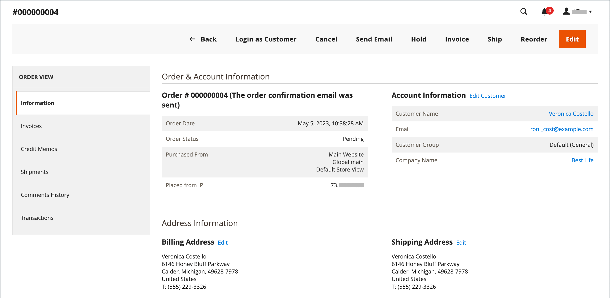

# 更新訂單

在協助已下訂單的客戶時，您必須判斷訂單的狀態。 `Pending`訂單的可用選項與`Processing`訂單的選項不同。 如需詳細資訊，請參閱[處理訂單](order-processing.md)。

## 待處理訂單

客戶下訂單後，但在收到付款之前，訂單處於`Pending`狀態。 您可以編輯訂單、保留訂單或完全取消訂單。 暫緩訂單的按鈕列會列出訂單可用的動作。

{width="600" zoomable="yes"}

如果您修改訂單的主要部分，則會取消原始訂單並產生新訂單。 不過，您可以變更帳單或送貨地址，而不產生新訂單。

| 按鈕 | 說明 |
|--- |--- |
| **[!UICONTROL Back]** | 返回「訂單」頁面而不儲存變更。 |
| **[!UICONTROL Login as Customer]** | 允許管理員使用者協助客戶處理訂單。 |
| **[!UICONTROL Cancel]** | 取消待處理訂單。 |
| **[!UICONTROL Send Email]** | 傳送有關待定訂單的電子郵件給客戶。 |
| **[!UICONTROL Hold]** / **[!UICONTROL Unhold]** | 將擱置訂單的狀態變更為`On Hold`。 若要解除保留，請選擇&#x200B;_[!UICONTROL Unhold]_。 |
| **[!UICONTROL Invoice]** | 透過將訂單轉換為發票，從暫緩訂單建立[發票](invoices.md#create-an-invoice)，並將訂單狀態變更為`processing`。 |
| **[!UICONTROL Ship]** | 建立訂單的[出貨](shipments.md#create-a-shipment)記錄。 |
| **[!UICONTROL Reorder]** | 建立與目前暫緩訂單重複的新暫緩訂單。 |
| **[!UICONTROL Edit]** | 在編輯模式中開啟擱置訂單。 「編輯」按鈕僅適用於暫緩訂單，或基於交涉[報價單](../b2b/quotes.md)的訂單。 |

{style="table-layout:auto"}

## 處理訂單

訂單在下列情況下進入`Processing`狀態：

* 當付款動作設為`Authorize and Capture`時，會收到/擷取訂單的付款，並產生商業發票。
* 已授權訂單交易，但尚未擷取付款 — 當付款動作設為`Authorize`時。

[付款動作組態](../configuration-reference/sales/payment-methods.md#payment-actions)會決定建立訂單後可用的訂單動作。

您無法大幅變更`Processing`訂單，但可以編輯帳單和送貨地址。

{width="600" zoomable="yes"}

>[!NOTE]
>
>當付款方式的付款動作設為`Authorize and Capture`時，客戶下訂單時會自動建立商業發票。 在這種情況下，您可以使用[銷退折讓單](credit-memo-create.md)退款，但無法[取消](#cancel-a-pending-order)或[作廢](#void-a-processing-order)訂單。

| 按鈕 | 說明 |
|--- |--- |
| **[!UICONTROL Back]** | 返回「訂單」頁面而不儲存變更。 |
| **[!UICONTROL Send Email]** | 傳送有關訂單的電子郵件給客戶。 |
| **[!UICONTROL Void]** | [無效](#void-a-processing-order)訂單交易或部份訂單交易。 |
| **[!UICONTROL Credit Memo]** | 啟動建立[銷退折讓單](credit-memo-create.md)的程式。 |
| **[!UICONTROL Hold]** / **[!UICONTROL Unhold]** | 將銷售訂單的狀態變更為`On Hold`。 若要解除銷售訂單的保留，請選擇&#x200B;_[!UICONTROL Unhold]_。 |
| **[!UICONTROL Reorder]** | 根據目前訂單建立新的暫緩訂單。 |
| **[!UICONTROL Create Returns]** |  (僅限Adobe Commerce)起始處理序以[從訂單傳回](returns.md)一或多個專案。 |

{style="table-layout:auto"}

## 讓處理訂單失效

當訂單仍處於`Processing`狀態且付款整合設定為`Authorize` （非`Authorize and Capture`）時，您只能作廢交易或取消訂單。 [取消訂單](#cancel-a-pending-order)也會使授權失效。

使用付款方式下訂單，且付款作業設為`Authorize and Capture`時，您可以透過銷退折讓單退回資金，但無法取消，因為已開立商業發票並擷取付款。

您的付款方式會決定您可用的付款作業。 如需詳細資訊，請參閱[付款動作](../configuration-reference/sales/payment-methods.md#payment-actions)。

**_要作廢訂單：_**

1. 在&#x200B;_管理員_&#x200B;側邊欄上，移至&#x200B;**[!UICONTROL Sales]** > _[!UICONTROL Operations]_>**[!UICONTROL Orders]**。

1. 在&#x200B;**[!UICONTROL Action]**&#x200B;欄中按一下&#x200B;**[!UICONTROL View]**，以編輯訂單。

1. 按一下&#x200B;**[!UICONTROL Void]**&#x200B;使訂單失效。

1. 在提示下，按一下&#x200B;**[!UICONTROL OK]**&#x200B;以作廢訂單。

擷取資金後，您可以使用[銷退折讓單](credit-memo-create.md)發放任何需要的退款。 您也可以建立針對產品退貨所簽發的[退貨商品授權(RMA)](returns.md)。 若要深入瞭解，請參閱[處理訂單](order-processing.md)。

## 編輯待處理訂單

1. 在&#x200B;_管理員_&#x200B;側邊欄上，移至&#x200B;**[!UICONTROL Sales]** > _[!UICONTROL Operations]_>**[!UICONTROL Orders]**。

1. 在&#x200B;**[!UICONTROL Action]**&#x200B;欄中按一下&#x200B;**[!UICONTROL View]**，以編輯訂單。

1. 按一下&#x200B;**[!UICONTROL Edit]**。

   {width="600" zoomable="yes"}

1. 出現提示時，按一下&#x200B;**[!UICONTROL OK]**&#x200B;以繼續編輯。

1. 視需要更新訂單。

1. 套用您的變更：
   * 若要儲存對帳單或送貨地址所做的變更，請按一下&#x200B;**[!UICONTROL Save]**。
   * 若要儲存對行專案所做的變更並重新處理訂單，請按一下&#x200B;**[!UICONTROL Submit Order]**。

## 保留訂單

如果客戶的偏好付款方式無法使用，或料號暫時無庫存，您可以保留訂單。

1. 在&#x200B;_訂單_&#x200B;格線中，尋找您要保留的`Pending`訂單。

1. 在&#x200B;_動作_&#x200B;資料行中，按一下&#x200B;**[!UICONTROL View]**。

1. 按一下&#x200B;**[!UICONTROL Hold]**&#x200B;以保留訂單。

若要移除訂單的保留，請再次編輯訂單，然後按一下&#x200B;**[!UICONTROL Unhold]**。

## 取消擱置中的訂單

取消訂單會將其狀態從`Pending`變更為`Canceled`。

1. 在&#x200B;_[!UICONTROL Orders]_格線中，找到要取消的擱置訂單。

1. 在&#x200B;_[!UICONTROL Action]_欄中按一下&#x200B;**[!UICONTROL View]**。

1. 按一下&#x200B;**[!UICONTROL Cancel]**&#x200B;取消訂單。

訂單的狀態現在是`Canceled`。
