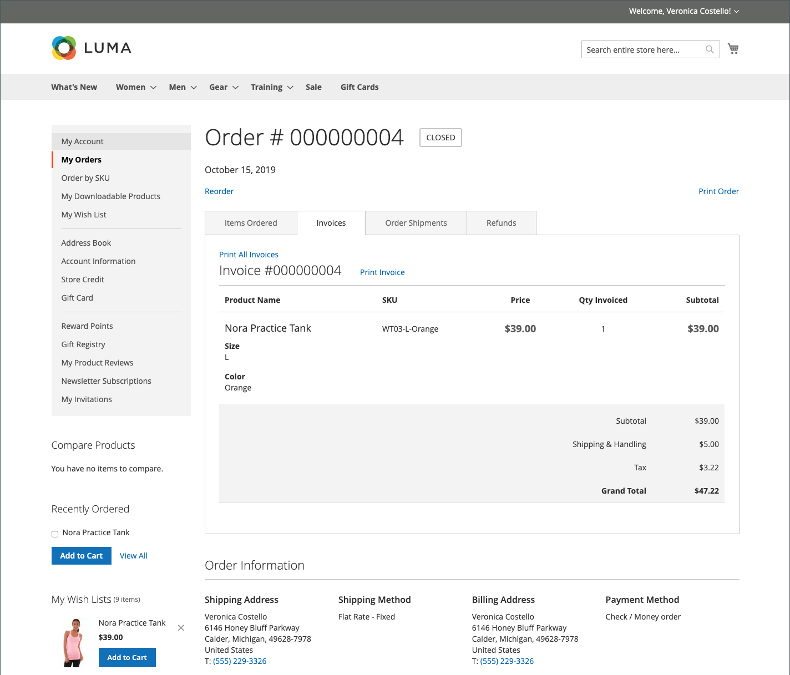
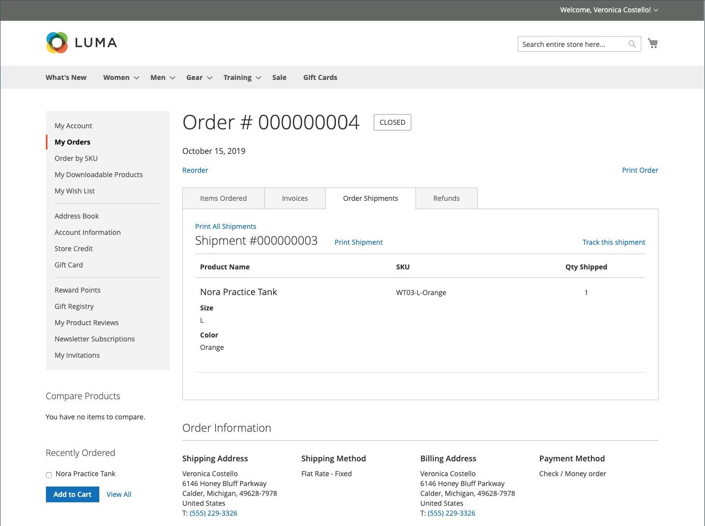
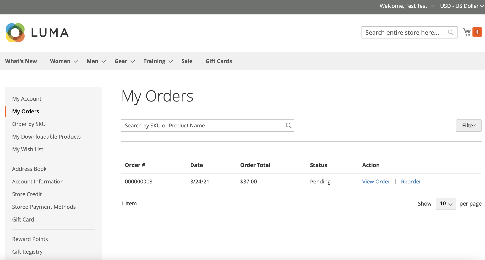

# 店面訂單管理

客戶可以從其帳戶存取其所有訂單。 訂單可以檢視、篩選、追蹤並重新提交為新訂單。 根據訂單的狀態，客戶可以列印其訂單、商業發票、出貨及退款記錄。

## 篩選訂單

{{b2b-feature}}

您的初始&#x200B;_[!UICONTROL My Orders]_&#x200B;結果也包含商業執行個體內所有網站之從屬使用者的相符訂單。 與公司帳戶關聯的客戶可以篩選訂單清單，以快速在結果中尋找記錄。 若要顯示篩選器選項，客戶按一下&#x200B;**[!UICONTROL Filter]**，然後按一下&#x200B;**[!UICONTROL Close]**&#x200B;以隱藏篩選器。

{width="700" zoomable="yes"}

| 篩選 | 說明 |
| ------ | ----------- |
| [!UICONTROL SKU or Product Name] | 輸入SKU或產品名稱。 |
| [!UICONTROL Order Number] | 可以是完整或部分訂單編號。 |
| [!UICONTROL Order Status] | 從下拉式清單中選擇值，以依據狀態篩選。 |
| [!UICONTROL Invoice Number] | 輸入完整或部分商業發票號碼。 |
| [!UICONTROL Order Date] | 設定一個或兩個日期欄位，以依訂單日期篩選。 |
| [!UICONTROL Created by] | 依訂單建立者篩選公司訂單。 |
| [!UICONTROL Order Total] | 設定最小、最大或兩個值，依訂單總計篩選。 |

## 檢視訂單

客戶在清單中找到訂單並按一下&#x200B;**[!UICONTROL View Order]**。 從未結訂單中，他們可以執行下列任一作業：

{width="700" zoomable="yes"}

### 檢視最近訂購的產品

對於下訂單後登入的客戶，**[!UICONTROL Recent Orders]**&#x200B;區塊會顯示在側邊欄和&#x200B;**[!UICONTROL My Account]**&#x200B;頁面上。 其中顯示上次購買的五個產品。

客戶可以選取產品並按一下&#x200B;**[!UICONTROL Add to Cart]**，將產品讀入購物車。 他們也可以按一下「**[!UICONTROL View all]**」以檢視最後順序，重新導向至&#x200B;_[!UICONTROL My Account]_&#x200B;頁面和&#x200B;**[!UICONTROL Recent Orders]**&#x200B;區塊。

### 列印訂單

1. 客戶按一下&#x200B;**[!UICONTROL Print Order]**。

1. 遵循「列印」對話方塊中的指示完成列印。

### 列印發票

1. 在&#x200B;**[!UICONTROL Invoices]**&#x200B;標籤上，客戶按一下下列其中一項：

   - **[!UICONTROL Print All Invoices]**

   - **[!UICONTROL Print Invoice]**

   {width="700" zoomable="yes"}

1. 使用「列印」對話方塊完成列印。

### 列印出貨

1. 在&#x200B;**[!UICONTROL Order Shipments]**&#x200B;標籤上，客戶按一下下列其中一項：

   - **[!UICONTROL Print All Shipments]**

   - **[!UICONTROL Print Shipment]**

   {width="700" zoomable="yes"}

1. 使用「列印」對話方塊完成列印。

### 追蹤出貨

1. 在&#x200B;**[!UICONTROL Order Shipments]**&#x200B;索引標籤上，按一下&#x200B;**[!UICONTROL Track this Shipment]**。

   任何可用的追蹤資訊都會顯示在快顯視窗中。

1. 準備就緒後，客戶按一下&#x200B;**[!UICONTROL Close Window]**。

### 列印退款

1. 在&#x200B;**退款**&#x200B;索引標籤上，客戶按一下下列其中一項：

   - **列印所有退款**

   - **列印退款**

   {width="700" zoomable="yes"}

1. 使用「列印」對話方塊完成列印。

啟用&#x200B;[_允許重新排序_](reorders-allow.md)&#x200B;組態選項時，客戶便可使用重新排序。

客戶可以從兩個頁面啟動特定訂單的再訂購功能：

- 我的訂單頁面
- 訂單檢視頁面

## 重新排序

_[!UICONTROL Reorder]_&#x200B;連結顯示在清單中，訂單位於&#x200B;_[!UICONTROL View]_&#x200B;連結附近。

{width="700" zoomable="yes"}

**案例1。**&#x200B;訂單中的所有產品都可供重新訂購

客戶會重新導向至購物車，而所有產品都會新增至購物車。

**案例2。**&#x200B;訂單中的部分/所有產品無法重新訂購

>[!NOTE]
>
>可以重新排序`Not Visible Individually`產品。

_[!UICONTROL Reorder]_&#x200B;連結未出現在&#x200B;_[!UICONTROL My Orders]_&#x200B;和&#x200B;_[!UICONTROL View Order]_&#x200B;頁面上。

{width="700" zoomable="yes"}

>[!TIP]
>
>如果購物車不是空的，而客戶點按&#x200B;**[!UICONTROL Reorder]** （從[!UICONTROL My Orders]或[!UICONTROL Order View]頁面），則現有產品會保留在購物車中，並新增重新訂購產品。

## 取消訂單

啟用&#x200B;[_允許取消_](cancel-allow.md)&#x200B;組態選項時，客戶即可使用取消。

客戶可以從下列三個頁面啟動特定訂單的取消功能：

- 我的訂單頁面
- 訂單檢視頁面
- 我的帳戶頁面

_[!UICONTROL Cancel Order]_&#x200B;連結顯示在&#x200B;_[!UICONTROL Reorder]_&#x200B;連結附近。 如果訂單無法取消，則不會顯示連結。

{width="700" zoomable="yes"}

若要執行取消，客戶：

1. 點按&#x200B;**[!UICONTROL Cancel Order]**

1. 提供取消原因

   {width="700" zoomable="yes"}

   您可以在&#x200B;[_允許取消_](cancel-allow.md)&#x200B;頁面上自訂取消原因。

1. 點按&#x200B;**[!UICONTROL Confirm]**

   在[我的訂單]頁面上{width="700" zoomable="yes"}

   取消後，狀態為&#x200B;_[!UICONTROL Pending]_&#x200B;的訂單、狀態變更為&#x200B;_[!UICONTROL Canceled]_&#x200B;的訂單、狀態變更為&#x200B;_[!UICONTROL Processing]_&#x200B;的訂單、狀態變更為&#x200B;_[!UICONTROL Closed]_&#x200B;的訂單，系統將處理退款。

   取消完成後，系統會傳送電子郵件給客戶。

   {width="700" zoomable="yes"}

   取消資訊會新增至客戶的訂單歷史記錄。 它會出現在順序的註記內和註解歷史記錄標籤中。

   {width="700" zoomable="yes"}

   {width="700" zoomable="yes"}

   如果訂單由於某些原因而變更為無法取消的狀態，且客戶未重新整理頁面，則仍會顯示取消訂單的連結。 但是，當他們嘗試取消時，會顯示錯誤訊息。

   {width="700" zoomable="yes"}

   重新整理頁面後，您可以看到訂單已完成，這就是取消無法運作的原因。

   {width="700" zoomable="yes"}
