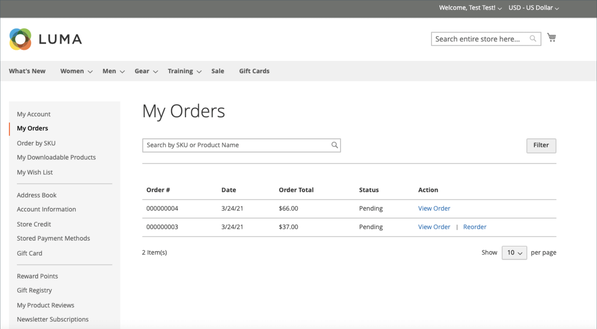

# 店面訂單管理

客戶可以從其帳戶存取其所有訂單。 訂單可以檢視、篩選、追蹤並重新提交為新訂單。 根據訂單的狀態，客戶可以列印其訂單、商業發票、出貨及退款記錄。

## 篩選訂單

{{b2b-feature}}

您的初始 _[!UICONTROL My Orders]_結果也包含來自商務執行個體內所有網站之從屬使用者的相符訂單。 與公司帳戶關聯的客戶可以篩選訂單清單，以快速在結果中尋找記錄。 若要顯示篩選器選項，客戶需按一下&#x200B;**[!UICONTROL Filter]**，和點按次數&#x200B;**[!UICONTROL Close]**以隱藏篩選器。

{width="700" zoomable="yes"}

| 篩選 | 說明 |
| ------ | ----------- |
| [!UICONTROL SKU or Product Name] | 輸入SKU或產品名稱。 |
| [!UICONTROL Order Number] | 可以是完整或部分訂單編號。 |
| [!UICONTROL Order Status] | 從下拉式清單中選擇值，以依據狀態篩選。 |
| [!UICONTROL Invoice Number] | 輸入完整或部分商業發票號碼。 |
| [!UICONTROL Order Date] | 設定一個或兩個日期欄位，以依訂單日期篩選。 |
| [!UICONTROL Created by] | 依訂單建立者篩選公司訂單。 |
| [!UICONTROL Order Total] | 設定最小、最大或兩個值，依訂單總計篩選。 |

## 檢視訂單

客戶在清單中尋找訂單並按一下 **[!UICONTROL View Order]**. 從未結訂單中，他們可以執行下列任一作業：

{width="700" zoomable="yes"}

### 檢視最近訂購的產品

此 **[!UICONTROL Recent Orders]** 區塊會顯示在側邊欄和 **[!UICONTROL My Account]** 已下訂單後登入的客戶適用的頁面。 其中顯示上次購買的五個產品。

客戶可以選取產品並按一下「 」，將產品朗讀至購物車 **[!UICONTROL Add to Cart]**. 他們也可以按一下「 」，檢視最後訂單 **[!UICONTROL View all]**，會重新導向至 _[!UICONTROL My Account]_頁面和&#x200B;**[!UICONTROL Recent Orders]**區塊。

### 列印訂單

1. 客戶點按 **[!UICONTROL Print Order]**.

1. 遵循「列印」對話方塊中的指示完成列印。

### 列印發票

1. 在 **[!UICONTROL Invoices]** 索引標籤上，客戶按一下下列其中一項：

   - **[!UICONTROL Print All Invoices]**

   - **[!UICONTROL Print Invoice]**

   {width="700" zoomable="yes"}

1. 使用「列印」對話方塊完成列印。

### 列印出貨

1. 在 **[!UICONTROL Order Shipments]** 索引標籤上，客戶按一下下列其中一項：

   - **[!UICONTROL Print All Shipments]**

   - **[!UICONTROL Print Shipment]**

   {width="700" zoomable="yes"}

1. 使用「列印」對話方塊完成列印。

### 追蹤出貨

1. 在 **[!UICONTROL Order Shipments]** 標籤，按一下 **[!UICONTROL Track this Shipment]**.

   任何可用的追蹤資訊都會顯示在快顯視窗中。

1. 準備就緒後，客戶按一下 **[!UICONTROL Close Window]**.

### 列印退款

1. 在 **退款** 索引標籤上，客戶按一下下列其中一項：

   - **列印所有退款**

   - **列印退款**

   {width="700" zoomable="yes"}

1. 使用「列印」對話方塊完成列印。

當客戶符合以下條件時，可使用重新訂購： [_允許重新排序_](reorders-allow.md) 組態選項已啟用。

客戶可以從兩個頁面啟動特定訂單的再訂購功能：

- 我的訂單頁面
- 訂單檢視頁面

## 重新排序

此 _[!UICONTROL Reorder]_連結會顯示在清單中，且訂單位於_[!UICONTROL View]_ 連結。

{width="700" zoomable="yes"}

**案例1.** 訂單中的所有產品都可供重新訂購

客戶會重新導向至購物車，而所有產品都會新增至購物車。

**案例2.** 訂單中的部分/所有產品無法重新訂購

>[!NOTE]
>
>可以重新排序 `Not Visible Individually` 產品。

此 _[!UICONTROL Reorder]_連結未出現在_[!UICONTROL My Orders]_ 和 _[!UICONTROL View Order]_頁面。

{width="700" zoomable="yes"}

>[!TIP]
>
>如果購物車非空白且客戶點按 **[!UICONTROL Reorder]** (來自 [!UICONTROL My Orders] 或 [!UICONTROL Order View] 頁面)，現有產品會保留在購物車中，並新增重新訂購產品。
