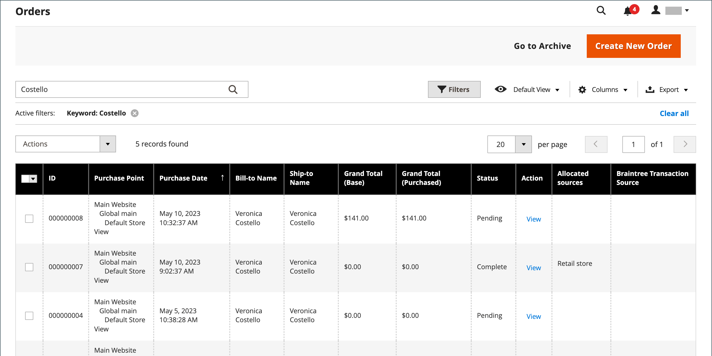

# 訂購

此 _訂購_ 格線會列出所有目前的訂單，並追蹤其進度和 [訂單狀態](order-status.md) 透過 [工作流程](order-processing.md). 要瞭解基本程式，一個簡單的方法就是讓訂單成為 [invoice](invoices.md)，則發票會變成 [出貨](shipments.md). 格線代表流程的第一階段，您可以在此執行 [更新](order-update.md) 現有訂單與建立訂單。

通常，當客戶從店面完成結帳程式時，就會建立訂單。 不過，如果客戶需要協助，您也可以存取其 [購物車](shopping-assisted-cart-manage.md) 或 [建立訂單](customer-account-create-order.md) 來自 _訂購_ 格線或直接從他們的客戶帳戶取得。

## 訂單工作區

「訂單」工作區會列出所有目前的訂單，並讓您編輯現有訂單與 [建立](customer-account-create-order.md) 訂購。 網格中的每一列代表客戶順序，而每一欄代表屬性或資料欄位。 使用標準 [控制項](../getting-started/admin-grid-controls.md) 若要排序和篩選清單，請尋找訂單並套用 [動作](../getting-started/admin-actions-control.md) 至選取的訂單。 使用分頁控制項上方的索引標籤來篩選清單、變更預設檢視、變更和重新排列欄，以及匯出資料。

{width="700" zoomable="yes"}

### 格線配置

欄的選取範圍及其在格線中的順序可根據您的偏好變更。 新版面可儲存為格線 _檢視_. 依預設，20個可用欄中只有9個會包含在格線中。

{width="600" zoomable="yes"}

#### 變更欄選擇

在右上角，按一下 _欄_ (  )控制並執行下列動作：

- 選取您要新增至格線之任何欄的核取方塊。
- 清除您要從格線移除之任何欄的核取方塊。

#### 重設欄選擇

1. 按一下 _欄_ (  )控制項。

1. 若要重設格線欄，請按一下 **[!UICONTROL Reset]**.

   格點版面配置會變更為僅顯示 [預設欄](#column-descriptions).

#### 移動欄

1. 按一下並按住欄標題。

1. 將欄拖曳到新位置並釋放。

#### 儲存格點檢視

1. 按一下 **[!UICONTROL View]** (  )控制項。

1. 按一下 **[!UICONTROL Save Current View]**.

1. 輸入 **[!UICONTROL name]** 以檢視。

1. 若要儲存所有變更，請按一下箭頭(  )。

   檢視的名稱現在會顯示為目前的檢視。

#### 變更檢視

按一下 **[!UICONTROL View]** (  )控制項。 然後，執行下列任一項作業：

- 若要使用不同的檢視，請按一下檢視的名稱。

- 若要變更檢視的名稱，請按一下 _編輯_ (  )圖示並更新名稱。

### 工作區控制項

| 控制 | 說明 |
|--- |--- |
| [!UICONTROL Create New Order] | 建立訂單。 另請參閱 [建立訂單](customer-account-create-order.md) 以取得詳細資訊。 |
| [!UICONTROL Go to Archive] | 顯示已封存訂單的清單。 |
| [!UICONTROL Search] | 根據目前篩選條件來起始訂單搜尋。 |
| [!UICONTROL Filters] | 定義一組搜尋引數，用來篩選顯示在格線中的記錄。 |
| [!UICONTROL Default View] | 決定格線的預設欄配置。 |
| [!UICONTROL Columns] | 決定欄的選取範圍及其在格線中的順序。 欄配置可以變更並儲存為 _檢視_. 依預設，網格中只包含某些欄。 |
| [!UICONTROL Export] | 將選取的記錄匯出為CSV或Excel XML檔案。 |

{style="table-layout:auto"}

### 動作

若要將動作套用至特定訂單，請選取每個訂單第一欄中的核取方塊。 若要選取或取消選取所有訂單，請使用欄頂端的控制。

{width="600" zoomable="yes"}

| 控制 | 說明 |
|--- |--- |
| [!UICONTROL Actions] | 列出可套用至所選訂單的所有動作。 若要將動作套用至訂單或訂單群組，請選取每個訂單第一欄中的核取方塊。  排序動作： `Cancel` / `Hold` / `Unhold` / `Print Invoices` / `Print Packing Slips` / `Print Credit Memos` / `Print All` / `Print Shipping Labels` / `Move to Archive`  (僅限Adobe Commerce) |
| [!UICONTROL Mass Actions] | 可用來選取多個記錄作為動作目標。 在受動作影響的每個記錄的第一欄中選取核取方塊。 選項： `Select All` / `Unselect All` / `Select Visible` / `Unselect Visible` |
| [!UICONTROL Submit] | 將目前的動作套用至選取的訂單記錄。 |
| [!UICONTROL Edit] | 以編輯模式開啟訂單。 |

{style="table-layout:auto"}

### 欄說明

| 欄 | 說明 |
|--- |--- |
| [!UICONTROL Select] | 選取引號的核取方塊以遵循動作，或使用欄標題中的選取控制項。 選項：全選/取消全選 |
| [!UICONTROL ID] | 首次儲存新訂單時指派的唯一循序編號。 |
| [!UICONTROL Purchase Point] | 識別下訂單所在的商店檢視。 |
| [!UICONTROL Purchase Date] | 下訂單的日期和時間。 它一律根據預設時區顯示。 |
| [!UICONTROL Bill-to Name] | 負責支付訂單的人員名稱。 |
| [!UICONTROL Ship-to Name] | 訂單所要送貨對象的名稱。 |
| [!UICONTROL Grand Total (Base)] | 訂單的總計。 |
| [!UICONTROL Grand Total (Purchased)] | 訂單中購買的產品總數。 |
| [!UICONTROL Status] | 目前的訂單狀態。 |
| [!UICONTROL Action] | _[!UICONTROL View]_以編輯模式開啟訂單。 |
| [!UICONTROL Allocated sources] | 配置給該特定訂單的來源。 |

{style="table-layout:auto"}

其他可用的欄：

| 欄 | 說明 |
|--- |--- |
| [!UICONTROL Billing Address] | 下訂單的客戶的帳單地址。 |
| [!UICONTROL Shipping Address] | 訂單的送貨地址。 |
| [!UICONTROL Shipping Information] | 用來出貨訂單的方法。 |
| [!UICONTROL Customer Email] | 下訂單者的電子郵件地址。 |
| [!UICONTROL Customer Group] | 下訂單者被指派到的客戶群組。 |
| [!UICONTROL Subtotal] | 訂單小計，不含運費與處理費以及稅金。 |
| [!UICONTROL Shipping and Handling] | 運費和處理費。 |
| [!UICONTROL Customer Name] | 下訂單的客戶的名字和姓氏。 |
| [!UICONTROL Payment Method] | 用於訂單的付款方式。 |
| [!UICONTROL Total Refunded] | 訂單中要退款給客戶的任何金額。 |
| [!UICONTROL Refunded to Store Credit] |  (僅限Adobe Commerce)訂單中要退款至客戶商店貸方的任何金額。 |
| [!UICONTROL Company Name] |  (可與Adobe Commerce B2B搭配使用) [公司](../b2b/account-companies.md) 下訂單的人。 |

{style="table-layout:auto"}

## 訂單搜尋

「訂單」格線左上角的「搜尋」方塊可用來依關鍵字或篩選格線中的訂單記錄來尋找特定訂單。

{width="600" zoomable="yes"}

### 搜尋相符專案

1. 在頁面搜尋方塊中輸入搜尋字詞。

1. 若要顯示結果，請按一下 _搜尋_ (  )。

### 篩選搜尋

1. 若要顯示搜尋篩選的選取專案，請按一下 _篩選器_ (  )索引標籤內。

   {width="600" zoomable="yes"}

1. 請儘可能填寫您想要描述訂單的過濾條件。

1. 按一下 **[!UICONTROL Apply Filters]** 以顯示結果。

### 搜尋篩選器

| 篩選 | 說明 |
|--- |--- |
| [!UICONTROL Purchase Date] | 根據購買日期篩選搜尋。 若要搜尋某個日期範圍內的訂單，請輸入 **[!UICONTROL from]** 和 **[!UICONTROL to]** 日期。 |
| [!UICONTROL ID] | 根據訂單ID篩選搜尋。 |
| [!UICONTROL Grand Total (Base)] | 根據每張訂單的「總計」來篩選搜尋，包括套用至訂單的任何銷退折讓。 |
| [!UICONTROL Grand Total (Purchased)] | 根據每個訂單中購買的專案總計篩選搜尋。 |
| [!UICONTROL Bill-to Name] | 根據負責支付訂單的人員姓名來篩選搜尋。 |
| [!UICONTROL Ship-to Name] | 根據每份訂單的收貨人姓名來篩選搜尋。 |
| [!UICONTROL Purchase Point] | 依下訂單的網站、商店或商店檢視來篩選搜尋。 |
| [!UICONTROL Status] | 根據訂單狀態來篩選搜尋。 選項： `Canceled` / `Closed` / `Complete` / `Suspected Fraud` / `On Hold` / `Payment Review` / `PayPal Canceled Reversal` /` PayPal Reversed` /` Pending` / `Pending Payment` / `Pending PayPal` / `Processing` |
| [!UICONTROL Braintree Transaction Source] | 根據交易來源篩選搜尋。 |

{style="table-layout:auto"}

### 搜尋工具

| 工具 | 說明 |
|--- |--- |
| [!UICONTROL Apply Filters] | 將所有篩選器套用至搜尋結果。 |
| [!UICONTROL Cancel] | 取消目前的搜尋。 |
| [!UICONTROL Clear All] | 清除所有搜尋篩選器。 |

{style="table-layout:auto"}

## 疑難排解資源

如需疑難排解訂單問題的說明，請參閱下列Commerce支援知識庫文章：

- [訂單顯示錯誤](https://experienceleague.adobe.com/docs/commerce-knowledge-base/kb/troubleshooting/storefront/magento-2.4.0-known-issue-orders-display-error.html)
- [PayPal重複訂單10415錯誤](https://experienceleague.adobe.com/docs/commerce-knowledge-base/kb/support-tools/patches/v1-0-6/mdva-31006-magento-patch-paypal-duplicate-orders-10415-error.html)
- [新訂單將傳送至封存](https://experienceleague.adobe.com/docs/commerce-knowledge-base/kb/troubleshooting/known-issues-patches-attached/new-orders-are-sent-to-archive.html)
- [未顯示在「管理員」中「訂單」網格中的訂單](https://experienceleague.adobe.com/docs/commerce-knowledge-base/kb/troubleshooting/known-issues-patches-attached/orders-not-displayed-in-the-orders-grid-in-the-admin.html)
- [訂單狀態 — 透過REST API建立的出貨不正確](https://experienceleague.adobe.com/docs/commerce-knowledge-base/kb/support-tools/patches/v1-0-7/mdva-30972-magento-patch-order-status-incorrect-shipment-created-via-rest-api.html)
