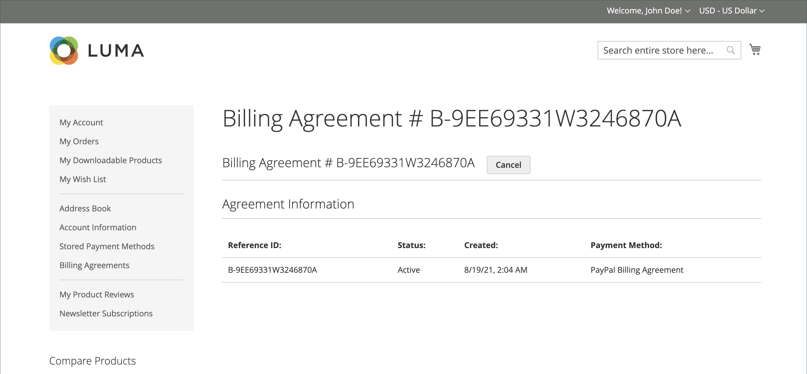

# PayPal帳單協定

為簡化結帳程式，客戶可與PayPal簽訂帳單協定，作為付款服務提供者。 結帳時，客戶選擇帳單協定作為付款方式。 付款系統透過其唯一編號來驗證帳單協定，並向客戶帳戶收費。 有了帳單協定，客戶就不再需要每次購買時輸入付款資訊。 客戶可以從其客戶帳戶的儀表板管理其帳單協定，其中每個儀表板的狀態顯示為&#x200B;_作用中_&#x200B;或&#x200B;_已取消_。 帳單協定取消時，無法重新啟用。

## 帳單協定工作流程

1. **客戶註冊帳單合約**。 建立帳單協定後，只能從客戶帳戶新增其他帳單協定。 客戶可建立的帳單協定數目沒有限制。 客戶可使用下列任一方法來註冊帳單協定：

   - **註冊客戶帳戶** — 客戶可以從其客戶帳戶註冊帳單合約。
   - **在結帳時註冊** — 使用PayPal Express結帳付款的客戶可標籤核取方塊以建立帳單合約。 雖然目前訂單未使用帳單協定，但下次客戶下訂單時，帳單協定會成為付款方式選項。
   - **由商店管理員註冊** — 根據客戶要求，商店管理員可使用客戶帳單合約建立銷售訂單。

1. **PayPal驗證並記錄合約**。 當客戶下訂單並依帳單協定付款時，帳單協定參考ID和銷售訂單付款詳細資料會移轉到PayPal並記錄在客戶帳戶中，連同參考資訊。 如果付款獲得授權，即會在Commerce中建立訂單。 帳單協定參考ID會傳送給客戶及商店。

## 管理帳單協定

_[!UICONTROL Billing Agreements]_&#x200B;頁面列出您商店與其客戶之間的所有帳單協定。 商戶可以依客戶或帳單協定資訊來篩選記錄，包括帳單協定參考識別碼、狀態和建立日期。 每個記錄都包含帳單協定的一般資訊，以及所有將其用作付款方式的銷售訂單。 您可以檢視、取消或刪除客戶帳單協定。 取消的帳單協定只能由存放區管理員刪除。

### 檢視帳單協定

1. 在&#x200B;_管理員_&#x200B;側邊欄上，移至&#x200B;**[!UICONTROL Sales]** > _[!UICONTROL Operations]_>**[!UICONTROL Billing Agreements]**。

1. 在清單中尋找帳單協定，然後按一下以開啟它。

每個帳單協定頁面都包含兩個標籤： _[!UICONTROL General Information]_&#x200B;和_[!UICONTROL Related Orders]_。

#### 一般資訊

此標籤包含帳單協定的一般資訊：

- [!UICONTROL Reference ID]：指派給目前帳單合約的唯一數值識別碼。
- [!UICONTROL Customer]：指派給目前帳單合約的客戶帳戶。
- [!UICONTROL Status]：付款協定狀態。
- [!UICONTROL Created At]：建立日期。
- [!UICONTROL Updated At]：更新日期。

{width="600" zoomable="yes"}

#### 相關訂單

此頁標會顯示使用目前帳單協定所下的訂單清單。

{width="600" zoomable="yes"}

### 取消帳單協定

1. 在&#x200B;_管理員_&#x200B;側邊欄上，移至&#x200B;**[!UICONTROL Sales]** > _[!UICONTROL Operations]_>**[!UICONTROL Billing Agreements]**。

1. 在清單中尋找帳單協定，然後按一下以開啟它。

1. 按一下右上角的&#x200B;**[!UICONTROL Cancel]**。

1. 若要確認動作，請按一下&#x200B;**[!UICONTROL OK]**。

### 刪除帳單協定

1. 在&#x200B;_管理員_&#x200B;側邊欄上，移至&#x200B;**[!UICONTROL Sales]** > _[!UICONTROL Operations]_>**[!UICONTROL Billing Agreements]**。

1. 在清單中尋找帳單協定，然後按一下以開啟它。

1. 按一下右上角的&#x200B;**[!UICONTROL Delete]**。

1. 若要確認動作，請按一下&#x200B;**[!UICONTROL OK]**。

### 欄說明

| 欄 | 說明 |
|--- |--- |
| [!UICONTROL ID] | 指派給每個帳單協定的唯一數值識別碼 |
| [!UICONTROL Email] | 客戶的連絡人電子郵件 |
| [!UICONTROL First Name] | 客戶的名字 |
| [!UICONTROL Last Name] | 客戶的姓氏 |
| [!UICONTROL Reference ID] | 指派給每個帳單合約的唯一數值參考識別碼 |
| [!UICONTROL Status] | 付款協定狀態。 選項： `Active`或`Canceled` |
| [!UICONTROL Created] | 建立日期 |
| [!UICONTROL Updated] | 更新日期 |

{style="table-layout:auto"}

## 店面體驗

客戶若與付款提供者訂立帳單協定，即可立即進行購買，並於稍後根據協定付款。 此

{width="700" zoomable="yes"}

| 欄 | 說明 |
|--- |--- |
| [!UICONTROL Reference ID] | 指派給每個帳單合約的唯一數值參考識別碼 |
| [!UICONTROL Status] | 付款協定狀態。 選項： `Active`或`Canceled` |
| [!UICONTROL Created At] | 建立日期 |
| [!UICONTROL Updated At] | 更新日期 |
| [!UICONTROL Payment Method] | 帳單協定的付款提供者 |
| [!UICONTROL View] | 用於檢視帳單協定的按鈕 |

{style="table-layout:auto"}

### 建立帳單協定

1. 客戶從他們的帳戶儀表板選取&#x200B;**[!UICONTROL Billing Agreements]**。

1. 在&#x200B;**[!UICONTROL New Billing Agreement]**&#x200B;底下，選取付款提供者。

1. 按一下&#x200B;**[!UICONTROL Create]**。

此動作會將客戶重新導向至付款系統網站。

{width="700" zoomable="yes"}

### 檢視帳單協定

1. 客戶從他們的帳戶儀表板選取&#x200B;**[!UICONTROL Billing Agreements]**。

1. 選取帳單協定並按一下&#x200B;**[!UICONTROL View]**。

{width="700" zoomable="yes"}

### 取消帳單協定

1. 客戶從他們的帳戶儀表板選取&#x200B;**[!UICONTROL Billing Agreements]**。

1. 選取帳單協定並按一下&#x200B;**[!UICONTROL View]**。

1. 在右上角，按一下&#x200B;**[!UICONTROL Cancel]**&#x200B;然後按一下&#x200B;**[!UICONTROL OK]**&#x200B;以確認。

>[!NOTE]
>
>如果管理員使用者（商家）取消帳單協定，就無法在店面取消該協定。 此合約顯示&#x200B;_已取消_&#x200B;狀態。
