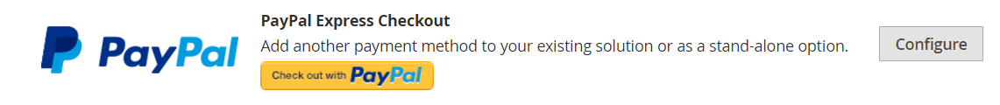

# PayPal Express簽出

PayPal Express Checkout讓您的客戶能夠透過信用卡或透過其個人PayPal帳戶的安全性付款，有助於提高銷售額。 結帳時，系統會將客戶重新導向安全的PayPal網站，以完成付款資訊。 然後，客戶會回到您的商店，以完成剩餘的結帳程式。 選擇「快速結帳」會將您熟悉的PayPal按鈕新增至商店，據報會增加銷售額。

>[!IMPORTANT]
>
>**PSD2需求：**  
>自2019年9月14日起，歐洲銀行可能會拒絕不符合規定的付款 [PSD2](../getting-started/compliance-payment-services-directive.md) 需求。 PayPal Express Checkout不需要採取任何動作即可符合PSD2，因為所有要求都由PayPal處理。

目前擁有PayPal帳戶的客戶只要按一下 _[!UICONTROL Check out with PayPal]_按鈕。 Express Checkout可作為獨立使用，或搭配其中一個PayPal多合一解決方案使用。 如果您已線上上接受信用卡，您可以提供「快速結帳」作為額外選項，以吸引偏好使用PayPal付款的新客戶。

>[!NOTE]
>
>PayPal已停止支援透過PayPal Express Checkout銷售數位產品，建議您使用 [PayPal支付標準](paypal-payments-standard.md) 或是另一個PayPal付款閘道，以處理任何訂單，包括 [虛擬產品](../catalog/product-create-virtual.md).

## 需求

- 商家： [企業PayPal帳戶][1]
- 客戶： [個人PayPal帳戶][2]

## 快速簽出工作流程

與其他付款方式不同，PayPal Express結帳可讓客戶在一般結帳工作流程的開頭從產品頁面、迷你購物車和購物車結帳。

1. **客戶下訂單**  — 客戶按一下/點選 _[!UICONTROL Check out with PayPal]_按鈕。
1. **客戶已重新導向至PayPal網站**  — 將客戶重新導向至PayPal網站以完成交易。
1. **客戶登入其PayPal帳戶**  — 客戶必須登入其PayPal帳戶才能完成交易。 付款系統使用來自其PayPal帳戶的帳單和送貨資訊。
1. **客戶返回結帳頁面**  — 系統會將客戶重新導向回商店中的結帳頁面，以便檢閱訂單。
1. **客戶下訂單**  — 客戶下訂單，並將訂單資訊提交至PayPal。
1. **PayPal結算交易** - PayPal會收到訂單並結算交易。

>[!NOTE]
>
>PayPal Express Checkout不支援具有多個地址的訂單。

## 內文中籤出

PayPal _In-Context簽出_ 讓您更輕鬆地線上上付款。 透過簡化的一鍵或兩鍵順暢結帳，客戶永遠不會忘記您的商店。 內容結帳功能在Mac和PC上同樣運作良好，且在桌上型電腦、平板電腦和行動裝置上提供一致的體驗。 若要深入瞭解，請參閱 [在Express Checkout中進行內容內簽出][5].

{width="700" zoomable="yes"}

[_PayPal內容感知簽出示範_][6]

當您為設定商店時 [!DNL PayPal Express Checkout]，您可啟用此選項。

## 設定您的PayPal帳戶

在Commerce Admin中設定PayPal Express Checkout之前，您必須在PayPal網站上設定您的商家帳戶。

1. 登入您的PayPal進階帳戶，網址為 [manager.paypal.com][3].

1. 前往 **[!UICONTROL Service Settings]** > **[!UICONTROL Hosted Checkout Pages]** > **[!UICONTROL Set Up]** 並進行下列設定：

   - **[!UICONTROL AVS]**: `No`
   - **[!UICONTROL CSC]**: `No`
   - **[!UICONTROL Enable Secure Token]**: `Yes`

1. 按一下 **[!UICONTROL Save Changes]**.

1. 設定其他使用者（由PayPal建議）：

   - 前往 [manager.paypal.com][3] 並登入您的帳戶。

   - 若要設定其他使用者，請依照指示操作。

   - 按一下 **[!UICONTROL Update]**.

## 在Commerce中設定PayPal Express簽出

您可以同時啟用兩個PayPal解決方案：PayPal Express Checkout，以及多合一解決方案。 如果您啟用不同的解決方案，先前使用的解決方案會自動停用。

>[!NOTE]
>
>按一下 **[!UICONTROL Save Config]** 隨時儲存進度。

### 步驟1：開始設定

1. 在 _管理員_ 側欄，前往 **[!UICONTROL Stores]** > _[!UICONTROL Settings]_>**[!UICONTROL Configuration]**.

1. 在左側面板中，展開 **[!UICONTROL Sales]** 並選擇 **[!UICONTROL Payment Methods]**.

1. 如果您的安裝有多個網站、商店或檢視，請設定 **[!UICONTROL Store View]** 到您要套用此設定的存放區檢視。

1. 在 _[!UICONTROL Merchant Location]_區段，選取&#x200B;**[!UICONTROL Merchant Country]**您的企業所在位置。

   此設定會決定要選取顯示在設定中的PayPal解決方案。

   {width="600" zoomable="yes"}

1. 在 _[!UICONTROL Recommended Solutions]_，按一下&#x200B;**[!UICONTROL Configure]**的&#x200B;**[!UICONTROL PayPal Express Checkout]**.

   {width="600"}

### 步驟2：啟用並連線您的PayPal帳戶

1. 如有需要，請展開  此 **[!UICONTROL Required PayPal Settings]** 區段。

   {width="600" zoomable="yes"}

1. 連線您的帳戶以進行測試或生產：

   - 若要測試（開發）模式，請按一下 **[!UICONTROL Sandbox Credentials]** 並輸入您的 [PayPal沙箱][7] 認證。
   - 在生產模式中，按一下 **[!UICONTROL Connect with PayPal]** 並輸入您的生產帳戶認證。

   當您的連線通過驗證時，您可以繼續。

1. 設定 **[!UICONTROL Enable this Solution]** 至 `Yes`.

1. 若要啟用 [PayPal In-Context簽出](#in-context-checkout)：

   - 設定 **[!UICONTROL Enable In-Context Checkout Experience]** 至 `Yes`.

   - 輸入您的PayPal **[!UICONTROL Merchant Account ID]**.

     您的商家帳戶ID位於您的PayPal企業帳戶個人資料中。

>[!NOTE]
>
>[PayPal點數](paypal.md#paypal-credit-and-pay-later) 此付款選項預設為啟用。

### 步驟3：完成必要的PayPal設定

1. 如有需要，請展開  此 **[!UICONTROL Express Checkout]** 區段。

   {width="600" zoomable="yes"}

1. （選擇性）輸入 **[!UICONTROL Email Associated with PayPal Merchant Account]**.

   >[!IMPORTANT]
   >
   >電子郵件地址區分大小寫。 若要接收付款，您輸入的電子郵件地址必須符合您在PayPal商家帳戶中指定的電子郵件地址。

   如果您沒有PayPal帳戶，請按一下 **[!UICONTROL Start accepting payments via PayPal]**.

1. 設定 **[!UICONTROL API Authentication Methods]** 變更為下列其中一項：

   - `API Signature`  — 此PayPal驗證方法最容易實作，而且是以您的使用者名稱、密碼以及可識別您帳戶的唯一字元與數字字串為基礎。 API簽章認證不會過期。
   - `API Certificate`  — 此PayPal驗證方法比較安全，是以您的使用者名稱、密碼和可下載的憑證為基礎。 API憑證會在三年後到期，且必須續約。

   如有需要，請完成下列作業：

   - **[!UICONTROL API Username]**
   - **[!UICONTROL API Password]**
   - **[!UICONTROL API Signature]**

1. 如果您使用來自沙箱帳戶的認證，請設定 **[!UICONTROL Sandbox Mode]** 至 `Yes`.

   在沙箱中測試設定時，僅使用 [信用卡號碼][4] 由PayPal建議。 當您準備好進入生產環境時，請返回設定並將沙箱模式設定為 `No` 並連線至您的生產PayPal帳戶。

1. 如果您的系統使用Proxy伺服器來建立Commerce與PayPal支付系統之間的連線，請設定 **[!UICONTROL API Uses Proxy]** 至 `Yes` 並完成下列作業：

   - **[!UICONTROL Proxy Host]**
   - **[!UICONTROL Proxy Port]**

在此步驟順序的結尾，已完成必要的PayPal設定。 您可以繼續使用基本和進階設定，或按一下 **[!UICONTROL Save Config]** 並稍後返回以調整設定

### 步驟4：設定廣告PayPal Credit /廣告PayPal PayLater （選擇性）

從2.4.3版開始，在包含PayPal的部署中支援PayPal PayLater。 此功能可讓購物者以雙週分期付款的方式支付訂單，而不需在購買時支付全額。 已棄用PayPal點數體驗。

設定 **[!UICONTROL Enable PayPal PayLater Experience]** 變更為下列其中一項：

- `Yes`  — 設定廣告PayPal PayLater
- `No`  — 若要設定廣告PayPal信用

>[!NOTE]
>
>此 **[!UICONTROL Enable PayPal PayLater Experience]** 設定不會停用 [!DNL PayPal PayLater] 功能且不會移除 **_[!UICONTROL PayPal PayLater]_** 按鈕。 若要同時停用兩者 **_[!UICONTROL PayPal PayLater]_** 和 **_[!UICONTROL PayPal Credit]_** 按鈕時，您必須選取 `PayPal Credit` 的值 **[!UICONTROL Disable Funding Options]** 設定([!UICONTROL Advanced Settings] 在 [!UICONTROL Frontend Experience Settings])。

#### 廣告PayPal點數

1. 展開  此 **[!UICONTROL Advertise PayPal Credit]** 區段。

1. 若要取得您的帳戶資訊，請按一下 **[!UICONTROL Get Publisher ID from PayPal]** 並依照指示操作。

1. 輸入您的 **[!UICONTROL Publisher ID]**.

   {width="600" zoomable="yes"}

1. 展開  此 **[!UICONTROL Home Page]** 區段。

1. 若要在頁面上放置橫幅，請設定 **[!UICONTROL Display]** 至 `Yes`.

1. 設定 **[!UICONTROL Position]** 變更為下列其中一項：

   - `Header (center)`
   - `Sidebar (right)`

1. 設定 **[!UICONTROL Size]** 變更為下列其中一項：

   - `190 x 100`
   - `234 x 60`
   - `300 x 50`
   - `468 x 60`
   - `728 x 90`
   - `800 x 66`

   {width="600" zoomable="yes"}

1. 展開  其餘部分並重複上述步驟：

   - [!UICONTROL Catalog Category Page]
   - [!UICONTROL Catalog Product Page]
   - [!UICONTROL Checkout Cart Page]

#### 廣告PayPal PayLater

1. 展開  此 **[!UICONTROL Advertise PayPal PayLater]** 區段。

1. 設定 **[!UICONTROL Enable PayPal PayLater]** 至 `Yes`.

1. 展開  此 **[!UICONTROL Home Page]** 區段。

1. 若要在頁面上放置橫幅，請設定 **[!UICONTROL Display]** 至 `Yes`.

1. 設定 **[!UICONTROL Position]** 變更為下列其中一項：

   - `Header (center)`
   - `Sidebar`

1. 設定 **[!UICONTROL Style Layout]** 變更為下列其中一項：

   - `Text`
   - `Flex`

1. 的 [!UICONTROL Style Layout] **[!UICONTROL Text]** 僅限，設定 **[!UICONTROL Logo Type]** 變更為下列其中一項：

   - `Primary`
   - `Alternative`
   - `Inline`
   - `None`

1. 的 [!UICONTROL Style Layout] **[!UICONTROL Text]** 僅限，設定 **[!UICONTROL Logo Position]** 變更為下列其中一項：

   - `Left`
   - `Right`
   - `Top`

1. 的 [!UICONTROL Style Layout] **[!UICONTROL Text]** 僅限，設定 **[!UICONTROL Text Color]** 變更為下列其中一項：

   - `Black`
   - `White`
   - `Monochrome`
   - `Grayscale`

1. 的 [!UICONTROL Style Layout] **[!UICONTROL Text]** 僅限，設定 **[!UICONTROL Text Size]** 變更為下列其中一項：

   - `10px`
   - `11px`
   - `12px`
   - `13px`
   - `14px`
   - `15px`
   - `16px`

1. 的 [!UICONTROL Style Layout] **[!UICONTROL Flex]** 僅限，設定 **[!UICONTROL Ratio]** 變更為下列其中一項：

   - `1x1`
   - `1x4`
   - `8x1`
   - `20x1`

1. 的 [!UICONTROL Style Layout] **[!UICONTROL Flex]** 僅限，設定 **[!UICONTROL Color]** 變更為下列其中一項：

   - `Blue`
   - `Black`
   - `White`
   - `White No Border`
   - `Gray`
   - `Monochrome`
   - `Grayscale`

   {width="600" zoomable="yes"}

1. 展開  其餘部分並重複上述步驟：

   - [!UICONTROL Catalog Product Page]
   - [!UICONTROL Checkout Cart Page]
   - [!UICONTROL Checkout Payment Step]
   - [!UICONTROL Catalog Category Page]

### 步驟5：完成基本設定

1. 展開  此 **[!UICONTROL Basic Settings - PayPal Express Checkout]** 區段。

   {width="600" zoomable="yes"}

1. 的 **[!UICONTROL Title]**，輸入在結帳時識別此付款方式的標題。

   建議您使用標題 _PayPal_ 用於所有商店檢視。

1. 如果您提供多種付款方式，請輸入數字 **[!UICONTROL Sort Order]** 決定與其他付款方式一起列出時，PayPal Express結帳的順序。

   此數字與其他付款方式相關。 (`0` =第一個， `1` =秒， `2` =第三個，依此類推。)

1. 設定 **[!UICONTROL Payment Action]** 變更為下列其中一項：

   - `Authorization`  — 核准購買並保留資金。 金額必須等到提取後才會提取 _已擷取_ 由商家提供。
   - `Sale`  — 採購金額已獲授權，並立即從客戶帳戶中提取。
   - `Order`  — 在PayPal的客戶餘額、銀行帳戶或信用卡中，不會擷取或授權訂單金額。 「訂單」付款動作代表PayPal付款系統與商家之間的協定。 它可讓商家在長達29天的期間內，從客戶採購員帳戶抓取一或多項最高至訂購總金額的金額。 在訂購資金後，商家可以在接下來的29天期間內隨時抓取資金。 您只能透過建立一張或多張商業發票，從「商務管理員」擷取訂單金額。

1. 若要顯示 _[!UICONTROL Check out with PayPal]_產品頁面上的按鈕，設定&#x200B;**[!UICONTROL Display on Product Details Page]**至 `Yes`.

1. 如果付款作業設為 `Order`，完成下列操作

   - **[!UICONTROL Authorization Honor Period (days)]**  — 決定主要授權的有效時間。 該值應等於您PayPal商家帳戶中的對應值。 您的PayPal商家帳戶中的預設值為 `3`. 若要增加此數目，您必須聯絡PayPal。 授權在美國太平洋時間最後一天的晚上11點49分失效。

   - **[!UICONTROL Order Valid Period (days)]**  — 決定訂單的有效時間。 訂單無效時，您將無法再為其建立商業發票。 指定等於您PayPal商家帳戶中「訂單有效期間」值的值。 您的PayPal商家帳戶中的預設值為 `29`. 若要變更此號碼，您必須連絡PayPal。

   - **[!UICONTROL Number of Child Authorizations]**  — 指定單一訂單的最大授權數目，此數目決定您可以為訂單建立的線上部份商業發票的最大數目。 此值應等於您PayPal商家帳戶中的對應設定。 您的PayPal帳戶中的預設子授權數量為 `1`. 若要增加此數目，您必須聯絡PayPal。

### 步驟6：完成進階設定

1. 展開  此 **[!UICONTROL Advanced Settings]** 區段。

   {width="600" zoomable="yes"}

1. 設定 **[!UICONTROL Display on Shopping Cart]** 至 `Yes`.

1. 設定 **[!UICONTROL Payment Applicable From]** 變更為下列其中一項：

   - `All Allowed Countries`  — 來自您商店設定中所指定之所有國家/地區的客戶均可以使用此付款方式。
   - `Specific Countries`  — 選擇此選項後， _[!UICONTROL Payment from Specific Countries]_清單隨即顯示。 若要選取多個國家/地區，請按住Ctrl鍵(PC)或Command鍵(Mac)，然後按一下每個專案。

1. 若要將與付款系統的通訊寫入記錄檔，請設定 **[!UICONTROL Debug Mode]** 至 `Yes`.

   「PayPal付款進階」的記錄檔為 `_payflow_advanced.log`.

   >[!NOTE]
   >
   >根據PCI資料安全性標準，記錄檔中不會記錄信用卡資訊。

1. 若要啟用主機驗證功能，請設定 **[!UICONTROL Enable SSL Verification]** 至 `Yes`.

1. 若要從PayPal網站依明細專案顯示客戶訂單的完整摘要，請設定 **[!UICONTROL Transfer Cart Line Items]** 至 `Yes`.

1. 若要在摘要中包含最多十個送貨選項，請設定 **[!UICONTROL Transfer Shipping Options]** 至 `Yes`. （只有行專案設為移轉時，才會顯示此選項。）

1. 若要判斷用於PayPal接受按鈕的影像型別，請設定 **[!UICONTROL Shortcut Buttons Flavor]** 變更為下列其中一項：

   - `Dynamic` - （建議）顯示可從PayPal伺服器動態變更的影像。
   - `Static`  — 顯示無法動態變更的特定影像。

1. 若要允許沒有PayPal帳戶的客戶使用此方法購物，請設定 **[!UICONTROL Enable PayPal Guest Checkout]** 至 `Yes`.

1. 設定 **[!UICONTROL Require Customer's Billing Address]** 變更為下列其中一項：

   - `Yes`  — 所有購買都需要客戶的帳單地址。
   - `No`  — 購買時不需要客戶的帳單地址。
   - `For Virtual Quotes Only`  — 僅需虛擬報價單的客戶帳單地址。

   >[!NOTE]
   >
   >必須透過PayPal技術支援為商家帳戶啟用此功能。

1. （選用）設定 **[!UICONTROL Billing Agreement Signup]** 允許客戶簽署 [帳單協定](paypal-billing-agreements.md) 當客戶帳戶中沒有可用的有效帳單協定時，在PayPal付款系統中的商店使用：

   - `Auto`  — 客戶可在「快速結帳」流程中簽署帳單協定，或使用其他付款方式。
   - `Ask Customer`  — 客戶可決定是否在「快速結帳」流程中簽署帳單協定。
   - `Never`  — 客戶在快速結帳流程中無法簽署帳單合約。

   >[!NOTE]
   >
   >商家必須詢問 [PayPal商家技術支援](https://developer.paypal.com/support/) 以在其帳戶中啟用帳單協定。 此 _帳單協定註冊_ 只有在PayPal確認您的商家帳戶已啟用帳單協定後，才會啟用引數。

1. 若要允許客戶從PayPal網站完成交易，而不返回您的商店進行訂單審查，請設定 **[!UICONTROL Skip Order Review Step]** 至 `Yes`.

1. 視需要為商店完成其他章節：

   - [PayPall帳單協定設定](#paypal-billing-agreement-settings)
   - [結算報表設定](#settlement-report-settings)
   - [前端體驗設定](#frontend-experience-settings)
   - [自訂智慧按鈕](#customize-smart-buttons)
   - [功能](#features)

1. 完成後，按一下 **[!UICONTROL Save Config]**.

#### PayPal帳單協定設定

A [帳單協定](paypal-billing-agreements.md) 是商戶與客戶之間的銷售協定，已獲得PayPal授權用於多份訂單。 在結帳程式中，「帳單協定」付款選項只會針對已與貴公司簽訂帳單協定的客戶顯示。 在PayPal授權合約之後，付款系統就會發出唯一的參考ID，以識別與合約相關聯的每張訂單。 與採購單類似，客戶可與貴公司設定的帳單協定數並無限制。

1. 展開  此 **[!UICONTROL PayPal Billing Agreement Settings]** 區段。

   {width="600" zoomable="yes"}

1. 設定 **[!UICONTROL Enabled]** 至 `Yes`.

1. 的 **[!UICONTROL Title]**，輸入在結帳時識別PayPal帳單協定方法的標題。

1. 如果您提供多種付款方式，請在 **[!UICONTROL Sort Order]** 在結帳期間與其他付款方式一起列出時，用來決定「帳單協定」顯示順序的欄位。

1. 設定 **[!UICONTROL Payment Action]** 變更為下列其中一項：

   - `Authorization`  — 核准購買並保留資金。 此金額必須等到商家「擷取」後才會提取。
   - `Sale`  — 採購金額已獲授權，並立即從客戶帳戶中提取。

1. 設定 **[!UICONTROL Payment Applicable From]** 變更為下列其中一項：

   - `All Allowed Countries`  — 來自您商店設定中所指定之所有國家/地區的客戶均可以使用此付款方式。
   - `Specific Countries`  — 選擇此選項後， _[!UICONTROL Payment from Specific Countries]_清單隨即顯示。 若要選取多個國家/地區，請按住Ctrl鍵(PC)或Command鍵(Mac)並按一下每個國家/地區。

1. 若要在記錄檔中記錄與付款系統的通訊，請設定 **[!UICONTROL Debug Mode]** 至 `Yes`.

   >[!NOTE]
   >
   >記錄檔儲存在伺服器上，只有開發人員才能存取。 根據PCI資料安全性標準，記錄檔中不會記錄信用卡資訊。

1. 若要啟用SSL驗證，請設定 **[!UICONTROL Enable SSL Verification]** 至 `Yes`.

1. 若要在PayPal付款頁面上顯示客戶訂單中每個明細專案的摘要，請設定 **[!UICONTROL Transfer Cart Line Items]** 至 `Yes`.

1. 若要允許客戶從其客戶帳戶的控制面板啟動帳單協定，請設定 **[!UICONTROL Allow in Billing Agreement Wizard]** 至 `Yes`.

#### 結算報表設定

1. 展開  此 **[!UICONTROL Settlement Report Settings]** 區段。

   {width="600" zoomable="yes"}

1. 的 **[!UICONTROL SFTP Credentials]**，請執行下列動作：

   - 如果您已註冊PayPal安全FTP伺服器，請輸入下列SFTP登入認證：

      - 登入
      - 密碼

   - 若要執行之前的測試報告 _上線_ 在您的網站上使用Express Checkout，設定 **[!UICONTROL Sandbox Mode]** 至 `Yes`.

   - 輸入 **[!UICONTROL Custom Endpoint Hostname or IP Address]**.

     預設值為： `reports.paypal.com`

   - 輸入 **[!UICONTROL Custom Path]** 報告儲存的位置。

     預設值為： `/ppreports/outgoing`

1. 若要根據排程產生報表，請填妥 **[!UICONTROL Scheduled Fetching]** 設定：

   - 設定 **[!UICONTROL Enable Automatic Fetching]** 至 `Yes`.

   - 設定 **[!UICONTROL Schedule]** 變更為下列其中一項：

      - `Daily`
      - `Every 3 Days`
      - `Every 7 Days`
      - `Every 10 Days`
      - `Every 14 Days`
      - `Every 30 Days`
      - `Every 40 Days`

     PayPal會保留每個報表45天。

   - 設定 **[!UICONTROL Time of Day]** 到您想要產生報告時的小時、分鐘和秒。

#### 前端體驗設定

使用「前端體驗設定」來選擇要在您的網站上顯示的PayPal標誌，以及自訂PayPal商家頁面的外觀。

1. 展開  此 **[!UICONTROL Frontend Experience Settings]** 區段。

   {width="600" zoomable="yes"}

1. 選取 **[!UICONTROL PayPal Product Logo]** 出現在商店的PayPal區塊中。

   PayPal標誌有四種樣式和兩種尺寸：

   - `No Logo`
   - `We Prefer PayPal (150 x 60 or 150 x 40)`
   - `Now Accepting PayPal (150 x 60 or 150 x 40)`
   - `Payments by PayPal (150 x 60 or 150 x 40)`
   - `Shop Now Using PayPal (150 x 60 or 150 x 40)`

1. 若要自訂PayPal商家頁面的外觀，請執行下列動作：

   - 輸入 **[!UICONTROL Page Style]** 要套用至PayPal商家頁面的專案：

      - `paypal`  — 使用PayPal頁面樣式。
      - `primary`  — 使用您識別為 _主要_ 帳戶設定檔中的樣式。
      - `your_custom_value`  — 使用帳戶設定檔中指定的自訂付款頁面樣式。

   - 的 **[!UICONTROL Header Image URL]**，輸入您要在付款頁面左上角顯示的影像URL。 檔案大小上限為750畫素寬x 90畫素高。

     >[!NOTE]
     >
     >PayPal建議將影像存放在安全(https)伺服器上。 否則，瀏覽器可能會警告 _此頁面包含安全和非安全專案_.

   - 若要設定頁面的顏色，請輸入六個字元的十六進位代碼，不使用 `#` 符號，代表下列各項：

      - **[!UICONTROL Header Background Color]**  — 結帳頁面標頭的背景顏色。
      - **[!UICONTROL Header Border Color]**  — 標頭周圍兩畫素邊框的色彩。
      - **[!UICONTROL Page Background Color]**  — 結帳頁面以及頁首與付款表單周圍的背景顏色。

#### 自訂智慧按鈕

此 _智慧型付款按鈕_ 功能可讓您自訂PayPal按鈕，該按鈕可顯示在「結帳」、「產品詳細資料」、「購物車」和「迷你購物車」頁面上。 PayPal的內部研究顯示，預設選項具有高度認知度，可能導致購買率提高，但其預設值可能與您的商店風格不符。 您可以選擇：

- PayPal按鈕的大小、顏色和形狀
- 顯示在PayPal按鈕上的文字
- 顯示多個按鈕時的版面（水平或垂直）

若要自訂按鈕，請展開  請調整下列各節並調整設定：

- **[!UICONTROL Checkout Page]**
- **[!UICONTROL Product Pages]**
- **[!UICONTROL Cart Page]**
- **[!UICONTROL Mini Cart]**

{width="600" zoomable="yes"}

**_若要設定每個頁面型別的按鈕顯示：_**

1. 展開  區段。

1. 設定 **[!UICONTROL Customize Button]** 至 `Yes`.

1. 若要設定PayPal在「智慧型付款」按鈕上顯示的文字，請設定 **[!UICONTROL Label]** 變更為下列其中一項：

   - `Checkout` - PayPal簽出
   - `Pay` - PayPal簽出
   - `Buy Now`  — 使用PayPal立即購買
   - `PayPal` - PayPal
   - `Installment`  - PayPal
   - `Credit` - PayPal點數

1. 設定 **[!UICONTROL Layout]** 變更為下列其中一項：

   - `Vertical` - （預設）垂直顯示PayPal智慧型按鈕。 購買者必須登入PayPal或建立PayPal帳戶，不論是否 **[!UICONTROL Enable Guest Checkout]** 已選取。
   - `Horizontal`  — 水準顯示PayPal智慧型按鈕。 時間 **[!UICONTROL Enable Guest Checkout]** ，則 **[!UICONTROL Pay with Debit Card or Credit Card]** 按鈕會顯示在PayPal快顯視窗中。 否則，購買者必須登入PayPal或建立PayPal帳戶。

1. 設定 **[!UICONTROL Size]** 變更為下列其中一項：

   - `Medium` - 250畫素x 35畫素。
   - `Large` - 350畫素x 40畫素。
   - `Responsive` - （預設）調整為容器的寬度。 最小寬度是100畫素，最大寬度是500畫素。 高度會根據寬度動態調整。

1. 設定 **[!UICONTROL Shape]** 變更為下列其中一項：

   - `Pill` - （預設）按鈕的形狀像藥丸（中央較長，端點彎曲）。
   - `Rectangle`  — 矩形中的方形形狀，不含曲線。

1. 設定 **[!UICONTROL Color]** 變更為下列其中一項：

   - `Gold` （預設）
   - `Blue`
   - `Silver`
   - `Black`

#### 功能

功能設定可讓您停用與此PayPal解決方案相關的特定功能。

1. 展開  此 **[!UICONTROL Features]** 區段。

   {width="600" zoomable="yes"}

1. 設定 **[!UICONTROL Disable Funding Options]** 以決定其他哪些PayPal資金選項會顯示在 _簽出_ 頁面。

   選取的選項不會顯示在 _簽出_ 頁面。 未選取的選項僅在PayPal支援商店幣別與購買者地點時才會顯示。 選項包括：

   - PayPal點數
   - Venmo
   - PayPal來賓結帳信用卡圖示
   - Elektronisches Lastschriftverfahren — 德文ELV

[1]: https://www.paypal.com/webapps/mpp/how-to-sell-online
[2]: https://www.paypal.com/webapps/mpp/buying-online
[3]: https://manager.paypal.com/
[4]: https://www.paypalobjects.com/en_AU/vhelp/paypalmanager_help/credit_card_numbers.htm
[5]: https://www.paypal.com/rs/webapps/mpp/express-checkout
[6]: https://demo.paypal.com/us/demo/navigation?merchant=bigbox&amp;amp;page=incontextProductCheckout
[7]: https://developer.paypal.com/docs/api-basics/sandbox/
