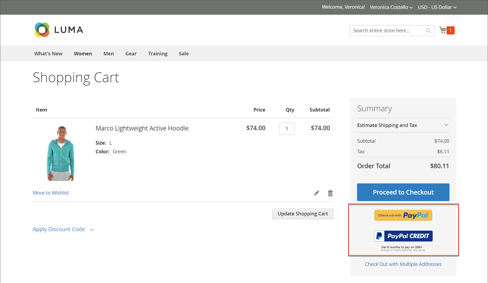

# PayPal Payflow Pro

PayPal Payflow Pro閘道（先前稱為&#x200B;_Verisign_）適用於美國、加拿大、澳洲和紐西蘭的客戶。 與其他PayPal付款方式不同，商戶每月收取固定費用，另加每項交易的固定費用（無論數量為何）。

{width="700" zoomable="yes"}

>[!IMPORTANT]
>
>**PSD2需求：**  
>自2019年9月14日起，歐洲銀行可能會拒絕不符合[PSD2](../getting-started/compliance-payment-services-directive.md)要求的付款。 為了遵循PSD2，PayPal Payflow Pro必須與協力廠商外掛程式整合。 若要深入瞭解，請參閱[Payflow](https://developer.paypal.com/api/nvp-soap/payflow/3d-secure-mpi/)的3D安全。

## 需求

- [PayPal商業帳戶][1] - PayPal Payflow Pro閘道將PayPal的商家帳戶與商家網站連結，同時充當閘道與商家帳戶。

- 如果您管理多個Adobe Commerce和Magento Open Source網站，每個網站都必須有個別的PayPal商家帳戶。

## 客戶工作流程

1. **客戶前往結帳** — 結帳期間，客戶選擇使用PayPal Payflow Pro付款，並輸入信用卡資訊。 客戶無須擁有個人PayPal帳戶。 不過，根據商家所在的國家/地區，客戶也可以使用個人PayPal帳戶支付訂單。
1. **客戶送出訂單** — 客戶送出訂單，並將訂單資訊傳送到PayPal進行處理。 客戶不會離開您網站的結帳頁面。
1. **PayPal完成交易** — 在下單時接受付款。 視組態中指定的付款作業而定，將會建立銷售訂單或銷售訂單與商業發票。

## 線上訂單處理工作流程

1. **管理員提交線上發票** — 商店管理員提交線上發票，因此建立對應的交易與發票。
1. **PayPal收到交易** — 訂單資訊已傳送給PayPal。 已產生交易與商業發票的記錄。 您可以在您的[PayPal商家帳戶][2]中檢視所有Payflow Pro Gateway交易。

>[!NOTE]
>
>PayPal Payflow Pro不支援部份商業發票與部份退款。

## 設定您的PayPal帳戶

1. 登入您的[PayPal企業帳戶][2]。

1. 使用PayPal管理員搭配下列設定來設定[託管簽出頁面][4]：

   - 在&#x200B;**[!UICONTROL Choose your settings]**&#x200B;底下，將&#x200B;**[!UICONTROL Transaction Process Mode]**&#x200B;設定為`Live`。

   - 在&#x200B;**[!UICONTROL Display options on payment page]**&#x200B;底下，將&#x200B;**取消URL方法**&#x200B;設定為`POST`。

   - 在&#x200B;**[!UICONTROL Billing Information]**&#x200B;下，選取必要和可編輯欄位的卡片安全碼&#x200B;**[!UICONTROL CSC]**&#x200B;核取方塊。

   - 在&#x200B;**[!UICONTROL Payment Confirmation]**&#x200B;底下，將&#x200B;**[!UICONTROL Return URL Method]**&#x200B;設定為`POST`。

   - 在&#x200B;**[!UICONTROL Security Options]**&#x200B;底下，完成下列設定：

      - **[!UICONTROL AVS]**： `No`
      - **[!UICONTROL CSC]**： `No`
      - **[!UICONTROL Enable Secure Token]**： `Yes`

   - 選擇&#x200B;**[!UICONTROL Customize]**，然後選擇&#x200B;**[!UICONTROL Layout C]**。

     版面C只會顯示信用卡和借記卡欄位，而且可以在您的網站上設定框架，或作為獨立的快顯視窗使用。 大小固定為490 x 565畫素，並額外留出空間以儲存錯誤訊息。 在某些系統上，此設定可更正透明重新導向的問題。

1. 組態設定完成後，按一下&#x200B;**[!UICONTROL Save and Publish]**。

1. 在PayPal管理員功能表中，選擇&#x200B;**[!UICONTROL Account Administration]**。

1. 在&#x200B;**[!UICONTROL Manage Security]**&#x200B;下，按一下&#x200B;**[!UICONTROL Transaction Settings]**&#x200B;並執行下列動作：

   - 將&#x200B;**[!UICONTROL Allow reference transactions]**&#x200B;設為`Yes`。

   - 按一下&#x200B;**[!UICONTROL Confirm]**。

     >[!NOTE]
     >
     >如果您有多個Commerce網站，則必須為每個網站建立個別的PayPal付款進階帳戶。

1. 設定其他使用者（由PayPal建議）：

   - 在主功能表的第二列，按一下&#x200B;**[!UICONTROL Manage Users]**。

   - 若要新增其他使用者到帳戶，請按一下&#x200B;**[!UICONTROL Add User]**。 此連結位於「管理使用者」標題的正上方。

   - 完成&#x200B;_[!UICONTROL Add User]_&#x200B;表單下列區段中的必填欄位：

      - [!UICONTROL Admin Confirmation]
      - [!UICONTROL User Information]
      - [!UICONTROL User Login Information]
      - [!UICONTROL Assign Privilege to User]

   - 按一下&#x200B;**[!UICONTROL Update]**。

1. 請務必登出您的PayPal帳戶。

## 在Commerce中設定PayPal Payflow Pro

>[!TIP]
>
>隨時按一下「**[!UICONTROL Save Config]**」以儲存進度。

### 步驟1：開始設定

此設定方法假設您有現有的PayPal帳戶。

1. 在&#x200B;_管理員_&#x200B;側邊欄上，移至&#x200B;**[!UICONTROL Stores]** > _[!UICONTROL Settings]_>**[!UICONTROL Configuration]**。

1. 在左側面板中，展開&#x200B;**[!UICONTROL Sales]**&#x200B;並選擇&#x200B;**[!UICONTROL Payment Methods]**。

1. 如果您的Commerce安裝有多個網站、商店或檢視，請將&#x200B;**[!UICONTROL Store View]**&#x200B;設定為您要套用此設定的商店檢視。

1. 在&#x200B;_[!UICONTROL Merchant Location]_&#x200B;區段中，選取您的企業所在的&#x200B;**[!UICONTROL Merchant Country]**。

   此設定會決定要選取顯示在設定中的PayPal解決方案。

   {width="600" zoomable="yes"}

1. 展開&#x200B;**[!UICONTROL PayPal Payment Gateways]** （如有需要）並按一下&#x200B;**[!UICONTROL Payflow Pro]**&#x200B;的&#x200B;**[!UICONTROL Configure]**。

   {width="600" zoomable="yes"}

### 步驟2：完成必要的PayPal設定

{width="600" zoomable="yes"}

1. （選擇性）輸入&#x200B;**[!UICONTROL Email Associated with your PayPal Merchant Account]**。

   >[!IMPORTANT]
   >
   >電子郵件地址區分大小寫。 若要接收付款，電子郵件地址必須與您PayPal商家帳戶中指定的電子郵件地址相符。

1. 輸入下列其中一個憑證，您可用來登入PayPal商家帳戶：

   - **[!UICONTROL Partner]** — 您的PayPal合作夥伴識別碼。
   - **[!UICONTROL User]** — 如果您在帳戶上設定一或多個其他使用者，此值是獲授權處理交易之使用者的識別碼。 但是，如果您尚未設定其他使用者，**[!UICONTROL USER]**&#x200B;會具有與&#x200B;**[!UICONTROL Vendor]**&#x200B;相同的值。
   - **[!UICONTROL Vendor]** — 您的商家登入ID是在您註冊帳戶時建立的。

1. 輸入與您的PayPal帳戶相關聯的&#x200B;**[!UICONTROL Password]**。

1. 若要執行測試交易，請將&#x200B;**[!UICONTROL Test Mode]**&#x200B;設定為`Yes`。

   在沙箱中測試設定時，只能使用PayPal建議的[信用卡號碼][3]。 當您準備好要前往生產環境時，請返回設定並將測試模式設定為`No`。

1. 如果您的系統使用Proxy伺服器來建立與PayPal系統的連線，請將&#x200B;**[!UICONTROL Use Proxy]**&#x200B;設定為`Yes`並執行下列動作：

   - 輸入&#x200B;**[!UICONTROL Proxy Host]**&#x200B;的IP位址。

   - 輸入&#x200B;**[!UICONTROL Proxy Port]**&#x200B;的連線埠號碼。

     當伺服器防火牆阻止直接存取PayPal伺服器時，就會使用Proxy。 在這種情況下，會使用協力廠商伺服器來轉送流量。

1. 將&#x200B;**[!UICONTROL Enable this Solution]**&#x200B;設為`Yes`。

1. 如果您想要提供[PayPal信用額度](paypal.md#paypal-credit-and-pay-later)給您的客戶，請將&#x200B;**[!UICONTROL Enable PayPal Credit]**&#x200B;設為`Yes`。

1. 如果您想要安全地儲存客戶付款/信用卡詳細資料，讓客戶不必每次都重新輸入付款資訊，請將&#x200B;**[!UICONTROL Vault Enabled]**&#x200B;設為`Yes`。

### 步驟3：設定廣告PayPal信用/廣告PayPal PayLater （選擇性）

從2.4.3版開始，在包含PayPal的部署中支援PayPal PayLater。 此功能可讓購物者以雙週分期付款的方式支付訂單，而不需在購買時支付全額。 已棄用PayPal點數體驗。

將&#x200B;**[!UICONTROL Enable PayPal PayLater Experience]**&#x200B;設定為下列其中一項：

- `Yes` — 若要設定PayPal PayLater廣告
- `No` — 若要設定廣告PayPal點數

#### 廣告PayPal點數

1. 展開&#x200B;**[!UICONTROL Advertise PayPal Credit]**&#x200B;區段的。

   {width="600" zoomable="yes"}

1. 若要取得您的帳戶資訊，請按一下&#x200B;**[!UICONTROL Get Publisher ID from PayPal]**&#x200B;並依照指示進行。

1. 輸入您的&#x200B;**[!UICONTROL Publisher ID]**。

1. 展開&#x200B;**[!UICONTROL Home Page]**&#x200B;區段的。

   {width="600" zoomable="yes"}

1. 若要在頁面上放置橫幅，請將&#x200B;**[!UICONTROL Display]**&#x200B;設為`Yes`。

1. 將&#x200B;**[!UICONTROL Position]**&#x200B;設定為下列其中一項：

   - `Header (center)`
   - `Sidebar (right)`

1. 將&#x200B;**[!UICONTROL Size]**&#x200B;設定為下列其中一項：

   - `190 x 100`
   - `234 x 60`
   - `300 x 50`
   - `468 x 60`
   - `728 x 90`
   - `800 x 66`

1. 展開其餘的區段，並重複先前步驟以設定首頁：

   - **[!UICONTROL Catalog Category Page]**
   - **[!UICONTROL Catalog Product Page]**
   - **[!UICONTROL Checkout Cart Page]**

#### 廣告PayPal PayLater

1. 展開&#x200B;**[!UICONTROL Advertise PayPal PayLater]**&#x200B;區段的。

1. 將&#x200B;**[!UICONTROL Enable PayPal PayLater]**&#x200B;設為`Yes`。

1. 展開&#x200B;**[!UICONTROL Home Page]**&#x200B;區段的。

   {width="600" zoomable="yes"}

1. 若要在頁面上放置橫幅，請將&#x200B;**[!UICONTROL Display]**&#x200B;設為`Yes`。

1. 將&#x200B;**[!UICONTROL Position]**&#x200B;設定為下列其中一項：

   - `Header (center)`
   - `Sidebar`

1. 將&#x200B;**[!UICONTROL Style Layout]**&#x200B;設定為下列其中一項：

   - `Text`
   - `Flex`

1. 僅針對[!UICONTROL Style Layout] **[!UICONTROL Text]**，將&#x200B;**[!UICONTROL Logo Type]**&#x200B;設定為下列其中一項：

   - `Primary`
   - `Alternative`
   - `Inline`
   - `None`

1. 僅針對[!UICONTROL Style Layout] **[!UICONTROL Text]**，將&#x200B;**[!UICONTROL Logo Position]**&#x200B;設定為下列其中一項：

   - `Left`
   - `Right`
   - `Top`

1. 僅針對[!UICONTROL Style Layout] **[!UICONTROL Text]**，將&#x200B;**[!UICONTROL Text Color]**&#x200B;設定為下列其中一項：

   - `Black`
   - `White`
   - `Monochrome`
   - `Grayscale`

1. 僅針對[!UICONTROL Style Layout] **[!UICONTROL Text]**，將&#x200B;**[!UICONTROL Text Size]**&#x200B;設定為下列其中一項：

   - `10px`
   - `11px`
   - `12px`
   - `13px`
   - `14px`
   - `15px`
   - `16px`

1. 僅針對[!UICONTROL Style Layout] **[!UICONTROL Flex]**，將&#x200B;**[!UICONTROL Ratio]**&#x200B;設定為下列其中一項：

   - `1x1`
   - `1x4`
   - `8x1`
   - `20x1`

1. 僅針對[!UICONTROL Style Layout] **[!UICONTROL Flex]**，將&#x200B;**[!UICONTROL Color]**&#x200B;設定為下列其中一項：

   - `Blue`
   - `Black`
   - `White`
   - `White No Border`
   - `Gray`
   - `Monochrome`
   - `Grayscale`

1. 展開其餘的區段，並重複之前的步驟：

   - **[!UICONTROL Catalog Product Page]**
   - **[!UICONTROL Checkout Cart Page]**
   - **[!UICONTROL Checkout Payment Step]**
   - **[!UICONTROL Catalog Category Page]**

### 步驟4：完成基本設定

1. 展開&#x200B;**[!UICONTROL Basic Settings - PayPal Payflow Pro]**&#x200B;區段的。

   {width="600" zoomable="yes"}

1. 針對&#x200B;**[!UICONTROL Title]**，輸入在結帳時識別PayPal Payflow Pro的標題。

   建議您使用標題&#x200B;_借記卡或信用卡_。

1. 如果您提供多種付款方式，請輸入&#x200B;**[!UICONTROL Sort Order]**&#x200B;的數字，以決定與其他付款方式一起列出時，Payflow Pro出現的順序。

   此數字與其他付款方式相關。 （`0` =第一個，`1` =第二個，`2` =第三個，依此類推。）

1. 將&#x200B;**[!UICONTROL Payment Action]**&#x200B;設定為下列其中一項：

   - `Authorization` — 核准購買並保留資金。 此金額必須等到商戶擷取後才會提取。
   - `Sale` — 已授權並立即從客戶帳戶中取用購買的金額。

1. 針對&#x200B;**[!UICONTROL Credit Card Settings]**，選取您接受在商店付款的信用卡。

   若要選取多個卡片，請按住Ctrl鍵(PC)或Command鍵(Mac)，然後按一下每個卡片。

   >[!NOTE]
   >
   >American Express需要額外的合約。

### 步驟5：完成進階設定

1. 展開&#x200B;**[!UICONTROL Advanced Settings]**&#x200B;區段的。

   {width="600" zoomable="yes"}

1. 將&#x200B;**[!UICONTROL Payment Applicable From]**&#x200B;設定為下列其中一項：

   - `All Allowed Countries` — 來自您商店組態中指定的所有[國家/地區](../getting-started/store-details.md#country-options)的客戶都可以使用此付款方式。
   - `Specific Countries` — 選擇此選項後，_[!UICONTROL Payment from Specific Countries]_&#x200B;清單會出現。 按住Ctrl鍵(PC)或Command鍵(Mac)，並在清單中選取客戶可在您的商店購買產品的國家/地區。

1. 若要將與付款系統的通訊寫入記錄檔，請將&#x200B;**[!UICONTROL Debug Mode]**&#x200B;設為`Yes`。

   >[!NOTE]
   >
   >根據PCI資料安全性標準，記錄檔中不會記錄信用卡資訊。

1. 若要啟用主機認證驗證，請將&#x200B;**[!UICONTROL Enable SSL Verification]**&#x200B;設為`Yes`。

1. 若要要求客戶輸入CVV代碼，請將&#x200B;**[!UICONTROL Require CVV Entry]**&#x200B;設為`Yes`。

1. 視您的商店需求，完成下列章節：

   - [CVV和AVS設定](#cvv-and-avs-settings)
   - [結算報表設定](#settlement-report-settings)
   - [前端體驗設定](#frontend-experience-settings)

#### CVV和AVS設定

若要在「位址驗證系統」識別不符狀況時，決定何時應拒絕交易，請指定如何處理各種狀況。

1. 展開&#x200B;**[!UICONTROL CVV and AVS Settings]**&#x200B;區段的。

   {width="600" zoomable="yes"}

1. 若要根據不相符的街道不符來拒絕交易，請將&#x200B;**[!UICONTROL AVS Street Does Not Match]**&#x200B;設為`Yes`。

1. 若要拒絕以不相符的郵遞區號為依據的交易，請將&#x200B;**[!UICONTROL AVS Zip Does Not Match]**&#x200B;設為`Yes`。

1. 若要根據不相符的國家識別碼拒絕交易，請將&#x200B;**[!UICONTROL International AVS Indicator Does Not Match]**&#x200B;設為`Yes`。

1. 若要拒絕以不相符的CVV程式碼為基礎的交易，請將&#x200B;**[!UICONTROL International Card Security Code Does Not Match]**&#x200B;設為`Yes`。

#### 結算報表設定

1. 展開&#x200B;**[!UICONTROL Settlement Report Settings]**&#x200B;區段的。

   {width="600" zoomable="yes"}

1. 針對&#x200B;**[!UICONTROL SFTP Credentials]**，請執行下列動作：

   - 如果您已註冊PayPal安全FTP伺服器，請輸入下列SFTP登入認證：

      - 登入
      - 密碼

   - 若要在您的網站上使用「快速簽出」功能上線之前執行測試報告，請將&#x200B;**[!UICONTROL Sandbox Mode]**&#x200B;設為`Yes`。

   - 輸入&#x200B;**[!UICONTROL Custom Endpoint Hostname or IP Address]**。

     預設值為`reports.paypal.com`。

   - 輸入儲存報告的&#x200B;**[!UICONTROL Custom Path]**。

     預設值為`/ppreports/outgoing`。

1. 若要根據排程產生報表，請完成&#x200B;**[!UICONTROL Scheduled Fetching]**&#x200B;設定：

   - 將&#x200B;**[!UICONTROL Enable Automatic Fetching]**&#x200B;設為`Yes`。

   - 將&#x200B;**[!UICONTROL Schedule]**&#x200B;設定為下列其中一項：

      - `Daily`
      - `Every 3 Days`
      - `Every 7 Days`
      - `Every 10 Days`
      - `Every 14 Days`
      - `Every 30 Days`
      - `Every 40 Days`

     PayPal會保留每個報表45天。

   - 將&#x200B;**[!UICONTROL Time of Day]**&#x200B;設為您要產生報告時的小時、分鐘和秒。

#### 前端體驗設定

使用「前端體驗設定」來選擇要在您的網站上顯示的PayPal標誌，以及自訂PayPal商家頁面的外觀。

1. 展開&#x200B;**[!UICONTROL Frontend Experience Settings]**&#x200B;區段的。

   {width="600" zoomable="yes"}

1. 選取您要在商店的PayPal區塊中顯示的&#x200B;**[!UICONTROL PayPal Product Logo]**。

   PayPal標誌有四種樣式和兩種尺寸：

   - `No Logo`
   - `We Prefer PayPal (150 x 60 or 150 x 40)`
   - `Now Accepting PayPal (150 x 60 or 150 x 40)`
   - `Payments by PayPal (150 x 60 or 150 x 40)`
   - `Shop Now Using PayPal (150 x 60 or 150 x 40)`

1. 若要自訂PayPal商家頁面的外觀：

   - 輸入您要套用至PayPal商家頁面的&#x200B;**[!UICONTROL Page Style]**&#x200B;名稱：

      - `paypal` — 使用PayPal頁面樣式。
      - `primary` — 使用您在帳戶設定檔中識別為&#x200B;_主要_&#x200B;樣式的頁面樣式。
      - `your_custom_value` — 使用帳戶設定檔中指定的自訂付款頁面樣式。

   - 針對&#x200B;**[!UICONTROL Header Image URL]**，輸入您要顯示在付款頁面左上角的影像URL。 檔案大小上限為750畫素寬x 90畫素高。

     >[!NOTE]
     >
     >PayPal建議將影像存放在安全(https)伺服器上。 否則，瀏覽器可能會警告此頁面&#x200B;_包含安全和非安全專案_。

   - 若要設定頁面的顏色，請針對下列各項，輸入6個字元的十六進位代碼（不含`#`符號）：

      - **[!UICONTROL Header Background Color]** — 結帳頁面標頭的背景顏色。
      - **[!UICONTROL Header Border Color]** — 標頭周圍兩畫素框線的色彩。
      - **[!UICONTROL Page Background Color]** — 結帳頁面及頁首與付款表單周圍的背景顏色。

### 步驟6：完成PayPal Express結帳的基本設定

1. 展開&#x200B;**[!UICONTROL Basic Settings - PayPal Express Checkout]**&#x200B;區段的。

   {width="600" zoomable="yes"}

1. 針對&#x200B;**[!UICONTROL Title]**，輸入在結帳時識別此付款方式的標題。

   建議為每個商店檢視將標題設定為&#x200B;_PayPal_。

1. 如果您提供多種付款方式，請輸入&#x200B;**[!UICONTROL Sort Order]**&#x200B;的數字，以決定與其他付款方式列示時，PayPal Express Checkout出現的順序。

   此數字與其他付款方式相關。 （`0` =第一個，`1` =第二個，`2` =第三個，依此類推。）

1. 將&#x200B;**[!UICONTROL Payment Action]**&#x200B;設定為下列其中一項：

   - `Authorization` — 核准購買並保留資金。 此金額必須等到商戶擷取&#x200B;_到_&#x200B;後才會撤回。
   - `Sale` — 已授權並立即從客戶帳戶中取用購買的金額。

1. 若要在產品頁面上顯示&#x200B;_[!UICONTROL Check out with PayPal]_&#x200B;按鈕，請將&#x200B;**[!UICONTROL Display on Product Details Page]**&#x200B;設為`Yes`。

### 步驟7：完成PayPal Express簽出的進階設定

1. 展開&#x200B;**[!UICONTROL Advanced Settings]**&#x200B;區段的。

   {width="600" zoomable="yes"}

1. 將&#x200B;**[!UICONTROL Display on Shopping Cart]**&#x200B;設為`Yes`。

1. 將&#x200B;**[!UICONTROL Payment Applicable From]**&#x200B;設定為下列其中一項：

   - `All Allowed Countries` — 來自您商店組態中所指定之所有國家/地區的客戶可以使用此付款方式。
   - `Specific Countries` — 選擇此選項後，_[!UICONTROL Payment from Specific Countries]_&#x200B;清單會出現。 若要選取多個國家/地區，請按住Ctrl鍵(PC)或Command鍵(Mac)，然後按一下每個專案。

1. 若要將與付款系統的通訊寫入記錄檔，請將&#x200B;**[!UICONTROL Debug Mode]**&#x200B;設為`Yes`。

   >[!NOTE]
   >
   >根據PCI資料安全性標準，記錄檔中不會記錄信用卡資訊。

1. 若要啟用主機認證驗證，請將&#x200B;**[!UICONTROL Enable SSL Verification]**&#x200B;設為`Yes`。

1. 若要顯示PayPal網站中明細專案的客戶訂單完整摘要，請將&#x200B;**[!UICONTROL Transfer Cart Line Items]**&#x200B;設為`Yes`。

1. 若要允許客戶從PayPal網站完成交易，而不返回您的商店進行訂單稽核，請將&#x200B;**[!UICONTROL Skip Order Review Step]**&#x200B;設為`Yes`。

1. 完成時，按一下&#x200B;**[!UICONTROL Save Config]**。

### 步驟8：新增Google reCAPTCHA

為了更能保護PayPal Payflow Pro結帳，請啟用Google reCAPTCHA。 它包含使用可點按介面或隱藏檢查來驗證客戶的重新驗證碼選項。 建議使用隱藏選項，以提高銷售轉換率並保護您的商店。 如需詳細資訊，請參閱[Google reCAPTCHA](../systems/security-google-recaptcha.md)。

[1]: https://www.paypal.com/webapps/mpp/how-to-sell-online
[2]: https://manager.paypal.com/
[3]: https://www.paypalobjects.com/en_AU/vhelp/paypalmanager_help/credit_card_numbers.htm
[4]: https://developer.paypal.com/docs/payflow/integration-guide/configure-hosted-checkout/#configuring-hosted-pages-using-paypal-manager
