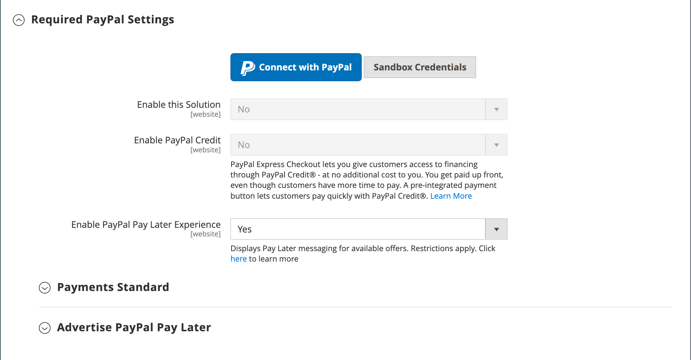

# PayPal支付標準

[PayPal Payments Standard][4]是接受線上付款的最簡單方式。 只要在商店中新增結帳按鈕，您就可以讓客戶享有信用卡和PayPal付款的便利性。

>[!NOTE]
>
>若是美國以外的商家，則稱為&#x200B;_PayPal網站支付標準_。

有了PayPal Payments Standard，您可以在行動裝置上刷信用卡。 不需每月付費，您可透過eBay支付。 支援的信用卡包括Visa、MasterCard、Discover和American Express。 此外，客戶可以直接從其個人PayPal帳戶付款。 PayPal支付標準可在PayPal全球參考清單的所有國家/地區使用。

>[!IMPORTANT]
>
>**PSD2需求：**  
>自2019年9月14日起，歐洲銀行可能會拒絕不符合[PSD2](../getting-started/compliance-payment-services-directive.md)要求的付款。 PayPal Payments Standard不需採取任何動作即可符合PSD2，因為所有要求都由PayPal處理。

## 商家需求

- [PayPal企業帳戶][1]

## 簽出工作流程

對於客戶而言，如果個人PayPal帳戶上的信用卡資訊是最新的，則PayPal Payments Standard為一步驟流程。

1. **客戶下訂單** — 客戶按一下/點選「_立即付款_」按鈕以完成購買。

1. **PayPal處理交易** — 將客戶重新導向至PayPal網站以完成交易。

## 設定PayPal付款標準

>[!NOTE]
>
>PayPal Payments Standard不能與任何其他PayPal方法同時使用，包括Express Checkout。 如果您變更付款解決方案，先前使用的解決方案會停用。

>[!TIP]
>
>隨時按一下「**[!UICONTROL Save Config]**」以儲存進度。

### 步驟1：開始設定

此設定方法假設您有現有的PayPal帳戶。

1. 在&#x200B;_管理員_&#x200B;側邊欄上，移至&#x200B;**[!UICONTROL Stores]** > _[!UICONTROL Settings]_>**[!UICONTROL Configuration]**。

1. 在左側面板中，展開&#x200B;**[!UICONTROL Sales]**&#x200B;並選擇&#x200B;**[!UICONTROL Payment Methods]**。

1. 如果您的Commerce安裝有多個網站、商店或檢視，請將&#x200B;**[!UICONTROL Store View]**&#x200B;設定為您要套用此設定的商店檢視。

1. 在&#x200B;_[!UICONTROL Merchant Location]_區段中，選取您的企業所在的&#x200B;**[!UICONTROL Merchant Country]**。

   此設定會決定要選取顯示在設定中的PayPal解決方案。

   {width="600" zoomable="yes"}

1. 展開&#x200B;**[!UICONTROL PayPal All-in-One Payment Solutions]**&#x200B;並按一下&#x200B;**[!UICONTROL Payments Standard]**&#x200B;的&#x200B;**[!UICONTROL Configure]**。

   {width="700" zoomable="yes"}

### 步驟2：啟用並連線您的PayPal帳戶

{width="600" zoomable="yes"}

1. 連線您的帳戶以進行測試或生產：

   - 若要測試（開發）模式，請按一下&#x200B;**[!UICONTROL Sandbox Credentials]**&#x200B;並輸入您的[PayPal沙箱][3]認證。
   - 在生產模式中，按一下&#x200B;**[!UICONTROL Connect with PayPal]**&#x200B;並輸入您的生產帳戶認證。

   當您的連線通過驗證時，您可以繼續。

1. 將&#x200B;**[!UICONTROL Enable this Solution]**&#x200B;設為`Yes`。

1. 如果您想要提供[PayPal信用額度](paypal.md#paypal-credit-and-pay-later)給您的客戶，請將&#x200B;**[!UICONTROL Enable PayPal Credit]**&#x200B;設為`Yes`。

### 步驟3：完成「付款標準」設定

1. 展開&#x200B;**[!UICONTROL Payments Standard]**&#x200B;區段的。

   {width="600" zoomable="yes"}

1. 輸入&#x200B;**[!UICONTROL Email Associated with your PayPal Merchant Account]**。

   >[!IMPORTANT]
   >
   >電子郵件地址區分大小寫。 若要接收付款，您輸入的電子郵件地址必須符合您在PayPal商家帳戶中指定的電子郵件地址。

   如果您沒有PayPal帳戶，請按一下&#x200B;**[!UICONTROL Start accepting payments via PayPal]**。

1. 將&#x200B;**[!UICONTROL API Authentication Methods]**&#x200B;設定為下列其中一項：

   - `API Signature` — 此PayPal驗證方法最容易實作，而且是以您的使用者名稱、密碼以及識別您帳戶的唯一字元與數字字串為基礎。 API簽章認證不會過期。
   - `API Certificate` — 此PayPal驗證方法較安全，是以您的使用者名稱、密碼和可下載的憑證為基礎。 API憑證會在三年後到期，且必須續約。

   如有需要，請完成下列作業：

   - **[!UICONTROL API Username]**
   - **[!UICONTROL API Password]**
   - **[!UICONTROL API Signature]**

1. 如果您使用來自沙箱帳戶的認證，請將&#x200B;**[!UICONTROL Sandbox Mode]**&#x200B;設為`Yes`。

   在沙箱中測試設定時，只能使用PayPal建議的[信用卡號碼][2]。 當您準備好要前往生產時，請返回設定並將沙箱模式設定為`No`並連線到您的生產PayPal帳戶。

1. 如果您的系統使用Proxy伺服器來建立Adobe Commerce或Magento Open Source與PayPal付款系統之間的連線，請將&#x200B;**[!UICONTROL API Uses Proxy]**&#x200B;設為`Yes`並完成下列作業：

   - **[!UICONTROL Proxy Host]**
   - **[!UICONTROL Proxy Port]**

### 步驟4：設定廣告PayPal Credit /廣告PayPal PayLater （選擇性）

從2.4.3版開始，在包含PayPal的部署中支援PayPal PayLater。 此功能可讓購物者以雙週分期付款的方式支付訂單，而不需在購買時支付全額。 已棄用PayPal點數體驗。

將&#x200B;**[!UICONTROL Enable PayPal PayLater Experience]**&#x200B;設定為下列其中一項：

- `Yes` — 若要設定PayPal PayLater廣告
- `No` — 若要設定廣告PayPal點數

#### 廣告PayPal點數

1. 展開&#x200B;**[!UICONTROL Advertise PayPal Credit]**&#x200B;區段的。

   {width="600" zoomable="yes"}

1. 若要取得您的帳戶資訊，請按一下&#x200B;**[!UICONTROL Get Publisher ID from PayPal]**&#x200B;並依照指示進行。

1. 輸入您的&#x200B;**[!UICONTROL Publisher ID]**。

   {width="600" zoomable="yes"}

1. 展開&#x200B;**[!UICONTROL Home Page]**&#x200B;區段的。

1. 若要在頁面上放置橫幅，請將&#x200B;**[!UICONTROL Display]**&#x200B;設為`Yes`。

1. 將&#x200B;**[!UICONTROL Position]**&#x200B;設定為下列其中一項：

   - `Header (center)`
   - `Sidebar (right)`

1. 將&#x200B;**[!UICONTROL Size]**&#x200B;設定為下列其中一項：

   - `190 x 100`
   - `234 x 60`
   - `300 x 50`
   - `468 x 60`
   - `728 x 90`
   - `800 x 66`

1. 展開其餘的區段，並重複之前的步驟：

   - **[!UICONTROL Catalog Category Page]**
   - **[!UICONTROL Catalog Product Page]**
   - **[!UICONTROL Checkout Cart Page]**

#### 廣告PayPal PayLater

1. 展開&#x200B;**[!UICONTROL Advertise PayPal PayLater]**&#x200B;區段的。

1. 將&#x200B;**[!UICONTROL Enable PayPal PayLater]**&#x200B;設為`Yes`。

1. 展開&#x200B;**[!UICONTROL Home Page]**&#x200B;區段的。

   {width="600" zoomable="yes"}

1. 若要在頁面上放置橫幅，請將&#x200B;**[!UICONTROL Display]**&#x200B;設為`Yes`。

1. 將&#x200B;**[!UICONTROL Position]**&#x200B;設定為下列其中一項：

   - `Header (center)`
   - `Sidebar`

1. 將&#x200B;**[!UICONTROL Style Layout]**&#x200B;設定為下列其中一項：

   - `Text`
   - `Flex`

1. 僅針對[!UICONTROL Style Layout] **[!UICONTROL Text]**，將&#x200B;**[!UICONTROL Logo Type]**&#x200B;設定為下列其中一項：

   - `Primary`
   - `Alternative`
   - `Inline`
   - `None`

1. 僅針對[!UICONTROL Style Layout] **[!UICONTROL Text]**，將&#x200B;**[!UICONTROL Logo Position]**&#x200B;設定為下列其中一項：

   - `Left`
   - `Right`
   - `Top`

1. 僅針對[!UICONTROL Style Layout] **[!UICONTROL Text]**，將&#x200B;**[!UICONTROL Text Color]**&#x200B;設定為下列其中一項：

   - `Black`
   - `White`
   - `Monochrome`
   - `Grayscale`

1. 僅針對[!UICONTROL Style Layout] **[!UICONTROL Text]**，將&#x200B;**[!UICONTROL Text Size]**&#x200B;設定為下列其中一項：

   - `10px`
   - `11px`
   - `12px`
   - `13px`
   - `14px`
   - `15px`
   - `16px`

1. 僅針對[!UICONTROL Style Layout] **[!UICONTROL Flex]**，將&#x200B;**[!UICONTROL Ratio]**&#x200B;設定為下列其中一項：

   - `1x1`
   - `1x4`
   - `8x1`
   - `20x1`

1. 僅針對[!UICONTROL Style Layout] **[!UICONTROL Flex]**，將&#x200B;**[!UICONTROL Color]**&#x200B;設定為下列其中一項：

   - `Blue`
   - `Black`
   - `White`
   - `White No Border`
   - `Gray`
   - `Monochrome`
   - `Grayscale`

1. 展開其餘的區段，並重複之前的步驟：

   - **[!UICONTROL Catalog Product Page]**
   - **[!UICONTROL Checkout Cart Page]**
   - **結帳付款步驟**
   - **[!UICONTROL Catalog Category Page]**

### 步驟5：完成基本設定

1. 展開&#x200B;**[!UICONTROL Basic Settings - PayPal Website Payments Standard]**&#x200B;區段的。

   {width="600" zoomable="yes"}

1. 針對&#x200B;**[!UICONTROL Title]**，輸入在結帳時識別此付款方式的標題。

   建議您將標題&#x200B;_PayPal_&#x200B;用於所有商店檢視。

1. 如果您提供多種付款方式，請輸入&#x200B;**[!UICONTROL Sort Order]**&#x200B;的數字，以決定與其他付款方式列示時，PayPal付款標準出現的順序。

   此數字與其他付款方式相關。 （`0` =第一個，`1` =第二個，`2` =第三個，依此類推。）

1. 將&#x200B;**[!UICONTROL Payment Action]**&#x200B;設定為下列其中一項：

   - `Authorization` — 核准購買並保留資金。 此金額必須等到商戶擷取後才會提取。
   - `Sale` — 已授權並立即從客戶帳戶中取用購買的金額。

1. 若要在產品頁面上顯示&#x200B;_[!UICONTROL Check out with PayPal]_按鈕，請將&#x200B;**[!UICONTROL Display on Product Details Page]**設為`Yes`。

### 步驟6：完成進階設定

1. 展開&#x200B;**[!UICONTROL Advanced Settings]**&#x200B;區段的。

   {width="600" zoomable="yes"}

1. 若要讓PayPal Payments Standard可從購物車和迷你購物車使用，請將&#x200B;**[!UICONTROL Display on Shopping Cart]**&#x200B;設為`Yes`。

1. 將&#x200B;**[!UICONTROL Payment from Applicable Countries]**&#x200B;設定為下列其中一項：

   - `All Allowed Countries` — 來自您商店組態中指定的所有[國家/地區](../getting-started/store-details.md#country-options)的客戶都可以使用此付款方式。
   - `Specific Countries` — 選取此選項後，_[!UICONTROL Payment from Specific Countries]_清單就會顯示。 若要選取多個國家/地區，請按住Ctrl鍵(PC)或Command鍵(Mac)，然後按一下每個選項。

1. 若要在記錄檔中記錄與付款系統的通訊，請將&#x200B;**[!UICONTROL Debug Mode]**&#x200B;設為`Yes`。

   >[!NOTE]
   >
   >記錄檔儲存在伺服器上，只有開發人員才能存取。 根據PCI資料安全性標準，記錄檔中不會記錄信用卡資訊。

1. 若要啟用SSL驗證，請將&#x200B;**[!UICONTROL Enable SSL Verification]**&#x200B;設為`Yes`。

1. 若要在您的PayPal付款頁面顯示訂單中每個明細專案的摘要，請將&#x200B;**[!UICONTROL Transfer Cart Line Items]**&#x200B;設為`Yes`。

   若要在摘要中包含最多十個送貨選項，請將&#x200B;**[!UICONTROL Transfer Shipping Options]**&#x200B;設為`Yes`。 （只有行專案設為移轉時，才會顯示此選項。）

1. 若要判斷用於PayPal接受按鈕的影像型別，請將&#x200B;**[!UICONTROL Shortcut Buttons Flavor]**&#x200B;設定為下列其中一項：

   - `Dynamic` - （建議）顯示可從PayPal伺服器動態變更的影像。
   - `Static` — 顯示無法動態變更的特定影像。

1. 若要允許沒有PayPal帳戶的客戶使用此方法購買，請將&#x200B;**[!UICONTROL Enable PayPal Guest Checkout]**&#x200B;設為`Yes`。

1. 將&#x200B;**[!UICONTROL Require Customer's Billing Address]**&#x200B;設定為下列其中一項：

   - `Yes` — 所有購買都需要客戶帳單地址。
   - `No` — 購買時不需要客戶帳單地址。
   - `For Virtual Quotes Only` — 僅需要虛擬報價的客戶帳單地址。

1. 若要允許客戶在客戶帳戶中沒有可用的有效帳單協定時，與您的商店簽訂[PayPal帳單協定](paypal-billing-agreements.md)，請將&#x200B;**[!UICONTROL Billing Agreement Signup]**&#x200B;設定為下列其中一項：

   - `Auto` — 客戶可在快速結帳流程期間輸入帳單協定，或使用其他付款方式。
   - `Ask Customer` — 客戶可決定是否在「快速結帳」工作流程期間簽訂帳單合約。
   - `Never` — 客戶無法在快速結帳工作流程期間輸入帳單合約。

   >[!NOTE]
   >
   >商家必須要求PayPal商家技術支援以在其帳戶中啟用帳單協定。 只有在PayPal確認您的商家帳戶已啟用帳單協定之後，才能啟用&#x200B;_帳單協定註冊_&#x200B;引數。

1. 若要允許客戶從PayPal網站完成交易，而不返回您的商店進行訂單稽核，請將&#x200B;**[!UICONTROL Skip Order Review Step]**&#x200B;設為`Yes`。

### 步驟7：完成並儲存組態設定

1. 視您的商店需求，完成下列章節：

   - [PayPal帳單協定設定](#paypal-billing-agreement-settings)
   - [結算報表設定](#settlement-report-settings)
   - [前端體驗設定](#frontend-experience-settings)

1. 完成時，按一下&#x200B;**[!UICONTROL Save Config]**。

#### PayPal帳單協定設定

[帳單合約](paypal-billing-agreements.md)是商家與客戶之間的銷售合約，已獲得PayPal授權可搭配多份訂單使用。 在結帳程式中，「帳單協定」付款選項只會針對已與貴公司簽訂帳單協定的客戶顯示。 在PayPal授權合約之後，付款系統就會發出唯一的參考ID，以識別與合約相關聯的每張訂單。 與採購單類似，客戶可與貴公司設定的帳單協定數並無限制。

1. 展開&#x200B;**[!UICONTROL PayPal Billing Agreement Settings]**&#x200B;區段的。

   {width="600" zoomable="yes"}

1. 將&#x200B;**[!UICONTROL Enabled]**&#x200B;設為`Yes`。

1. 針對&#x200B;**[!UICONTROL Title]**，輸入在結帳時識別PayPal帳單合約方式的標題。

1. 如果您提供多種付款方式，請在&#x200B;**[!UICONTROL Sort Order]**&#x200B;欄位中輸入數字，以決定結帳期間與其他付款方式一起列出時，「帳單協定」出現的順序。

1. 將&#x200B;**[!UICONTROL Payment Action]**&#x200B;設定為下列其中一項：

   - `Authorization` — 核准購買並保留資金。 此金額必須等到商家「擷取」後才會提取。
   - `Sale` — 已授權並立即從客戶帳戶中取用購買的金額。

1. 將&#x200B;**[!UICONTROL Payment Applicable From]**&#x200B;設定為下列其中一項：

   - `All Allowed Countries` — 來自您商店組態中所指定之所有國家/地區的客戶可以使用此付款方式。
   - `Specific Countries` — 選擇此選項後，_[!UICONTROL Payment from Specific Countries]_清單會出現。 若要選取多個國家/地區，請按住Ctrl鍵(PC)或Command鍵(Mac)並按一下每個國家/地區。

1. 若要在記錄檔中記錄與付款系統的通訊，請將&#x200B;**[!UICONTROL Debug Mode]**&#x200B;設為`Yes`。

   >[!NOTE]
   >
   >記錄檔儲存在伺服器上，只有開發人員才能存取。 根據PCI資料安全性標準，記錄檔中不會記錄信用卡資訊。

1. 若要啟用SSL驗證，請將&#x200B;**[!UICONTROL Enable SSL Verification]**&#x200B;設為`Yes`。

1. 若要在您的PayPal付款頁面上顯示客戶訂單中每個明細專案的摘要，請將&#x200B;**[!UICONTROL Transfer Cart Line Items]**&#x200B;設為`Yes`。

1. 若要允許客戶從其客戶帳戶的儀表板啟動帳單協定，請將&#x200B;**[!UICONTROL Allow in Billing Agreement Wizard]**&#x200B;設為`Yes`。

#### 結算報表設定

1. 展開&#x200B;**[!UICONTROL Settlement Report Settings]**&#x200B;區段的。

   {width="600" zoomable="yes"}

1. 針對&#x200B;**[!UICONTROL SFTP Credentials]**，請執行下列動作：

   - 如果您已註冊PayPal安全FTP伺服器，請輸入下列SFTP登入認證：

      - 登入
      - 密碼

   - 若要在您的網站上使用「快速簽出」功能上線之前執行測試報告，請將&#x200B;**[!UICONTROL Sandbox Mode]**&#x200B;設為`Yes`。

   - 輸入&#x200B;**[!UICONTROL Custom Endpoint Hostname or IP Address]**。

     預設值為`reports.paypal.com`。

   - 輸入儲存報告的&#x200B;**[!UICONTROL Custom Path]**。

     預設值為`/ppreports/outgoing`。

1. 若要根據排程產生報表，請完成&#x200B;**[!UICONTROL Scheduled Fetching]**&#x200B;設定：

   - 將&#x200B;**[!UICONTROL Enable Automatic Fetching]**&#x200B;設為`Yes`。

   - 將&#x200B;**[!UICONTROL Schedule]**&#x200B;設定為下列其中一項：

      - `Daily`
      - `Every 3 Days`
      - `Every 7 Days`
      - `Every 10 Days`
      - `Every 14 Days`
      - `Every 30 Days`
      - `Every 40 Days`

     PayPal會保留每個報表45天。

   - 將&#x200B;**[!UICONTROL Time of Day]**&#x200B;設為您要產生報告時的小時、分鐘和秒。

#### 前端體驗設定

使用&#x200B;_[!UICONTROL Frontend Experience Settings]_來選擇要在您的網站上顯示的PayPal標誌，以及自訂PayPal商家頁面的外觀。

1. 展開&#x200B;**[!UICONTROL Frontend Experience Settings]**&#x200B;區段的。

   {width="600" zoomable="yes"}

1. 選取您要在商店的PayPal區塊中顯示的&#x200B;**[!UICONTROL PayPal Product Logo]**。

   PayPal標誌有四種樣式和兩種尺寸：

   - `No Logo`
   - `We Prefer PayPal (150 x 60 or 150 x 40)`
   - `Now Accepting PayPal (150 x 60 or 150 x 40)`
   - `Payments by PayPal (150 x 60 or 150 x 40)`
   - `Shop Now Using PayPal (150 x 60 or 150 x 40)`

1. 若要自訂PayPal商家頁面的外觀：

   - 輸入您要套用至PayPal商家頁面的&#x200B;**[!UICONTROL Page Style]**&#x200B;名稱：

      - `paypal` — 使用PayPal頁面樣式。
      - `primary` — 使用您在帳戶設定檔中識別為&#x200B;_主要_&#x200B;樣式的頁面樣式。
      - `your_custom_value` — 使用帳戶設定檔中指定的自訂付款頁面樣式。

   - 針對&#x200B;**[!UICONTROL Header Image URL]**，輸入您要顯示在付款頁面左上角的影像URL。 檔案大小上限為750畫素寬x 90畫素高。

     >[!NOTE]
     >
     >PayPal建議將影像存放在安全(https)伺服器上。 否則，瀏覽器可能會警告此頁面&#x200B;_包含安全和非安全專案_。

   - 若要設定頁面的顏色，請針對下列各項，輸入6個字元的十六進位代碼（不含`#`符號）：

      - **[!UICONTROL Header Background Color]** — 結帳頁面標頭的背景顏色。
      - **[!UICONTROL Header Border Color]** — 標頭周圍兩畫素框線的色彩。
      - **[!UICONTROL Page Background Color]** — 結帳頁面及頁首與付款表單周圍的背景顏色。

[1]: https://www.paypal.com/webapps/mpp/how-to-sell-online
[2]: https://www.paypalobjects.com/en_AU/vhelp/paypalmanager_help/credit_card_numbers.htm
[3]: https://developer.paypal.com/docs/api-basics/sandbox/
[4]: https://developer.paypal.com/docs/paypal-payments-standard/mobile-paypal-payments-standard/
