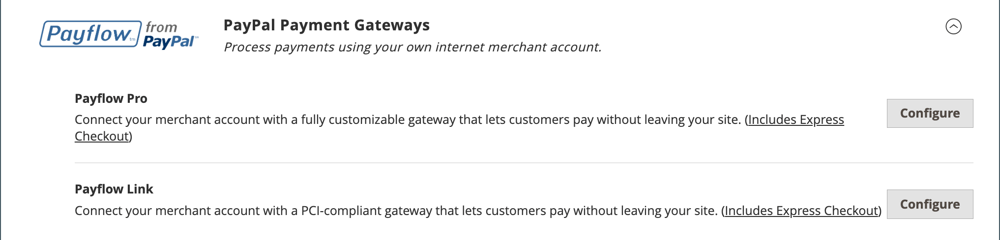

# PayPal支付解決方案

PayPal是全球線上支付的領先業者，也是客戶線上付款的快速安全方式。 可用的PayPal解決方案選擇因商家所在地而異。 PayPal Express Checkout和PayPal Payments Standard適用於全球各地。 若要瞭解更多資訊，請參閱[依國家/地區的PayPal解決方案](#paypal-solutions-by-country)。

>[!IMPORTANT]
>
>**PSD2需求：**  
>自2019年9月14日起，歐洲銀行可能會拒絕不符合[PSD2](../getting-started/compliance-payment-services-directive.md)要求的付款。 對於大多數PayPal解決方案，無需採取任何動作即可遵守PSD2，因為這些要求是由PayPal處理。

## PayPal企業帳戶

若要在商店提供PayPal付款方式，您必須擁有PayPal [企業帳戶][1]和/或[PayPal Payflow帳戶][2]。 帳戶需求會在每個PayPal解決方案的說明中指定。 您的PayPal商家帳戶也可用來管理任何[欺詐篩選器](#paypal-fraud-management-filters)，這些篩選器套用到從您的商店進行的購買。

使用PayPal Express Checkout或Express Checkout for Payflow Pro的客戶必須擁有PayPal購買者帳戶。 當商家啟用&#x200B;_PayPal帳戶選擇性_&#x200B;時，PayPal付款標準（某些國家/地區的網站付款標準）可直接使用或透過買家帳戶使用。 預設會啟用此引數，讓客戶可以選擇輸入信用卡資訊，或使用PayPal建立採購員帳戶。 停用時，客戶必須先建立PayPal購買者帳戶，才能進行購買。

Website Payments Pro、Website Payments Pro Payflow Edition、Payflow Pro Gateway和Payflow Link會要求客戶在結帳時輸入信用卡資訊。

## PayPal點數和PayLater

PayPal PayLater讓您的客戶能夠快速取得融資，因此他們現在就可以購買產品，並隨著時間付費，您無需支付額外費用。 客戶選擇PayPal信用額度選項時不會向您收費，您只需支付一般的PayPal交易費用。 若要深入瞭解，請參閱[PayPal網站][3]。

廣告融資時，可大幅提升銷售額。 PayPal有助於將瀏覽器變成以PayPal PayLater融資的買家。 您的客戶可隨時間付費，而您則可獲得預先付費，不需額外付費。 使用PayPal免費橫幅廣告，在客戶透過PayPal結帳時，宣傳PayPal融資為付款選項。 PayPal Advertising計畫已經顯示可產生額外的購買，並將平均購買量增加15%或更多。

您可以在結帳期間輕鬆新增免費的現成橫幅廣告至您的網站頁面，並將&#x200B;_PayPal點數_&#x200B;按鈕新增至您的購物車，以提醒您的客戶有現成的融資。

>[!NOTE]
>
>從2.4.3版開始，在包含PayPal的部署中支援PayPal PayLater。 此功能可讓購物者以雙週分期付款的方式支付訂單，而不需在購買時支付全額。 已棄用PayPal點數體驗。

對於美國商家，預設會針對[PayPal Express結帳](paypal-express-checkout.md)付款選項啟用PayPal信用額度。 若要針對此付款方式停用它，請參閱[PayPal Express結帳設定](paypal-express-checkout.md#features)的&#x200B;_功能_&#x200B;區段。

其他PayPal付款解決方案預設會停用PayPal信用額度，但支援解決方案的付款方式設定可啟用：

- [進階付款](paypal-payments-advanced.md)
- [Payments Pro](paypal-payments-pro.md)
- [付款標準](paypal-payments-standard.md)
- [Payflow Pro](paypal-payflow-pro.md)
- [Payflow連結](paypal-payflow-link.md)

>[!IMPORTANT]
>
>在您為商店設定PayPal Credit或PayPal PayLater之前，請確定已在您的PayPal商家帳戶中啟用。

## 整合式PayPal解決方案

使用PayPal和Adobe Commerce，您可以接受所有主要借記卡和信用卡的付款。 PayPal提供額外的便利功能，不需額外付費，因為即使您沒有PayPal帳戶的客戶也可以透過PayPal支付購買費用。

>[!NOTE]
>
>除了PayPal Express結帳之外，您一次不能在商店中啟用多個PayPal方法。 PayPal Express Checkout可搭配其他PayPal支付方式使用，但PayPal Payments Standard除外。 如果您變更付款解決方案，則會停用先前的方法。

### PayPal Express簽出

[PayPal Express簽出](paypal-express-checkout.md)

### PayPal多合一支付解決方案

在美國，PayPal提供下列PCI相容解決方案，以滿足您成長中企業的需求。

- [PayPal付款進階](paypal-payments-advanced.md)
- [PayPal Payments Pro](paypal-payments-pro.md)
- [PayPal支付標準](paypal-payments-standard.md)

{width="600" zoomable="yes"}

### PayPal付款閘道

付款閘道是由電子商務應用程式服務提供者提供的商家服務，可授權信用卡或直接付款處理。 他們作為客戶與銀行之間的中介機構。

付款閘道適用於線上和離線環境。 您可透過電話、線上或行動應用程式接受付款。 交易會傳送至服務提供者的處理系統，然後傳送至客戶的銀行進行驗證和確認。 若已確認，則商家會收到付款，而不會直接聯絡客戶的銀行帳戶。

支付閘道有兩種型別：直接和託管。

- 直接付款閘道可讓使用者在商店網站上輸入其卡片詳細資料。
- 託管支付閘道將使用者重新導向至商店網站外部的託管支付頁面。

付款閘道可為交易相關的所有當事人提供安全性與保護。

PayPal為您的企業提供兩種支付閘道解決方案供您選擇。 您可以讓PayPal在其安全的支付網站上代管您的結帳，或是透過可自訂的解決方案控制整個支付體驗。

- [PayPal Payflow Pro](paypal-payflow-pro.md)
- [PayPal Payflow連結](paypal-payflow-link.md)

{width="600" zoomable="yes"}

## PayPal詐騙管理篩選器

PayPal詐騙管理篩選器可讓您更輕鬆地偵測及回應詐騙交易，並可設定為標幟、保留以供稽核或拒絕風險較高的付款。 與Commerce [訂單狀態](order-status.md)值相關的動作已根據詐騙篩選設定變更：

| 動作 | 結果 |
| --- | --- |
| [!UICONTROL Review] | 可疑的訂單在下單時會收到&#x200B;_付款稽核_&#x200B;狀態。 您可以在管理員或PayPal端檢閱訂單並核准或取消付款。 當您按一下&#x200B;**[!UICONTROL Accept Payment]**&#x200B;或&#x200B;**[!UICONTROL Deny Payment]**&#x200B;時，不會建立訂單的新交易。   如果您在PayPal網站上變更交易狀態，則必須按一下管理員訂單頁面中的&#x200B;**[!UICONTROL Get Payment Update]**&#x200B;以套用變更。 如果您按一下&#x200B;**[!UICONTROL Accept Payment]**&#x200B;或&#x200B;**[!UICONTROL Deny Payment]**，則會套用PayPal網站所做的變更。 |
| [!UICONTROL Deny] | 客戶無法下懷疑的訂單，因為PayPal已拒絕對應的交易。   若要拒絕管理員付款，請按一下頁面右上角的&#x200B;**[!UICONTROL Deny Payment]**。 訂單狀態變更為`Canceled`，交易已還原，並在客戶帳戶上核發資金。 對應的資訊已新增至訂單檢視的&#x200B;_[!UICONTROL Comments History]_&#x200B;區段中。 |
| [!UICONTROL Flag] | 可疑的訂單在放置時取得狀態`Processing`。 對應的交易會在商家帳戶交易清單中標示旗標。 |

{style="table-layout:auto"}

## 各國的PayPal解決方案

| 國家 | PayPal支付解決方案 |
|--- |--- |
| 澳洲 | [!DNL PayPal Website Payments Standard] [[!DNL PayPal Payflow Pro]](paypal-payflow-pro.md) [!DNL PayPal Website Payments Pro Hosted Solution] [[!DNL PayPal Express Checkout]](paypal-express-checkout.md) |
| 加拿大 | [!DNL PayPal Website Payments Standard] [!DNL PayPal Website Payments Pro] [[!DNL PayPal Payflow Pro]](paypal-payflow-pro.md) [[!DNL PayPal Payflow Link]](paypal-payflow-link.md) （包括Express簽出） [[!DNL PayPal Express Checkout]](paypal-express-checkout.md) |
| 法國 | [!DNL PayPal Integral Evolution] [!DNL PayPal Website Payments Standard] [[!DNL PayPal Express Checkout]](paypal-express-checkout.md) |
| 德國 | [[!DNL PayPal Express Checkout]](paypal-express-checkout.md) |
| 中國香港特別行政區 | [!DNL PayPal Website Payments Pro Hosted Solution] [!DNL PayPal Website Payments Standard] [[!DNL PayPal Express Checkout]](paypal-express-checkout.md) |
| 義大利 | [!DNL PayPal ProPay] [[!DNL Pal Payments Standard]](paypal-payments-standard.md) [[!DNL PayPal Express Checkout]](paypal-express-checkout.md) |
| 日本 | [!DNL PayPal Website Payments Plus] [!DNL PayPal Website Payments Standard] [[!DNL PayPal Express Checkout]](paypal-express-checkout.md) |
| 紐西蘭 | [[!DNL PayPal Payflow Pro]](paypal-payflow-pro.md) [!DNL PayPal Website Payments Standard] [[!DNL PayPal Express Checkout]](paypal-express-checkout.md) |
| 西班牙 | [!DNL PayPal Pasarela Integral] [!DNL PayPal Website Payments Standard] [[!DNL PayPal Express Checkout]](paypal-express-checkout.md) |
| 英國 | [!DNL PayPal Payments Pro Hosted Solution] （包括Express簽出） [[!DNL PayPal Payments Standard]](paypal-payments-standard.md) [[!DNL PayPal Express Checkout]](paypal-express-checkout.md) |
| 美國 | [[!DNL PayPal Payments Advanced]](paypal-payments-advanced.md) （包含快速簽出） [[!DNL PayPal Payments Pro]](paypal-payments-pro.md) （包含快速簽出） [[!DNL PayPal Payments Standard+]](paypal-payments-standard.md) [[!DNL PayPal Payflow Pro]](paypal-payflow-pro.md) （包含快速簽出） [[!DNL PayPal Payflow Link]](paypal-payflow-link.md) （包含快速簽出） [[!DNL PayPal Express Checkout]](paypal-express-checkout.md) |

{style="table-layout:auto"}

### 其他國家/地區

PayPal Express Checkout和PayPal Website Payments Standard適用於下列國家/地區：

- 阿根廷
- 奧地利
- 比利時
- 巴西
- 保加利亞
- 智利
- 哥斯大黎加
- 賽普勒斯
- 捷克共和國
- 丹麥
- 多明尼加共和國
- 厄瓜多爾
- 愛沙尼亞
- 芬蘭
- 法屬圭亞那
- 直布羅陀
- 希臘
- 瓜德魯普島
- 匈牙利
- 冰島
- 印度
- 印尼
- 愛爾蘭
- 以色列
- 牙買加
- 拉脫維亞
- 列支敦斯登
- 立陶宛
- 盧森堡
- 馬來西亞
- 馬爾他
- 法屬馬丁尼克
- 墨西哥
- 荷蘭
- 挪威
- 菲律賓
- 波蘭
- 葡萄牙
- 留尼旺
- 羅馬尼亞
- 聖馬利諾
- 新加坡
- 斯洛伐克
- 斯洛維尼亞
- 南非
- 南韓
- 瑞典
- 瑞士
- 台灣
- 泰國
- 土耳其
- 阿拉伯聯合大公國
- 烏拉圭
- 委內瑞拉
- 越南

[1]: https://manager.paypal.com/
[2]: https://developer.paypal.com/docs/payflow/payflow-gateway/
[3]: https://www.paypal.com/us/business/buy-now-pay-later
