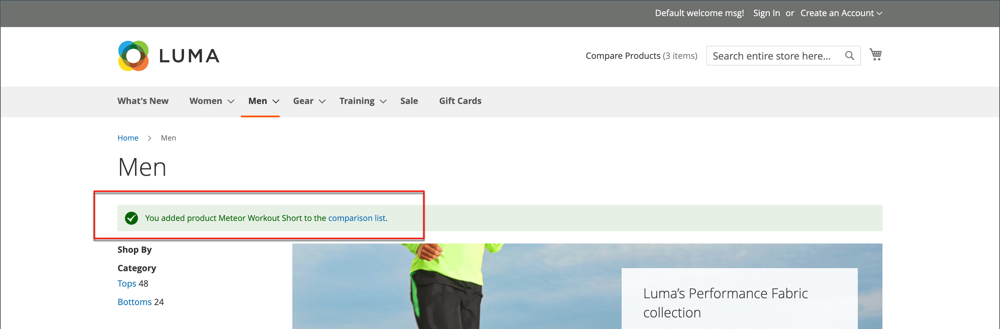
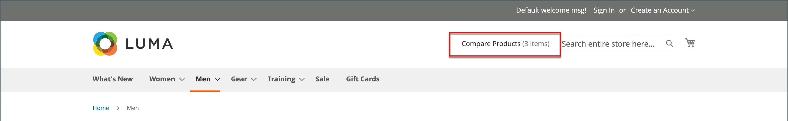

# 比較產品

比較產品會產生兩個或多個產品的詳細並排比較。 根據主題的不同，新增到比較連結可能會以圖示或文字表示。 此 _比較產品_ 區塊通常會顯示在目錄頁面的左側或右側邊欄中。

{width="700" zoomable="yes"}

不喜歡 [最近檢視/比較的產品](products-viewed-compared.md) 區塊，管理員不包含「比較產品」的其他組態設定。

## 比較店面的產品

在店面中使用比較清單有幾種方式。

### 從目錄頁面

1. 客戶找到要比較的產品，然後按一下 **[!UICONTROL Add to Compare]** 每個的連結。

1. 導覽至相關聯的類別頁面。

   根據主題和頁面配置，可能有 _比較產品_ 區塊。 若是如此，會列出類別中標示為要比較的專案。

   客戶可按一下 _刪除_ (  )以取得任何產品，將其從比較報表中移除，或按一下 **[!UICONTROL Clear All]** 以移除所有專案，並以您的比較選取專案重新開始。

1. 點擊數 **[!UICONTROL Compare]**.

1. 若要列印比較資訊，請按一下 **[!UICONTROL Print This Page]**.

1. 若要從比較頁面移除單一產品，請按一下 _刪除_ (  )。

### 從通知訊息

1. 客戶將產品新增至比較清單後，頁面會顯示通知訊息。

1. 在顯示的頂端訊息通知中，按一下 _比較清單_ 連結。

   {width="700" zoomable="yes"}

此動作會將客戶重新導向至比較清單，以便他們存取其他動作。

### 從 _比較產品_ 區塊

1. 客戶找到要比較的產品，然後按一下 **[!UICONTROL Add to Compare]** 每個的連結。

1. 在搜尋欄位附近的標題中，按一下 _比較產品_ 連結。

   {width="700" zoomable="yes"}

### 從我的帳戶儀表板

1. 客戶將所需產品新增至比較清單。

1. 導覽至 **[!UICONTROL My Account]**.

1. 在 _比較產品_ 封鎖，點按 **[!UICONTROL Compare]**.

   {width="700" zoomable="yes"}

## 其他比較清單動作

| [!UICONTROL Action] | 說明 |
|------|-----------|
|  | 從比較清單中刪除單一專案。 |
| **[!UICONTROL Add to Cart]** | 將產品新增至購物車。 如果產品有任何組態，頁面會將客戶重新導向至產品頁面，客戶可在其中選取可設定的選項，然後按一下 **[!UICONTROL Add to Cart]**. |
| _願望清單圖示_ | 將產品新增至願望清單（需要在商店設定中啟用願望清單功能）。 |
| _列印此頁面_ | 列印比較清單頁面。 |

{style="table-layout:auto"}
