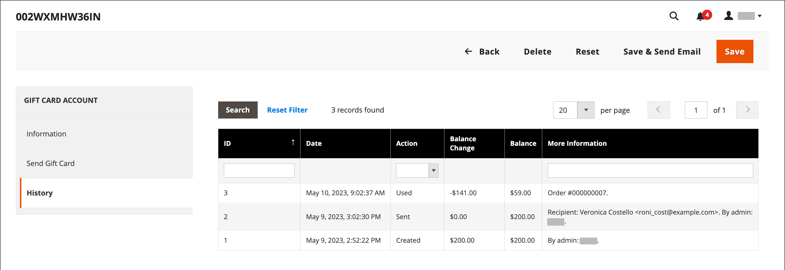

# 禮品卡帳戶

系統會自動為每個購買的禮卡建立禮卡帳戶。 然後，禮品卡的價值便可以套用至商店中的產品購買中。 您也可以從「管理員」建立禮品卡帳戶，作為客戶的促銷或服務。 禮品卡帳號與禮品卡代碼相對應。

{width="700" zoomable="yes"}

## 設定禮品卡帳戶

禮品卡組態會針對商店檢視建立所有禮品卡的預設設定，並管理程式碼集區。 代碼集區是特定格式的一組唯一禮品卡代碼。 每次建立禮品卡帳戶時，都會使用集區的代碼。 商店管理員有責任確保有足夠的代碼可供禮品卡銷售。 在提供禮品卡銷售之前，請務必產生代碼集區。 依預設，Adobe Commerce會產生1,000個程式碼。 除非目前集區中沒有其他可用的程式碼，否則不會產生新的程式碼集區。

### 步驟1：設定電子郵件通知

1. 在 _管理員_ 側欄，前往 **[!UICONTROL Stores]** > _[!UICONTROL Settings]_>**[!UICONTROL Configuration]**.

1. 在左側面板中，展開 **[!UICONTROL Sales]** 並選擇 **[!UICONTROL Gift Cards]**.

1. 展開  此 _[!UICONTROL Gift Card Email Settings]_並執行下列動作：

   - 設定 **[!UICONTROL Gift Card Notification Email Sender]** 顯示為禮品卡通知寄件者的商店身分識別。

   - 設定 **[!UICONTROL Gift Card Notification Email Template]** 至用於通知的範本。

   {width="600" zoomable="yes"}

1. 展開  此 _[!UICONTROL Email Sent from Gift Card Account Management]_並執行下列動作：

   - 設定 **[!UICONTROL Gift Card Email Sender]** 以顯示為禮品卡寄件者的商店身分識別。

   - 設定 **[!UICONTROL Gift Card Template]** 要用於禮品卡的範本。

另請參閱 [儲存電子郵件地址](../configuration-reference/general/store-email-addresses.md) 以取得特定設定欄位和選項的相關資訊。

### 步驟2：完成一般設定

1. 展開  此 _[!UICONTROL Gift Card General Settings]_區段。

1. 若要允許客戶兌換卡上的值以取得現金，請設定 **[!UICONTROL Redeemable]** 至 `Yes`.

1. 的 **[!UICONTROL Lifetime (days)]**，輸入卡片過期前的天數。

   如果沒有到期日，則將此欄位留空。

   >[!NOTE]
   >
   >根據您所在的位置，禮品卡過期可能是非法的。 在設定禮品卡的期限之前，請先檢查當地法律。

1. 若要讓客戶可以選擇輸入禮品卡隨附的訊息，請設定 **[!UICONTROL Allow Gift Message]** 至 `Yes` 並輸入訊息的可用字元數 **[!UICONTROL Gift Message Maximum Length]**.

1. 設定 **[!UICONTROL Generate Gift Card Account when Orders Item is]** 變更為下列其中一項：

   - `Ordered`  — 訂購時建立禮品卡帳戶。
   - `Invoiced`  — 擷取付款並開立訂單商業發票後，會建立禮品卡帳戶。

   {width="600" zoomable="yes"}

### 步驟3：建立禮卡代碼集區

1. 展開  此 _[!UICONTROL Gift Card Account General Settings]_並執行下列動作：

   {width="600" zoomable="yes"}

   - 若要自訂程式碼，請根據您的偏好設定完成下列作業：

      - 程式碼長度
      - 程式碼格式
      - 程式碼首碼
      - 程式碼尾碼
      - 將每X個字元加上破折號

   - 若要決定要產生的代碼數目，請輸入 **[!UICONTROL New Pool Size]**.

   - 若要指定您何時收到重新補充代碼集區的通知，請輸入 **[!UICONTROL Low Code Pool Threshold]**.

1. 產生程式碼集區之前，請按一下 **[!UICONTROL Save Config]**.

1. 按一下 **[!UICONTROL Generate]**.

1. 完成後，按一下 **[!UICONTROL Save Config]**.

## 檢閱現有的禮品卡帳戶

1. 若要尋找目前訂單的禮品卡帳戶號碼，請執行下列步驟：

   - 在 _管理員_ 側欄，前往 **[!UICONTROL Sales]** > _[!UICONTROL Operations]_>**[!UICONTROL Orders]**.

   - 尋找清單中的順序，然後按一下 **[!UICONTROL View]** 在 _[!UICONTROL Action]_欄。

   - 向下捲動至 _[!UICONTROL Items Ordered]_區段。

   數字位於 _[!UICONTROL Product]_欄，在&#x200B;**[!UICONTROL Gift Card Accounts]**.

1. 在 _管理員_ 側欄，前往 **[!UICONTROL Marketing]** > _[!UICONTROL Promotions]_>**[!UICONTROL Gift Card Accounts]**.

1. 在格線中尋找禮品卡帳戶，並在編輯模式中開啟。

   禮品卡代碼會顯示在 _資訊_ 區段。

   {width="600" zoomable="yes"}

## 建立禮品卡帳戶

1. 在 _管理員_ 側欄，前往 **[!UICONTROL Marketing]** > _[!UICONTROL Promotions]_>**[!UICONTROL Gift Card Accounts]**.

1. 在右上角，按一下 **[!UICONTROL Add Gift Card Account]**.

1. 在 _[!UICONTROL Information]_部分，設定&#x200B;**[!UICONTROL Active]**至 `Yes` 並執行下列動作：

   - 若要在結帳時兌換信用卡餘額，或將信用卡餘額轉帳至客戶的商店貸方，請設定 **[!UICONTROL Redeemable]** 至 `Yes`.

   - 選擇 **[!UICONTROL Website]** 可在其中使用禮卡帳戶的位置。

   - 輸入初始值 **[!UICONTROL Balance]** 在禮卡上。

   - _（可選）_ 若要設定 **[!UICONTROL Expiration Date]** 針對禮品卡，從行事曆選取日期 .

     若保留為空白，禮卡帳戶不會過期。

     {width="600" zoomable="yes"}

1. 在左側面板中，選擇 **[!UICONTROL Send Gift Card]** 並執行下列動作：

   - 輸入 **[!UICONTROL Recipient Email]** 位址。

   - 輸入 **[!UICONTROL Recipient Name]**.

   - 設定 **[!UICONTROL Send Email from the Following Store View]** 至顯示為禮品卡通知寄件者的商店檢視。

   {width="600" zoomable="yes"}

1. 執行下列任一項作業以儲存新帳戶：

   - 如果您尚未準備好傳送禮品卡，請按一下 **[!UICONTROL Save]**.

   - 若要儲存變更並透過電子郵件將禮品卡傳送給收件者，請按一下 **儲存並傳送電子郵件**.

## 檢視禮卡帳戶歷史記錄

1. 前往 **[!UICONTROL Marketing]** > _[!UICONTROL Promotions]_>**[!UICONTROL Gift Card Accounts]**.

1. 在編輯模式中開啟禮品卡。

1. 此 **[!UICONTROL History]** 已顯示禮品卡的。

   {width="600" zoomable="yes"}

| 欄 | 說明 |
|--- |--- |
| [!UICONTROL ID] | 禮品卡動作的唯一數值。 |
| [!UICONTROL Date] | 動作日期。 |
| [!UICONTROL Action] | 決定禮品卡的所有可能動作。 選項： `Created` / `Updated` / `Sent` / `Used` / `Redeemed` / `Expired` |
| [!UICONTROL Balance Change] | 顯示禮品卡餘額的變更金額。 |
| [!UICONTROL Balance] | 表示可用餘額。 |
| [!UICONTROL More Information] | 顯示誰變更了禮品卡餘額的相關資訊。 |

{style="table-layout:auto"}

## 刪除禮品卡帳戶

1. 在 _管理員_ 側欄，前往 **[!UICONTROL Marketing]** > _[!UICONTROL Promotions]_>**[!UICONTROL Gift Card Accounts]**.

1. 選取要刪除的禮品卡帳戶，並在編輯模式中開啟。

1. 在功能表列中，按一下 **[!UICONTROL Delete]**.

1. 若要確認動作，請按一下 **[!UICONTROL OK]**.

## 欄說明

| 欄 | 說明 |
|--- |--- |
| [!UICONTROL ID] | 指派給禮品卡帳戶的唯一數值識別碼。 |
| [!UICONTROL Code] | 必須輸入此代碼才能套用禮品卡。 |
| [!UICONTROL Website] | 表示有禮品卡帳戶的網站。 |
| [!UICONTROL Created] | 建立日期。 |
| [!UICONTROL End] | 禮品卡到期日（若已排程）。 |
| [!UICONTROL Active] | 判斷禮品卡是否有效。 |
| [!UICONTROL Status] | 決定禮卡在客戶帳戶中是否可兌換，或是可用。 選項： `Used` / `Redeemed` / `Expired` |
| [!UICONTROL Balance] | 表示可用餘額。 |

{style="table-layout:auto"}
