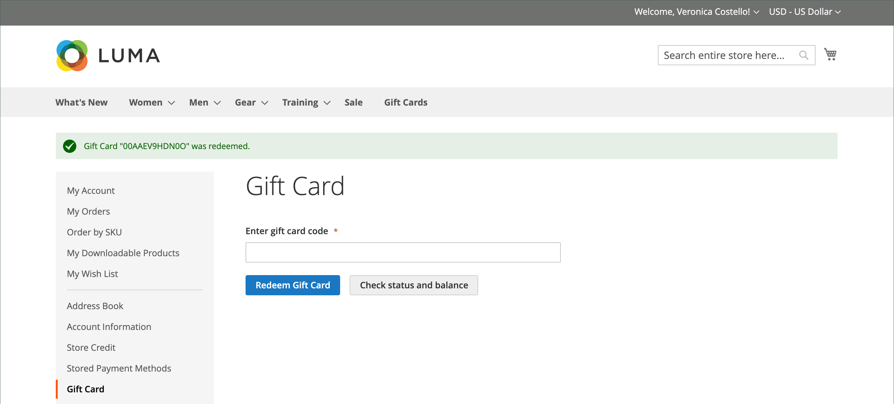

# 禮卡購買與兌換

{{ee-feature}}

在購物車中兌換禮品卡的方式與將優惠券套用至訂單類似。 結帳時，購物者會輸入禮品卡代碼，將禮品卡的金額沖銷至購買。 擁有客戶帳戶的禮品卡持有者可以從其帳戶儀表板檢查狀態和剩餘餘額。 單一和多張禮品卡可用來支付全部或部分訂單。

透過在&#x200B;_管理員_&#x200B;中開啟訂單，即可檢視套用的禮品卡代碼，這樣您便可以擷取代碼，並視需要將其放在實體禮品卡上。 如果禮品卡訂單被取消或退款，您必須手動取消相關的禮品卡帳戶。 您可以完全刪除帳戶或停用帳戶。

{width="700" zoomable="yes"}

例如，客戶在示範Luma商店購物時，可以購買虛擬或實體禮品卡。

**虛擬禮品卡** - Luma虛擬禮品卡已透過電子郵件傳送選擇性訊息給收件者。 您可以在任何Luma系列網站上贖回，且永不過期。

**實體禮品卡** - Luma禮品卡已包裝在自訂藝術郵件程式中，且免費寄給收件者。 可預先製作並標示唯一代碼，然後透過商店、電話或任何Luma系列網站贖回。 永不過期。

**組合禮品卡** — 組合禮品卡具有虛擬和實體禮品卡的特徵。 Luma組合禮品卡已出貨並透過電子郵件傳送給收件者。 購買禮品卡時需要電子郵件和送貨地址。 永不過期。

## 禮卡生命週期

1. **客戶決定禮卡值**。

   客戶從產品頁面決定禮品卡的價值。 視組態而定，會有固定價格欄位、價格選項清單，或兩者皆有。 所有金額都會以商店中使用的貨幣顯示。

1. **客戶完成禮卡資訊**。

   若是實體禮品卡，客戶會輸入&#x200B;**寄件者姓名**&#x200B;和&#x200B;**收件者姓名**。 對於虛擬或組合禮品卡，客戶也會輸入&#x200B;**寄件者電子郵件**&#x200B;和&#x200B;**收件者電子郵件**。 如果客戶已登入，系統會自動從其帳戶輸入「寄件者姓名」（以及「寄件者電子郵件」，如果適用）。 根據設定，客戶可能也會向收件者輸入訊息。

1. **客戶完成簽出**。

   禮品卡會在購物車中顯示為條列專案，其詳細資訊會顯示寄件者、收件者和訊息的名稱（如適用）。 與禮品卡相關的金額在新增到購物車時會轉換為商店的基本貨幣。

1. **客戶收到訂單確認**。

   禮品卡購買者可以按一下確認中的連結，從其帳戶儀表板追蹤訂單。

1. **收件者收到禮品卡**。

   對於虛擬或組合禮品卡，收件者會收到包含禮品卡代碼、寄件者名稱及訊息（如適用）的電子郵件。 如果單筆訂單購買多張禮品卡，且型別為虛擬或合併，則所有對應的禮品卡代碼都會以一封電子郵件傳送給收件者。 實體禮品卡可以直接運送給收件者或客戶，然後客戶可以親自將禮品卡傳送給收件者。

1. **收件者將禮卡套用至購買**。

   收件者在您的商店購買商品，並在結帳時套用禮品卡代碼。 每次在結帳期間套用禮品卡時，該金額都會顯示在訂單總計區塊中，並從總計中扣除。 每張禮卡的全數餘額將從購物車總計中扣除。 如果一次購買使用了多張禮品卡，則會以遞增順序套用，從剩餘餘額最小的禮品卡開始，直到全部套用或總計為零為止。 當總計達到零時，套用至購物車的最後一個禮品卡帳戶會收到部分扣款。 尚未套用至購物車的任何卡片都不會收到餘額扣款。 這些金額只有在下訂單後才會從禮品卡帳戶中扣除。

## 店面體驗

禮品卡在店面的運作方式：

- 禮品卡代碼可套用至購物車或結帳時，以涵蓋訂單的總金額。

- 在目錄中，禮品卡會以個別型別的產品呈現。

- 在開立訂單發票後會啟用禮品卡代碼。 如果未支付訂單，則收貨客戶無法使用禮品卡。

- 贈品代碼的帳戶是為了追蹤特定憑單的餘額而建立的。 商店管理員可以手動調整餘額。

接收客戶可以使用帳戶儀表板的&#x200B;_[!UICONTROL Gift Card]_區段來檢查其[禮卡帳戶](product-gift-card-accounts.md)的餘額，並兌換[商店點數](../customers/store-credit-using.md)的禮卡。

{width="700" zoomable="yes"}

### 檢查禮卡的狀態與餘額

1. 客戶從店面登入並開啟其客戶帳戶頁面。

1. 客戶開啟&#x200B;**[!UICONTROL Gift Card]**&#x200B;頁面並輸入禮品卡代碼。

1. 客戶按一下&#x200B;**[!UICONTROL Check status and balance]**。

{width="700" zoomable="yes"}

會顯示禮品卡的餘額。

### 禮卡啟用

1. 客戶在&#x200B;_[!UICONTROL Gift Card]_頁面上輸入禮品卡代碼。

1. 客戶按一下&#x200B;**[!UICONTROL Redeem Gift Card]**。

{width="700" zoomable="yes"}

禮品卡金額已啟用，並已新增至商店貸方餘額總計。

{width="700" zoomable="yes"}

所有禮品卡餘額的作業都可在&#x200B;_[!UICONTROL Store Credit]_頁面上使用。

### 結帳時套用禮品卡

如果禮品卡無法贖回，客戶可以在結帳時套用禮品卡代碼。

1. 在&#x200B;_檢閱與付款_&#x200B;步驟中，客戶按一下&#x200B;**[!UICONTROL Apply Gift Card]**。

1. 輸入禮品卡代碼，然後按一下&#x200B;**[!UICONTROL Apply]**。

   折扣應反映在&#x200B;_[!UICONTROL Order Summary]_中。

1. 按一下&#x200B;**[!UICONTROL Place Order]**&#x200B;完成訂單。
