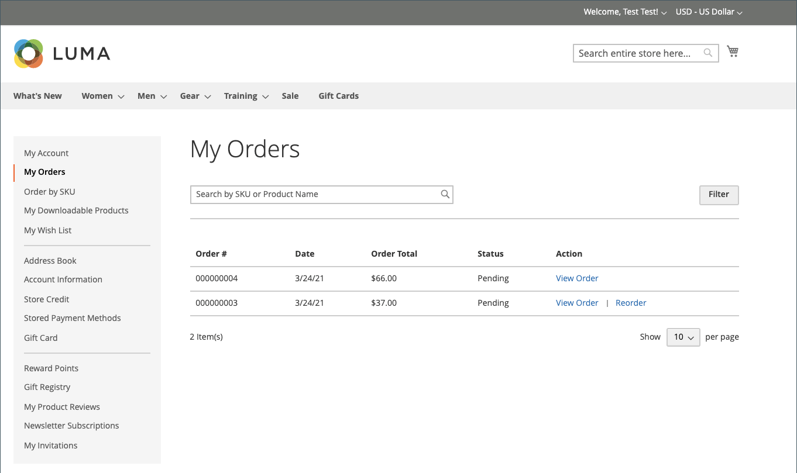

# 允許重新排序

啟用後，可以直接從客戶帳戶或&#x200B;_Admin_&#x200B;中的原始訂單進行重新排序。 依預設會啟用重新排序。

在Admin{width="700" zoomable="yes"}中客戶重新排序連結

## 為訂單啟用重新排序的條件

- 必須啟用&#x200B;_允許重新排序_&#x200B;組態選項。

- 如果訂單處於`Hold`或`Payment Review`狀態，則重新排序選項會停用。

- 如果訂單中的任何專案無法使用、無存貨或停用，店面就會停用重新排序選項。

- 即使有任何專案無存貨或停用，_管理員_&#x200B;也可以重新排序。

## 設定以允許客戶重新訂購

1. 在&#x200B;_管理員_&#x200B;側邊欄上，移至&#x200B;**[!UICONTROL Stores]** > _[!UICONTROL Settings]_>**[!UICONTROL Configuration]**。

1. 在左側面板中，展開&#x200B;**[!UICONTROL Sales]**&#x200B;並在下方選擇&#x200B;**[!UICONTROL Sales]**。

1. 展開&#x200B;**[!UICONTROL Reorder]**&#x200B;區段的。

   {width="600" zoomable="yes"}

1. 將&#x200B;**[!UICONTROL Allow Reorder]**&#x200B;設為`Yes`。

   此設定可啟用重新排序功能，其來源為「管理員」中店面或訂單清單上的客戶帳戶。

1. 按一下&#x200B;**[!UICONTROL Save Config]**。

## 從店面重新排序

客戶可以從兩個頁面啟動特定訂單的再訂購功能：

- _我的訂單_&#x200B;頁面

- _訂單檢視_&#x200B;頁面

### 我的訂單

_重新排序_&#x200B;按鈕一律會顯示在含有「訂單」的清單中（即使訂單中的所有產品都無法重新排序）。

{width="700" zoomable="yes"}

**案例1。**&#x200B;訂單中的所有產品皆可&#x200B;**使用**&#x200B;重新排序

系統會將使用者重新導向至購物車，並將所有產品新增至購物車

{width="700" zoomable="yes"}

**案例2。**&#x200B;訂單中的部分/所有產品&#x200B;**無法使用**&#x200B;重新排序

>[!NOTE]
>
>可以重新排序`Not Visible Individually`產品。

_重新排序_&#x200B;按鈕未出現在&#x200B;_我的訂單_&#x200B;和&#x200B;_檢視訂單_&#x200B;頁面。

{width="700" zoomable="yes"}

### 訂單檢視頁面

**案例1。**&#x200B;訂單中的所有產品都可供重新訂購

系統會將使用者重新導向至購物車，並將所有產品新增至購物車

**案例2。**&#x200B;訂單中的部分/所有產品&#x200B;**無法使用**&#x200B;重新排序

>[!NOTE]
>
>可以重新排序`Not Visible Individually`產品。

_重新排序_&#x200B;按鈕未出現在&#x200B;_我的訂單_&#x200B;和&#x200B;_檢視訂單_&#x200B;頁面。

{width="700" zoomable="yes"}

### 購物車不是空的

如果購物車不是空的，且使用者按一下&#x200B;**[!UICONTROL Reorder]** （從&#x200B;_我的訂單_&#x200B;或&#x200B;_訂單檢視_&#x200B;頁面），則現有產品會與新增的重新訂購產品一起保留在購物車中。

{width="700" zoomable="yes"}

## 從管理員重新排序

1. 在&#x200B;_管理員_&#x200B;側邊欄上，移至&#x200B;**[!UICONTROL Sales]** > **[!UICONTROL Orders]**。

1. 找到訂單並以&#x200B;**[!UICONTROL View]**&#x200B;模式開啟。

1. 按一下顯示在頂端按鈕列中的&#x200B;**[!UICONTROL Reorder]**。

   {width="600" zoomable="yes"}

   在您按一下&#x200B;**[!UICONTROL Reorder]**&#x200B;後，_建立新訂單_&#x200B;頁面會開啟，其中包含重新訂購的產品。

   {width="600" zoomable="yes"}

1. 視需要填寫所有必填欄位。

1. 若要提交訂單，請按一下&#x200B;**[!UICONTROL Submit Order]**。
