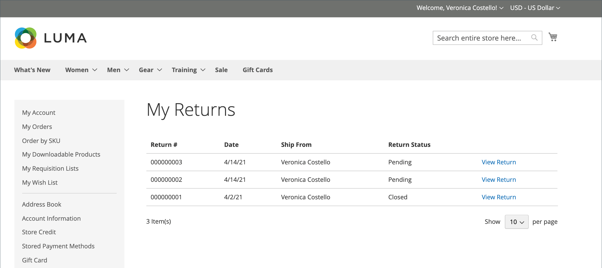

# 傳回店面體驗

{{ee-feature}}

客戶可使用下列其中一種方式，向店面請求RMA：

- 在側欄中[訂單與退貨Widget](../content-design/widget-orders-returns.md)
- 頁尾中的&#x200B;_訂單與退貨_&#x200B;連結

最佳做法是，確保在客戶服務政策中包含RMA需求和程式的說明。

>[!NOTE]
>
>如果您想要收集與傳回相關的其他資訊，可以新增您自己的自訂[傳回屬性](attributes-returns.md)。

所有客戶RMA資訊都會顯示在客戶帳戶儀表板的&#x200B;**[!UICONTROL My Returns]**&#x200B;頁面上。

{width="700" zoomable="yes"}

## 請求RMA

客戶在店面完成下列步驟以提交RMA：

1. 在頁尾中，按一下&#x200B;**[!UICONTROL Orders and Returns]**。

1. 輸入訂單資訊：

   - 訂單ID
   - 帳單姓氏
   - 電子郵件

1. 按一下&#x200B;**[!UICONTROL Continue]**。

   {width="700" zoomable="yes"}

1. 在訂購日期下方，按一下&#x200B;**[!UICONTROL Return]**。

   {width="700" zoomable="yes"}

1. 選擇要傳回的專案並輸入&#x200B;**[!UICONTROL Quantity to Return]**。

1. 將&#x200B;**[!UICONTROL Resolution]**&#x200B;設定為下列其中一項：

   - Exchange
   - [退款](../customers/refunds-customer-account.md)
   - [商店點數](../customers/store-credit-using.md)

1. 將&#x200B;**[!UICONTROL Item Condition]**&#x200B;設定為下列其中一項：

   - `Unopened`
   - `Opened`
   - `Damaged`

1. 將&#x200B;**[!UICONTROL Reason to Return]**&#x200B;設定為下列其中一項：

   - `Wrong Color`
   - `Wrong Size`
   - `Out of Service`
   - `Other`

   {width="700" zoomable="yes"}

1. 如有需要，請設定&#x200B;**[!UICONTROL Contact Email Address]**&#x200B;和&#x200B;**[!UICONTROL Comments]**。

   >[!NOTE]
   >
   >如果訂單包含數個專案，而客戶想要傳回其他專案，他們可以按一下「**[!UICONTROL Add Item To Return]**」、選取專案，然後設定所有提及的選項。

1. 按一下&#x200B;**[!UICONTROL Submit]**。
