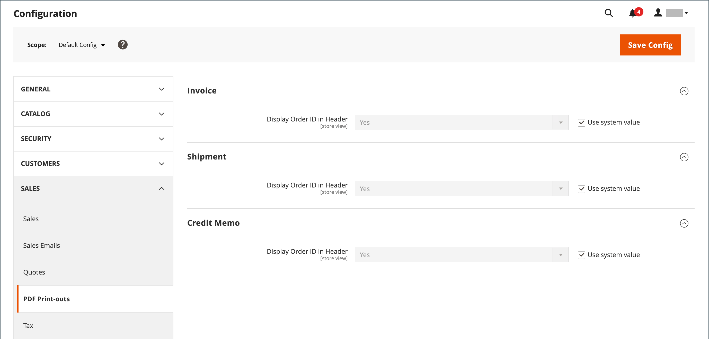

# 銷售檔案

若要支援訂單工作流程，並將客戶提交之訂單的相關檔案提供給客戶，請設定相關銷售檔案，以反映您的商店品牌並包含參考資訊。

## 設定商業發票與包裝單

不同於店面頁面使用的標誌影像，PDF發票和其他銷售檔案的標誌可能是高解析度、300 dpi影像。 當您調整標誌大小時，請留意要保留外觀比例。 調整標誌大小，使其符合高度，不必擔心右側有任何未使用的空間。

{width="200"}

調整標誌大小以符合所需大小的一種方式是建立具有正確尺寸的新空白影像。 然後，貼上您的標誌影像並調整大小以符合高度。 使用大多數的影像編輯程式，您可以按百分比縮放以保留外觀比例，或按住Shift鍵並手動調整影像大小。

**_若要更新標誌：_**

1. 在&#x200B;_管理員_&#x200B;側邊欄上，移至&#x200B;**[!UICONTROL Stores]** > _[!UICONTROL Settings]_>**[!UICONTROL Configuration]**。

1. 在左側面板中，展開&#x200B;**[!UICONTROL Sales]**&#x200B;並在下方選擇&#x200B;**[!UICONTROL Sales]**。

1. 展開 **[!UICONTROL Invoice and Packing Slip Design]**&#x200B;區段，然後執行下列動作：

   {width="600" zoomable="yes"}

   - 若要上傳&#x200B;**[!UICONTROL Logo for PDF Print-outs]**，請按一下&#x200B;**[!UICONTROL Choose File]**，尋找您準備的標誌，然後按一下&#x200B;**[!UICONTROL Open]**。

   - 若要上傳&#x200B;**[!UICONTROL Logo for HTML Print View]**，請按一下&#x200B;**[!UICONTROL Choose File]**，尋找您準備的標誌，然後按一下&#x200B;**[!UICONTROL Open]**。

   - 輸入您想要顯示在商業發票與包裝單上的地址。

1. 完成時，按一下&#x200B;**[!UICONTROL Save Config]**。

   上傳影像的縮圖會顯示在每個欄位之前，以供參考。 如果縮圖看起來扭曲，請不要擔心。 發票上的標誌比例正確。

### 取代影像

1. 按一下&#x200B;**[!UICONTROL Choose File]**&#x200B;並選擇其他標誌檔。

1. 選取您要取代之影像的&#x200B;**[!UICONTROL Delete Image]**&#x200B;核取方塊。

1. 按一下&#x200B;**[!UICONTROL Save Config]**。

### 影像格式

| 格式 | 需求 |
|--- |------------------------------------------|
| **_PDF_** |  |
| 檔案格式 | JPG (JPEG)、PNG、TIF (TIFF) |
| 影像大小 | 寬度高達1080畫素x高度為270畫素 |
| 解決方法 | 建議使用300 DPI |
| **_HTML_** |  |
| 檔案格式 | JPG (JPEG)、PNG、GIF |
| 影像大小 | 由主題決定。 |
| 解決方法 | 72或96 DPI |

{style="table-layout:auto"}

## 新增參考ID

訂單ID和客戶IP位址可包含在訂單隨附的銷售檔案標題中。 依預設，訂單識別碼和客戶IP位址都會顯示在商業發票、出貨包裝單及銷退折讓單的頁首中。

{width="600" zoomable="yes"}

**_若要變更訂單識別碼設定：_**

1. 在&#x200B;_管理員_&#x200B;側邊欄上，移至&#x200B;**[!UICONTROL Stores]** > _[!UICONTROL Settings]_>**[!UICONTROL Configuration]**。

1. 在左側面板中，展開&#x200B;**[!UICONTROL Sales]**&#x200B;並選擇&#x200B;**[!UICONTROL PDF Print-outs]**。

1. 展開&#x200B;**發票**&#x200B;區段的。

1. 根據您的喜好設定&#x200B;**[!UICONTROL Display Order ID in Header]**。

1. 對&#x200B;**[!UICONTROL Shipment]**&#x200B;和&#x200B;**[!UICONTROL Credit Memo]**&#x200B;區段重複。

1. 完成時，按一下&#x200B;**[!UICONTROL Save Config]**。

**_若要變更客戶IP位址設定：_**

1. 在&#x200B;_管理員_&#x200B;側邊欄上，移至&#x200B;**[!UICONTROL Stores]** > _[!UICONTROL Settings]_>**[!UICONTROL Configuration]**。

1. 在左側面板中，展開&#x200B;**[!UICONTROL Sales]**&#x200B;並在下方選擇&#x200B;**[!UICONTROL Sales]**。

1. 展開&#x200B;**[!UICONTROL General]**&#x200B;區段的。

   {width="600" zoomable="yes"}

1. 將&#x200B;**[!UICONTROL Hide Customer IP]**&#x200B;設定為您的偏好設定。

1. 完成時，按一下&#x200B;**[!UICONTROL Save Config]**。
