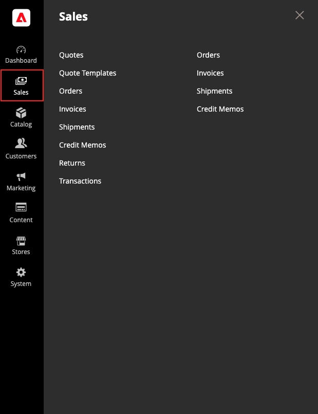

# [!UICONTROL Sales]功能表

「銷售」功能表會根據異動在訂單工作流程中的位置來列出異動。 您可能會將每個選項視為訂單期限中的不同階段。

>[!BEGINTABS]

>[!TAB Adobe Commerce]

僅[!BADGE 個PaaS]{type=Informative url="https://experienceleague.adobe.com/zh-hant/docs/commerce/user-guides/product-solutions" tooltip="僅適用於雲端專案(Adobe管理的PaaS基礎結構)和內部部署專案的Adobe Commerce 。"}

{width="450" zoomable="yes"}

>[!TAB Adobe Commerce as a Cloud Service]

僅[!BADGE SaaS]{type=Positive url="https://experienceleague.adobe.com/zh-hant/docs/commerce/user-guides/product-solutions" tooltip="僅適用於Adobe Commerce as a Cloud Service和Adobe Commerce Optimizer專案(Adobe管理的SaaS基礎結構)。"}

{width="450" zoomable="yes"}

>[!ENDTABS]

## 顯示[!UICONTROL Sales]功能表

在&#x200B;_管理員_&#x200B;側邊欄上，按一下&#x200B;**[!UICONTROL Sales]**。

## 功能表選項

### [!UICONTROL Quotes]

 (適用於Adobe Commerce B2B)

授權買家可從購物車傳送[要求](../b2b/quote-request.md)，與賣家[議價價格](../b2b/quotes.md)。

### [!UICONTROL Quote Templates]

 (適用於Adobe Commerce B2B)

透過建立可重複使用且可自訂的[報價範本](../b2b/quote-templates-overview.md)，讓買家和賣家簡化報價程式。

### [!UICONTROL Orders]

下達[訂單](orders.md)時，銷售訂單會建立為交易的暫時記錄。 尚未處理付款，訂單仍可取消。

### [!UICONTROL Invoices]

[發票](invoices.md)是訂單付款的收款記錄。 單一訂單可建立多張發票，每張發票可包含您所指定之採購產品的數量或數量。 視付款作業而定，系統會在產生商業發票時自動擷取付款。

### [!UICONTROL Shipments]

[出貨](shipments.md)是已出貨訂單中產品的記錄。 與商業發票一樣，在訂單中的所有產品都已出貨之前，多個出貨可以與單一訂單相關聯。

### [!UICONTROL Credit Memos]

[銷退折讓單](credit-memos.md)是一份檔案，會顯示客戶應支付的全部或部分退款金額。 金額可用於購買或退款給客戶。

### [!UICONTROL Returns]

 (僅限Adobe Commerce)

可以將[退回的商品授權](returns.md) (RMA)授與要求退回專案以進行更換或退款的客戶。 RMA可針對簡單、分組、可設定和套裝產品型別發行。 不過，RMA不適用於虛擬及可下載的產品，或禮品卡。

### [!UICONTROL Billing Agreements]

僅[!BADGE 個PaaS]{type=Informative url="https://experienceleague.adobe.com/zh-hant/docs/commerce/user-guides/product-solutions" tooltip="僅適用於雲端專案(Adobe管理的PaaS基礎結構)和內部部署專案的Adobe Commerce 。"}

[帳單合約](paypal-billing-agreements.md)與採購單類似，不過不限於單一採購。 結帳時，客戶選擇「帳單協定」作為付款方式。 帳單協定可簡化結帳程式，因為客戶不需要為每次購買輸入付款資訊。

### [!UICONTROL Transactions]

[交易](transactions.md)頁面會列出您商店與所有付款系統之間發生的所有付款活動，並提供更詳細資訊的存取權。

### [!UICONTROL Braintree Virtual Terminal]

僅[!BADGE 個PaaS]{type=Informative url="https://experienceleague.adobe.com/zh-hant/docs/commerce/user-guides/product-solutions" tooltip="僅適用於雲端專案(Adobe管理的PaaS基礎結構)和內部部署專案的Adobe Commerce 。"}

在Braintree虛擬終端機頁面上，管理員使用者可接受所選金額的付款。 若要讓終端機功能可用，商家應該設定基本的[Braintree設定](braintree.md)。 Braintree提供完全可自訂的結帳體驗，包含詐騙偵測和PayPal整合。

### [!UICONTROL Archive]

 (僅限Adobe Commerce)

（必須啟用封存選項） [封存訂單](order-archive.md)和其他銷售檔案會定期改善效能，讓您的工作區沒有不必要的資訊。
