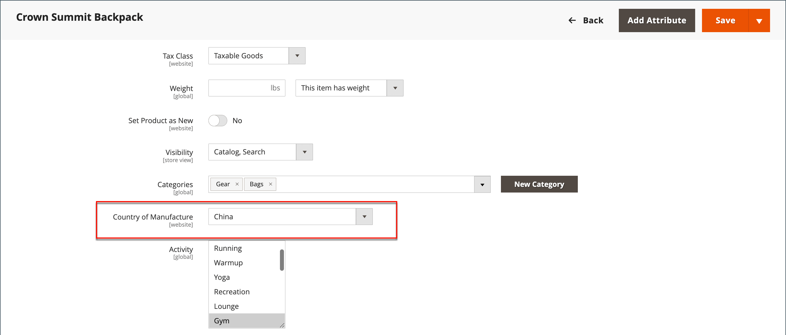

# 設定送貨標籤

下列設定必須在產品層級，以及在每個用於列印標籤之電信業者的組態中進行。 若要列印標籤，所有電信業者都要求您開立帳戶。 然後，針對您打算使用的每個電信業者，完成您商店中的設定。

## 電信業者需求

| [!UICONTROL Carrier] | 需求 |
|-------|--------|
| [USPS](usps.md) | 需要USPS帳戶。 自2018年2月23日起，USPS要求所有運送標籤皆須包含郵資。 |
| [UPS](ups.md) | 需要UPS帳戶。 出貨標籤僅適用於產自美國特定證明的出貨。美國以外的商店需要此證明資料。 |
| [FedEx](fedex.md) | 需要FedEx帳戶。 對於美國以外的商店，僅支援國際出貨的運送標籤。 FedEx不允許源自美國境外的國內出貨 |
| [DHL](dhl.md) | 需要DHL帳戶。 僅支援源自美國的出貨標籤。 |

{style="table-layout:auto"}

## 步驟1：確認製造國家

USPS和FedEx國際出貨的所有產品都需要有製造國家/地區。 如果您有許多應更新的產品，您可以 [匯入](../systems/data-import.md) 更新，或使用「詳細目錄」格線來更新多個記錄。

1. 在 _管理員_ 側欄，前往 **[!UICONTROL Catalog]** > **[!UICONTROL Products]**.

1. 使用下列其中一種方法更新送貨標籤記錄。

### 方法1：更新單一記錄

1. 在格線中，尋找要更新的產品，並以編輯模式開啟。

1. 更新 **製造國家** 視需要。

   {width="700" zoomable="yes"}

1. 按一下 **[!UICONTROL Save]**.

### 方法2：更新多個記錄

1. 在格線中，選取每個要更新之產品的核取方塊。

   例如，在中國製造的所有產品。

1. 設定 **[!UICONTROL Actions]** 控制項至 `Update Attributes` 並按一下 **[!UICONTROL Submit]**.

1. 在 _更新屬性_ 表單，尋找 **製造國家** 欄位並選取 **變更** 核取方塊。

1. 選擇國家/地區。

1. 按一下 **[!UICONTROL Save]**.

## 步驟2驗證商店資訊

1. 在 _管理員_ 側欄，前往 **[!UICONTROL Stores]** > _[!UICONTROL Settings]_>**[!UICONTROL Configuration]**.

1. 在左側面板中，展開 **[!UICONTROL Sales]** 並選擇 **[!UICONTROL Shipping Settings]**.

1. 展開  此 **[!UICONTROL Origin]** 區段，並確認下列欄位是否已完成：

   - **[!UICONTROL Street Address]**  — 送貨地點的街道地址。 例如，公司或倉儲的位置。 送貨標籤需要此欄位。
   - **[!UICONTROL Street Address Line 2]**  — 任何其他地址資訊，例如樓層或入口。 建議使用此欄位。

   {width="600" zoomable="yes"}

1. 在 _銷售_ 區段，選擇 **[!UICONTROL Delivery Methods]**.

1. 展開  此 **[!UICONTROL USPS]** 區段，並確認下列欄位是否已完成：

   - **[!UICONTROL Secure Gateway URL]**  — 系統會自動進入閘道URL。
   - **[!UICONTROL Password]**  — 密碼由USPS提供，可讓您透過網站服務存取其系統。
   - **長、寬、高、圍**  — 套件的預設維度。 若要顯示這些欄位，請設定 **[!UICONTROL Size]** 至 `Large`.

1. 展開  此 **FedEx** 一節，並確認下列欄位是否已完成：

   - 計量器編號
   - 索引鍵
   - 密碼

   此資訊由電信業者提供，是透過Web服務存取其系統所需。

1. 在左側面板中，展開 **[!UICONTROL General]** 並選擇 **[!UICONTROL General]** 底下。

1. 展開  此 **[!UICONTROL Store Information]** 一節，並確認下列欄位是否已完成：

   - **[!UICONTROL Store Name]**  — 存放區或存放區檢視的名稱。
   - **[!UICONTROL Store Contact Telephone]**  — 商店或商店檢視的主要聯絡人電話號碼。
   - **[!UICONTROL Country]**  — 您的商店所在的國家/地區。
   - **[!UICONTROL VAT Number]**  — 若適用的話，您商店的「增值稅」編號。 （位於美國的商店不需要）
   - **[!UICONTROL Store Contact Address]**  — 商店或商店檢視的主要聯絡人的街道地址。

1. 如果您有多個商店，且聯絡資訊與預設值不同，請設定 **[!UICONTROL Store View]** ，並確認資訊是否完整。

   如果資訊遺失，當您嘗試列印標籤時會出現錯誤。

   {width="600" zoomable="yes"}

1. 按一下 **[!UICONTROL Save Config]**.
