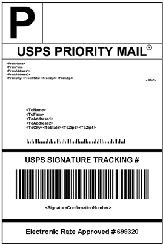

# 送貨標籤

Commerce包括與主要承運商的高層級整合，可讓您存取承運商出貨系統，以追蹤訂單、建立出貨標籤等。 可針對一般出貨及具有退貨商品授權的產品建立出貨標籤。 除了由出貨承運商提供的資訊外，標籤也包含商務訂單編號、包裝編號和出貨的包裝總數。

{width="300"}

- [設定送貨標籤](shipping-label-configure.md)
- [建立送貨標籤和封裝](shipping-label-create.md)

## 送貨標籤工作流程

出貨標籤可在建立出貨時或稍後產生。 出貨標籤以PDF格式儲存，並下載至您的電腦。

### 步驟1：商家提交出貨標籤請求

商家/商店經理完成產生標籤所需的資訊，並提交請求。

### 步驟2：傳送至電信業者的請求

Commerce會聯絡出貨承運商，並在承運商系統中建立訂單。 系統會針對每個出貨的套件分別建立訂單。

### 步驟3：電信業者傳送標籤與追蹤號碼

承運商會傳送出貨的送貨標籤與追蹤編號。

- 含有多個套件的單一出貨會收到多個出貨標籤。

- 如果您多次產生相同的送貨標籤，則會保留原始的追蹤編號。

- 對於有RMA編號的退貨產品，舊的追蹤編號會換成新的追蹤編號。

### 步驟4：商家下載並列印標籤

產生出貨標籤之後，會儲存新的出貨並列印標籤。 如果由於連線問題或任何其他原因而無法建立出貨標籤，則不會建立出貨。 根據您的瀏覽器設定，可以開啟和列印PDF檔案。 每個標籤都會顯示在PDF中的個別頁面上。
